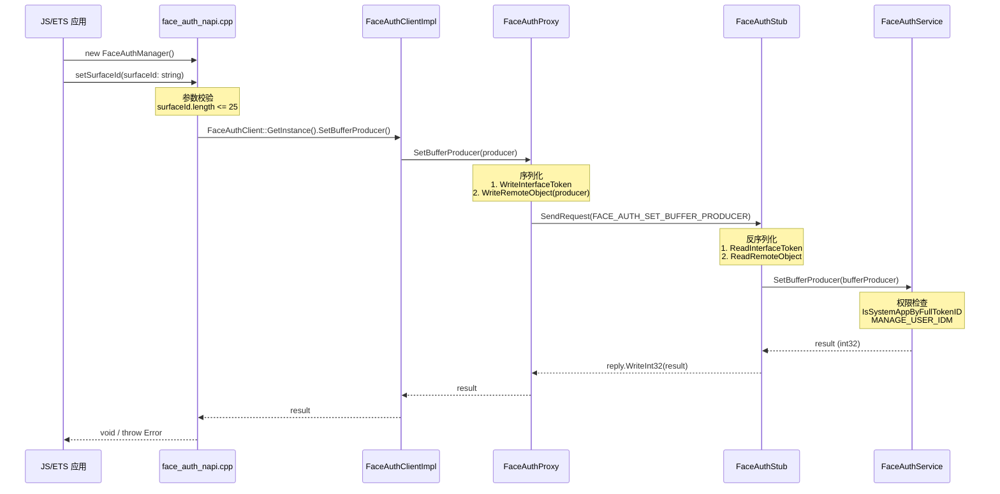

# 架构说明

## 整体架构

```
┌─────────────────────────────────────────────────────────────────────────────┐
│                              应用层                                          │
│  ┌─────────────────┐    ┌─────────────────┐    ┌─────────────────────────┐ │
│  │   JS/ETS 应用   │    │   SystemUI      │    │   设置应用               │ │
│  └────────┬────────┘    └────────┬────────┘    └──────────┬────────────┘ │
│           │                        │                         │              │
│           └────────────────────────┼─────────────────────────┘              │
│                                    │                                          │
└────────────────────────────────────┼──────────────────────────────────────────┘
                                     │
┌────────────────────────────────────┼──────────────────────────────────────────┐
│                              框架层                                           │
│                                                                              │
│  ┌─────────────────────────────────────────────────────────────────────┐    │
│  │                      JS/ETS N-API                                    │    │
│  │  face_auth_napi.cpp                                                 │    │
│  │  ┌─────────────────────┐                                            │    │
│  │  │ FaceAuthManager     │ setSurfaceId(surfaceId: string)            │    │
│  │  │ ResultCode.FAIL     │ 错误码: 12700001                            │    │
│  │  └─────────────────────┘                                            │    │
│  └───────────────────────────────────┬───────────────────────────────────┘    │
│                                      │                                         │
│  ┌───────────────────────────────────┼───────────────────────────────────┐    │
│  │                    IPC 通信层 (faceauth_framework.so)                 │    │
│  │                                                                      │    │
│  │   FaceAuthClientImpl  ───→  FaceAuthProxy  ───→  [IPC]  ───→  FaceAuthStub  │
│  │   (客户端实现)                    (序列化/发送)              (反序列化/分发)  │
│  └───────────────────────────────────┬───────────────────────────────────┘    │
│                                      │                                         │
│  ┌───────────────────────────────────┼───────────────────────────────────┐    │
│  │              System Ability (FaceAuthService SA 942)                  │    │
│  │                                                                      │    │
│  │   FaceAuthService  ───→  FaceAuthDriverHdi  ───→  HDI Adapter       │    │
│  │   (SA 实现)             (驱动封装)              (接口适配)              │    │
│  └───────────────────────────────────┬───────────────────────────────────┘    │
│                                      │                                         │
└──────────────────────────────────────┼──────────────────────────────────────────┘
                                       │
┌──────────────────────────────────────┼──────────────────────────────────────────┐
│                              硬件抽象层 (HDI)                                  │
│                                                                              │
│  ┌─────────────────────────────────────────────────────────────────────┐    │
│  │                    drivers/interface/face_auth                       │    │
│  │               (设备厂商需实现此接口的 stub)                           │    │
│  │                                                                      │    │
│  │   IFaceAuthInterface V2_0                                          │    │
│  │   ├── IAllInOneExecutor                                            │    │
│  │   │     ├── GetExecutorInfo()                                      │    │
│  │   │     ├── OnSetBufferProducer()                                  │    │
│  │   │     ├── Enroll()                                              │    │
│  │   │     ├── Authenticate()                                         │    │
│  │   │     └── ...                                                    │    │
│  │   └── IExecutorCallback                                            │    │
│  │         ├── OnResult()                                             │    │
│  │         └── OnTip()                                                │    │
│  └───────────────────────────────────┬───────────────────────────────────┘    │
│                                      │                                         │
└──────────────────────────────────────┼──────────────────────────────────────────┘
```

## IPC 调用时序

### setSurfaceId 调用链

```
┌──────────┐     ┌──────────┐     ┌──────────┐     ┌──────────┐     ┌──────────┐
│  JS/ETS  │────▶│ N-API    │────▶│ Client   │────▶│ IPC     │────▶│ Service  │
│  应用    │     │ faceauth │     │ Proxy    │     │ 传输    │     │ (SA 942) │
└──────────┘     └──────────┘     └──────────┘     └──────────┘     └──────────┘
                      │                │                │                │
                      │ SetSurfaceId   │ WriteInterface │ ReadRemoteObj  │
                      │ (string)       │ Token + Data   │ SetBufferProducer
                      │                │ SendRequest     │
                      │                │                 │
                      ▼                ▼                ▼                ▼
               face_auth_napi.cpp  face_auth_      MessageParcel    face_auth_
                                   proxy.cpp                         service.cpp
```

### Mermaid 时序图



## 数据流

```
┌─────────────────────────────────────────────────────────────────────────────┐
│                              数据流向                                        │
├─────────────────────────────────────────────────────────────────────────────┤
│                                                                              │
│  surfaceId (string)                                                          │
│     │                                                                         │
│     ▼                                                                         │
│  ┌───────────────┐                                                           │
│  │  N-API 层      │ 校验：非空、长度≤25、纯数字                                │
│  └───────┬───────┘                                                           │
│          │                                                                    │
│          ▼                                                                    │
│  IBufferProducer (RemoteObject)                                               │
│     │                                                                         │
│     ▼                                                                         │
│  ┌───────────────┐                                                           │
│  │  IPC 层        │ 序列化：MessageParcel.WriteRemoteObject()                 │
│  └───────┬───────┘                                                           │
│          │                                                                    │
│          │ [Binder IPC 跨进程]                                                │
│          ▼                                                                    │
│  ┌───────────────┐                                                           │
│  │  SA 层         │ 反序列化：MessageParcel.ReadRemoteObject()                │
│  │ FaceAuthService│ 权限校验：IsSystemAppByFullTokenID                        │
│  └───────┬───────┘                                                           │
│          │                                                                    │
│          ▼                                                                    │
│  ┌───────────────┐                                                           │
│  │  HDI 层        │ 调用：FaceAuthDriverHdi.SetBufferProducer()               │
│  │ (厂商实现)     │ 传递：IBufferProducer 至硬件驱动                           │
│  └───────────────┘                                                           │
│                                                                              │
└─────────────────────────────────────────────────────────────────────────────┘
```

## 线程模型

| 层级 | 线程/队列 | 说明 |
|------|----------|------|
| N-API | JS 线程 | Node.js 主线程 |
| IPC | IPC 线程 | Binder 通信线程 |
| SA | SystemAbility 线程 | SAMgr 调度 |
| HDI | 驱动线程 | 设备厂商实现 |

## 关键接口

### IFaceAuth 接口

**文件**: `frameworks/ipc/inc/iface_auth.h`

```cpp
class IFaceAuth : public IRemoteBroker {
    DECLARE_INTERFACE_DESCRIPTOR(u"ohos.faceauth.IFaceAuth");

    // 设置 Buffer 生产者（用于人脸录入预览）
    virtual int32_t SetBufferProducer(sptr<IBufferProducer> &producer) = 0;
};
```

### IFaceAuthInterfaceCode

**文件**: `frameworks/ipc/inc/iface_auth_ipc_interface_code.h`

```cpp
enum IFaceAuthInterfaceCode : uint32_t {
    FACE_AUTH_SET_BUFFER_PRODUCER = 1,  // 唯一 IPC 命令码
};
```
