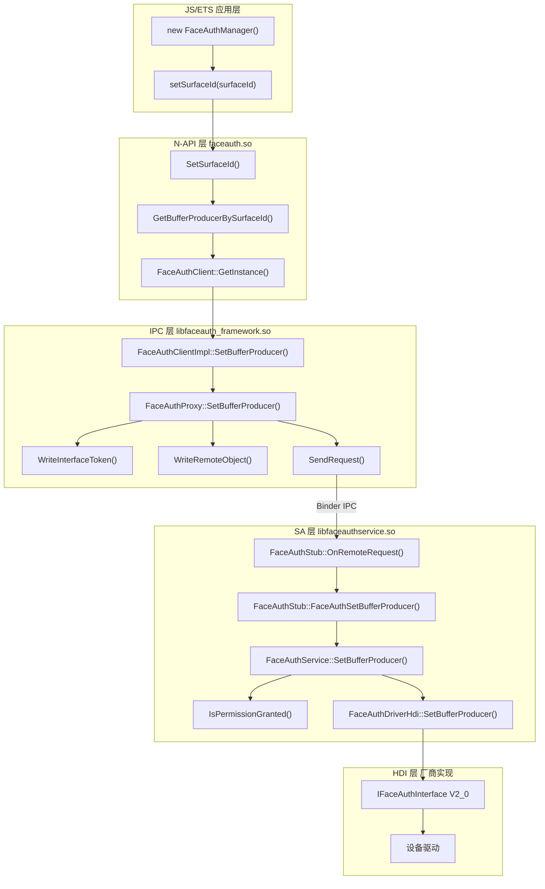

# 关键调用链

## setSurfaceId 调用链

### 完整调用栈

```
JS/ETS 应用
    │
    ▼
┌─────────────────────────────────────────────────────────┐
│ face_auth_napi.cpp                                      │
│ SetSurfaceId(napi_env, napi_callback_info)             │
│  ├─ 参数校验 (argc, string length)                      │
│  ├─ GetBufferProducerBySurfaceId(surfaceId)            │
│  │   └─ SurfaceUtils::GetInstance()->GetSurface()      │
│  │       └─ Surface::GetProducer()                      │
│  └─ FaceAuthClient::GetInstance().SetBufferProducer()  │
└─────────────────────────────────────────────────────────┘
    │
    ▼
┌─────────────────────────────────────────────────────────┐
│ face_auth_client_impl.cpp                               │
│ FaceAuthClientImpl::SetBufferProducer()                │
│  ├─ CheckSystemPermission()                             │
│  └─ GetProxy()->SetBufferProducer()                    │
└─────────────────────────────────────────────────────────┘
    │
    ▼
┌─────────────────────────────────────────────────────────┐
│ face_auth_proxy.cpp                                     │
│ FaceAuthProxy::SetBufferProducer()                      │
│  ├─ MessageParcel::WriteInterfaceToken()                │
│  ├─ MessageParcel::WriteRemoteObject()                  │
│  └─ SendRequest(CODE, data, reply)                     │
└─────────────────────────────────────────────────────────┘
    │
    │ [Binder IPC 跨进程]
    │
    ▼
┌─────────────────────────────────────────────────────────┐
│ face_auth_stub.cpp                                      │
│ FaceAuthStub::OnRemoteRequest()                         │
│  ├─ MessageParcel::ReadInterfaceToken()                 │
│  └─ FaceAuthSetBufferProducer(data, reply)             │
│      ├─ MessageParcel::ReadRemoteObject()               │
│      ├─ iface_cast<IBufferProducer>()                   │
│      └─ SetBufferProducer(buffer) [虚调用]              │
└─────────────────────────────────────────────────────────┘
    │
    ▼
┌─────────────────────────────────────────────────────────┐
│ face_auth_service.cpp                                   │
│ FaceAuthService::SetBufferProducer()                    │
│  ├─ IsPermissionGranted(MANAGE_USER_IDM)                │
│  ├─ IsSystemAppByFullTokenID()                         │
│  └─ FaceAuthDriverHdi::SetBufferProducer()             │
└─────────────────────────────────────────────────────────┘
    │
    ▼
┌─────────────────────────────────────────────────────────┐
│ face_auth_driver_hdi.cpp                                │
│ FaceAuthDriverHdi::SetBufferProducer()                  │
│  └─ 调用 HDI 接口 (drivers/interface/face_auth V2_0)   │
└─────────────────────────────────────────────────────────┘
```

## Mermaid 完整调用图



## 关键入口点

### 1. N-API 入口

**文件**: `frameworks/js/napi/src/face_auth_napi.cpp:191-201`

```cpp
extern "C" __attribute__((constructor)) void RegisterModule(void)
{
    napi_module_register(&module);
}
```

**模块名**: `userIAM.faceAuth`

### 2. IPC 客户端入口

**文件**: `frameworks/ipc/src/face_auth_client_impl.cpp`

**单例获取**:
```cpp
FaceAuthClient &FaceAuthClient::GetInstance()
```

### 3. IPC 服务端入口

**文件**: `services/src/face_auth_service.cpp`

**SA 启动**:
```cpp
void FaceAuthService::OnStart()
{
    // 注册到 SAMgr
}
```

### 4. HDI 调用入口

**文件**: `services/src/face_auth_driver_hdi.cpp`

```cpp
int32_t FaceAuthDriverHdi::SetBufferProducer(
    sptr<IBufferProducer> &producer)
{
    // 调用 IFaceAuthInterface
}
```

## 跨进程边界

```
┌─────────────────────────────────────────────────────────────────────┐
│                         跨进程边界 (Binder)                          │
├─────────────────────────────────────────────────────────────────────┤
│                                                                      │
│   进程 A (应用进程)                              进程 B (useriam)    │
│                                                                      │
│   FaceAuthClientImpl ──SendRequest()────▶ FaceAuthStub              │
│        │                                         │                   │
│        │            Binder Transaction           │                   │
│        └─────────────────────────────────────────┘                   │
│                                                                      │
└─────────────────────────────────────────────────────────────────────┘
```

## 数据传递路径

```
surfaceId: string
    │
    ├─ N-API: 字符串解析为 uint64_t
    ├─ IPC:   序列化 IRemoteObject
    ├─ SA:    反序列化为 IBufferProducer
    └─ HDI:   传递给设备驱动
```

## 错误传播路径

```
HDI 错误
    │
    ├─ 返回 int32_t 错误码
    ├─ SA: WriteInt32(result)
    ├─ IPC: ReadInt32()
    └─ N-API: GenerateBusinessError(code)
              └─ napi_throw(env, error)
```

## 线程上下文

| 调用阶段 | 线程 | 说明 |
|----------|------|------|
| JS 调用 | JS 主线程 | Node.js 线程 |
| N-API 处理 | JS 主线程 | 参数校验 |
| IPC 发送 | Binder 线程池 | 跨进程通信 |
| SA 处理 | SystemAbility 线程 | SAMgr 调度 |
| HDI 调用 | 驱动线程 | 设备厂商实现 |
