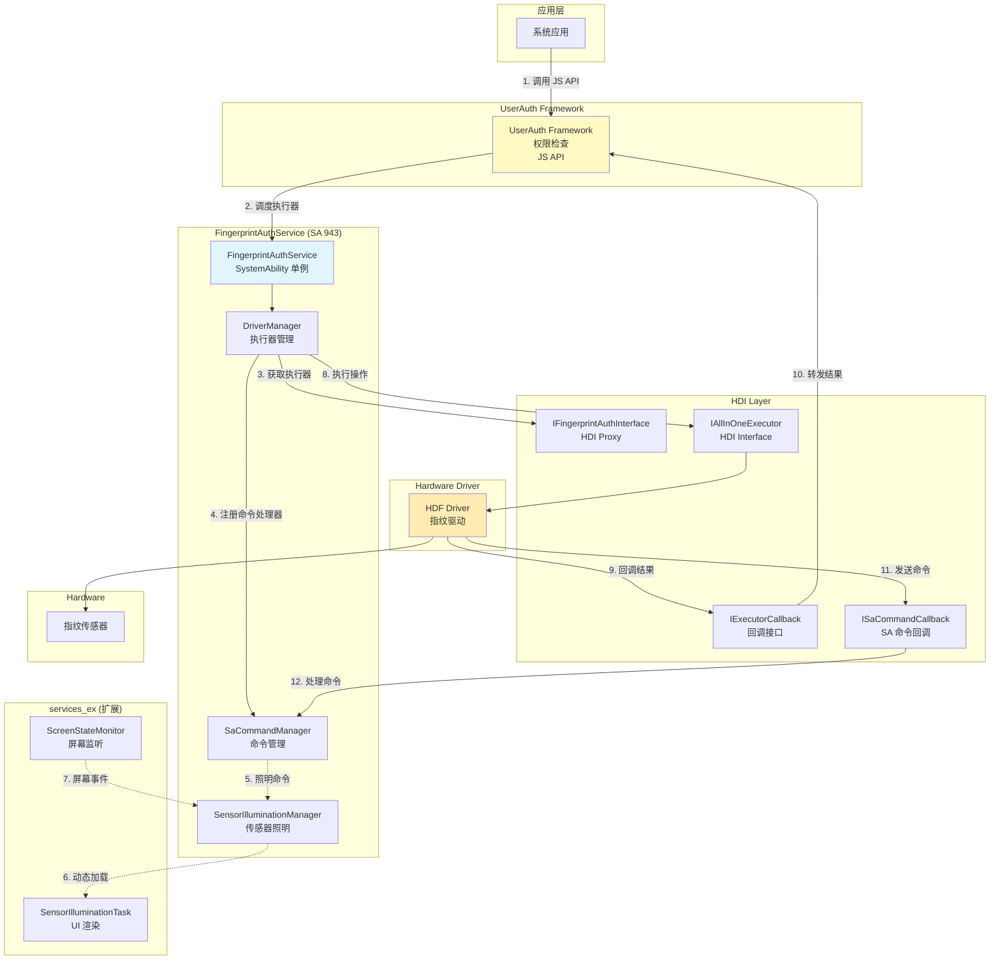
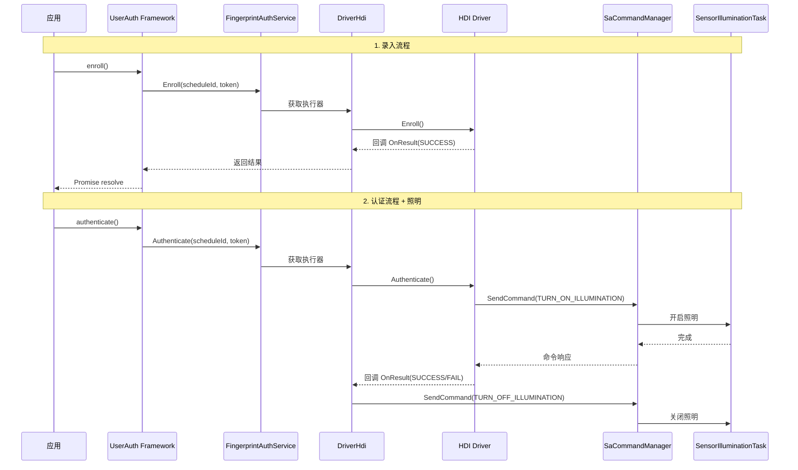
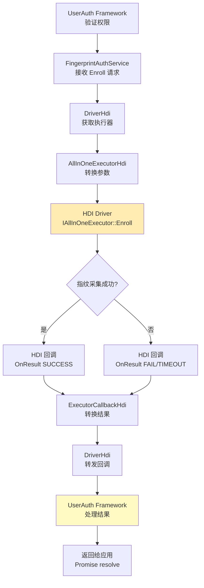
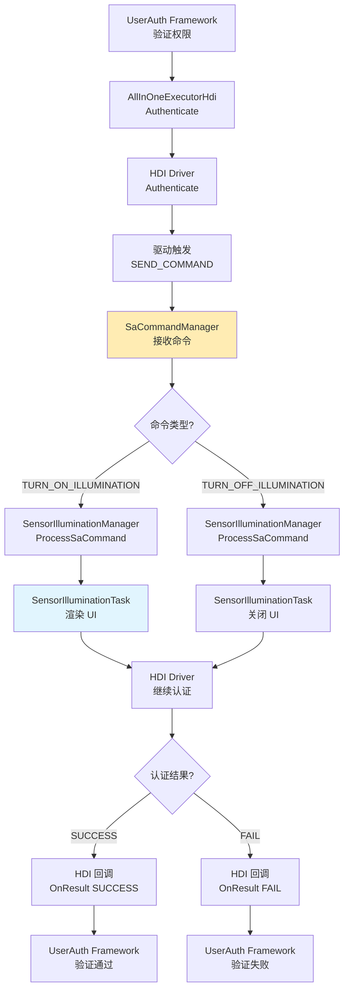
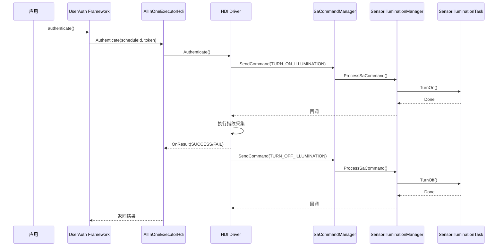
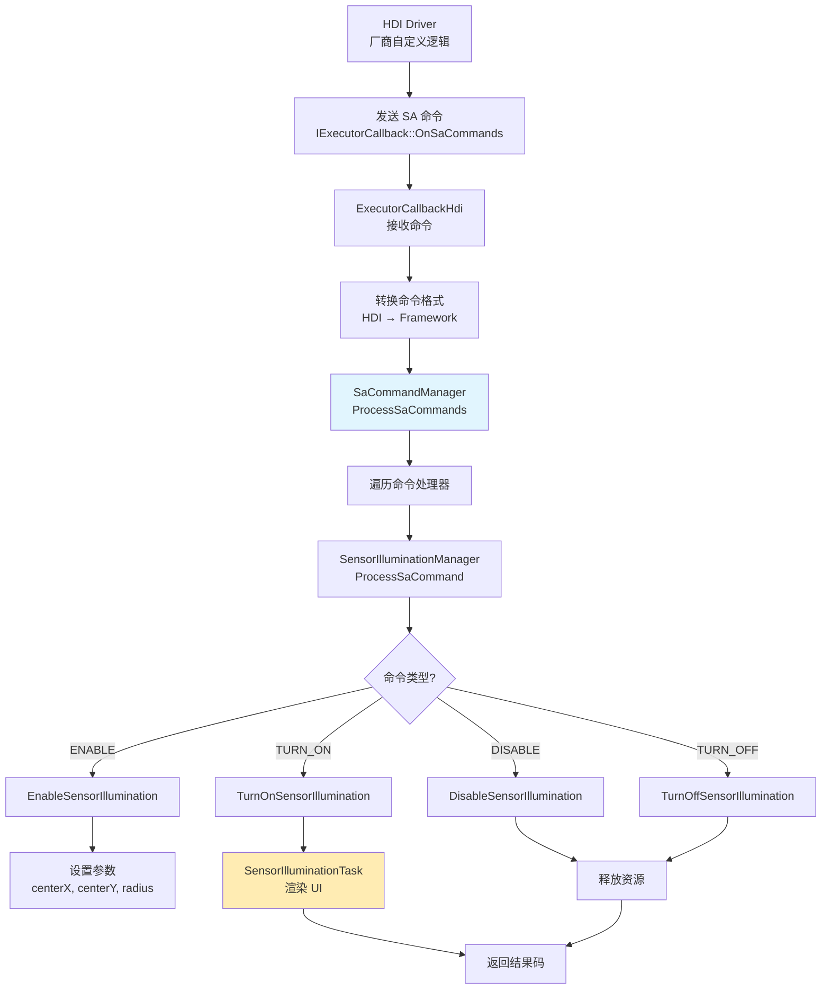
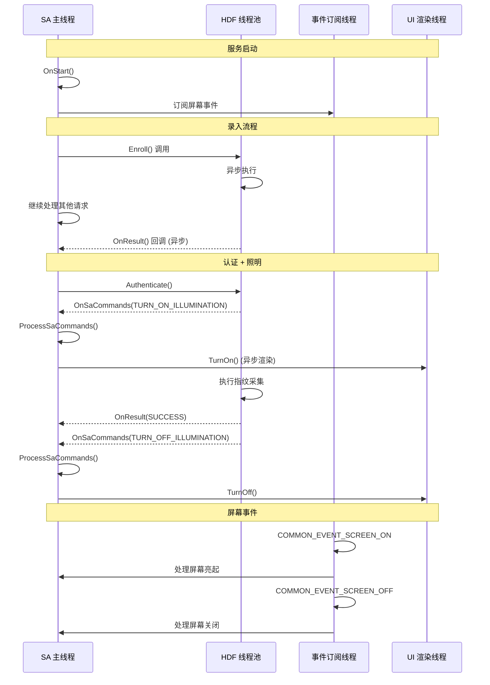

# 架构说明

## 目的

本文档详细说明指纹认证组件的架构设计，包括组件图、数据流、线程模型和关键时序。

## 适用范围

- 架构师
- 需要深入理解组件设计原理的开发者
- 性能优化人员

## 关键结论

1. **分层架构**：组件采用清晰的分层设计，从上到下依次为：UserAuth Framework → FingerprintAuthService → HDI 适配层 → Hardware Driver。

2. **通信模式**：
   - **下行调用**：Framework 通过 HDI Proxy 调用 Driver，执行操作
   - **上行回调**：Driver 通过 IExecutorCallback 返回结果
   - **命令流**：Driver 通过 ISaCommandCallback 发送命令到 SA

3. **线程模型**：服务运行在 SA 主线程，HDI 回调通过 HDF 线程池异步执行，UI 渲染在专门的渲染线程。

4. **扩展机制**：通过 `SaCommandManager` 和动态库加载实现功能扩展，支持厂商自定义命令。

---

## 组件图

### 整体架构



### 模块交互图



---

## 核心组件说明

### 1. FingerprintAuthService（主服务）

**文件路径**：
- 头文件：`services/inc/fingerprint_auth_service.h`
- 实现：`services/src/fingerprint_auth_service.cpp`

**职责**：
- 作为 System Ability 943 注册到系统
- 管理服务生命周期（OnStart/OnStop）
- 初始化 DriverManager
- 单例模式，全局唯一实例

**关键代码**：
```cpp
// services/src/fingerprint_auth_service.cpp:51
const bool REGISTER_RESULT = SystemAbility::MakeAndRegisterAbility(
    FingerprintAuthService::GetInstance().get()
);

// services/src/fingerprint_auth_service.cpp:68
FingerprintAuthService::FingerprintAuthService()
    : SystemAbility(SUBSYS_USERIAM_SYS_ABILITY_FINGERPRINTAUTH, true)
{
}
```

**证据**：
- 文件：`services/src/fingerprint_auth_service.cpp:16-110`
- SA 注册：第 51 行
- SA ID 定义：第 68 行

### 2. FingerprintAuthDriverHdi（HDI 驱动适配器）

**文件路径**：
- 头文件：`services/inc/fingerprint_auth_driver_hdi.h`
- 实现：`services/src/fingerprint_auth_driver_hdi.cpp`

**职责**：
- 实现 UserAuth Framework 的 `IAuthDriverHdi` 接口
- 管理 HDI 执行器列表
- 处理执行器获取和回调注册
- 支持 All-in-One Executor 模式

**关键方法**：
```cpp
// 获取执行器列表
std::vector<std::shared_ptr<IAuthExecutorHdi>> GetExecutors();

// 注册 SA 命令处理器
void RegisterSaCommandCallback(const sptr<ISaCommandCallback> &callback);
```

**证据**：
- 文件：`services/src/fingerprint_auth_driver_hdi.cpp:47-93`

### 3. FingerprintAllInOneExecutorHdi（All-in-One 执行器）

**文件路径**：
- 头文件：`services/inc/fingerprint_auth_all_in_one_executor_hdi.h`
- 实现：`services/src/fingerprint_auth_all_in_one_executor_hdi.cpp`

**职责**：
- 实现 UserAuth Framework 的 `IAuthExecutorHdi` 接口
- 封装 HDI 的 `IAllInOneExecutor` 接口
- 提供所有执行器操作：Enroll、Authenticate、Identify、Delete、Cancel
- 处理 SA 命令（SendCommand）

**关键方法**：
```cpp
// services/src/fingerprint_auth_all_in_one_executor_hdi.cpp

ResultCode Enroll(uint64_t scheduleId, const std::vector<uint8_t> &extraInfo) override;      // 101-116 行
ResultCode Authenticate(uint64_t scheduleId, const std::vector<uint8_t> &extraInfo) override; // 118-134 行
ResultCode Identify(uint64_t scheduleId, const std::vector<uint8_t> &extraInfo) override;   // 136-151 行
ResultCode Delete(uint64_t scheduleId, const std::vector<uint64_t> &templateIds) override; // 153-163 行
ResultCode Cancel(uint64_t scheduleId) override;                                        // 165-175 行
ResultCode SendCommand(uint64_t commandId, const std::vector<uint8_t> &extraInfo);        // 177-198 行
```

**证据**：
- 文件：`services/src/fingerprint_auth_all_in_one_executor_hdi.cpp:101-198`

### 4. SaCommandManager（SA 命令管理器）

**文件路径**：
- 头文件：`services/inc/sa_command_manager.h`
- 实现：`services/src/sa_command_manager.cpp`

**职责**：
- 管理 SA 命令处理器
- 注册/注销命令处理器
- 分发来自 HDI 驱动的命令
- 支持多个命令处理器并存

**关键接口**：
```cpp
// services/inc/isa_command_processor.h
class ISaCommandProcessor {
public:
    virtual ~ISaCommandProcessor() = default;
    virtual ResultCode ProcessSaCommand(const SaCommand &command) = 0;
    virtual void OnHdiDisconnect() {}
};
```

**支持的命令处理器**：
- `SensorIlluminationManager`：处理传感器照明相关命令

**证据**：
- 文件：`services/inc/sa_command_manager.h`
- 实现：`services/src/sa_command_manager.cpp:20-98`

### 5. SensorIlluminationManager（传感器照明管理器）

**文件路径**：
- 头文件：`services/inc/sensor_illumination_manager.h`
- 实现：`services/src/sensor_illumination_manager.cpp`

**职责**：
- 实现 `ISaCommandProcessor` 接口
- 管理传感器照明状态
- 动态加载 `services_ex` 库
- 协调 `SensorIlluminationTask` 执行 UI 渲染

**支持的命令**：
```cpp
// 传感器照明命令
ENABLE_SENSOR_ILLUMINATION    // 启用照明
DISABLE_SENSOR_ILLUMINATION   // 禁用照明
TURN_ON_SENSOR_ILLUMINATION    // 打开照明
TURN_OFF_SENSOR_ILLUMINATION   // 关闭照明
```

**动态库加载**：
```cpp
// services/src/service_ex_manager.cpp:30-52
void ServiceExManager::Load()
{
    handle_ = dlopen("libfingerprintauthservice_ex.z.so", RTLD_NOW);
    auto createFunc = reinterpret_cast<CreateSensorIlluminationTaskFunc>(
        dlsym(handle_, "GetSensorIlluminationTask")
    );
    task_ = createFunc();
}
```

**证据**：
- 文件：`services/src/sensor_illumination_manager.cpp:1-206`
- 动态加载：`services/src/service_ex_manager.cpp:30-52`

---

## 数据流

### 1. 录入流程（Enroll）



**关键代码路径**：
```
UserAuth Framework
  → services/src/fingerprint_auth_service.cpp:68 (SA 构造)
  → services/src/fingerprint_auth_driver_hdi.cpp:47 (获取执行器)
  → services/src/fingerprint_auth_all_in_one_executor_hdi.cpp:101 (Enroll 实现)
  → HDI Driver (IAllInOneExecutor::Enroll)
  → HDI Driver 回调 (IExecutorCallback::OnResult)
  → services/src/fingerprint_auth_executor_callback_hdi.cpp:16 (回调处理)
  → UserAuth Framework
```

**参数转换**：
```cpp
// services/src/fingerprint_auth_all_in_one_executor_hdi.cpp:101-116
ResultCode FingerprintAllInOneExecutorHdi::Enroll(
    uint64_t scheduleId,
    const std::vector<uint8_t> &extraInfo)
{
    // 转换为 HDI 参数格式
    EnrollParam param {
        .scheduleId = scheduleId,
        .extraInfo = extraInfo
    };

    // 调用 HDI 接口
    auto ret = executor_->Enroll(param, callback_);

    // 转换结果码
    return ConvertToResultCode(ret);
}
```

### 2. 认证流程（Authenticate）+ 传感器照明



**传感器照明时序**：


### 3. 命令流（SA Command）



**命令结构**（来自 HDI 定义）：
```cpp
// services/inc/fingerprint_auth_hdi.h (HDI 类型别名)
using SaCommand = OHOS::HDI::FingerprintAuth::V2_0::SaCommand;
using SaCommandId = OHOS::HDI::FingerprintAuth::V2_0::SaCommandId;

struct SaCommand {
    SaCommandId id;           // 命令 ID
    std::vector<uint8_t> payload;  // 命令载荷
};
```

---

## 线程模型

### 线程概览

| 线程类型 | 职责 | 创建时机 | 生命周期 |
|----------|------|----------|---------|
| **SA 主线程** | 服务生命周期管理、命令分发 | 系统启动 | 持久运行 |
| **HDF 回调线程池** | HDI 操作回调 | HDF 初始化 | 服务运行期间 |
| **事件订阅线程** | 屏幕状态事件处理 | `ScreenStateMonitor` 初始化 | 服务运行期间 |
| **UI 渲染线程** | 传感器照明 UI 渲染 | Rosen 渲染服务 | 渲染任务期间 |

### 线程交互图



### 线程安全

| 资源 | 保护机制 | 证据 |
|--------|---------|------|
| `FingerprintAuthService` 单例 | `std::mutex mutex_` | `services/src/fingerprint_auth_service.cpp:39` |
| SensorIlluminationManager 执行器映射 | `std::map` + `std::mutex` | `services/src/sensor_illumination_manager.cpp:107-114` |
| ServiceExManager 动态库句柄 | `std::mutex` + RAII | `services/src/service_ex_manager.cpp:1-79` |
| HDF 回调 | 通过 HDF 线程池异步执行 | HDI 框架保证 |

---

## 扩展机制

### 1. SA 命令扩展

**原理**：通过 `SaCommandManager` 注册自定义命令处理器。

**扩展步骤**：

1. **定义命令 ID**（在 HDI 接口中）：
```cpp
// drivers_interface/fingerprint_auth/idl/*.idl
enum SaCommandId {
    VENDOR_COMMAND_BEGIN = 1000,
    VENDOR_CUSTOM_CMD_1 = 1001,
    VENDOR_CUSTOM_CMD_2 = 1002
};
```

2. **实现命令处理器**：
```cpp
// services/inc/my_vendor_processor.h
class MyVendorProcessor : public ISaCommandProcessor {
public:
    ResultCode ProcessSaCommand(const SaCommand &command) override {
        if (command.id == VENDOR_CUSTOM_CMD_1) {
            // 处理自定义命令
            return SUCCESS;
        }
        return GENERAL_ERROR;
    }
};
```

3. **注册处理器**：
```cpp
// services/src/fingerprint_auth_service.cpp
auto myProcessor = std::make_shared<MyVendorProcessor>();
SaCommandManager::GetInstance().RegisterProcessor(myProcessor);
```

### 2. 动态库扩展（services_ex）

**原理**：通过 `ServiceExManager` 动态加载扩展库。

**扩展库要求**：

1. **导出工厂函数**：
```cpp
// services_ex/src/sensor_illumination_task.cpp
extern "C" {
    ISensorIlluminationTask *GetSensorIlluminationTask()
    {
        return new SensorIlluminationTask();
    }
}
```

2. **定义符号可见性**：
```
// services_ex/fingerprint_auth_service_ex_map
{
    global:
        GetSensorIlluminationTask*;
    local:
        *;
};
```

3. **加载扩展库**：
```cpp
// services/src/service_ex_manager.cpp
void ServiceExManager::Load()
{
    handle_ = dlopen("libfingerprintauthservice_ex.z.so", RTLD_NOW);
    auto createFunc = reinterpret_cast<CreateSensorIlluminationTaskFunc>(
        dlsym(handle_, "GetSensorIlluminationTask")
    );
    task_ = createFunc();
}
```

---

## 性能考量

### 1. 异步操作

**设计原则**：所有 HDI 操作都是异步的，避免阻塞 SA 主线程。

**证据**：
- HDI 回调通过 HDF 线程池执行：`services/src/fingerprint_auth_executor_callback_hdi.cpp:16-141`
- 用户认证流程不阻塞框架：使用 `OnResult()` 回调返回结果

### 2. 内存管理

**智能指针使用**：
- 使用 `std::shared_ptr` 管理执行器实例：`services/src/fingerprint_auth_driver_hdi.cpp:47-93`
- 使用 `sptr`（Strong Pointer）管理 HDI 接口：HDF 框架要求

**内存保护**：
- `MemoryGuard` RAII 包装器：`services/inc/memory_guard.h`
- CFI（Control Flow Integrity）启用：`services/BUILD.gn:34`

### 3. 错误处理

**防御性编程**：
- 参数检查宏：`common/utils/iam_check.h`
- 空指针检查：所有公共方法入口

**错误码转换**：
- HDI 错误码转换为框架标准错误码：`services/src/fingerprint_auth_all_in_one_executor_hdi.cpp:101-198`

---

## 相关跳转

- [01_Overview.md](./01_Overview.md) - 组件全貌
- [02_Directory_Structure.md](./02_Directory_Structure.md) - 目录结构
- [04_HDI_Interfaces.md](./04_HDI_Interfaces.md) - HDI 接口详解
- [05_Internal_APIs.md](./05_Internal_APIs.md) - 内部 API 详解
