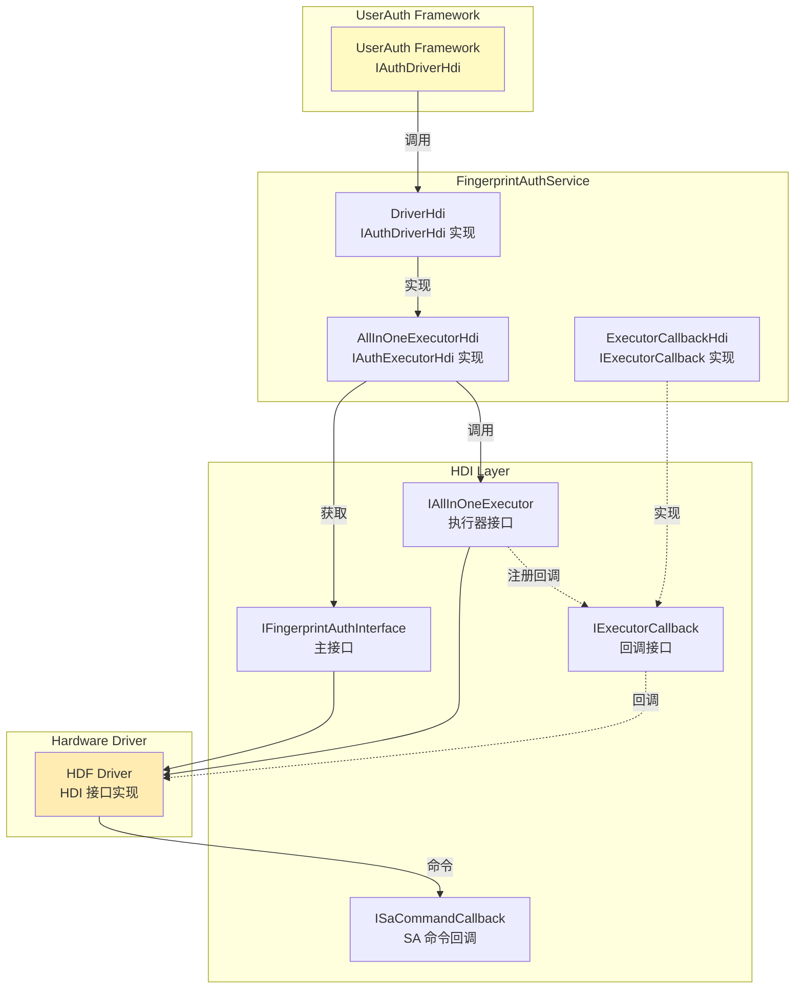
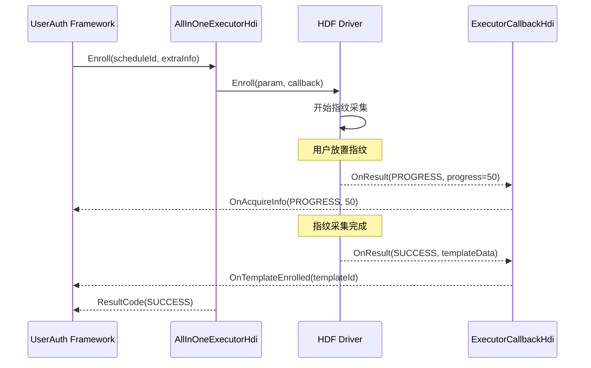
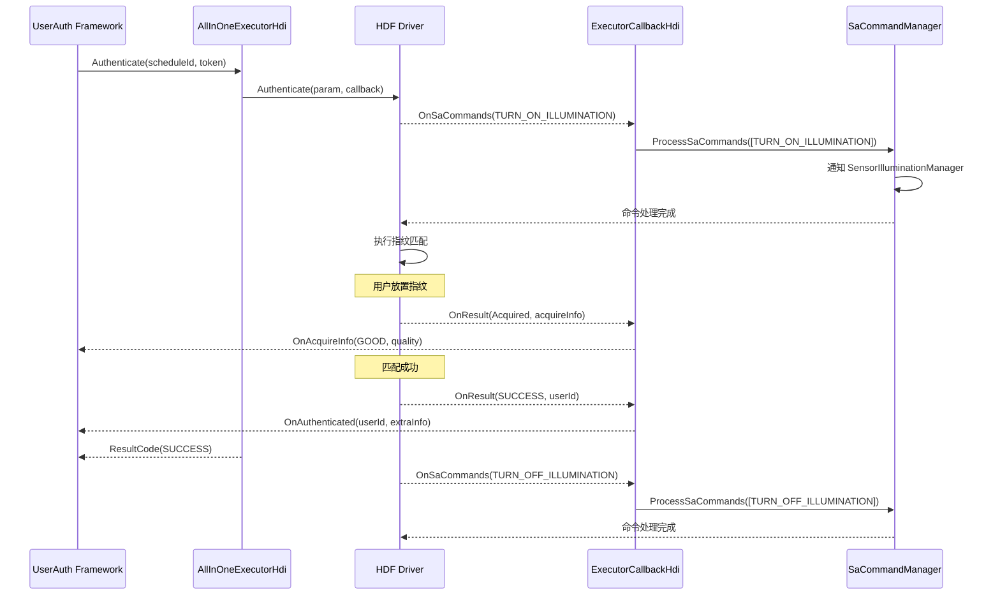

# HDI 接口

## 目的

本文档列出指纹认证组件使用的所有硬件驱动接口（HDI）定义，包括接口类型、方法、数据结构和回调。

## 适用范围

- 驱动开发者
- 框架对接开发者
- 需要理解硬件抽象层的架构师

## 关键结论

1. **HDI 版本**：本组件使用 HDF（Hardware Driver Foundation）V2.0 版本接口。

2. **主要接口**：
   - `IFingerprintAuthInterface`：指纹认证主接口，获取执行器列表
   - `IAllInOneExecutor`：All-in-One 执行器接口，提供所有认证操作
   - `IExecutorCallback`：执行器回调接口，返回操作结果
   - `ISaCommandCallback`：SA 命令回调接口，驱动主动发送命令

3. **接口来源**：HDI 接口定义位于 `drivers_interface_fingerprint_auth` 外部依赖，本组件通过类型别名引用。

4. **无 N-API**：HDI 是 C++ 原生接口，不是 JavaScript 接口。JS API 位于上层 `user_auth_framework`。

---

## HDI 接口总览

### 接口依赖关系



---

## 1. IFingerprintAuthInterface（主接口）

**HDI 命名空间**：`OHOS::HDI::FingerprintAuth::V2_0`

**本组件别名**：`services/inc/fingerprint_auth_hdi.h`
```cpp
using IFingerprintAuthInterface = OHOS::HDI::FingerprintAuth::V2_0::IFingerprintAuthInterface;
```

### 接口方法

| 方法 | 说明 |
|------|------|
| `GetExecutorList()` | 获取所有可用的指纹执行器列表 |
| `RegisterSaCommandCallback()` | 注册 SA 命令回调处理器 |

### 使用位置

**接口获取**：
```cpp
// services/src/fingerprint_auth_interface_adapter.cpp:25-28
sptr<IFingerprintAuthInterface> FingerprintAuthInterfaceAdapter::Get()
{
    return IFingerprintAuthInterface::Get();
}
```

**证据**：
- 文件：`services/inc/fingerprint_auth_hdi.h`
- 实现：`services/src/fingerprint_auth_interface_adapter.cpp:25-28`

---

## 2. IAllInOneExecutor（执行器接口）

**HDI 命名空间**：`OHOS::HDI::FingerprintAuth::V2_0`

**本组件别名**：`services/inc/fingerprint_auth_hdi.h`
```cpp
using IAllInOneExecutor = OHOS::HDI::FingerprintAuth::V2_0::IAllInOneExecutor;
```

### 接口方法

| 方法 | 参数 | 返回值 | 说明 |
|------|------|--------|------|
| `GetExecutorInfo()` | `ExecutorInfo &executorInfo` | `int32_t` | 获取执行器信息（能力、等级等） |
| `Enroll()` | `EnrollParam &param, sptr<IExecutorCallback> &callback` | `int32_t` | 录入指纹 |
| `Authenticate()` | `AuthenticateParam &param, sptr<IExecutorCallback> &callback` | `int32_t` | 认证指纹 |
| `Identify()` | `IdentifyParam &param, sptr<IExecutorCallback> &callback` | `int32_t` | 识别指纹 |
| `Delete()` | `DeleteParam &param, sptr<IExecutorCallback> &callback` | `int32_t` | 删除指纹模板 |
| `Cancel()` | `uint64_t scheduleId` | `int32_t` | 取消操作 |
| `SendCommand()` | `uint64_t commandId, std::vector<uint8_t> &payload` | `int32_t` | 发送控制命令 |
| `GetProperty()` | `std::vector<uint64_t> &propertyIds, sptr<IExecutorCallback> &callback` | `int32_t` | 获取属性 |
| `SetCachedTemplates()` | `uint64_t executorIndex, std::vector<uint64_t> &templateIds` | `int32_t` | 设置缓存模板 |

### 本组件实现

**实现类**：`FingerprintAllInOneExecutorHdi`

**文件路径**：
- 头文件：`services/inc/fingerprint_auth_all_in_one_executor_hdi.h`
- 实现：`services/src/fingerprint_auth_all_in_one_executor_hdi.cpp`

**方法实现位置**：

| 方法 | 文件行号 | 说明 |
|------|---------|------|
| `GetExecutorInfo()` | TODO | 获取执行器信息 |
| `Enroll()` | 101-116 | 录入指纹实现 |
| `Authenticate()` | 118-134 | 认证指纹实现 |
| `Identify()` | 136-151 | 识别指纹实现 |
| `Delete()` | 153-163 | 删除模板实现 |
| `Cancel()` | 165-175 | 取消操作实现 |
| `SendCommand()` | 177-198 | 发送 SA 命令 |
| `GetProperty()` | 200-218 | 获取属性实现 |
| `SetCachedTemplates()` | 220-231 | 设置缓存模板 |

**证据**：
- 文件：`services/src/fingerprint_auth_all_in_one_executor_hdi.cpp:101-231`

### Enroll 参数结构

```cpp
// HDI 定义的参数结构（来自 drivers_interface）
struct EnrollParam {
    uint64_t scheduleId;              // 调度 ID
    std::vector<uint8_t> extraInfo;   // 额外信息
};
```

### Authenticate 参数结构

```cpp
struct AuthenticateParam {
    uint64_t scheduleId;              // 调度 ID
    std::vector<uint8_t> extraInfo;   // 额外信息（包含 token）
};
```

---

## 3. IExecutorCallback（回调接口）

**HDI 命名空间**：`OHOS::HDI::FingerprintAuth::V2_0`

**本组件别名**：`services/inc/fingerprint_auth_hdi.h`
```cpp
using IExecutorCallback = OHOS::HDI::FingerprintAuth::V2_0::IExecutorCallback;
```

### 回调方法

| 方法 | 参数 | 说明 |
|------|------|------|
| `OnResult()` | `int32_t result, std::vector<uint8_t> &extraInfo` | 返回操作结果 |
| `OnSaCommands()` | `std::vector<SaCommand> &commands` | 返回 SA 命令 |

### 本组件实现

**实现类**：`FingerprintAuthExecutorCallbackHdi`

**文件路径**：
- 头文件：`services/inc/fingerprint_auth_executor_callback_hdi.h`
- 实现：`services/src/fingerprint_auth_executor_callback_hdi.cpp`

**方法实现位置**：

| 方法 | 文件行号 | 说明 |
|------|---------|------|
| `OnResult()` | 19-63 | 处理 HDI 返回结果 |
| `OnSaCommands()` | 65-139 | 处理来自驱动的 SA 命令 |

**证据**：
- 文件：`services/src/fingerprint_auth_executor_callback_hdi.cpp:19-139`

### 回调数据结构

```cpp
// SaCommand 结构（来自 HDI 定义）
struct SaCommand {
    SaCommandId id;                   // 命令 ID
    std::vector<uint8_t> payload;      // 命令载荷
};
```

**SaCommandId 枚举**（常用值）：

| 命令 ID | 值 | 说明 |
|---------|-----|------|
| `ENABLE_SENSOR_ILLUMINATION` | 1 | 启用传感器照明 |
| `DISABLE_SENSOR_ILLUMINATION` | 2 | 禁用传感器照明 |
| `TURN_ON_SENSOR_ILLUMINATION` | 3 | 打开传感器照明 |
| `TURN_OFF_SENSOR_ILLUMINATION` | 4 | 关闭传感器照明 |

---

## 4. ISaCommandCallback（SA 命令回调接口）

**HDI 命名空间**：`OHOS::HDI::FingerprintAuth::V2_0`

**本组件别名**：`services/inc/fingerprint_auth_hdi.h`
```cpp
using ISaCommandCallback = OHOS::HDI::FingerprintAuth::V2_0::ISaCommandCallback;
```

### 回调方法

| 方法 | 参数 | 说明 |
|------|------|------|
| `OnSaCommands()` | `std::vector<SaCommand> &commands` | 处理来自驱动的 SA 命令 |

### 用途

允许 HDI 驱动向 SA 服务发送主动命令，例如：
- 驱动检测到需要照亮传感器区域时，发送 `TURN_ON_SENSOR_ILLUMINATION` 命令
- 驱动检测到认证完成或失败时，发送 `TURN_OFF_SENSOR_ILLUMINATION` 命令

---

## HDI 数据类型

### ExecutorInfo（执行器信息）

```cpp
// HDI 定义的执行器信息结构
struct ExecutorInfo {
    uint16_t executorId;              // 执行器 ID
    uint16_t authType;                // 认证类型（指纹=1）
    uint16_t executorRole;            // 执行器角色
    uint16_t executorSecureLevel;      // 安全等级
    uint32_t authType;               // 支持的认证类型
    std::vector<uint32_t> executorMatcher;  // 执行器匹配器
    std::vector<uint32_t> esls;     // 执行器安全等级
    std::vector<uint32_t> publicKeys; // 公钥
    std::string ownerInfo;            // 所有者信息
};
```

### AuthType（认证类型）

| 值 | 说明 |
|-----|------|
| `PIN` | 0 | PIN 码认证 |
| `FINGERPRINT` | 1 | 指纹认证 |
| `FACE` | 2 | 人脸认证 |

### ExecutorRole（执行器角色）

| 值 | 说明 |
|-----|------|
| `COLLECTOR` | 1 | 采集器 |
| `VERIFIER` | 2 | 验证器 |
| `ALL_IN_ONE` | 3 | All-in-One（本组件使用） |

### ExecutorSecureLevel（安全等级）

| 值 | 说明 |
|-----|------|
| `S0` | 0 | 纯软件实现 |
| `S1` | 1 | TEE（可信执行环境） |
| `S2` | 2 | TEE + 安全硬件 |
| `S3` | 3 | 安全芯片 |
| `S4` | 4 | 最高安全级别 |

### Property（属性）

```cpp
// HDI 定义的属性结构
struct Property {
    uint64_t propertyId;              // 属性 ID
    std::vector<uint8_t> value;       // 属性值
};
```

**常用属性 ID**：
- `PROPERTY_ENROLL_PROGRESS`：录入进度
- `PROPERTY_REMAINING_TIMES`：剩余尝试次数
- `PROPERTY_AUTH_SUB_TYPE`：认证子类型

---

## HDI 状态码

### HDF 状态码

| 状态码 | 值 | 说明 |
|--------|-----|------|
| `HDF_SUCCESS` | 0 | 操作成功 |
| `HDF_FAILURE` | -1 | 一般失败 |
| `HDF_ERR_TIMEOUT` | -2 | 操作超时 |
| `HDF_ERR_QUEUE_FULL` | -3 | 队列满 |
| `HDF_ERR_DEVICE_BUSY` | -4 | 设备忙碌 |

### 组件转换后的结果码

**完整列表**：参见 `common/inc/fingerprint_auth_defines.h:24-77`

| HDI 错误码 | 转换后结果码 | 说明 |
|-----------|-------------|------|
| HDF_SUCCESS | SUCCESS | 成功 |
| HDF_FAILURE | FAIL | 失败 |
| HDF_ERR_TIMEOUT | TIMEOUT | 超时 |
| HDF_ERR_DEVICE_BUSY | BUSY | 设备忙碌 |
| 其他 | GENERAL_ERROR | 一般错误 |

---

## 本组件对 HDI 的使用

### 1. 获取 HDI 接口

```cpp
// services/src/fingerprint_auth_interface_adapter.cpp:25-28
sptr<IFingerprintAuthInterface> FingerprintAuthInterfaceAdapter::Get()
{
    return IFingerprintAuthInterface::Get();
}
```

### 2. 获取执行器列表

```cpp
// services/src/fingerprint_auth_driver_hdi.cpp:47-93
void FingerprintAuthDriverHdi::Init()
{
    auto hdiInterface = FingerprintAuthInterfaceAdapter::Get();

    // 获取执行器列表
    std::vector<sptr<IAllInOneExecutor>> executors;
    auto ret = hdiInterface->GetExecutorList(executors);

    // 初始化 All-in-One 执行器
    for (auto &executor : executors) {
        auto hdiExecutor = Common::MakeShared<FingerprintAllInOneExecutorHdi>(executor);
        executors_.push_back(hdiExecutor);
    }
}
```

### 3. 注册 SA 命令回调

```cpp
// services/src/fingerprint_auth_all_in_one_executor_hdi.cpp:177-198
ResultCode FingerprintAllInOneExecutorHdi::SendCommand(
    uint64_t commandId,
    const std::vector<uint8_t> &extraInfo)
{
    SaCommand cmd;
    cmd.id = static_cast<SaCommandId>(commandId);
    cmd.payload = extraInfo;

    // 通过回调接口发送命令
    std::vector<SaCommand> commands;
    commands.push_back(cmd);
    SaCommandManager::GetInstance().ProcessSaCommands(commands);

    return SUCCESS;
}
```

### 4. 注册回调到 HDI

```cpp
// services/src/fingerprint_auth_all_in_one_executor_hdi.cpp
FingerprintAllInOneExecutorHdi::FingerprintAllInOneExecutorHdi(
    const sptr<IAllInOneExecutor> &executor)
    : executor_(executor)
{
    // 创建回调对象
    callback_ = new FingerprintAuthExecutorCallbackHdi();

    // 注册回调到 HDI 驱动
    executor_->RegisterCallback(callback_);
}
```

---

## HDI 接口调用时序

### 录入流程时序



### 认证流程时序



---

## 相关跳转

- [01_Overview.md](./01_Overview.md) - 组件全貌
- [03_Architecture.md](./03_Architecture.md) - 架构设计
- [05_Internal_APIs.md](./05_Internal_APIs.md) - 内部 API 详解
- [08_Security_Analysis.md](./08_Security_Analysis.md) - 安全分析

---

## 参考资料

1. **HDI 定义源**：`drivers_interface/fingerprint_auth`（外部依赖）
2. **HDF 框架文档**：[OpenHarmony HDF 文档](https://docs.openharmony.cn/)
3. **UserIAM 框架**：[useriam_user_auth_framework](https://gitee.com/openharmony/useriam_user_auth_framework)
