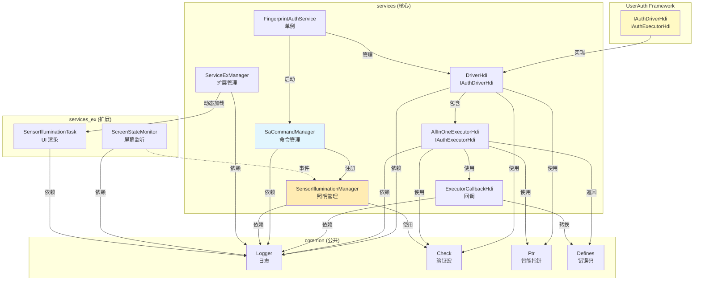

# 内部 API

## 目的

本文档说明指纹认证组件的内部模块接口、依赖方向、接口稳定性标注和可替换点。

## 适用范围

- 组件维护者
- 需要理解模块间交互的开发者
- 计划扩展组件功能的架构师

## 关键结论

1. **核心模块**：
   - `FingerprintAuthService`：主服务类，单例模式，生命周期管理
   - `FingerprintAuthDriverHdi`：HDI 驱动适配器，执行器管理
   - `FingerprintAllInOneExecutorHdi`：All-in-One 执行器实现
   - `SaCommandManager`：SA 命令管理器，扩展命令处理
   - `SensorIlluminationManager`：传感器照明协调器

2. **依赖方向**：单向依赖为主，无循环依赖：
   - `services/` → `common/`（基础设施）
   - `services/` → `services_ex/`（动态加载）
   - `services_ex/` → `services/`（头文件依赖）

3. **接口稳定性**：
   - 公共接口（`I*`）：稳定，遵循接口契约
   - 私有接口（无 `I` 前缀）：内部实现，可能变更
   - 可替换点：`ISaCommandProcessor`、`ISensorIlluminationTask`

---

## 核心模块接口

### 1. FingerprintAuthService（主服务）

**文件路径**：
- 头文件：`services/inc/fingerprint_auth_service.h`
- 实现：`services/src/fingerprint_auth_service.cpp`

**接口类型**：私有实现，无公共接口（除了 SystemAbility 标准接口）

**主要方法**：

| 方法 | 访问级别 | 说明 |
|------|-----------|------|
| `GetInstance()` | public static | 获取单例实例 |
| `FingerprintAuthService()` | public | 构造函数，注册 SystemAbility |
| `OnStart()` | public override | SA 启动回调 |
| `OnStop()` | public override | SA 停止回调（未实现） |
| `StartDriverManager()` | private | 启动驱动管理器 |

**稳定性**：**稳定** - SystemAbility 标准生命周期接口

**证据**：
- 文件：`services/inc/fingerprint_auth_service.h:27-42`

**使用示例**：
```cpp
// 获取服务实例
auto service = FingerprintAuthService::GetInstance();

// SA 自动启动（通过注册）
const bool REGISTER_RESULT = SystemAbility::MakeAndRegisterAbility(
    FingerprintAuthService::GetInstance().get()
);
```

---

### 2. FingerprintAuthDriverHdi（HDI 驱动适配器）

**文件路径**：
- 头文件：`services/inc/fingerprint_auth_driver_hdi.h`
- 实现：`services/src/fingerprint_auth_driver_hdi.cpp`

**接口类型**：实现 UserAuth Framework 的 `IAuthDriverHdi` 接口

**主要方法**：

| 方法 | 返回值 | 说明 |
|------|--------|------|
| `GetExecutors()` | `std::vector<std::shared_ptr<IAuthExecutorHdi>>` | 获取所有执行器 |
| `RegisterSaCommandCallback()` | `void` | 注册 SA 命令回调 |
| `GetExecutorInfo()` | `ExecutorInfo` | 获取执行器信息 |

**稳定性**：**稳定** - UserAuth Framework 标准接口

**证据**：
- 文件：`services/src/fingerprint_auth_driver_hdi.cpp:47-93`

**调用示例**：
```cpp
auto driverHdi = std::make_shared<FingerprintAuthDriverHdi>();

// 获取执行器列表
auto executors = driverHdi->GetExecutors();

// 注册 SA 命令回调
auto callback = new SaCommandCallback();
driverHdi->RegisterSaCommandCallback(callback);
```

---

### 3. FingerprintAllInOneExecutorHdi（All-in-One 执行器）

**文件路径**：
- 头文件：`services/inc/fingerprint_auth_all_in_one_executor_hdi.h`
- 实现：`services/src/fingerprint_auth_all_in_one_executor_hdi.cpp`

**接口类型**：实现 UserAuth Framework 的 `IAuthExecutorHdi` 接口

**主要方法**：

| 方法 | 返回值 | 说明 |
|------|--------|------|
| `GetExecutorInfo()` | `ExecutorInfo` | 获取执行器能力信息 |
| `Enroll()` | `ResultCode` | 录入指纹 |
| `Authenticate()` | `ResultCode` | 认证指纹 |
| `Identify()` | `ResultCode` | 识别指纹 |
| `Delete()` | `ResultCode` | 删除模板 |
| `Cancel()` | `ResultCode` | 取消操作 |
| `SendCommand()` | `ResultCode` | 发送 SA 命令 |
| `GetProperty()` | `ResultCode` | 获取属性 |
| `SetCachedTemplates()` | `ResultCode` | 设置缓存模板 |

**稳定性**：**稳定** - UserAuth Framework 标准接口

**证据**：
- 文件：`services/src/fingerprint_auth_all_in_one_executor_hdi.cpp:101-231

**使用示例**：
```cpp
// 创建执行器实例
auto executor = std::make_shared<FingerprintAllInOneExecutorHdi>(hdiExecutor);

// 执行录入
ResultCode ret = executor->Enroll(scheduleId, extraInfo);

// 执行认证
ret = executor->Authenticate(scheduleId, token);

// 发送命令
ret = executor->SendCommand(TURN_ON_SENSOR_ILLUMINATION, payload);
```

---

### 4. FingerprintAuthExecutorCallbackHdi（回调适配器）

**文件路径**：
- 头文件：`services/inc/fingerprint_auth_executor_callback_hdi.h`
- 实现：`services/src/fingerprint_auth_executor_callback_hdi.cpp`

**接口类型**：私有实现，封装 HDI 回调到 Framework 回调

**主要方法**：

| 方法 | 参数 | 说明 |
|------|------|------|
| `OnResult()` | `int32_t result, std::vector<uint8_t> &extraInfo` | 处理 HDI 返回结果 |
| `OnSaCommands()` | `std::vector<SaCommand> &commands` | 处理来自驱动的 SA 命令 |

**稳定性**：**内部** - 可能随 HDI 接口变更

**证据**：
- 文件：`services/src/fingerprint_auth_executor_callback_hdi.cpp:19-139

---

### 5. SaCommandManager（SA 命令管理器）

**文件路径**：
- 头文件：`services/inc/sa_command_manager.h`
- 实现：`services/src/sa_command_manager.cpp`

**接口类型**：公共管理类

**主要方法**：

| 方法 | 访问级别 | 说明 |
|------|-----------|------|
| `GetInstance()` | public static | 获取单例 |
| `RegisterProcessor()` | public | 注册命令处理器 |
| `UnregisterProcessor()` | public | 注销命令处理器 |
| `ProcessSaCommands()` | public | 处理 SA 命令 |

**稳定性**：**稳定** - 命令管理公共接口

**证据**：
- 文件：`services/src/sa_command_manager.cpp:20-98

**使用示例**：
```cpp
// 获取管理器实例
auto manager = SaCommandManager::GetInstance();

// 注册命令处理器
auto processor = std::make_shared<MyCommandProcessor>();
manager->RegisterProcessor(processor);

// 处理命令
std::vector<SaCommand> commands;
commands.push_back({TURN_ON_ILLUMINATION, payload});
manager->ProcessSaCommands(commands);
```

---

### 6. SensorIlluminationManager（传感器照明管理器）

**文件路径**：
- 头文件：`services/inc/sensor_illumination_manager.h`
- 实现：`services/src/sensor_illumination_manager.cpp`

**接口类型**：实现 `ISaCommandProcessor` 接口

**主要方法**：

| 方法 | 访问级别 | 说明 |
|------|-----------|------|
| `GetInstance()` | public static | 获取单例 |
| `EnableSensorIllumination()` | public | 启用传感器照明 |
| `DisableSensorIllumination()` | public | 禁用传感器照明 |
| `TurnOnSensorIllumination()` | public | 打开传感器照明 |
| `TurnOffSensorIllumination()` | public | 关闭传感器照明 |
| `ProcessSaCommand()` | public override | 实现 ISaCommandProcessor 接口 |

**稳定性**：**稳定** - 公共管理接口

**证据**：
- 文件：`services/src/sensor_illumination_manager.cpp:1-206`

**使用示例**：
```cpp
auto manager = SensorIlluminationManager::GetInstance();

// 启用传感器照明
manager->EnableSensorIllumination(executorId, centerX, centerY, radius);

// 打开照明
manager->TurnOnSensorIllumination(executorId);

// 关闭照明
manager->TurnOffSensorIllumination(executorId);

// 禁用传感器照明
manager->DisableSensorIllumination(executorId);
```

---

### 7. ServiceExManager（扩展服务管理器）

**文件路径**：
- 头文件：`services/inc/service_ex_manager.h`
- 实现：`services/src/service_ex_manager.cpp`

**接口类型**：私有实现，管理动态库加载

**主要方法**：

| 方法 | 访问级别 | 说明 |
|------|-----------|------|
| `GetInstance()` | public static | 获取单例 |
| `Load()` | public | 加载扩展库 |
| `GetSensorIlluminationTask()` | public | 获取传感器照明任务实例 |

**稳定性**：**内部** - 可能随扩展机制变更

**证据**：
- 文件：`services/src/service_ex_manager.cpp:30-52`

**使用示例**：
```cpp
// 加载扩展库
ServiceExManager::GetInstance().Load();

// 获取传感器照明任务
auto task = ServiceExManager::GetInstance().GetSensorIlluminationTask();
task->TurnOn();
```

---

## 扩展接口（可替换点）

### 1. ISaCommandProcessor（SA 命令处理器接口）

**文件路径**：`services/inc/isa_command_processor.h`

**用途**：允许扩展自定义 SA 命令处理逻辑

**接口定义**：
```cpp
class ISaCommandProcessor {
public:
    virtual ~ISaCommandProcessor() = default;
    virtual ResultCode ProcessSaCommand(const SaCommand &command) = 0;
    virtual void OnHdiDisconnect() {}
};
```

**现有实现**：
- `SensorIlluminationManager`：处理传感器照明命令

**稳定性**：**稳定** - 扩展接口

**扩展示例**：
```cpp
// 自定义命令处理器
class MyVendorProcessor : public ISaCommandProcessor {
public:
    ResultCode ProcessSaCommand(const SaCommand &command) override {
        switch (command.id) {
            case VENDOR_CUSTOM_CMD:
                // 处理自定义命令
                return SUCCESS;
            default:
                return GENERAL_ERROR;
        }
    }
};

// 注册处理器
auto processor = std::make_shared<MyVendorProcessor>();
SaCommandManager::GetInstance().RegisterProcessor(processor);
```

---

### 2. ISensorIlluminationTask（传感器照明任务接口）

**文件路径**：`services/inc/isensor_illumination_task.h`

**用途**：定义传感器照明 UI 任务接口

**接口定义**：
```cpp
class ISensorIlluminationTask {
public:
    virtual ~ISensorIlluminationTask() = default;
    virtual void TurnOn() = 0;
    virtual void TurnOff() = 0;
    virtual void Release() = 0;
};
```

**现有实现**：
- `SensorIlluminationTask`（在 `services_ex` 中）

**稳定性**：**稳定** - 扩展接口

**扩展示例**：
```cpp
// 自定义传感器照明任务
class MySensorIlluminationTask : public ISensorIlluminationTask {
public:
    void TurnOn() override {
        // 自定义 UI 渲染逻辑
    }

    void TurnOff() override {
        // 关闭 UI
    }

    void Release() override {
        // 释放资源
    }
};

// 导出工厂函数
extern "C" {
    ISensorIlluminationTask *GetSensorIlluminationTask() {
        return new MySensorIlluminationTask();
    }
}
```

---

## 模块依赖关系

### 依赖图



### 依赖方向总结

| 源模块 | 目标模块 | 依赖类型 | 说明 |
|--------|---------|---------|------|
| `FingerprintAuthService` | `FingerprintAuthDriverHdi` | 组合 | 主服务持有驱动管理器 |
| `FingerprintAuthDriverHdi` | `FingerprintAllInOneExecutorHdi` | 组合 | 驱动管理器管理执行器 |
| `FingerprintAllInOneExecutorHdi` | `FingerprintAuthExecutorCallbackHdi` | 组合 | 执行器注册回调 |
| `FingerprintAuthService` | `SaCommandManager` | 组合 | 服务管理命令管理器 |
| `SaCommandManager` | `SensorIlluminationManager` | 组合 | 命令管理器管理照明管理器 |
| `SensorIlluminationManager` | `ServiceExManager` | 组合 | 照明管理器通过扩展管理器加载任务 |
| `services/` | `common/` | 依赖 | 所有模块依赖公共基础设施 |
| `services_ex/` | `services/` | 头文件依赖 | 扩展模块依赖核心模块头文件 |

---

## 接口稳定性标注

### 稳定性等级

| 等级 | 说明 | 示例 |
|------|------|------|
| **稳定（Stable）** | UserAuth Framework 标准接口，长期兼容 | `IAuthDriverHdi`、`IAuthExecutorHdi` |
| **公共（Public）** | 组件内部公共接口，可能变更 | `SaCommandManager`、`SensorIlluminationManager` |
| **扩展（Extension）** | 扩展点接口，用于功能扩展 | `ISaCommandProcessor`、`ISensorIlluminationTask` |
| **内部（Internal）** | 私有实现，可能变更 | `FingerprintAuthExecutorCallbackHdi`、`ServiceExManager` |

### 接口列表

| 接口/类 | 文件 | 稳定性 | 原因 |
|----------|------|---------|------|
| `FingerprintAuthService` | `services/inc/fingerprint_auth_service.h` | 稳定 | SystemAbility 标准接口 |
| `FingerprintAuthDriverHdi` | `services/inc/fingerprint_auth_driver_hdi.h` | 稳定 | UserAuth Framework 标准接口 |
| `FingerprintAllInOneExecutorHdi` | `services/inc/fingerprint_auth_all_in_one_executor_hdi.h` | 稳定 | UserAuth Framework 标准接口 |
| `SaCommandManager` | `services/inc/sa_command_manager.h` | 公共 | 组件内部公共接口 |
| `SensorIlluminationManager` | `services/inc/sensor_illumination_manager.h` | 公共 | 组件内部公共接口 |
| `ISaCommandProcessor` | `services/inc/isa_command_processor.h` | 扩展 | 扩展点接口 |
| `ISensorIlluminationTask` | `services/inc/isensor_illumination_task.h` | 扩展 | 扩展点接口 |
| `FingerprintAuthExecutorCallbackHdi` | `services/inc/fingerprint_auth_executor_callback_hdi.h` | 内部 | HDI 回调适配器 |
| `ServiceExManager` | `services/inc/service_ex_manager.h` | 内部 | 动态库加载管理 |

---

## 接口使用示例

### 完整的录入流程

```cpp
// 1. 获取服务实例
auto service = FingerprintAuthService::GetInstance();

// 2. 获取驱动管理器（内部）
auto driverHdi = service->GetDriverManager();

// 3. 获取执行器列表
auto executors = driverHdi->GetExecutors();

// 4. 获取 All-in-One 执行器
auto executor = executors[0];

// 5. 执行录入
uint64_t scheduleId = 12345;
std::vector<uint8_t> extraInfo;
ResultCode ret = executor->Enroll(scheduleId, extraInfo);

// 6. 处理结果（通过回调）
// 回调会在 HDF 线程池中异步执行
```

### 完整的认证流程 + 传感器照明

```cpp
// 1. 获取执行器
auto executor = GetExecutor();

// 2. 执行认证
uint64_t scheduleId = 12345;
std::vector<uint8_t> token; // 来自上层框架
ResultCode ret = executor->Authenticate(scheduleId, token);

// 3. HDI 驱动会自动发送传感器照明命令
// TURN_ON_SENSOR_ILLUMINATION

// 4. SaCommandManager 处理命令
auto manager = SaCommandManager::GetInstance();
// manager->ProcessSaCommands([TURN_ON_SENSOR_ILLUMINATION])

// 5. SensorIlluminationManager 执行照明
auto illumManager = SensorIlluminationManager::GetInstance();
// illumManager->TurnOnSensorIllumination(executorId)

// 6. 认证完成后，HDI 发送 TURN_OFF_ILLUMINATION
// manager->ProcessSaCommands([TURN_OFF_SENSOR_ILLUMINATION])
// illumManager->TurnOffSensorIllumination(executorId)
```

---

## 可替换点设计

### 扩展点 1：自定义 SA 命令处理器

**场景**：厂商需要添加自定义命令（如指纹传感器校准）

**步骤**：
1. 在 HDI 接口中定义新命令 ID
2. 实现 `ISaCommandProcessor` 接口
3. 注册到 `SaCommandManager`

**代码示例**：
```cpp
// 1. 定义命令 ID（在 drivers_interface_fingerprint_auth 中）
enum SaCommandId {
    VENDOR_CALIBRATE_SENSOR = 1000
};

// 2. 实现处理器
class CalibrateProcessor : public ISaCommandProcessor {
public:
    ResultCode ProcessSaCommand(const SaCommand &command) override {
        if (command.id == VENDOR_CALIBRATE_SENSOR) {
            // 解析 payload
            // 执行校准逻辑
            return SUCCESS;
        }
        return GENERAL_ERROR;
    }
};

// 3. 注册处理器
auto processor = std::make_shared<CalibrateProcessor>();
SaCommandManager::GetInstance().RegisterProcessor(processor);
```

### 扩展点 2：自定义传感器照明 UI

**场景**：厂商需要自定义传感器照明效果

**步骤**：
1. 实现 `ISensorIlluminationTask` 接口
2. 导出工厂函数
3. 编译为 `libfingerprintauthservice_ex.z.so`

**代码示例**：
```cpp
// 1. 实现 ISensorIlluminationTask 接口
class MyIlluminationTask : public ISensorIlluminationTask {
public:
    void TurnOn() override {
        // 自定义 UI 渲染逻辑
        // 使用 Rosen、OpenGL ES 或其他图形库
    }

    void TurnOff() override {
        // 关闭 UI
    }

    void Release() override {
        // 释放资源
    }
};

// 2. 导出工厂函数（在 services_ex 中）
extern "C" {
    ISensorIlluminationTask *GetSensorIlluminationTask() {
        return new MyIlluminationTask();
    }
}
```

---

## 相关跳转

- [01_Overview.md](./01_Overview.md) - 组件全貌
- [02_Directory_Structure.md](./02_Directory_Structure.md) - 目录结构
- [03_Architecture.md](./03_Architecture.md) - 架构设计
- [04_HDI_Interfaces.md](./04_HDI_Interfaces.md) - HDI 接口详解
