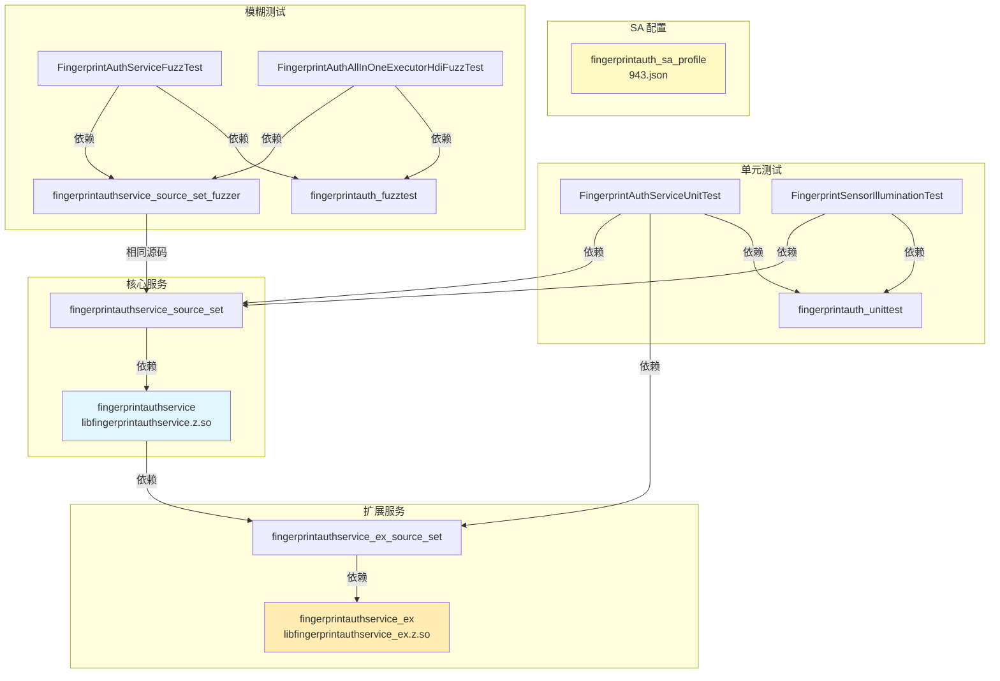

# GN 目标梳理

## 目的

本文档详细说明指纹认证组件的 GN（Generate Ninja）构建系统配置，包括所有 targets 列表、类型、依赖、产物和开关。

## 适用范围

- 构建系统维护者
- 需要了解编译配置的开发者
- 计划修改构建配置的工程师

## 关键结论

1. **主要产物**：
   - `libfingerprintauthservice.z.so`：核心指纹认证服务库
   - `libfingerprintauthservice_ex.z.so`：扩展服务库（传感器照明 UI）

2. **主要 Targets**：
   - `fingerprintauthservice_source_set`：源码集合，编译核心服务
   - `fingerprintauthservice`：共享库，输出核心服务
   - `fingerprintauthservice_ex_source_set`：源码集合，编译扩展服务
   - `fingerprintauthservice_ex`：共享库，输出扩展服务
   - `fingerprintauth_sa_profile`：SA 配置目标

3. **特性开关**：
   - `use_display_manager_component`：显示管理器集成（默认 true）
   - `use_power_manager_component`：电源管理器集成（默认 true）

4. **安全特性**：启用 CFI、UBSAN、边界检查、分支保护等安全特性。

---

## 全局配置文件

### fingerprint_auth.gni

**文件路径**：`fingerprint_auth.gni`

**作用**：定义全局编译开关和特性配置

**内容**：
```gn
# fingerprint_auth.gni:14-27
declare_args() {
  use_display_manager_component = true
  if (defined(global_parts_info) &&
      !defined(global_parts_info.powermgr_display_manager)) {
    use_display_manager_component = false
  }

  use_power_manager_component = true
  if (defined(global_parts_info) &&
      !defined(global_parts_info.powermgr_power_manager)) {
    use_power_manager_component = false
    use_display_manager_component = false
  }
}
```

**配置项**：

| 配置项 | 默认值 | 说明 |
|--------|---------|------|
| `use_display_manager_component` | `true` | 启用显示管理器集成 |
| `use_power_manager_component` | `true` | 启用电源管理器集成 |

**自动禁用逻辑**：
- 如果 `powermgr_display_manager` 不在全局组件列表中，自动禁用 `use_display_manager_component`
- 如果 `powermgr_power_manager` 不在全局组件列表中，自动禁用 `use_power_manager_component` 和 `use_display_manager_component`

**证据**：
- 文件：`fingerprint_auth.gni:14-27`

---

## 主要 Targets（生产）

### Target 1: fingerprintauthservice_source_set

**文件路径**：`services/BUILD.gn:29-76`

**类型**：`ohos_source_set`

**用途**：编译核心服务源码，供其他 target 复用

**Sources（9 个文件）**：
```
src/fingerprint_auth_all_in_one_executor_hdi.cpp
src/fingerprint_auth_driver_hdi.cpp
src/fingerprint_auth_executor_callback_hdi.cpp
src/fingerprint_auth_interface_adapter.cpp
src/fingerprint_auth_service.cpp
src/memory_guard.cpp
src/sa_command_manager.cpp
src/sensor_illumination_manager.cpp
src/service_ex_manager.cpp
```

**Include Directories**：
```gn
include_dirs = [
    "inc",
    "../common/inc",
    "../common/logs",
    "../common/utils",
]
```

**External Dependencies**：
```gn
external_deps = [
  "ability_base:configuration",
  "c_utils:utils",
  "drivers_interface_fingerprint_auth:libfingerprint_auth_proxy_2.0",
  "hdf_core:libhdf_utils",
  "hilog:libhilog",
  "ipc:ipc_core",
  "miscdevice:vibrator_interface_native",
  "safwk:system_ability_fwk",
  "samgr:samgr_proxy",
  "user_auth_framework:userauth_executors",
]
```

**Security Features**：
```gn
sanitize = {
  integer_overflow = true      # 整数溢出检测
  ubsan = true                 # 未定义行为检测
  boundary_sanitize = true      # 边界检查
  cfi = true                   # 控制流完整性
  cfi_cross_dso = true        # 跨 DSO 的 CFI
  debug = false
}
branch_protector_ret = "pac_ret" # PAC-RET 分支保护
```

**Conditional Defines**：
```gn
if (use_musl) {
  if (musl_use_jemalloc && musl_use_jemalloc_dfx_intf) {
    defines = [ "CONFIG_USE_JEMALLOC_DFX_INTF" ]
  }
}
```

**证据**：
- 文件：`services/BUILD.gn:29-76`

---

### Target 2: fingerprintauthservice

**文件路径**：`services/BUILD.gn:78-98`

**类型**：`ohos_shared_library`

**用途**：生成核心指纹认证服务共享库

**Output**：`libfingerprintauthservice.z.so`

**Dependencies**：
```gn
deps = [ ":fingerprintauthservice_source_set" ]
external_deps = [ "hilog:libhilog" ]
```

**Version Script**（musl only）：
```gn
if (use_musl) {
  version_script = "fingerprint_auth_service_map"
}
```

**说明**：`fingerprint_auth_service_map` 定义符号可见性，所有符号都标记为 local（私有）。

**证据**：
- 文件：`services/BUILD.gn:78-98`

---

### Target 3: fingerprintauthservice_ex_source_set

**文件路径**：`services_ex/BUILD.gn:21-90`

**类型**：`ohos_source_set`

**用途**：编译扩展服务源码（传感器照明 UI）

**Sources（2 个文件）**：
```
src/screen_state_monitor.cpp
src/sensor_illumination_task.cpp
```

**Include Directories**：
```gn
include_dirs = [
    "inc",
    "../services/inc",
    "../common/inc",
    "../common/logs",
    "../common/utils",
]
```

**Dependencies**：
```gn
deps = [ "../services:fingerprintauthservice" ]
```

**External Dependencies**（图形相关）：
```gn
external_deps = [
  "ability_base:want",
  "c_utils:utils",
  "common_event_service:cesfwk_innerkits",
  "drivers_interface_fingerprint_auth:libfingerprint_auth_proxy_2.0",
  "egl:libEGL",
  "graphic_2d:libcomposer",
  "graphic_2d:librender_service_base",
  "graphic_2d:librender_service_client",
  "graphic_surface:buffer_handle",
  "graphic_surface:surface_headers",
  "hdf_core:libhdf_utils",
  "hilog:libhilog",
  "ipc:ipc_single",
  "opengles:libGLES",
  "samgr:samgr_proxy",
  "skia:skia_canvaskit",
  "user_auth_framework:userauth_executors",
  "window_manager:libdm",
]
```

**Conditional Dependencies & Defines**：
```gn
if (use_display_manager_component) {
  external_deps += [ "display_manager:displaymgr" ]
  defines += [ "CONFIG_USE_DISPLAY_MANAGER_COMPONENT" ]
}

if (use_power_manager_component) {
  external_deps += [ "power_manager:powermgr_client" ]
  defines += [ "CONFIG_USE_POWER_MANAGER_COMPONENT" ]
}

if (defined(use_rosen_drawing) && use_rosen_drawing) {
  external_deps += [ "graphic_2d:2d_graphics" ]
  defines += [ "USE_ROSEN_DRAWING" ]
}
```

**Security Features**：与核心服务相同

**证据**：
- 文件：`services_ex/BUILD.gn:21-90`

---

### Target 4: fingerprintauthservice_ex

**文件路径**：`services_ex/BUILD.gn:92-112`

**类型**：`ohos_shared_library`

**用途**：生成扩展服务共享库

**Output**：`libfingerprintauthservice_ex.z.so`

**Dependencies**：
```gn
deps = [ ":fingerprintauthservice_ex_source_set" ]
external_deps = [ "hilog:libhilog" ]
```

**Version Script**（musl only）：
```gn
if (use_musl) {
  version_script = "fingerprint_auth_service_ex_map"
}
```

**说明**：`fingerprint_auth_service_ex_map` 导出 `GetSensorIlluminationTask*` 符号，其余为 local。

**证据**：
- 文件：`services_ex/BUILD.gn:92-112`

---

### Target 5: fingerprintauth_sa_profile

**文件路径**：`sa_profile/BUILD.gn:17-20`

**类型**：`ohos_sa_profile`

**用途**：生成 System Ability 配置文件

**Sources**：
```gn
sources = [ "943.json" ]
```

**Output**：处理后的 SA 配置（由系统加载）

**证据**：
- 文件：`sa_profile/BUILD.gn:17-20`

---

## 测试 Targets

### Target 6: FingerprintAuthServiceUnitTest

**文件路径**：`test/unittest/BUILD.gn`

**类型**：`ohos_unittest`

**用途**：核心服务单元测试

**Sources**：
```
fingerprint_auth_all_in_one_executor_hdi_unit_test.cpp
fingerprint_auth_driver_hdi_unit_test.cpp
fingerprint_auth_executor_callback_hdi_unit_test.cpp
sa_command_manager_unit_test.cpp
screen_state_monitor_unit_test.cpp
```

**Dependencies**：
```gn
deps = [
  "../../services:fingerprintauthservice_source_set",
  "../../services_ex:fingerprintauthservice_ex_source_set",
]
```

**External Dependencies**：
```gn
external_deps = [
  "drivers_interface_fingerprint_auth:libfingerprint_auth_proxy_2.0",
  "googletest:gmock_main",
  "googletest:gtest_main",
  "graphic_2d:librender_service_client",
  "hilog:libhilog",
  "user_auth_framework:userauth_executors",
  "window_manager:libdm",
  "hdf_core:libhdf_utils",
]
```

**Conditional**：
```gn
if (use_display_manager_component) {
  external_deps += [ "display_manager:displaymgr" ]
}
```

**证据**：
- 文件：`test/unittest/BUILD.gn`

---

### Target 7: FingerprintSensorIlluminationTest

**文件路径**：`test/unittest/BUILD.gn`

**类型**：`ohos_unittest`

**用途**：传感器照明单元测试

**Sources**：
```
fingerprint_auth_sensor_illumination_test.cpp
```

**Dependencies**：
```gn
deps = [ "../../services:fingerprintauthservice_source_set" ]
```

**Conditional**：
```gn
if (use_display_manager_component) {
  external_deps += [ "display_manager:displaymgr" ]
}
```

**证据**：
- 文件：`test/unittest/BUILD.gn`

---

### Target 8: fingerprintauth_unittest

**文件路径**：`test/unittest/BUILD.gn`

**类型**：`group` (testonly)

**用途**：单元测试组

**Dependencies**：
```gn
deps = [
  "FingerprintAuthServiceUnitTest",
  "FingerprintSensorIlluminationTest",
]
```

**证据**：
- 文件：`test/unittest/BUILD.gn`

---

### Fuzz Targets

**Target 9: fingerprintauth_fuzztest**

**文件路径**：`test/fuzztest/BUILD.gn`

**类型**：`group` (testonly)

**用途**：模糊测试组

**Dependencies**：
```gn
deps = [
  "FingerprintAuthAllInOneExecutorHdiFuzzTest",
  "FingerprintAuthServiceFuzzTest",
]
```

**证据**：
- 文件：`test/fuzztest/BUILD.gn`

---

**Target 10: FingerprintAuthServiceFuzzTest**

**文件路径**：`test/fuzztest/fingerprintauthservice_fuzzer/BUILD.gn`

**类型**：`ohos_fuzztest`

**用途**：服务模糊测试

**Sources**：
```
../iamfuzz/iam_fuzz_test.cpp
fingerprint_auth_service_fuzzer.cpp
```

**cflags**：
```gn
cflags = [
  "-g",
  "-O0",
  "-Wno-unused-variable",
  "-fno-omit-frame-pointer",
]
```

**Dependencies**：
```gn
deps = [ "../common_fuzzer:fingerprintauthservice_source_set_fuzzer" ]
```

**External Dependencies**：
```gn
external_deps = [
  "c_utils:utils",
  "hilog:libhilog",
  "ipc:ipc_single",
  "safwk:system_ability_fwk",
  "samgr:samgr_proxy",
]
```

**证据**：
- 文件：`test/fuzztest/fingerprintauthservice_fuzzer/BUILD.gn`

---

**Target 11: FingerprintAuthAllInOneExecutorHdiFuzzTest**

**文件路径**：`test/fuzztest/fingerprintauthallinoneexecutorhdi_fuzzer/BUILD.gn`

**类型**：`ohos_fuzztest`

**用途**：执行器 HDI 模糊测试

**Sources**：
```
../iamfuzz/iam_fuzz_test.cpp
fingerprint_auth_all_in_one_executor_hdi_fuzzer.cpp
```

**Dependencies**：
```gn
deps = [ "../common_fuzzer:fingerprintauthservice_source_set_fuzzer" ]
```

**External Dependencies**：
```gn
external_deps = [
  "c_utils:utils",
  "drivers_interface_fingerprint_auth:libfingerprint_auth_proxy_2.0",
  "hilog:libhilog",
  "user_auth_framework:userauth_executors",
  "hdf_core:libhdf_utils",
]
```

**证据**：
- 文件：`test/fuzztest/fingerprintauthallinoneexecutorhdi_fuzzer/BUILD.gn`

---

**Target 12: fingerprintauthservice_source_set_fuzzer**

**文件路径**：`test/fuzztest/common_fuzzer/BUILD.gn`

**类型**：`ohos_source_set`

**用途**：共享模糊测试源码

**Sources**（与核心服务相同）：
```
../../../services/src/fingerprint_auth_all_in_one_executor_hdi.cpp
../../../services/src/fingerprint_auth_driver_hdi.cpp
../../../services/src/fingerprint_auth_executor_callback_hdi.cpp
../../../services/src/fingerprint_auth_interface_adapter.cpp
../../../services/src/fingerprint_auth_service.cpp
../../../services/src/memory_guard.cpp
../../../services/src/sa_command_manager.cpp
../../../services/src/sensor_illumination_manager.cpp
../../../services/src/service_ex_manager.cpp
```

**证据**：
- 文件：`test/fuzztest/common_fuzzer/BUILD.gn`

---

## Target 依赖图



---

## Build Groups（from bundle.json）

### service_group

**文件路径**：`bundle.json:46-57`

**Targets**：
```json
"service_group": [
  "//base/useriam/fingerprint_auth/services:fingerprintauthservice",
  "//base/useriam/fingerprint_auth/services_ex:fingerprintauthservice_ex",
  "//base/useriam/fingerprint_auth/sa_profile:fingerprintauth_sa_profile"
]
```

**说明**：服务组包含所有生产相关的 targets。

---

### test

**文件路径**：`bundle.json:60-63`

**Targets**：
```json
"test": [
  "//base/useriam/fingerprint_auth/test/fuzztest:fingerprintauth_fuzztest",
  "//base/useriam/fingerprint_auth/test/unittest:fingerprintauth_unittest"
]
```

**说明**：测试组包含所有测试相关的 targets。

---

## 特性开关与条件编译

### 全局特性开关

| 特性 | 默认值 | 控制内容 |
|------|---------|----------|
| `fingerprint_auth_enabled` | `true` | 主开关（在 services/BUILD.gn 中声明） |
| `use_display_manager_component` | `true` | 显示管理器集成 |
| `use_power_manager_component` | `true` | 电源管理器集成 |
| `use_rosen_drawing` | 未定义 | Rosen 绘图框架 |

### 条件编译 Defines

| Define | 设置条件 | 作用 |
|--------|---------|------|
| `CONFIG_USE_DISPLAY_MANAGER_COMPONENT` | `use_display_manager_component == true` | 启用显示管理器功能 |
| `CONFIG_USE_POWER_MANAGER_COMPONENT` | `use_power_manager_component == true` | 启用电源管理器功能 |
| `USE_ROSEN_DRAWING` | `use_rosen_drawing == true` | 使用 Rosen 绘图框架 |
| `CONFIG_USE_JEMALLOC_DFX_INTF` | `use_musl && musl_use_jemalloc && musl_use_jemalloc_dfx_intf` | 启用 Jemalloc DFX 接口 |

### 条件依赖

| 条件 | 添加的依赖 |
|------|-----------|
| `use_display_manager_component == true` | `display_manager:displaymgr` |
| `use_power_manager_component == true` | `power_manager:powermgr_client` |
| `use_rosen_drawing == true` | `graphic_2d:2d_graphics` |

---

## 安全特性配置

### Sanitization（应用于所有生产 targets）

```gn
sanitize = {
  integer_overflow = true      # 检测整数溢出
  ubsan = true                 # 检测未定义行为
  boundary_sanitize = true      # 边界检查
  cfi = true                   # 控制流完整性
  cfi_cross_dso = true        # 跨 DSO 的 CFI
  debug = false
}
```

### 分支保护

```gn
branch_protector_ret = "pac_ret"  # 使用 PAC-RET 指令
```

**说明**：PAC（Pointer Authentication Code）是 ARMv8.3-A 引入的安全特性，用于验证返回地址。

### 移除配置

```gn
remove_configs = [ "//build/config/compiler:no_exceptions" ]
```

**说明**：允许使用 C++ 异常。

---

## 符号可见性

### 核心服务（fingerprint_auth_service_map）

```
{
    local:
        *;  # 所有符号都是局部的
}
```

**说明**：核心服务不导出任何符号，仅通过 SA 机制访问。

---

### 扩展服务（fingerprint_auth_service_ex_map）

```
{
    global:
        GetSensorIlluminationTask*;  # 导出工厂函数
    local:
        *;  # 其他符号都是局部的
}
```

**说明**：扩展服务只导出 `GetSensorIlluminationTask` 工厂函数，供核心服务动态加载。

---

## 相关跳转

- [01_Overview.md](./01_Overview.md) - 组件全貌
- [02_Directory_Structure.md](./02_Directory_Structure.md) - 目录结构
- [07_Build_Artifacts.md](./07_Build_Artifacts.md) - 编译产物详解
- [09_Troubleshooting.md](./09_Troubleshooting.md) - 构建问题排查

---

## 参考资料

1. **GN 文档**：[OpenHarmony GN 使用指南](https://docs.openharmony.cn/)
2. **HDF 文档**：[OpenHarmony HDF 框架](https://docs.openharmony.cn/)
3. **编译工具链**：OpenHarmony SDK 编译器配置
