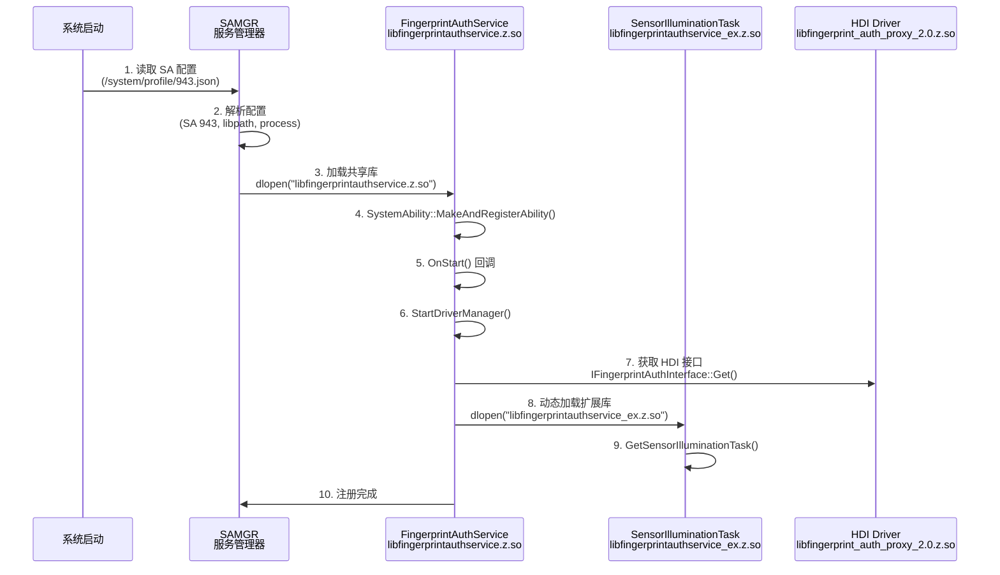

# 构建与产物

## 目的

本文档说明指纹认证组件的编译产物、安装路径、加载关系和构建特性。

## 适用范围

- 构建工程师
- 集成开发者
- 需要理解产物部署的人员

## 关键结论

1. **编译产物**：
   - `libfingerprintauthservice.z.so` - 主服务库（SA 943）
   - `libfingerprintauthservice_ex.z.so` - 扩展库（传感器照明 UI）

2. **安装路径**：
   - 标准库路径：`/system/lib64/` 或 `/system/lib/`
   - SA 配置：`/system/profile/`

3. **加载关系**：
   - 主服务由 SAMGR（服务管理器）按 SA 配置自动加载
   - 扩展库由主服务通过 `dlopen()` 动态加载

4. **构建特性**：
   - 启用 CFI、UBSan、整数溢出保护
   - PAC-RET 分支保护
   - 可选特性：display_manager、power_manager

---

## GN 目标清单

### 核心目标

| Target 名称 | 类型 | 输出文件 | BUILD.gn 位置 |
|------------|------|---------|---------------|
| `fingerprintauthservice_source_set` | ohos_source_set | 静态库 | `services/BUILD.gn:29` |
| `fingerprintauthservice` | ohos_shared_library | libfingerprintauthservice.z.so | `services/BUILD.gn:78` |
| `fingerprintauthservice_ex_source_set` | ohos_source_set | 静态库 | `services_ex/BUILD.gn:21` |
| `fingerprintauthservice_ex` | ohos_shared_library | libfingerprintauthservice_ex.z.so | `services_ex/BUILD.gn:92` |
| `fingerprintauth_sa_profile` | ohos_sa_profile | 943.json | `sa_profile/BUILD.gn:17` |

### 测试目标（忽略）

| Target 名称 | 类型 | 用途 |
|------------|------|------|
| `fingerprintauth_fuzztest` | 模糊测试 | Fuzz 测试 |
| `fingerprintauth_unittest` | 单元测试 | 单元测试 |

---

## 编译产物详解

### 1. libfingerprintauthservice.z.so（主服务库）

**Target 名称**：`fingerprintauthservice`

**Target 类型**：`ohos_shared_library`

**输出文件**：`libfingerprintauthservice.z.so`

**构建位置**：`services/BUILD.gn:78-98`

**安装路径**：
- `/system/lib64/libfingerprintauthservice.z.so`（64 位系统）
- `/system/lib/libfingerprintauthservice.z.so`（32 位系统）

**符号导出**：
```
// services/fingerprint_auth_service_map
{
    global:
        FingerprintAuthService*;
        GetInstance*;
    local:
        *;
};
```

**SA 配置**：`sa_profile/943.json`
```json
{
    "name": 943,
    "libpath": "libfingerprintauthservice.z.so",
    "run-on-create": true,
    "distributed": false,
    "dump_level": 1,
    "min_hdi_proxy_version": ["libfingerprint_auth_proxy_2.0.z.so"]
}
```

**依赖关系**：
```
fingerprintauthservice
  → fingerprintauthservice_source_set
    → libhilog (hilog)
    → libhdf_utils (hdf_core)
    → libfingerprint_auth_proxy_2.0 (drivers_interface_fingerprint_auth)
    → libipc_core (ipc)
    → libsafwk.z.so (safwk)
    → libuserauth_executors (user_auth_framework)
    → libvibrator_interface_native (miscdevice)
    → libz.so (c_utils)
```

**证据**：
- BUILD.gn：`services/BUILD.gn:78-98`
- SA 配置：`sa_profile/943.json`
- 版本脚本：`services/fingerprint_auth_service_map`

---

### 2. libfingerprintauthservice_ex.z.so（扩展库）

**Target 名称**：`fingerprintauthservice_ex`

**Target 类型**：`ohos_shared_library`

**输出文件**：`libfingerprintauthservice_ex.z.so`

**构建位置**：`services_ex/BUILD.gn:92-112`

**安装路径**：
- `/system/lib64/libfingerprintauthservice_ex.z.so`（64 位系统）
- `/system/lib/libfingerprintauthservice_ex.z.so`（32 位系统）

**符号导出**：
```
// services_ex/fingerprint_auth_service_ex_map
{
    global:
        GetSensorIlluminationTask*;
    local:
        *;
};
```

**功能**：
- 传感器照明 UI 渲染
- 屏幕状态监听
- Rosen 渲染服务集成

**依赖关系**：
```
fingerprintauthservice_ex
  → fingerprintauthservice_ex_source_set
    → libEGL (egl)
    → libGLES (opengles)
    → libcomposer (graphic_2d)
    → librender_service_base (graphic_2d)
    → librender_service_client (graphic_2d)
    → buffer_handle (graphic_surface)
    → surface_headers (graphic_surface)
    → libhdf_utils (hdf_core)
    → libhilog (hilog)
    → libipc_single.z.so (ipc)
    → libfingerprint_auth_proxy_2.0 (drivers_interface_fingerprint_auth)
    → libuserauth_executors (user_auth_framework)
    → libz.so (c_utils)
    → libdm (window_manager)
    → libskia_canvaskit (skia)
    → [可选] libdisplaymgr (display_manager)
    → [可选] libpowermgr (power_manager)
```

**证据**：
- BUILD.gn：`services_ex/BUILD.gn:92-112`
- 版本脚本：`services_ex/fingerprint_auth_service_ex_map`
- 动态加载：`services/src/service_ex_manager.cpp:30-52`

---

### 3. SA 配置文件

**文件名称**：`943.json`

**文件路径**：`sa_profile/943.json`

**安装路径**：`/system/profile/943.json`

**Target 名称**：`fingerprintauth_sa_profile`

**Target 类型**：`ohos_sa_profile`

**构建位置**：`sa_profile/BUILD.gn:17-20`

**配置内容**：
```json
{
    "process": "useriam",
    "systemability": [
        {
            "name": 943,
            "libpath": "libfingerprintauthservice.z.so",
            "run-on-create": true,
            "distributed": false,
            "dump_level": 1,
            "min_hdi_proxy_version": ["libfingerprint_auth_proxy_2.0.z.so"]
        }
    ]
}
```

**配置说明**：
- `process`: 运行进程名（useriam）
- `name`: SA ID（943）
- `libpath`: 共享库路径
- `run-on-create`: 系统启动时自动创建
- `distributed`: 是否支持分布式（false）
- `dump_level`: dump 信息级别（1）
- `min_hdi_proxy_version`: 最低 HDI Proxy 版本要求

**证据**：
- BUILD.gn：`sa_profile/BUILD.gn:17-20`
- 配置文件：`sa_profile/943.json`

---

## 构建特性

### 安全加固特性

#### 1. CFI（Control Flow Integrity）

**启用状态**：✅ 启用

**配置**：
```gn
config("fingerprintauthservice_config") {
  sanitize = {
    cfi = true
    cfi_cross_dso = true
  }
}
```

**作用**：防止控制流劫持攻击

**证据**：`services/BUILD.gn:30-36`

---

#### 2. UBSan（Undefined Behavior Sanitizer）

**启用状态**：✅ 启用

**配置**：
```gn
sanitize = {
  ubsan = true
}
```

**作用**：检测未定义行为

**证据**：`services/BUILD.gn:31`

---

#### 3. 整数溢出保护

**启用状态**：✅ 启用

**配置**：
```gn
sanitize = {
  integer_overflow = true
}
```

**作用**：检测整数溢出

**证据**：`services/BUILD.gn:30`

---

#### 4. 边界检查（Boundary Sanitize）

**启用状态**：✅ 启用

**配置**：
```gn
sanitize = {
  boundary_sanitize = true
}
```

**作用**：检测数组越界

**证据**：`services/BUILD.gn:32`

---

#### 5. PAC-RET 分支保护

**启用状态**：✅ 启用

**配置**：
```gn
branch_protector_ret = "pac_ret"
```

**作用**：防止返回地址篡改

**证据**：`services/BUILD.gn:38`

---

### 编译开关

#### Feature 开关：`fingerprint_auth_enabled`

**定义位置**：`services/BUILD.gn:16-18`

```gn
declare_args() {
  fingerprint_auth_enabled = true
}
```

**作用**：控制是否编译指纹认证组件

**使用场景**：某些产品不需要指纹认证功能

---

#### 可选组件：`display_manager`

**定义位置**：`fingerprint_auth.gni:14-19`

```gn
declare_args() {
  use_display_manager_component = true
  if (defined(global_parts_info) &&
      !defined(global_parts_info.powermgr_display_manager)) {
    use_display_manager_component = false
  }
}
```

**作用**：是否集成显示管理器（传感器照明需要）

**证据**：`services_ex/BUILD.gn:71-74`

---

#### 可选组件：`power_manager`

**定义位置**：`fingerprint_auth.gni:21-27`

```gn
use_power_manager_component = true
if (defined(global_parts_info) &&
    !defined(global_parts_info.powermgr_power_manager)) {
    use_power_manager_component = false
    use_display_manager_component = false
}
```

**作用**：是否集成电源管理器（传感器照明需要）

**证据**：`services_ex/BUILD.gn:76-79`

---

## 运行时加载关系

### 系统启动流程



### 库加载顺序

1. **系统启动**：
   ```
   SAMGR → 读取 /system/profile/943.json
        → 加载 libfingerprintauthservice.z.so
        → 调用 SystemAbility::MakeAndRegisterAbility()
        → 触发 OnStart()
   ```

2. **SA 启动**：
   ```
   OnStart()
        → StartDriverManager()
            → 加载 libfingerprint_auth_proxy_2.0.z.so（HDI Proxy）
            → GetExecutorList()
        → ServiceExManager::Load()
            → 加载 libfingerprintauthservice_ex.z.so
            → dlsym("GetSensorIlluminationTask")
   ```

3. **运行时**：
   ```
   UserAuth Framework → 调用 SA 接口
        → SA 调用 HDI 接口
        → HDI Driver 执行操作
   ```

---

## 编译命令

### 完整编译

```bash
# 编译整个组件
./build.sh --product-name <product> --build-target fingerprint_auth
```

### 单独编译

```bash
# 编译主服务
./build.sh --product-name <product> --build-target fingerprintauthservice

# 编译扩展库
./build.sh --product-name <product> --build-target fingerprintauthservice_ex
```

### 清理产物

```bash
# 清理编译产物
./build.sh --product-name <product> --build-target fingerprint_auth --ccache
```

---

## 相关跳转

- [06_GN_Targets.md](./06_GN_Targets.md) - GN 目标详解
- [03_Architecture.md](./03_Architecture.md) - 架构设计
- [05_Internal_APIs.md](./05_Internal_APIs.md) - 内部 API

---

## 参考资料

1. **GN 构建系统**：[OpenHarmony 构建指南](https://docs.openharmony.cn/)
2. **SA 配置**：[System Ability 配置文档](https://docs.openharmony.cn/)
3. **HDF 框架**：[HDF 框架文档](https://docs.openharmony.cn/)
