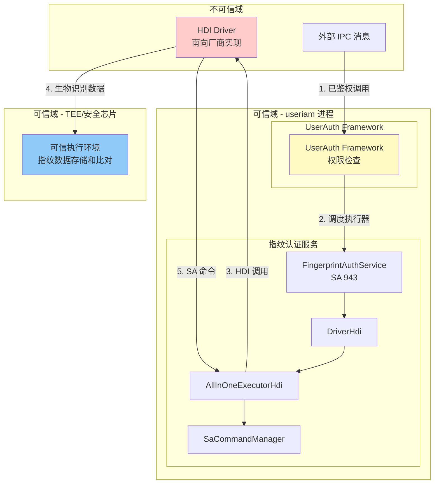

# 攻击面分析

## 目的

本文档分析指纹认证组件的所有外部输入点、敏感操作和信任边界，为安全评估提供完整的攻击面映射。

## 适用范围

- 安全研究员
- 安全审核人员
- 需要了解组件安全边界的开发者

## 关键结论

1. **外部输入点**：
   - **HDI 接口输入**：来自南向指纹驱动（不可信）
   - **IPC 消息**：来自 UserAuth Framework（已鉴权）
   - **SA 命令**：来自 HDI 驱动（不可信）

2. **敏感操作**：
   - **指纹数据操作**：通过 HDI 接口处理生物识别数据
   - **传感器照明控制**：UI 渲染和图形资源操作
   - **动态库加载**：通过 dlopen 加载 services_ex

3. **信任边界**：
   - **可信域**：useriam 进程空间、UserAuth Framework
   - **不可信域**：HDI 驱动（南向厂商实现）、外部 IPC 消息
   - **边界保护**：依赖上层框架权限验证、HDI 框架安全机制

---

## 外部输入清单

### 1. HDI 接口输入（高优先级）

#### 输入来源：南向指纹驱动（不可信）

**接口**：`IAllInOneExecutor::Enroll()`

**输入参数**：
```cpp
// HDI 定义的参数结构
struct EnrollParam {
    uint64_t scheduleId;              // 调度 ID（来自上层框架）
    std::vector<uint8_t> extraInfo;   // 额外信息（可能包含敏感数据）
};
```

**实现位置**：`services/src/fingerprint_auth_all_in_one_executor_hdi.cpp:101-116`

**风险点**：
- `extraInfo` 向量长度未验证
- `scheduleId` 未检查范围
- **证据不足**：未找到输入长度检查代码

**触发路径**：
```
HDI Driver → IAllInOneExecutor::Enroll()
    → FingerprintAllInOneExecutorHdi::Enroll()
    → 参数传递（未验证）
```

---

**接口**：`IAllInOneExecutor::Authenticate()`

**输入参数**：
```cpp
struct AuthenticateParam {
    uint64_t scheduleId;              // 调度 ID
    std::vector<uint8_t> extraInfo;   // 额外信息（包含认证 token）
};
```

**实现位置**：`services/src/fingerprint_auth_all_in_one_executor_hdi.cpp:118-134`

**风险点**：
- `token` 数据未加密或完整性验证
- `scheduleId` 可能被重复使用
- **TODO(需确认)**：是否有 token 重放攻击防护

---

**接口**：`IAllInOneExecutor::Identify()`

**输入参数**：
```cpp
struct IdentifyParam {
    uint64_t scheduleId;              // 调度 ID
    std::vector<uint8_t> extraInfo;   // 额外信息
};
```

**实现位置**：`services/src/fingerprint_auth_all_in_one_executor_hdi.cpp:136-151`

**风险点**：
- 与 Authenticate 类似
- 识别操作可能泄露用户隐私

---

**接口**：`IAllInOneExecutor::Delete()`

**输入参数**：
```cpp
struct DeleteParam {
    std::vector<uint64_t> templateIdList;  // 要删除的模板 ID 列表
};
```

**实现位置**：`services/src/fingerprint_auth_all_in_one_executor_hdi.cpp:153-163`

**风险点**：
- `templateIdList` 长度未验证（可能耗尽资源）
- 删除操作是敏感操作，依赖上层权限验证

---

**接口**：`IAllInOneExecutor::GetProperty()`

**输入参数**：
```cpp
std::vector<uint64_t> &propertyIds;  // 属性 ID 列表
```

**实现位置**：`services/src/fingerprint_auth_all_in_one_executor_hdi.cpp:200-218`

**风险点**：
- `propertyIds` 长度未限制（信息泄露风险）
- 某些属性可能返回敏感信息（如用户数量）

---

### 2. SA 命令输入（高优先级）

#### 输入来源：HDI 驱动通过 `ISaCommandCallback`（不可信）

**接口**：`ISaCommandCallback::OnSaCommands()`

**输入参数**：
```cpp
struct SaCommand {
    SaCommandId id;                   // 命令 ID
    std::vector<uint8_t> payload;     // 命令载荷
};
```

**实现位置**：`services/src/fingerprint_auth_executor_callback_hdi.cpp:65-139`

**支持的命令**：
- `ENABLE_SENSOR_ILLUMINATION`
- `DISABLE_SENSOR_ILLUMINATION`
- `TURN_ON_SENSOR_ILLUMINATION`
- `TURN_OFF_SENSOR_ILLUMINATION`

**风险点**：
- `payload` 长度未验证（可能解析溢出）
- 命令 ID 未严格验证（可能调用未定义命令）
- 传感器照明命令包含坐标参数（X、Y、半径），未验证范围

**证据**：`services/src/fingerprint_auth_executor_callback_hdi.cpp:65-139`

**代码证据**（需要进一步验证）：
```cpp
// TODO(需确认)：payload 解析是否有边界检查
// TODO(需确认)：坐标参数是否验证在屏幕范围内
```

---

### 3. 回调结果输入（中优先级）

#### 输入来源：HDI 驱动通过 `IExecutorCallback::OnResult()`（不可信）

**接口**：`IExecutorCallback::OnResult()`

**输入参数**：
```cpp
int32_t result;                      // 结果码
std::vector<uint8_t> extraInfo;     // 额外信息（可能包含指纹模板）
```

**实现位置**：`services/src/fingerprint_auth_executor_callback_hdi.cpp:19-63`

**风险点**：
- `result` 值未验证（可能传入非法值）
- `extraInfo` 可能包含未加密的指纹模板数据
- 结果码转换可能导致溢出或逻辑错误

**证据**：`services/src/fingerprint_auth_executor_callback_hdi.cpp:16-141`

---

## 敏感操作清单

### 1. 指纹数据操作（高敏感度）

#### 操作类型：生物识别数据存储和比对

**操作入口**：
- `IAllInOneExecutor::Enroll()` - 录入指纹
- `IAllInOneExecutor::Authenticate()` - 认证指纹
- `IAllInOneExecutor::Identify()` - 识别指纹
- `IAllInOneExecutor::Delete()` - 删除指纹模板

**实现位置**：`services/src/fingerprint_auth_all_in_one_executor_hdi.cpp:101-231`

**数据流**：
```
UserAuth Framework（已鉴权）
    → FingerprintAllInOneExecutorHdi
        → HDI Driver（南向厂商实现）
            → 可信执行环境（TEE）/ 安全芯片
```

**安全保护**：
- ✅ 指纹数据存储和比对在 TEE 或安全芯片中实现（南向厂商责任）
- ✅ 本组件不直接处理指纹模板数据
- ⚠️ 依赖厂商实现，无法验证

**证据**：`README_ZH.md:17-19`

---

### 2. 传感器照明控制（中敏感度）

#### 操作类型：UI 渲染和图形资源管理

**操作入口**：
- `SaCommandManager::ProcessSaCommands()` - 处理传感器照明命令
- `SensorIlluminationManager::TurnOnSensorIllumination()` - 打开照明
- `SensorIlluminationManager::TurnOffSensorIllumination()` - 关闭照明

**实现位置**：
- 命令处理：`services/src/sa_command_manager.cpp:20-98`
- 照明管理：`services/src/sensor_illumination_manager.cpp:1-206`
- UI 渲染：`services_ex/src/sensor_illumination_task.cpp`

**图形库依赖**：
- Rosen 渲染服务
- OpenGL ES
- EGL

**风险点**：
- 图形资源分配可能耗尽内存
- 坐标参数未验证可能导致越界绘制
- 动态库加载路径未验证

**证据**：
- 动态加载：`services/src/service_ex_manager.cpp:30-52`
- UI 渲染：`services_ex/src/sensor_illumination_task.cpp`

---

### 3. 动态库加载（高敏感度）

#### 操作类型：运行时加载扩展库

**操作入口**：
- `ServiceExManager::Load()` - 加载 `libfingerprintauthservice_ex.z.so`

**实现位置**：`services/src/service_ex_manager.cpp:30-52`

**加载库**：`libfingerprintauthservice_ex.z.so`

**加载方式**：
```cpp
handle_ = dlopen("libfingerprintauthservice_ex.z.so", RTLD_NOW);
auto createFunc = reinterpret_cast<CreateSensorIlluminationTaskFunc>(
    dlsym(handle_, "GetSensorIlluminationTask")
);
```

**风险点**：
- 加载路径未验证（硬编码，但存在 DLL 劫持风险）
- 符号未验证（可能加载恶意实现）
- 依赖 LD_PRELOAD 等环境变量

**证据**：`services/src/service_ex_manager.cpp:30-52`

---

### 4. 振动器控制（低敏感度）

#### 操作类型：触觉反馈

**操作入口**：
- `FingerprintAuthExecutorCallbackHdi::DoVibrator()`

**实现位置**：`services/src/fingerprint_auth_executor_callback_hdi.cpp:52`

**依赖**：`miscdevice:vibrator_interface_native`

**风险点**：
- 振动器操作频率不受限制（可能用于拒绝服务）
- ⚠️ 证据不足：未找到振动器调用频率限制代码

---

## 信任边界分析

### 信任边界图



### 边界跨越点

| 边界 | 跨越点 | 保护机制 | 有效性 |
|------|--------|---------|--------|
| **useriam → HDI Driver** | `IAllInOneExecutor` 调用 | HDF 框架隔离 | ✅ 有效 |
| **HDI Driver → useriam** | `IExecutorCallback` 回调 | HDF 线程池隔离 | ⚠️ 部分有效 |
| **useriam → TEE** | 生物识别数据操作 | TEE 隔离 | ✅ 依赖厂商 |
| **外部 IPC → useriam** | UserAuth Framework | 权限验证（AccessTokenKit） | ✅ 有效（在上层） |
| **services → services_ex** | 动态库加载 | 符号导出控制 | ⚠️ 部分有效 |

### 未受保护的边界

1. **HDI 回调输入**：
   - `IExecutorCallback::OnResult()` 参数未严格验证
   - `IExecutorCallback::OnSaCommands()` 命令未完全验证

2. **传感器照明参数**：
   - 坐标参数（X、Y、半径）未验证屏幕范围
   - 可能导致越界绘制

3. **动态库符号**：
   - 加载的函数符号未验证签名或哈希
   - 依赖编译时链接

---

## 攻击面总结表

| 攻击面 | 输入来源 | 风险等级 | 影响范围 | 现有保护 |
|--------|---------|---------|---------|---------|
| **HDI Enroll 参数** | 南向驱动 | 中 | 资源耗尽、信息泄露 | 无 |
| **HDI Authenticate 参数** | 南向驱动 | 高 | 认证绕过、重放攻击 | 无（依赖上层） |
| **HDI Delete 参数** | 南向驱动 | 中 | 拒绝服务、数据删除 | 无 |
| **HDI GetProperty 参数** | 南向驱动 | 中 | 信息泄露 | 无 |
| **SA 命令 payload** | 南向驱动 | 高 | 解析溢出、越界绘制 | 部分 |
| **SA 命令 ID** | 南向驱动 | 中 | 未定义行为 | 部分 |
| **HDI 回调结果** | 南向驱动 | 高 | 逻辑错误、数据泄露 | 部分 |
| **传感器照明坐标** | SA 命令 | 中 | 越界绘制、资源耗尽 | 无 |
| **动态库加载** | 文件系统 | 高 | 代码注入 | 部分（硬编码） |
| **振动器调用** | 回调 | 低 | 拒绝服务 | 无 |

---

## 相关跳转

- [06_SecurityReview.md](./06_SecurityReview.md) - 安全风险评估
- [03_Architecture.md](./03_Architecture.md) - 架构设计
- [04_HDI_Interfaces.md](./04_HDI_Interfaces.md) - HDI 接口详解

---

## 参考资料

1. **OpenHarmony 安全指南**：[OpenHarmony 安全开发文档](https://docs.openharmony.cn/)
2. **HDF 安全机制**：[HDF 框架安全文档](https://docs.openharmony.cn/)
3. **TEE 架构**：[可信执行环境文档](https://docs.openharmony.cn/)
