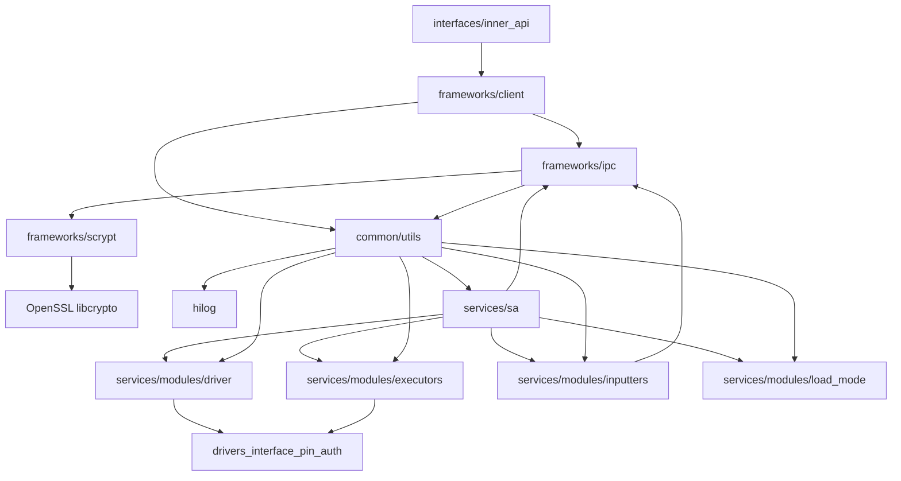

# 目录结构与模块职责

> **目的**：了解 pin_auth 模块的代码组织方式和各模块职责
> **适用范围**：所有开发者
> **关键结论**：模块按层次组织（interfaces/frameworks/services/common），职责清晰分离
> **相关文档**：[概览](index.md) | [架构设计](03_Architecture.md)

---

## 顶层目录结构

```
/Volumes/lexar/code/d/work/oh/base/useriam/pin_auth
├── bundle.json              # 组件描述文件（依赖、编译组、ROM/RAM）
├── pin_auth.gni             # 全局构建参数（特性开关）
├── hisysevent.yaml          # 系统事件配置
├── cfi_blocklist.txt        # CFI（控制流完整性）例外列表
├── common/                 # 公共代码（日志、工具）
├── frameworks/              # 框架层（客户端实现 + IPC）
├── interfaces/              # 对外接口（内部子系统 API）
├── sa_profile/             # Service Ability 配置（SA profile）
├── services/               # 服务实现（System Ability + 模块）
└── test/                  # 测试代码（忽略本文档）
```

---

## 模块分类与职责

### 1. 配置层

| 文件/目录 | 说明 | 关键内容 |
|-----------|------|---------|
| `bundle.json` | 组件元数据 | 依赖列表、编译组、Inner API 头文件、ROM/RAM 声明 |
| `pin_auth.gni` | 全局构建参数 | `pin_auth_enable_dynamic_load`、`sensors_miscdevice_enable`、`customization_enterprise_device_management_enable` |
| `hisysevent.yaml` | 系统事件配置 | 事件名称、事件级别定义 |
| `cfi_blocklist.txt` | CFI 例外 | 需要从 CFI 检查中排除的符号 |

**代码证据**：
- `bundle.json:18-23` - 特性开关定义
- `pin_auth.gni:14-26` - 构建参数声明

---

### 2. 公共代码层 (common/)

职责：提供跨模块复用的基础设施代码

```
common/
├── logs/                  # 日志工具
│   └── iam_logger.h       # 日志宏（IAM_LOGI、IAM_LOGE等）
└── utils/                 # 工具类
    ├── iam_ptr.h           # 智能指针工具
    ├── iam_check.h         # 参数验证宏
    ├── iam_defines.h       # 公共常量定义
    └── iam_para2str.h     # 参数转字符串工具
```

**关键特性**：
- 所有模块依赖 `iam_utils` source_set
- 统一的日志接口（基于 hilog）
- 安全检查宏（IF_FALSE_LOGE_AND_RETURN）

**代码证据**：
- `common/BUILD.gn:24-52` - iam_utils 定义
- `common/utils/iam_check.h` - 验证宏定义

---

### 3. 框架层 (frameworks/)

职责：提供客户端侧的实现和 IPC 通信机制

```
frameworks/
├── client/                # 客户端实现
│   ├── inc/              # 头文件
│   │   ├── pinauth_register_impl.h         # PinAuthRegister 实现
│   │   ├── inputer_get_data_service.h      # Inputer 服务
│   │   ├── inputer_data_impl.h            # IInputerData 实现
│   │   └── settings_data_manager.h        # 设置数据管理
│   └── src/              # 源文件（与 inc 对应）
│
├── ipc/                   # IPC 通信层
│   ├── inc/              # IPC 接口头文件
│   ├── src/              # Proxy/Stub 实现
│   │   ├── pin_auth_proxy.cpp             # PinAuthInterface 客户端代理
│   │   ├── pin_auth_stub.cpp             # PinAuthInterface 服务端实现
│   │   ├── inputer_get_data_proxy.cpp    # InputerGetData 客户端代理
│   │   ├── inputer_get_data_stub.cpp     # InputerGetData 服务端实现
│   │   ├── inputer_set_data_proxy.cpp    # InputerSetData 客户端代理
│   │   └── inputer_set_data_stub.cpp     # InputerSetData 服务端实现
│   └── common_defines/    # IPC 公共定义
│       ├── pin_auth_interface.h              # PinAuthInterface 定义
│       ├── inputer_get_data.h              # InputerGetData 定义
│       ├── inputer_set_data.h              # InputerSetData 定义
│       ├── pin_auth_interface_ipc_interface_code.h      # 接口码常量
│       ├── inputer_get_data_ipc_interface_code.h     # 接口码常量
│       └── inputer_set_data_ipc_interface_code.h     # 接口码常量
│
└── scrypt/                # 加密工具
    ├── inc/              # scrypt.h
    └── src/              # scrypt.cpp（基于 libcrypto）
```

**关键职责**：
- **客户端实现**：`PinAuthRegisterImpl` 实现 `PinAuthRegister` 接口
- **IPC 通信**：三组 Proxy/Stub 对处理跨进程通信
- **加密**：scrypt 算法用于 PIN 数据单向处理

**代码证据**：
- `frameworks/BUILD.gn:32-83` - pinauth_framework_source_set 定义
- `frameworks/BUILD.gn:85-109` - pinauth_framework 共享库
- `frameworks/BUILD.gn:111-148` - pinauth_ipc source_set

---

### 4. 对外接口层 (interfaces/)

职责：暴露给其他子系统使用的公共 API

```
interfaces/
└── inner_api/             # 内部子系统 API
    ├── pinauth_register.h   # 主注册接口
    ├── i_inputer.h        # Inputer 回调接口
    └── i_inputer_data.h   # 数据传输接口
```

**说明**：
- 这些头文件作为 Inner Kits 暴露到平台 SDK
- 在 `bundle.json:67-72` 中声明
- 其他子系统（如 Settings、锁屏）通过这些接口集成 PIN 认证

**代码证据**：
- `bundle.json:62-74` - Inner API 声明

---

### 5. Service Ability 配置层 (sa_profile/)

职责：定义 System Ability 的部署配置

```
sa_profile/
├── default/               # 静态加载配置
│   └── 941.json        # SA profile（run-on-create: true）
├── dynamic_load/          # 动态加载配置
│   ├── 941.json        # SA profile（run-on-create: false）
│   └── pinauth_sa_profile.cfg  # Init 配置、SELinux 上下文
└── BUILD.gn              # Profile 选择逻辑
```

**关键配置**：
- **SAID**：941
- **进程**：`useriam`（默认）或 `pinauth`（动态）
- **库**：`libpinauthservice.z.so`
- **SELinux 上下文**：`u:r:pinauth:s0`
- **权限**：`ohos.permission.ACCESS_AUTH_RESPOOL`、`ohos.permission.VIBRATE`

**代码证据**：
- `sa_profile/default/941.json:1-13` - 静态加载 SA profile
- `sa_profile/dynamic_load/pinauth_sa_profile.cfg` - 动态加载配置

---

### 6. 服务实现层 (services/)

职责：实现 System Ability 和相关功能模块

```
services/
├── sa/                    # System Ability 核心
│   ├── inc/
│   │   └── pin_auth_service.h        # SA 类定义
│   └── src/
│       └── pin_auth_service.cpp        # SA 实现（OnStart/OnStop）
│
└── modules/                # 服务功能模块
    ├── common/             # 公共定义
    │   └── inc/
    │       └── pin_auth_hdi.h        # HDI 类型别名
    │
    ├── driver/             # HDI 驱动接口
    │   ├── inc/
    │   │   ├── pin_auth_driver_hdi.h    # 驱动管理器
    │   │   └── pin_auth_interface_adapter.h # HDI 适配器
    │   └── src/
    │
    ├── executors/          # HDI 执行器实现
    │   ├── inc/
    │   │   ├── pin_auth_all_in_one_hdi.h        # 全功能执行器
    │   │   ├── pin_auth_collector_hdi.h        # 收集器
    │   │   ├── pin_auth_verifier_hdi.h         # 验证器
    │   │   ├── pin_auth_executor_callback_hdi.h # 执行器回调
    │   │   └── pin_auth_executor_hdi_common.h  # 公共工具
    │   └── src/
    │
    ├── inputters/          # 输入器管理
    │   ├── inc/
    │   │   ├── pin_auth_manager.h             # Inputer 管理器
    │   │   └── i_inputer_data_impl.h         # IInputerData 实现
    │   └── src/
    │       ├── pin_auth_manager.cpp           # Token 隔离管理
    │       └── i_inputer_data_impl.cpp      # 数据传输实现
    │
    └── load_mode/          # 加载模式管理
        ├── inc/
        │   ├── load_mode_handler.h            # 加载模式基类
        │   ├── load_mode_handler_default.h    # 静态加载处理器
        │   ├── load_mode_handler_dynamic.h    # 动态加载处理器
        │   ├── driver_load_manager.h          # 驱动加载管理
        │   ├── system_ability_listener.h       # SA 事件监听器
        │   ├── system_param_manager.h         # 系统参数管理
        │   └── relative_timer.h              # 相对定时器
        └── src/
```

**关键模块说明**：

| 模块 | 职责 | 关键类/接口 |
|------|------|------------|
| `sa/` | System Ability 入口、生命周期管理 | `PinAuthService` |
| `modules/driver/` | HDI 驱动初始化、加载管理 | `PinAuthDriverHdi`、`PinAuthInterfaceAdapter` |
| `modules/executors/` | 与 HDI 执行器交互 | `PinAuthAllInOneHdi`、`PinAuthCollectorHdi`、`PinAuthVerifierHdi` |
| `modules/inputters/` | Inputer 注册管理、Token 隔离 | `PinAuthManager`、`IInputerDataImpl` |
| `modules/load_mode/` | 静态/动态加载模式实现 | `LoadModeHandlerDefault`、`LoadModeHandlerDynamic` |

**代码证据**：
- `services/BUILD.gn:32-109` - pinauthservice_source_set 定义
- `services/BUILD.gn:111-134` - pinauthservice 共享库
- `services/sa/inc/pin_auth_service.h:31` - PinAuthService 类定义

---

## 测试目录（忽略）

```
test/
├── unittest/              # 单元测试
│   └── BUILD.gn
└── fuzztest/             # 模糊测试
    ├── common_fuzzer/
    └── */BUILD.gn        # 各模块的 fuzzer
```

**注意**：本文档不覆盖测试相关内容。

---

## 依赖关系图



---

## 文件索引速查

### 核心入口

| 功能 | 文件路径 | 说明 |
|------|---------|------|
| SA 入口 | `services/sa/src/pin_auth_service.cpp:40` | SystemAbility 注册点 |
| SA 声明 | `services/sa/inc/pin_auth_service.h:31` | PinAuthService 类 |
| 公共 API | `interfaces/inner_api/pinauth_register.h` | PinAuthRegister 接口 |
| Inputer 接口 | `interfaces/inner_api/i_inputer.h` | IInputer 定义 |
| Data 接口 | `interfaces/inner_api/i_inputer_data.h` | IInputerData 定义 |

### IPC 实现

| IPC 接口 | Proxy | Stub | 接口码定义 |
|----------|--------|------|------------|
| PinAuth | `frameworks/ipc/src/pin_auth_proxy.cpp` | `frameworks/ipc/src/pin_auth_stub.cpp` | `pin_auth_interface_ipc_interface_code.h` |
| InputerGetData | `frameworks/ipc/src/inputer_get_data_proxy.cpp` | `frameworks/ipc/src/inputer_get_data_stub.cpp` | `inputer_get_data_ipc_interface_code.h` |
| InputerSetData | `frameworks/ipc/src/inputer_set_data_proxy.cpp` | `frameworks/ipc/src/inputer_set_data_stub.cpp` | `inputer_set_data_ipc_interface_code.h` |

### 模块管理

| 模块 | 头文件 | 实现文件 |
|------|---------|---------|
| Inputer 管理 | `services/modules/inputters/inc/pin_auth_manager.h` | `services/modules/inputters/src/pin_auth_manager.cpp` |
| HDI 驱动 | `services/modules/driver/inc/pin_auth_driver_hdi.h` | `services/modules/driver/src/pin_auth_driver_hdi.cpp` |
| 全功能执行器 | `services/modules/executors/inc/pin_auth_all_in_one_hdi.h` | `services/modules/executors/src/pin_auth_all_in_one_hdi.cpp` |
| 加载模式 | `services/modules/load_mode/inc/load_mode_handler.h` | `services/modules/load_mode/src/load_mode_handler.cpp` |

---

## 下一步

- 理解系统架构 → [架构设计](03_Architecture.md)
- 学习 API 使用 → [对外 Native API](04_Native_API.md)
