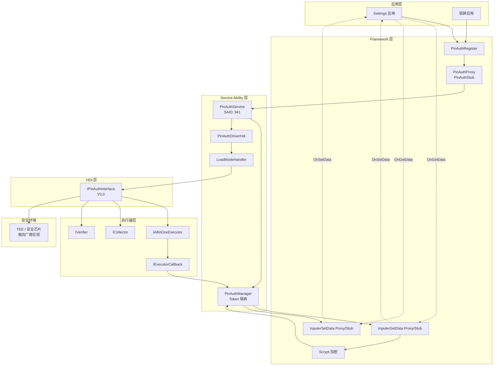
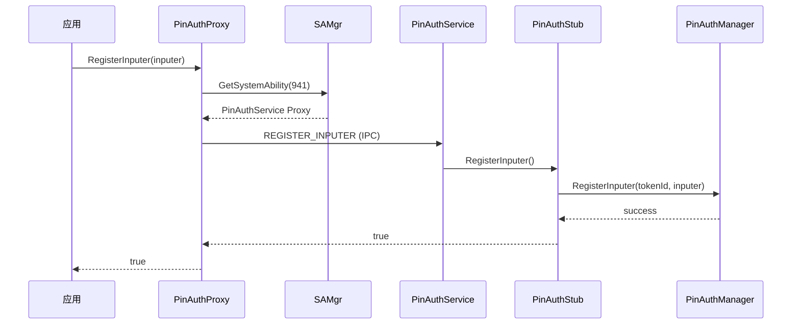
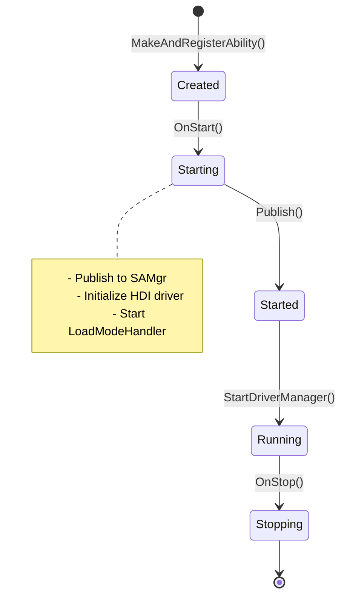
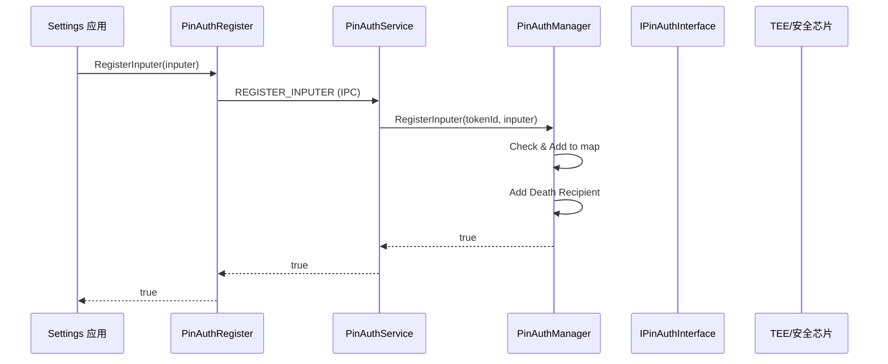
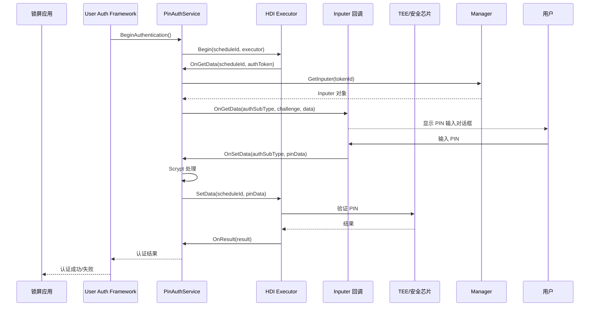
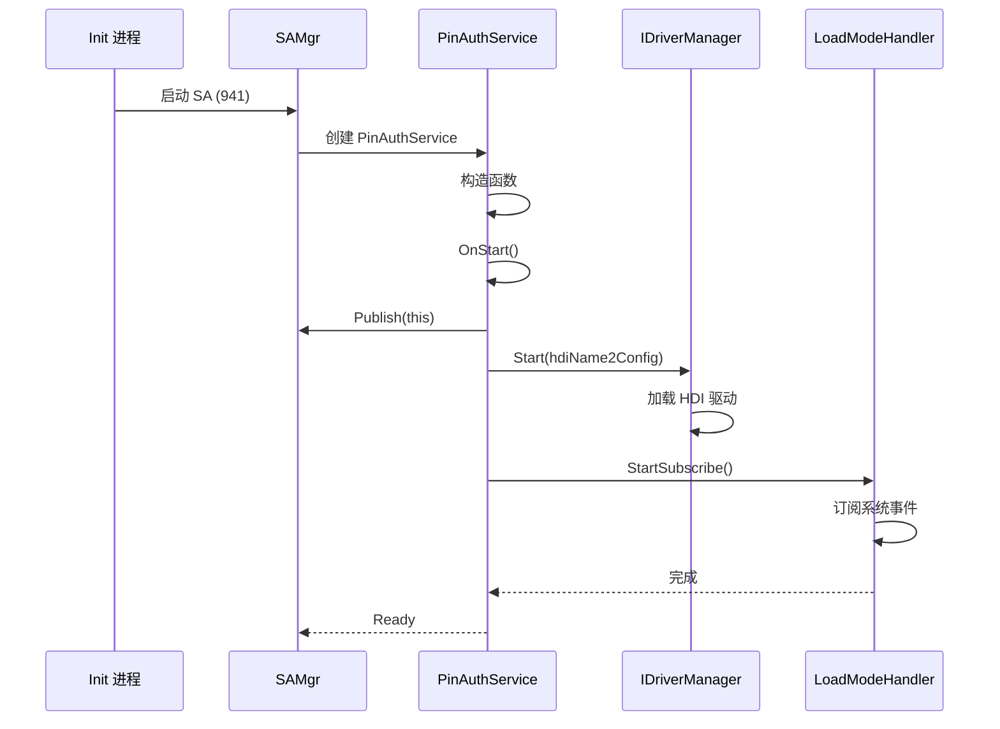
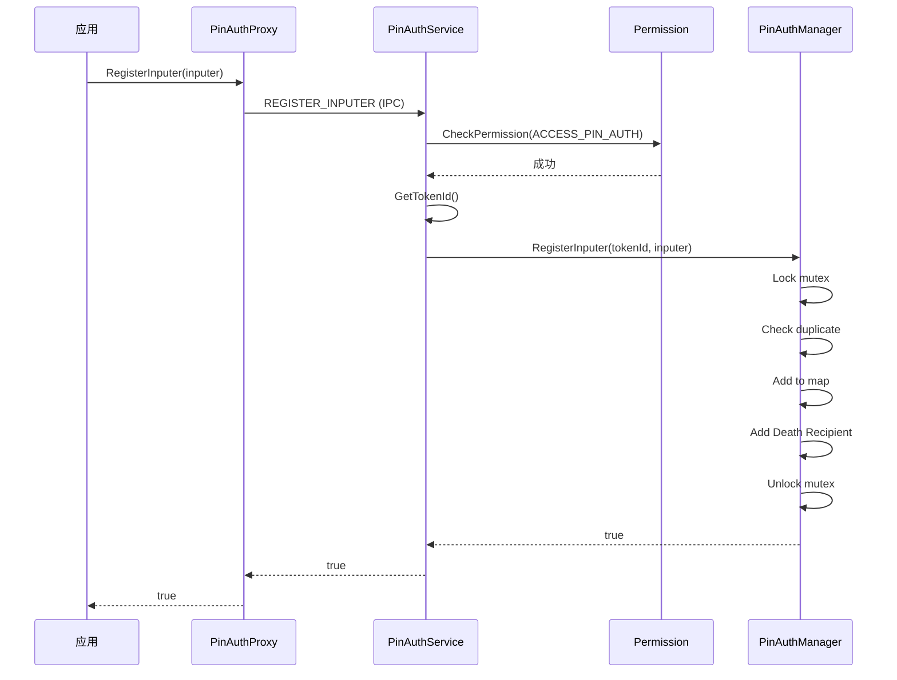
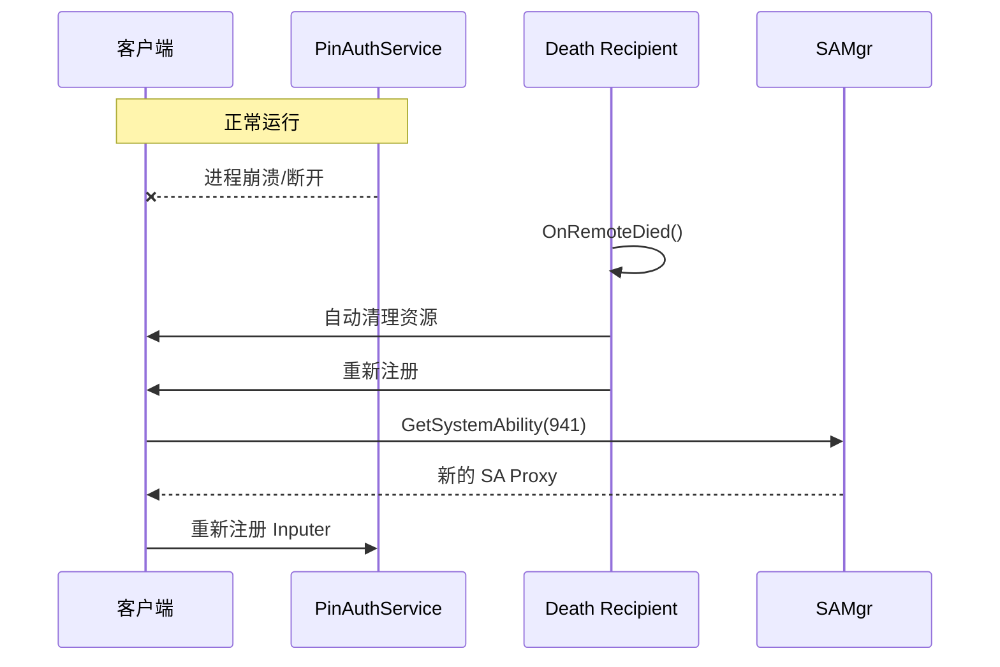
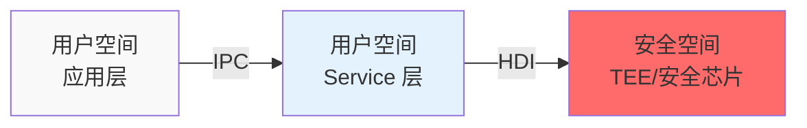

# 架构设计

> **目的**：理解 pin_auth 模块的架构设计、组件交互和数据流
> **适用范围**：架构师、高级开发者、安全审计人员
> **关键结论**：采用分层架构（Framework → Service → HDI），通过 IPC 和 HDI 实现跨进程和跨安全边界通信
> **相关文档**：[概览](index.md) | [目录结构](02_Directory.md) | [内部 API](05_Inner_API.md)

---

## 整体架构图



---

## 组件说明

### 1. 应用层

**职责**：提供 PIN 输入界面，实现 Inputer 回调

| 应用 | 实现接口 | 场景 |
|------|---------|------|
| Settings | `IInputer`、`IInputerData` | PIN 设置、修改 |
| 锁屏 | `IInputer`、`IInputerData` | PIN 认证（解锁） |

**安全要求**：
- 需要系统签名
- 需要 `ohos.permission.ACCESS_PIN_AUTH` 权限
- 作为系统级应用运行

---

### 2. Framework 层

#### 2.1 PinAuthRegister

**文件**：`frameworks/client/src/pinauth_register_impl.cpp`

**职责**：
- 实现 `PinAuthRegister` 接口
- 管理 IPC Proxy 生命周期
- 处理 Service Death Recipient

**关键方法**：
- `GetInstance()` - 单例获取
- `RegisterInputer()` - 注册 Inputer 回调
- `UnRegisterInputer()` - 注销 Inputer 回调

#### 2.2 IPC 通信层

**三组 Proxy/Stub 对**：

| 接口 | 方向 | 用途 | 接口码 |
|------|------|------|--------|
| PinAuthInterface | 应用 → SA | 注册/注销 Inputer | REGISTER_INPUTER=1, UNREGISTER_INPUTER=2 |
| InputerGetData | SA → 应用 | 请求 PIN 数据 | ON_GET_DATA=1 |
| InputerSetData | 应用 → SA | 传输 PIN 数据 | ON_SET_DATA=1 |

**IPC 流程**：



#### 2.3 Scrypt 加密

**文件**：`frameworks/scrypt/src/scrypt.cpp`

**用途**：
- PIN 数据单向哈希处理
- 防止原文跨设备传输

**算法**：
- 使用 OpenSSL libcrypto 的 scrypt 实现
- 参数：N、r、p、dkLen

---

### 3. Service Ability 层

#### 3.1 PinAuthService

**文件**：`services/sa/src/pin_auth_service.cpp`

**生命周期**：



**初始化流程**（`OnStart()`）：

```
1. Publish(this) - 注册到 SAMgr
2. StartDriverManager() - 初始化 HDI 驱动
   ├── IDriverManager::Start(hdiName2Config)
   └── LoadModeHandler::Start()
       ├── Subscribe system events
       └── Subscribe system parameters
```

**关键职责**：
- 权限检查（`CheckPermission()`）
- Token ID 获取（`GetTokenId()`）
- Inputer 管理（委托给 `PinAuthManager`）

#### 3.2 PinAuthManager

**文件**：`services/modules/inputters/src/pin_auth_manager.cpp`

**职责**：
- Token 隔离的 Inputer 注册表
- Death Recipient 管理
- Inputer 生命周期管理

**数据结构**：

```cpp
// 文件：services/modules/inputters/src/pin_auth_manager.cpp:30
std::map<uint32_t, sptr<InputerGetData>> pinAuthInputerMap_;
std::mutex mapMutex_;
```

**安全机制**：
- 使用 Token ID 作为键（Token 隔离）
- 线程安全（mutex 保护）
- Death Recipient 自动清理

---

### 4. 执行器层

#### 4.1 HDI 执行器类型

| 执行器 | 接口 | 用途 |
|--------|------|------|
| AllInOne | `IAllInOneExecutor` | 注册+认证一体化 |
| Collector | `ICollector` | 数据收集 |
| Verifier | `IVerifier` | 仅验证 |

**文件位置**：
- `services/modules/executors/src/pin_auth_all_in_one_hdi.cpp`
- `services/modules/executors/src/pin_auth_collector_hdi.cpp`
- `services/modules/executors/src/pin_auth_verifier_hdi.cpp`

#### 4.2 ExecutorCallback

**文件**：`services/modules/executors/src/pin_auth_executor_callback_hdi.cpp`

**职责**：
- HDI 执行器的回调实现
- 连接 HDI 回调与 `IInputerData`
- Token ID 绑定

**关键成员**：
```cpp
// 文件：services/modules/executors/inc/pin_auth_executor_callback_hdi.h
uint32_t tokenId_;  // 用于 Inputer 查找
uint64_t scheduleId_;  // 调度 ID（会话隔离）
```

---

### 5. 加载模式层

#### 5.1 静态加载模式

**文件**：`services/modules/load_mode/src/load_mode_handler_default.cpp`

**特征**：
- SA 启动时直接加载驱动
- run-on-create: true
- 适用于标准 OpenHarmony 设备

#### 5.2 动态加载模式

**文件**：`services/modules/load_mode/src/load_mode_handler_dynamic.cpp`

**特征**：
- 按需加载驱动
- run-on-create: false
- 订阅系统事件和参数
- 支持相对定时器延迟加载

**关键组件**：
- `DriverLoadManager` - 驱动生命周期管理
- `SystemAbilityListener` - SA 事件监听
- `SystemParamManager` - 系统参数管理
- `RelativeTimer` - 延迟加载定时器

---

## 数据流

### PIN 注册流程



### PIN 认证流程



---

## 线程模型

### 主线程（SA 线程）

- **职责**：
  - IPC 请求处理（`OnRemoteRequest()`）
  - SA 生命周期管理（`OnStart()`、`OnStop()`）
  - Inputer 注册管理

- **同步/异步**：
  - IPC 调用通常是同步的（阻塞等待响应）
  - HDI 回调在 HDI 线程执行

### HDI 线程

- **职责**：
  - 执行 PIN 注册/认证操作
  - 回调 `OnGetData()`、`OnResult()`

- **线程安全**：
  - `PinAuthManager` 使用 mutex 保护
  - `IInputerDataImpl` 使用 mutex 保护 scheduleId

### 应用线程

- **职责**：
  - 实现 `IInputer::OnGetData()` 回调
  - 实现 `IInputerData::OnSetData()` 回调

- **注意**：
  - `OnGetData()` 在 SA 线程调用
  - 应用应快速返回，避免阻塞 SA

---

## 关键时序

### 1. 系统启动时序（静态加载）



### 2. Inputer 注册时序



### 3. 死亡恢复时序



---

## 安全边界

### 信任边界



| 边界 | 通信机制 | 安全措施 |
|------|---------|---------|
| 应用 → SA | IPC (Binder) | Token 隔离、权限检查、描述符验证 |
| SA → TEE | HDI | 南向厂商实现、安全存储 |

### Token 隔离

- 每个 Token ID（调用者）对应独立的 Inputer
- 防止跨调用者数据泄露
- 使用 `pinAuthInputerMap_` 实现

**代码证据**：
- `services/modules/inputters/src/pin_auth_manager.cpp:31-34` - Token 隔离实现

---

## 代码证据

### SA 注册

**文件**：`services/sa/src/pin_auth_service.cpp:40`

```cpp
const bool REGISTER_RESULT = SystemAbility::MakeAndRegisterAbility(
    PinAuthService::GetInstance().get()
);
```

### IPC 接口码定义

**文件**：`frameworks/ipc/common_defines/pin_auth_interface_ipc_interface_code.h:18-20`

```cpp
enum class PinAuthInterfaceCode : uint32_t {
    REGISTER_INPUTER = 1,
    UNREGISTER_INPUTER = 2,
};
```

### Token ID 获取

**文件**：`services/sa/src/pin_auth_service.cpp:79-86`

```cpp
inline uint32_t PinAuthService::GetTokenId()
{
    uint32_t tokenId = this->GetFirstTokenID();  // 委托令牌优先
    if (tokenId == 0) {
        tokenId = this->GetCallingTokenID();     // 回退到直接调用者
    }
    return tokenId;
}
```

### PinAuthManager 数据结构

**文件**：`services/modules/inputters/src/pin_auth_manager.cpp:30-31`

```cpp
std::map<uint32_t, sptr<InputerGetData>> pinAuthInputerMap_;
std::mutex mapMutex_;
```

---

## 下一步

- 学习内部 API → [内部 API](05_Inner_API.md)
- 了解构建系统 → [GN Targets](06_GN_Targets.md)
