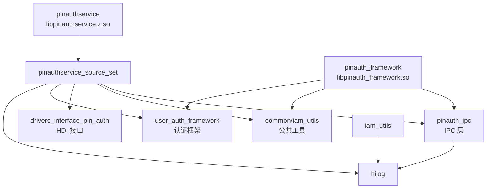

# GN Targets 文档

> **目的**：了解 pin_auth 模块的 GN 构建系统、目标和依赖关系
> **适用范围**：构建工程师、模块维护者
> **关键结论**：构建目标层次清晰，依赖管理规范，支持特性开关
> **相关文档**：[目录结构](02_Directory.md) | [编译产物](07_Build_Artifacts.md) | [常见问题](09_FAQ.md)

---

## 关键 BUILD.gn 文件

| 文件路径 | 作用 | Targets |
|---------|------|--------|
| `/Volumes/lexar/code/d/work/oh/base/useriam/pin_auth/bundle.json` | 组件元数据 | - |
| `/Volumes/lexar/code/d/work/oh/base/useriam/pin_auth/pin_auth.gni` | 全局构建参数 | - |
| `/Volumes/lexar/code/d/work/oh/base/useriam/pin_auth/common/BUILD.gn` | 公共工具 | `iam_utils` |
| `/Volumes/lexar/code/d/work/oh/base/useriam/pin_auth/frameworks/BUILD.gn` | 框架层 | `pinauth_framework`, `pinauth_ipc`, `pinauth_framework_source_set` |
| `/Volumes/lexar/code/d/work/oh/base/useriam/pin_auth/services/BUILD.gn` | 服务层 | `pinauthservice`, `pinauthservice_source_set` |
| `/Volumes/lexar/code/d/work/oh/base/useriam/pin_auth/sa_profile/BUILD.gn` | SA 配置 | `pinauth_sa_profile`, `pinauth_sa_profile.init` |

---

## 主要 Targets 列表

### 1. 公共层 Targets

#### iam_utils

**文件**：`common/BUILD.gn:24-52`

**类型**：`ohos_source_set`

**说明**：公共工具（日志、参数检查等）

**Sources**：
- `common/logs/iam_logger.h`
- `common/utils/iam_ptr.h`
- `common/utils/iam_check.h`
- `common/utils/iam_defines.h`
- `common/utils/iam_para2str.h`

**公共配置**：
```gn
public_configs = [
    ":iam_log_config",
    ":iam_utils_config",
]
```

**外部依赖**：
- `hilog:libhilog`
- `c_utils:utils`

---

### 2. 框架层 Targets

#### pinauth_ipc

**文件**：`frameworks/BUILD.gn:111-148`

**类型**：`ohos_source_set`

**说明**：IPC 通信层（Proxy/Stub 实现）

**Sources**：
- `frameworks/ipc/src/pin_auth_proxy.cpp`
- `frameworks/ipc/src/pin_auth_stub.cpp`
- `frameworks/ipc/src/inputer_get_data_proxy.cpp`
- `frameworks/ipc/src/inputer_get_data_stub.cpp`
- `frameworks/ipc/src/inputer_set_data_proxy.cpp`
- `frameworks/ipc/src/inputer_set_data_stub.cpp`

**公共配置**：
```gn
public_configs = [ ":pinauth_ipc_config" ]
```

**外部依赖**：
- `hilog:libhilog`
- `ipc:ipc_single`
- `c_utils:utils`
- `user_auth_framework:userauth_client`

---

#### pinauth_framework_source_set

**文件**：`frameworks/BUILD.gn:32-83`

**类型**：`ohos_source_set`

**说明**：框架源文件集合（包含客户端实现和加密）

**Sources**：
- `frameworks/client/src/pinauth_register_impl.cpp`
- `frameworks/client/src/inputer_get_data_service.cpp`
- `frameworks/client/src/inputer_data_impl.cpp`
- `frameworks/client/src/settings_data_manager.cpp`
- `frameworks/scrypt/src/scrypt.cpp`

**依赖**：
```gn
deps = [ ":pinauth_ipc" ]
```

**外部依赖**：
- `hilog:libhilog`
- `ipc:ipc_single`
- `samgr:samgr_proxy`
- `c_utils:utils`
- `data_share:datashare_consumer`
- `openssl:libcrypto_shared`
- `user_auth_framework:userauth_client`
- （可选）`enterprise_device_management:edmservice_kits`

---

#### pinauth_framework

**文件**：`frameworks/BUILD.gn:85-109`

**类型**：`ohos_shared_library`

**输出**：`libpinauth_framework.so`

**说明**：客户端框架库（暴露给子系统）

**依赖**：
```gn
deps = [ ":pinauth_framework_source_set" ]
```

**公共配置**：
```gn
public_configs = [ ":pinauth_config" ]
innerapi_tags = [ "platformsdk_indirect" ]
```

**安装路径**：`system/lib64/` 或 `system/lib/`

---

### 3. 服务层 Targets

#### pinauthservice_source_set

**文件**：`services/BUILD.gn:32-109`

**类型**：`ohos_source_set`

**说明**：服务源文件集合

**Sources**：
```
services/modules/driver/src/pin_auth_driver_hdi.cpp
services/modules/driver/src/pin_auth_interface_adapter.cpp
services/modules/executors/src/pin_auth_all_in_one_hdi.cpp
services/modules/executors/src/pin_auth_collector_hdi.cpp
services/modules/executors/src/pin_auth_executor_callback_hdi.cpp
services/modules/executors/src/pin_auth_executor_hdi_common.cpp
services/modules/executors/src/pin_auth_verifier_hdi.cpp
services/modules/inputters/src/i_inputer_data_impl.cpp
services/modules/inputters/src/pin_auth_manager.cpp
services/modules/load_mode/src/hisysevent_adapter.cpp
services/modules/load_mode/src/load_mode_handler.cpp
services/modules/load_mode/src/system_param_manager.cpp
services/sa/src/pin_auth_service.cpp
```

**条件 Sources（动态加载模式）**：
```gn
if (pin_auth_enable_dynamic_load) {
    sources += [
        "services/modules/load_mode/src/driver_load_manager.cpp",
        "services/modules/load_mode/src/load_mode_handler_dynamic.cpp",
        "services/modules/load_mode/src/relative_timer.cpp",
        "services/modules/load_mode/src/system_ability_listener.cpp",
    ]
    defines += [ "ENABLE_DYNAMIC_LOAD" ]
} else {
    sources += [ "services/modules/load_mode/src/load_mode_handler_default.cpp" ]
}
```

**依赖**：
```gn
deps = [ "../frameworks:pinauth_ipc" ]
```

**外部依赖**：
- `access_token:libaccesstoken_sdk`
- `c_utils:utils`
- `drivers_interface_pin_auth:libpin_auth_proxy_3.0`
- `hdf_core:libhdf_utils`
- `hdf_core:libhdi`
- `hilog:libhilog`
- `hisysevent:libhisysevent`
- `init:libbeget_proxy`
- `init:libbegetutil`
- `ipc:ipc_single`
- `openssl:libcrypto_shared`
- `safwk:system_ability_fwk`
- `samgr:samgr_proxy`
- `user_auth_framework:userauth_executors`
- （可选）`miscdevice:vibrator_interface_native`

---

#### pinauthservice

**文件**：`services/BUILD.gn:111-134`

**类型**：`ohos_shared_library`

**输出**：`libpinauthservice.z.so`

**说明**：PIN 认证服务（System Ability）

**依赖**：
```gn
deps = [ ":pinauthservice_source_set" ]
```

**安装路径**：`system/lib64/` 或 `system/lib/`

---

### 4. SA 配置 Targets

#### pinauth_sa_profile

**文件**：`sa_profile/BUILD.gn`

**类型**：`ohos_sa_profile`

**说明**：System Ability 部署配置

**输出**：
- 静态加载：`sa_profile/default/941.json`
- 动态加载：`sa_profile/dynamic_load/941.json`

**安装路径**：`system/etc/sa_profile/`

---

#### pinauth_sa_profile.init

**文件**：`sa_profile/BUILD.gn`

**类型**：group

**说明**：Init 配置（仅动态加载模式）

**输出**：`sa_profile/dynamic_load/pinauth_sa_profile.cfg`

**安装路径**：`system/etc/init/`

---

## 特性开关

### 全局参数（pin_auth.gni）

| 参数 | 类型 | 默认值 | 说明 |
|------|------|--------|------|
| `pin_auth_enabled` | bool | true | 是否启用 PIN 认证 |
| `pin_auth_enable_dynamic_load` | bool | false | 是否启用动态加载模式 |
| `sensors_miscdevice_enable` | bool | true | 是否启用振动器支持 |
| `customization_enterprise_device_management_enable` | bool | true | 是否启用企业设备管理集成 |

### 条件编译宏

| 宏 | 条件 | 影响文件 |
|-----|------|---------|
| `ENABLE_DYNAMIC_LOAD` | `pin_auth_enable_dynamic_load == true` | `services/modules/load_mode/src/driver_load_manager.cpp` 等 |
| `SENSORS_MISCDEVICE_ENABLE` | `sensors_miscdevice_enable == true` | `services/BUILD.gn:100-103` |
| `CUSTOMIZATION_ENTERPRISE_DEVICE_MANAGEMENT_ENABLE` | `customization_enterprise_device_management_enable == true` | `frameworks/BUILD.gn:63-69` |

---

## 依赖关系图



---

## Target → 产物映射

| Target | 输出类型 | 输出名称 | 安装路径 |
|--------|---------|----------|---------|
| `pinauthservice` | ohos_shared_library | `libpinauthservice.z.so` | `system/lib64/` 或 `system/lib/` |
| `pinauth_framework` | ohos_shared_library | `libpinauth_framework.so` | `system/lib64/` 或 `system/lib/` |
| `pinauth_sa_profile` | ohos_sa_profile | `941.json` | `system/etc/sa_profile/` |
| `pinauth_sa_profile.init` | group | `pinauth_sa_profile.cfg` | `system/etc/init/` |
| `iam_utils` | ohos_source_set | (无直接输出，中间产物) | - |
| `pinauth_ipc` | ohos_source_set | (无直接输出，中间产物) | - |

---

## 安全编译选项

所有生产 Targets 都启用了以下安全特性：

```gn
sanitize = {
    integer_overflow = true      # 整数溢出检查
    ubsan = true                # 未定义行为检查
    boundary_sanitize = true     # 边界检查
    cfi = true                  # 控制流完整性
    cfi_cross_dso = true        # 跨 DSO CFI
    debug = false
    blocklist = "../cfi_blocklist.txt"
}
branch_protector_ret = "pac_ret"  # 指针认证返回保护
```

**CFI 例外**：
- 文件：`cfi_blocklist.txt`
- 作用：排除某些符号的 CFI 检查

---

## 代码证据

### pinauthservice 定义

**文件**：`services/BUILD.gn:111-134`

```gn
ohos_shared_library("pinauthservice") {
    sanitize = { ... }
    branch_protector_ret = "pac_ret"
    deps = [ ":pinauthservice_source_set" ]
    external_deps = [ "hilog:libhilog" ]
    public_configs = [ ":pin_auth_services_config" ]
    
    if (use_musl) {
        version_script = "pin_auth_service_map"
    }
    
    subsystem_name = "useriam"
    part_name = "pin_auth"
}
```

### pinauth_framework 定义

**文件**：`frameworks/BUILD.gn:85-109`

```gn
ohos_shared_library("pinauth_framework") {
    sanitize = { ... }
    branch_protector_ret = "pac_ret"
    deps = [ ":pinauth_framework_source_set" ]
    external_deps = [ "hilog:libhilog" ]
    
    if (use_musl) {
        version_script = "pin_auth_framework_map"
    }
    
    public_configs = [ ":pinauth_config" ]
    innerapi_tags = [ "platformsdk_indirect" ]
    
    subsystem_name = "useriam"
    part_name = "pin_auth"
}
```

### 特性开关使用

**文件**：`services/BUILD.gn:61-71`

```gn
if (pin_auth_enable_dynamic_load) {
    sources += [
        "services/modules/load_mode/src/driver_load_manager.cpp",
        "services/modules/load_mode/src/load_mode_handler_dynamic.cpp",
        "services/modules/load_mode/src/relative_timer.cpp",
        "services/modules/load_mode/src/system_ability_listener.cpp",
    ]
    defines += [ "ENABLE_DYNAMIC_LOAD" ]
} else {
    sources += [ "services/modules/load_mode/src/load_mode_handler_default.cpp" ]
}
```

---

## 构建组（bundle.json）

### fwk_group

```json
{
  "fwk_group": [
    "//base/useriam/pin_auth/frameworks:pinauth_framework"
  ]
}
```

### service_group

```json
{
  "service_group": [
    "//base/useriam/pin_auth/sa_profile:pinauth_sa_profile",
    "//base/useriam/pin_auth/services:pinauthservice",
    "//base/useriam/pin_auth/sa_profile:pinauth_sa_profile.init"
  ]
}
```

---

## 下一步

- 了解编译产物 → [编译产物](07_Build_Artifacts.md)
- 常见构建问题 → [常见问题](09_FAQ.md)
