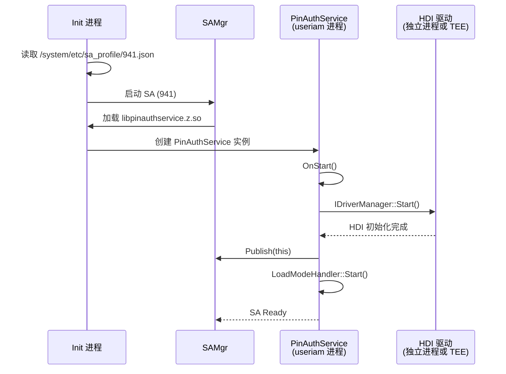
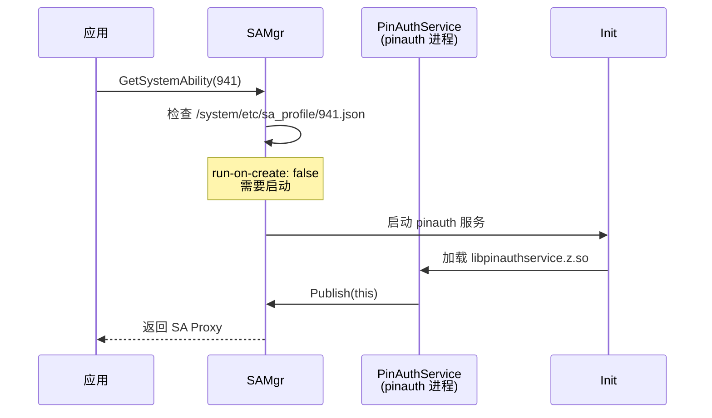

# 编译产物文档

> **目的**：了解 pin_auth 模块的编译产物、安装路径和运行时加载关系
> **适用范围**：构建工程师、系统集成者、设备厂商
> **关键结论**：两个主要共享库（服务 + 框架），SA 配置文件部署到系统目录
> **相关文档**：[GN Targets](06_GN_Targets.md) | [架构设计](03_Architecture.md) | [常见问题](09_FAQ.md)

---

## 编译产物清单

| 产物名称 | 类型 | 输出 Target | 安装路径 | 说明 |
|---------|------|-------------|----------|------|
| `libpinauthservice.z.so` | 共享库 | `pinauthservice` | `system/lib64/` 或 `system/lib/` | System Ability 主库 |
| `libpinauth_framework.so` | 共享库 | `pinauth_framework` | `system/lib64/` 或 `system/lib/` | 客户端框架库 |
| `941.json` | 配置文件 | `pinauth_sa_profile` | `system/etc/sa_profile/` | SA 注册配置（静态/动态） |
| `pinauth_sa_profile.cfg` | 配置文件 | `pinauth_sa_profile.init` | `system/etc/init/` | Init 配置（仅动态模式） |

---

## 主要共享库

### 1. libpinauthservice.z.so

**Target**：`pinauthservice`

**文件路径**：`services/BUILD.gn:111-134`

**功能**：
- 实现 PinAuthService System Ability
- HDI 驱动管理
- Inputer 管理和 Token 隔离
- 执行器管理（AllInOne、Collector、Verifier）
- 加载模式管理（静态/动态）

**包含模块**：
- SA 核心：`services/sa/src/pin_auth_service.cpp`
- HDI 驱动：`services/modules/driver/src/*.cpp`
- 执行器：`services/modules/executors/src/*.cpp`
- Inputer 管理：`services/modules/inputters/src/*.cpp`
- 加载模式：`services/modules/load_mode/src/*.cpp`

**符号导出**（use_musl 时）：
- 版本脚本：`services/pin_auth_service_map`
- 作用：限制导出符号，减少符号表大小

**依赖库**：
- 动态链接：`libhilog.so`、`libhdf.so`、`libhdi.so`、`libcrypto.so` 等
- HDI 代理：`libpin_auth_proxy_3.0.z.so`（来自 `drivers_interface_pin_auth`）

**安装路径**：
```
system/lib64/libpinauthservice.z.so    # 64 位系统
system/lib/libpinauthservice.z.so       # 32 位系统（如适用）
```

**运行时加载**：
- 由 Init 进程根据 `system/etc/sa_profile/941.json` 加载
- 静态加载：run-on-create: true，系统启动时立即加载
- 动态加载：run-on-create: false，按需加载

---

### 2. libpinauth_framework.so

**Target**：`pinauth_framework`

**文件路径**：`frameworks/BUILD.gn:85-109`

**功能**：
- PinAuthRegister 实现
- IPC Proxy 实现
- InputerData 实现
- Scrypt 加密工具
- Settings 数据管理

**包含模块**：
- 客户端实现：`frameworks/client/src/*.cpp`
- IPC Proxy：`frameworks/ipc/src/*_proxy.cpp`
- 加密：`frameworks/scrypt/src/scrypt.cpp`

**符号导出**（use_musl 时）：
- 版本脚本：`frameworks/pin_auth_framework_map`
- 作用：限制导出符号到公开 API

**暴露的 API**：
- `OHOS::UserIam::PinAuth::PinAuthRegister`
- `OHOS::UserIam::PinAuth::IInputer`
- `OHOS::UserIam::PinAuth::IInputerData`

**依赖库**：
- 动态链接：`libhilog.so`、`libipc_single.so`、`libcrypto.so` 等
- user_auth_framework：`libuserauth_client.so`

**安装路径**：
```
system/lib64/libpinauth_framework.so    # 64 位系统
system/lib/libpinauth_framework.so       # 32 位系统（如适用）
```

**运行时加载**：
- 由 Settings、锁屏等系统应用链接并加载
- 通过 `PinAuthRegister::GetInstance()` 访问

---

## SA 配置文件

### 941.json（SA Profile）

**Target**：`pinauth_sa_profile`

**说明**：System Ability 注册配置，由 SAMgr 读取

#### 静态加载配置

**文件**：`sa_profile/default/941.json`

**内容**：
```json
{
    "process": "useriam",
    "systemability": [
        {
            "name": 941,
            "libpath": "libpinauthservice.z.so",
            "run-on-create": true,
            "distributed": false,
            "dump_level": 1,
            "min_hdi_proxy_version": ["libpin_auth_proxy_3.0.z.so"]
        }
    ]
}
```

**参数说明**：
- `process`：SA 运行的进程名（`useriam`）
- `name`：SAID（941）
- `libpath`：共享库路径（`libpinauthservice.z.so`）
- `run-on-create`：是否在创建时立即启动（true = 静态加载）
- `distributed`：是否支持分布式（false）
- `dump_level`：Dump 级别
- `min_hdi_proxy_version`：最低 HDI 代理版本要求

#### 动态加载配置

**文件**：`sa_profile/dynamic_load/941.json`

**内容**：
```json
{
    "process": "pinauth",
    "systemability": [
        {
            "name": 941,
            "libpath": "libpinauthservice.z.so",
            "run-on-create": false
        }
    ]
}
```

**参数说明**：
- `process`：独立进程名（`pinauth`，而非 `useriam`）
- `run-on-create`：false（按需启动）

**安装路径**：
```
system/etc/sa_profile/941.json    # 静态或动态（二选一）
```

---

### pinauth_sa_profile.cfg（Init 配置）

**Target**：`pinauth_sa_profile.init`

**说明**：Init 进程配置（仅动态加载模式）

**文件**：`sa_profile/dynamic_load/pinauth_sa_profile.cfg`

**内容示例**：
```cfg
{
    "jobs" : [{
        "name" : "pinauth",
        "cmds" : [
            "start pinauth_service"
        ]
    }],
    "services" : [{
        "name" : "pinauth",
        "path" : ["/system/bin/sa_main", "pinauth", "941"]
    }]
}
```

**参数说明**：
- 定义了 pinauth 服务的启动命令
- 路径指向 `sa_main` 可执行文件

**安装路径**：
```
system/etc/init/pinauth_sa_profile.cfg    # 仅动态加载模式
```

---

## 运行时加载关系

### 系统启动流程（静态加载）



### 应用加载流程（动态加载）



### 库依赖关系

```
libpinauthservice.z.so
    ├── libhilog.so              (日志)
    ├── libhdf.so              (HDF 框架)
    ├── libhdi.so              (HDI 接口)
    ├── libcrypto.so            (加密)
    ├── libbeget_proxy.so       (Init 通信)
    ├── libbegetutil.so        (Init 工具)
    ├── libipc_single.so       (IPC)
    ├── libsafwk.so           (SA 框架)
    ├── libsamgr_proxy.so       (SA 管理器代理)
    ├── libaccesstoken_sdk.so  (访问令牌)
    ├── libhisysevent.so        (系统事件)
    └── libpin_auth_proxy_3.0.z.so  (HDI 代理，来自 drivers_interface_pin_auth)
        └── 南向厂商实现（TEE/安全芯片）

libpinauth_framework.so
    ├── libhilog.so
    ├── libipc_single.so
    ├── libcrypto.so
    ├── libdatashare.so        (数据共享)
    └── libuserauth_client.so    (用户认证框架客户端)
```

---

## 库文件大小

**从 bundle.json 声明**：

| 库 | ROM 估算 | RAM 估算 |
|-----|---------|---------|
| `libpinauthservice.z.so` | ~800 KB | ~4 MB |
| `libpinauth_framework.so` | ~224 KB | ~2 MB |
| **总计** | ~1 MB | ~6 MB |

**注意**：实际大小取决于编译选项和设备架构。

---

## 版本符号映射

### pin_auth_service.map

**条件**：`use_musl`

**作用**：控制 `libpinauthservice.z.so` 的符号导出

**示例**：
```
{
    global:
        PinAuthService*;
    local:
        *;
};
```

**位置**：`services/pin_auth_service_map`（TODO：需确认文件是否存在）

### pin_auth_framework.map

**条件**：`use_musl`

**作用**：控制 `libpinauth_framework.so` 的符号导出

**示例**：
```
{
    global:
        PinAuthRegister*;
    local:
        *;
};
```

**位置**：`frameworks/pin_auth_framework_map`（TODO：需确认文件是否存在）

---

## 加载模式选择

### 构建时选择

通过 `pin_auth.gni` 中的 `pin_auth_enable_dynamic_load` 参数：

```gn
# pin_auth.gni:17
pin_auth_enable_dynamic_load = false
```

### 运行时文件选择

`sa_profile/BUILD.gn` 根据参数选择配置文件：

```gn
if (pin_auth_enable_dynamic_load) {
    sources = [ "dynamic_load/941.json" ]
    if (defined(ohos_lite)) {
        sources += [ "dynamic_load/pinauth_sa_profile.cfg" ]
    }
} else {
    sources = [ "default/941.json" ]
}
```

---

## 代码证据

### SA Profile 配置

**文件**：`sa_profile/default/941.json:1-13`

```json
{
    "process": "useriam",
    "systemability": [
        {
            "name": 941,
            "libpath": "libpinauthservice.z.so",
            "run-on-create": true,
            "distributed": false,
            "dump_level": 1,
            "min_hdi_proxy_version": ["libpin_auth_proxy_3.0.z.so"]
        }
    ]
}
```

### bundle.json 产物声明

**文件**：`bundle.json:62-79`

```json
{
  "inner_kits": [
    {
      "type": "so",
      "name": "//base/useriam/pin_auth/frameworks:pinauth_framework",
      "header": {
        "header_files": [
            "i_inputer_data.h",
            "i_inputer.h",
            "pinauth_register.h"
        ],
        "header_base": "//base/useriam/pin_auth/interfaces/inner_api/"
      }
    }
  ]
}
```

---

## 下一步

- 常见构建问题 → [常见问题](09_FAQ.md)
- 安全风险评审 → [安全风险评审](08_Security_Review.md)
