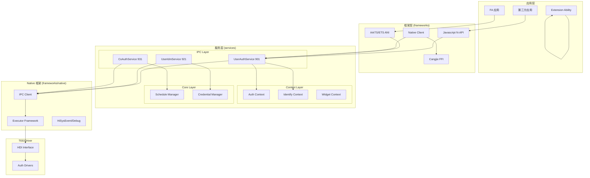
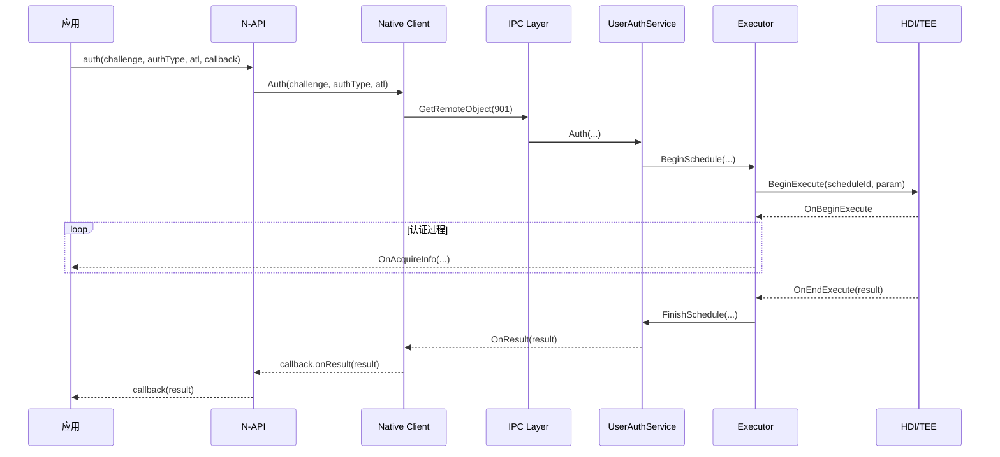

# 架构说明

## 1. 整体架构图



> **证据**: `README.md` 架构图 + bundle.json 服务配置

---

## 2. 数据流

### 2.1 认证流程数据流

```
┌─────────┐     ┌─────────────┐     ┌──────────────┐     ┌─────────┐
│  App    │────▶│  N-API      │────▶│  UserAuth    │────▶│   SA    │
│  JS/TS  │     │  (JS/ANI)   │     │  Service     │     │ Service │
└─────────┘     └─────────────┘     └──────────────┘     └─────────┘
                                              │
                                              ▼
                                        ┌──────────────┐
                                        │  Executor    │
                                        │  Framework   │
                                        └──────────────┘
                                              │
                                              ▼
                                        ┌──────────────┐
                                        │   HDI        │
                                        │  (TEE/Driver)│
                                        └──────────────┘
```

### 2.2 凭证管理数据流

```
┌─────────┐     ┌─────────────┐     ┌──────────────┐     ┌─────────┐
│  App    │────▶│  N-API      │────▶│  UserIdm     │────▶│   DB    │
│         │     │  (JS/ANI)   │     │  Service     │     │ (本地)  │
└─────────┘     └─────────────┘     └──────────────┘     └─────────┘
```

---

## 3. 线程模型

### 3.1 线程划分

| 线程 | 职责 | 位置 |
|------|------|------|
| **主线程** | N-API 调用、JS 回调 | JS 引擎线程 |
| **IPC 线程** | 跨进程通信 | IPC 框架 |
| **业务线程** | 认证上下文处理 | services/context/ |
| **HDI 线程** | 与 TEE 通信 | frameworks/native/executors/ |

### 3.2 线程安全

- **IPC 调用**: 异步方式，避免阻塞主线程
- **共享数据**: 使用锁机制保护
- **回调通知**: 通过消息队列传递给主线程

> **证据**: `services/context/src/` 中的 Context 实现

---

## 4. System Ability 服务架构

### 4.1 SA 清单

| SA ID | 服务名 | 进程 | 启动方式 | 库 |
|-------|--------|------|----------|-----|
| 901 | UserAuthService | useriam | 需时启动 | libuserauthservice.z.so |
| 921 | UserIdmService | useriam | 需时启动 | libuserauthservice.z.so |
| 931 | CoAuthService | useriam | 需时启动 | libuserauthservice.z.so |

> **证据**: `sa_profile/default/{901,921,931}.json`

### 4.2 SA 注册点

**UserAuthService**:
- 头文件: `services/ipc/inc/user_auth_service.h`
- 实现: `services/ipc/src/user_auth_service.cpp:143`
- 继承: `SystemAbility`, `UserAuthStub`

**UserIdmService**:
- 头文件: `services/ipc/inc/user_idm_service.h`
- 实现: `services/ipc/src/user_idm_service.cpp:51`
- 继承: `SystemAbility`, `UserIdmStub`

**CoAuthService**:
- 头文件: `services/ipc/inc/co_auth_service.h`
- 实现: `services/ipc/src/co_auth_service.cpp:54`
- 继承: `SystemAbility`, `CoAuthStub`

---

## 5. IPC 接口定义

### 5.1 IDL 文件清单

```
frameworks/native/ipc/idl/
├── IUserAuth.idl          # 用户认证接口
├── IUserIdm.idl          # 用户身份管理接口
├── ICoAuth.idl           # 协同认证接口
├── IExecutorMessenger.idl # 执行器消息传递
├── IExecutorCallback.idl  # 执行器回调
├── IIamCallback.idl      # 认证回调
├── IWidgetCallback.idl   # Widget 回调
├── IModalCallback.idl    # 模态框回调
├── IEventListenerCallback.idl # 事件监听回调
├── IIdmGetCredInfoCallback.idl   # 获取凭证信息回调
├── IIdmGetSecureUserInfoCallback.idl # 获取安全用户信息回调
├── IGetExecutorPropertyCallback.idl # 获取执行器属性回调
├── ISetExecutorPropertyCallback.idl # 设置执行器属性回调
├── IVerifyTokenCallback.idl # 验证令牌回调
└── UserAuthTypes.idl     # 公共类型定义
```

### 5.2 主要接口方法

**IUserAuth.idl**:
```
GetAvailableStatus           # 获取认证可用状态
GetProperty                  # 获取认证属性
SetProperty                  # 设置认证属性
AuthUser                    # 用户认证
Auth                        # 认证 (带 Challenge)
AuthWidget                  # Widget 认证
Identify                   # 识别
CancelAuthOrIdentify       # 取消认证/识别
VerifyAuthToken            # 验证认证令牌
GetEnrolledState           # 获取注册状态
PrepareRemoteAuth          # 准备远程认证
QueryReusableAuthResult    # 查询可复用认证结果
GetAuthLockState          # 获取认证锁定状态
```

**IUserIdm.idl**:
```
OpenSession                 # 打开会话
CloseSession               # 关闭会话
AddCredential              # 添加凭证
UpdateCredential          # 更新凭证
DelCredential             # 删除凭证
DelUser                   # 删除用户
GetCredentialInfo         # 获取凭证信息
```

**ICoAuth.idl**:
```
ExecutorRegister          # 注册执行器
ExecutorUnregister        # 注销执行器
```

> **证据**: `frameworks/native/ipc/idl/*.idl` 文件内容

---

## 6. 关键时序图

### 6.1 认证流程时序



---

## 7. 模块依赖方向

```
                    ┌─────────────────┐
                    │  services/       │
                    │  ipc/            │ ◀──┐
                    │  (SA Services)   │    │
                    └─────────────────┘    │
                              ▲            │
                              │            │
┌─────────────────┐          │            │
│ frameworks/     │          │            │
│ js/napi/        │ ───────▶│            │
│ (N-API)         │          │            │
└─────────────────┘          │            │
                              │            │
┌─────────────────┐          │            │
│ frameworks/     │          │            │
│ native/client/ │ ───────▶│            │
│ (Inner API)     │          │            │
└─────────────────┘          │            │
                              │            │
┌─────────────────┐          │            │
│ interfaces/     │          │            │
│ inner_api/      │ ◀───────│────────────┘
│ (Public Headers)│          │
└─────────────────┘          │
                              │
┌─────────────────┐          │
│ common/         │ ◀───────│────────────┘
│ (Utils)         │          │
└─────────────────┘          │
```

> **依赖规则**: 禁止逆向依赖，下层模块不能依赖上层模块

---

## 8. 扩展点

### 8.1 新增认证方式

1. 实现 `IAuthDriverHDI` 接口
2. 在 `CoAuthService` 中注册执行器
3. 提供用户态驱动 (如 useriam_face_auth)

### 8.2 新增回调方式

1. 实现相应的 Callback 接口
2. 在认证请求时注册回调

---

## 9. 相关文档

- [N-API 接口](02_NAPI.md)
- [Inner API](03_InnerAPI.md)
- [构建配置](04_Build.md)
- [安全评审](05_Security.md)
