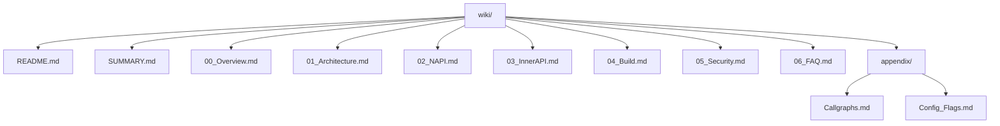

# User Auth Framework - OpenHarmony 工程 Wiki

## 概述

本 Wiki 是 OpenHarmony **User Identity & Access Management (IAM)** 子系统中的 **统一用户认证 (userauth)** 组件的完整工程文档。

**项目定位**: 为第三方应用提供统一的用户认证和生物特征认证 API。

**核心能力**:
- 支持多种认证方式：PIN、人脸、指纹、私有 PIN
- 认证信任等级 (ATL) 管理
- 凭证生命周期管理
- 跨设备远程认证
- 执行器 (Executor) 框架

**技术栈**:
- Native C++ (框架核心)
- JavaScript N-API (JS API)
- ArkTS/ETS ANI (ArkTS API)
- Cangjie FFI (Cangjie API)
- OpenHarmony IPC (跨进程通信)
- System Ability (系统服务)

---

## 文档覆盖范围

### 已覆盖

- [x] 项目概览与架构
- [x] N-API 接口文档 (JS API)
- [x] Inner API 接口文档 (Native Client)
- [x] System Ability 服务架构
- [x] GN 构建配置与产物
- [x] 安全风险评审

### 未覆盖 (测试相关内容)

- [x] 所有测试代码 (按照约束忽略)
- [x] fuzz test 配置
- [x] unittest 实现

---

## 目录结构



---

## 新人阅读路线

### 路线 1: 开发者 (使用 API)

1. [00_Overview.md](00_Overview.md) - 项目概览
2. [02_NAPI.md](02_NAPI.md) - JS API 使用指南

### 路线 2: 系统开发者 (扩展框架)

1. [00_Overview.md](00_Overview.md) - 项目概览
2. [01_Architecture.md](01_Architecture.md) - 整体架构
3. [03_InnerAPI.md](03_InnerAPI.md) - Inner API 参考
4. [01_Architecture.md#sa-服务架构] - SA 服务注册

### 路线 3: 平台开发者 (构建/适配)

1. [04_Build.md](04_Build.md) - GN 构建与产物
2. [05_Security.md](05_Security.md) - 安全评审

---

## 更新方式

### 手动更新

当代码变更涉及以下内容时，请同步更新 Wiki:

1. **新增/修改 API** → 更新 [02_NAPI.md](02_NAPI.md)
2. **新增/修改 Inner API** → 更新 [03_InnerAPI.md](03_InnerAPI.md)
3. **新增/修改 Target** → 更新 [04_Build.md](04_Build.md)
4. **新增安全检查点** → 更新 [05_Security.md](05_Security.md)

### 验证命令

```bash
# 检查所有链接存在
cd wiki && find . -name "*.md" -exec grep -l LINK {} \;

# 检查无测试引用
grep -r "test\|unittest\|fuzz" *.md --include="*.md"
```

---

## 生成信息

- **生成时间**: 2026-02-06
- **代码版本**: OpenHarmony master (latest)
- **扫描工具**: parallel explore agents
- **文档语言**: 中文 (默认)

---

## 相关链接

- **上游仓库**: https://gitee.com/openharmony/useriam_user_auth_framework
- **官方文档**: https://gitee.com/openharmony/docs/blob/master/zh-cn/application-dev/security/userauth-guidelines.md
- **驱动接口**: https://gitee.com/openharmony/drivers_interface
