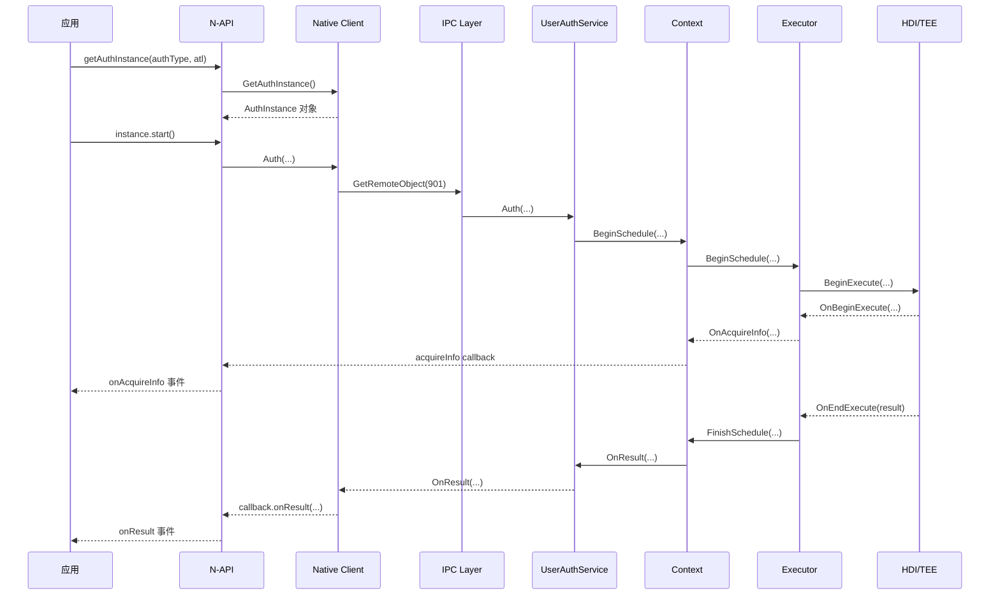

# 关键调用链

## 1. 概述

本文档描述 user_auth_framework 中关键业务流程的调用链，从入口到核心逻辑的完整路径。

---

## 2. 认证流程调用链

### 2.1 完整调用链

```
┌─────────────────────────────────────────────────────────────────────┐
│ JavaScript/ArkTS 层                                                  │
├─────────────────────────────────────────────────────────────────────┤
│  user_auth_entry.cpp                                                 │
│  ├─ GetAuthInstanceV9()  →  AuthInstanceV9::Constructor              │
│  └─ GetAuthInstanceV10() →  UserAuthInstanceV10::Constructor         │
└─────────────────────────────────────────────────────────────────────┘
                                │
                                ▼
┌─────────────────────────────────────────────────────────────────────┐
│ Native Client (frameworks/native/client/)                            │
├─────────────────────────────────────────────────────────────────────┤
│  user_auth_client_impl.cpp                                           │
│  ├─ UserAuthClientImpl::GetAuthInstance()                           │
│  └─ UserAuthClientImpl::Auth()                                       │
└─────────────────────────────────────────────────────────────────────┘
                                │
                                ▼
┌─────────────────────────────────────────────────────────────────────┐
│ IPC Layer                                                            │
├─────────────────────────────────────────────────────────────────────┤
│  ipc_client_utils.cpp                                               │
│  └─ GetRemoteObject(SA_ID_USERAUTH) → 获取 UserAuthService Proxy      │
└─────────────────────────────────────────────────────────────────────┘
                                │
                                ▼
┌─────────────────────────────────────────────────────────────────────┐
│ UserAuthService (services/ipc/src/user_auth_service.cpp)            │
├─────────────────────────────────────────────────────────────────────┤
│  OnRemoteRequest()                                                   │
│  └─ Auth() → AuthContext::Begin()                                   │
└─────────────────────────────────────────────────────────────────────┘
                                │
                                ▼
┌─────────────────────────────────────────────────────────────────────┐
│ Context Layer (services/context/)                                    │
├─────────────────────────────────────────────────────────────────────┤
│  auth_context.cpp                                                    │
│  ├─ Begin()                                                          │
│  ├─ Execute()                                                        │
│  └─ Finish()                                                         │
└─────────────────────────────────────────────────────────────────────┘
                                │
                                ▼
┌─────────────────────────────────────────────────────────────────────┐
│ Core Layer (services/core/src/authentication/)                       │
├─────────────────────────────────────────────────────────────────────┤
│  authentication.cpp                                                  │
│  ├─ StartSchedule()                                                 │
│  └─ EndSchedule()                                                    │
└─────────────────────────────────────────────────────────────────────┘
                                │
                                ▼
┌─────────────────────────────────────────────────────────────────────┐
│ Executor Framework (frameworks/native/executors/)                    │
├─────────────────────────────────────────────────────────────────────┤
│  driver_manager.cpp                                                  │
│  ├─ BeginSchedule()                                                 │
│  └─ CollectAuthentication()                                         │
└─────────────────────────────────────────────────────────────────────┘
                                │
                                ▼
┌─────────────────────────────────────────────────────────────────────┐
│ HDI / TEE (drivers_interface_user_auth)                              │
├─────────────────────────────────────────────────────────────────────┤
│  IAuthDriverHDI 接口 (厂商实现)                                      │
│  └─ BeginExecute() → [TEE 内部处理] → OnEndExecute()                 │
└─────────────────────────────────────────────────────────────────────┘
```

---

## 3. 凭证管理调用链

### 3.1 添加凭证

```
JS: userIDMClient.addCredential()
    │
    ▼
user_idm_client_impl.cpp::AddCredential()
    │
    ▼
IPC: GetRemoteObject(SA_ID_USERIDM) → UserIdmService Proxy
    │
    ▼
UserIdmService.cpp::AddCredential()
    │
    ▼
CredentialManager::AddCredential()
    │
    ▼
HDI: IAuthDriverHDI::BeginEnrollment()
    │
    ▼
[凭证存储到安全区域]
```

### 3.2 删除凭证

```
JS: userIDMClient.delCredential()
    │
    ▼
UserIdmService.cpp::DelCredential()
    │
    ▼
CredentialManager::DelCredential()
    │
    ▼
[从安全区域删除凭证]
```

---

## 4. 执行器注册调用链

```
JS: CoAuthClient.executorRegister()
    │
    ▼
CoAuthService.cpp::ExecutorRegister()
    │
    ▼
ExecutorManager::RegisterExecutor()
    │
    ▼
DriverManager::AddDriver()
    │
    ▼
HDI: IAuthDriverHDI::GetExecutorInfo()
    │
    ▼
[执行器信息注册完成]
```

---

## 5. 跨设备认证调用链

```
┌─────────────────────┐                    ┌─────────────────────┐
│       设备 A         │                    │       设备 B         │
├─────────────────────┤                    ├─────────────────────┤
│ UserAuthService     │ ◀─── SoftBus ───▶ │ UserAuthService     │
│      │              │                    │      │              │
│      ▼              │                    │      ▼              │
│ RemoteAuthInvoker   │                    │ RemoteAuthService  │
│      │              │                    │                     │
│      ▼              │                    │                     │
│ [本地认证结果]       │ ───── Token ────▶ │ [验证认证结果]       │
└─────────────────────┘                    └─────────────────────┘
```

---

## 6. 关键文件映射

| 功能 | 入口文件 | 核心文件 |
|------|----------|----------|
| 认证 | `user_auth_entry.cpp` | `auth_context.cpp`, `authentication.cpp` |
| 凭证管理 | `user_idm_client_impl.cpp` | `credential_manager.cpp` |
| 执行器 | `co_auth_service.cpp` | `executor_manager.cpp`, `driver_manager.cpp` |
| 跨设备 | `remote_auth_service.cpp` | `remote_auth_invoker.cpp` |

---

## 7. 调用链时序图

### 认证流程时序



---

## 8. 相关文档

- [架构说明](01_Architecture.md)
- [N-API 接口](02_NAPI.md)
- [Inner API](03_InnerAPI.md)
