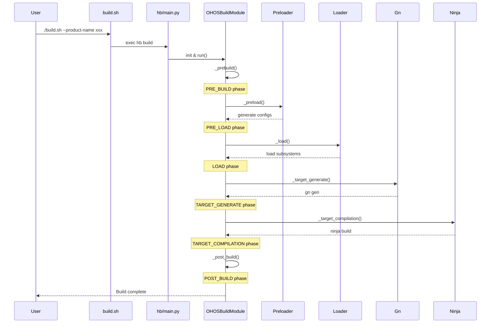

# 架构说明

本文档详细说明 OpenHarmony build 系统的架构设计，包括组件关系、数据流和构建时序。

## 系统架构图

```
┌─────────────────────────────────────────────────────────────────┐
│                        用户接口层                                 │
│  ┌─────────────┐  ┌─────────────┐  ┌─────────────┐              │
│  │ build.sh    │  │ build.py    │  │ hb command  │              │
│  └──────┬──────┘  └──────┬──────┘  └──────┬──────┘              │
└─────────┼────────────────┼────────────────┼─────────────────────┘
          │                │                │
          └────────────────┴────────────────┘
                           │
                           ▼
┌─────────────────────────────────────────────────────────────────┐
│                        hb 构建工具层                              │
│  ┌─────────────────────────────────────────────────────────┐   │
│  │  Main (main.py)                                         │   │
│  │  ├── Module Dispatcher                                  │   │
│  │  ├── Arg Parser (containers/arg.py)                     │   │
│  │  └── Config Manager (resources/config.py)               │   │
│  └─────────────────────────────────────────────────────────┘   │
│                           │                                     │
│  ┌────────────────────────┼────────────────────────┐           │
│  │                        ▼                        │           │
│  │  Modules              Services                  │           │
│  │  ├─ ohos_build    ├─ preloader.py              │           │
│  │  ├─ ohos_set      ├─ loader.py                  │           │
│  │  ├─ ohos_clean    ├─ gn.py                      │           │
│  │  ├─ ohos_env      ├─ ninja.py                   │           │
│  │  └─ ...           └─ ...                        │           │
│  └─────────────────────────────────────────────────┘           │
└─────────────────────────────────────────────────────────────────┘
                           │
                           ▼
┌─────────────────────────────────────────────────────────────────┐
│                        构建执行层                                 │
│  ┌─────────────┐  ┌─────────────┐  ┌─────────────┐              │
│  │   GN        │  │   Ninja     │  │  Python     │              │
│  │  (gn gen)   │  │  (ninja)    │  │  Scripts    │              │
│  └──────┬──────┘  └──────┬──────┘  └──────┬──────┘              │
└─────────┼────────────────┼────────────────┼─────────────────────┘
          │                │                │
          └────────────────┴────────────────┘
                           │
                           ▼
┌─────────────────────────────────────────────────────────────────┐
│                        产物输出层                                 │
│  ┌─────────────┐  ┌─────────────┐  ┌─────────────┐              │
│  │   .so/.a    │  │   Images    │  │   SDK/NDK   │              │
│  │  Libraries  │  │  (ext4/f2fs)│  │   Packages  │              │
│  └─────────────┘  └─────────────┘  └─────────────┘              │
└─────────────────────────────────────────────────────────────────┘
```

## 核心组件

### 1. 入口层

#### build.sh (`//build/build_scripts/build.sh`)
- **职责**: Shell 环境检查、参数解析、调用 hb
- **关键函数**: `check_shell_environment()`, `init_ohpm()`

#### build.py (`//build/build_scripts/build.py`)
- **职责**: Python 包装器，查找仓库根目录
- **关键函数**: `find_top()`, `get_python()`, `build()`

#### hb main (`//build/hb/main.py`)
- **职责**: 命令分发、模块初始化
- **关键类**: `Main`
- **模块映射**:
  ```python
  module_initializers = {
      'build': _init_build_module,
      'set': _init_set_module,
      'clean': _init_clean_module,
      'env': _init_env_module,
      'tool': _init_tool_module,
      'indep_build': _init_indep_build_module,
      # ...
  }
  ```

### 2. 构建模块层

#### OHOSBuildModule (`//build/hb/modules/ohos_build_module.py`)
- **职责**: 主构建流程编排
- **构建阶段**:
  ```
  _prebuild_and_preload() → _load() → _gn() → _ninja() → _post_build()
  ```

#### BuildModuleInterface (`//build/hb/modules/interface/build_module_interface.py`)
- **职责**: 定义构建模块接口
- **抽象方法**: `_prebuild_and_preload()`, `_gn()`, `_ninja()`

### 3. 服务层

#### OHOSPreloader (`//build/hb/services/preloader.py`)
- **职责**: 预加载构建配置
- **输出文件**:
  - `parts.json` - 部件配置
  - `features.json` - 特性配置
  - `syscap.json` - 系统能力
  - `build_config.json` - 构建配置

#### OHOSLoader (`//build/hb/services/loader.py`)
- **职责**: 加载子系统和部件信息
- **关键方法**:
  - `_check_args()` - 参数验证
  - `_generate_syscap_files()` - 生成系统能力文件
  - `_generate_target_gn()` - 生成目标 GN 文件

#### Gn (`//build/hb/services/gn.py`)
- **职责**: GN 命令执行
- **支持命令**:
  ```python
  class CMDTYPE(Enum):
      GEN = 1      # gn gen
      PATH = 2     # gn path
      DESC = 3     # gn desc
      LS = 4       # gn ls
      REFS = 5     # gn refs
      FORMAT = 6   # gn format
      CLEAN = 7    # gn clean
  ```

#### Ninja (`//build/hb/services/ninja.py`)
- **职责**: Ninja 构建执行
- **关键方法**: `run()` - 执行 `ninja -C out_path`

## 构建流程时序



## 数据流

### 配置数据流

```
subsystem_config.json ──┐
                        ├──→ Preloader ──→ parts.json
bundle.json (parts) ────┤         ├───────→ features.json
                        │         ├───────→ syscap.json
vendor/config.json ─────┘         └───────→ build_config.json
                                          │
                                          ▼
                                    Loader ──→ target GN files
                                          │
                                          ▼
                                    GN ──→ ninja files
                                          │
                                          ▼
                                    Ninja ──→ build outputs
```

### 产物数据流

```
Source Code (.c/.cpp/.rs)
       │
       ├──→ C/C++ Compiler (clang) ──→ Object Files (.o)
       │                                    │
       ├──→ Rust Compiler (rustc) ───→ Rust Objects          ──┐
       │                                    │                    │
       └──→ ArkTS Compiler (es2abc) ──→ ABC Files (.abc)       │
                                            │                  │
                                            ▼                  │
                                    GN/Ninja Link ──→ Libraries│
                                    ├─ .so (shared)            │
                                    ├─ .a (static)             │
                                    └─ executable              │
                                                                  │
                                            ▼                     │
                                    Package Scripts ──→ Images    │
                                    ├─ system.img                 │
                                    ├─ vendor.img                 │
                                    └─ userdata.img               │
                                                                  │
                                            ▼                     │
                                    SDK/NDK Packaging ──→ SDK     │
                                    ├─ toolchains                 │
                                    ├─ headers                    │
                                    └─ libraries ◄────────────────┘
```

## 构建阶段详解

### Phase 1: PRE_BUILD
- **职责**: 参数解析、环境检查
- **执行者**: `BuildArgsResolver`
- **关键操作**:
  - 解析 `--product-name`, `--target-cpu` 等参数
  - 验证产品配置
  - 设置构建环境变量

### Phase 2: PRE_LOAD
- **职责**: 预加载配置生成
- **执行者**: `OHOSPreloader`
- **输出**:
  - `out/{device}/build_configs/parts.json`
  - `out/{device}/build_configs/features.json`
  - `out/{device}/build_configs/syscap.json`

### Phase 3: LOAD
- **职责**: 加载子系统和部件
- **执行者**: `OHOSLoader`
- **关键操作**:
  - 扫描 `subsystem_config.json`
  - 解析各子系统的 `bundle.json`
  - 生成 `target_platform.gn`

### Phase 4: TARGET_GENERATE (gn gen)
- **职责**: 生成 Ninja 构建文件
- **执行者**: `Gn` 服务
- **命令**: `gn gen --args=... out/{device}`
- **输出**: `out/{device}/build.ninja`

### Phase 5: TARGET_COMPILATION (ninja)
- **职责**: 执行编译
- **执行者**: `Ninja` 服务
- **命令**: `ninja -C out/{device} {targets}`
- **输出**: 编译产物 (.o, .so, .a, executable)

### Phase 6: POST_BUILD
- **职责**: 后处理、打包
- **执行者**: `OHOSBuildModule._post_build()`
- **操作**:
  - 收集声明文件
  - 生成镜像
  - 打包 SDK/NDK

## 关键配置文件关系

```
┌─────────────────────┐
│ subsystem_config.json│
│ (子系统路径映射)      │
└──────────┬──────────┘
           │
           ▼
┌─────────────────────┐     ┌─────────────────────┐
│  foundation/xxx/    │────→│   bundle.json       │
│  (子系统目录)        │     │  (部件定义)          │
└─────────────────────┘     └──────────┬──────────┘
                                       │
                                       ▼
                              ┌─────────────────────┐
                              │   BUILD.gn          │
                              │  (模块定义)          │
                              │  ohos_shared_library│
                              │  ohos_executable    │
                              └─────────────────────┘
```

## 线程模型

### 编译阶段并行度

```
Ninja Parallel Compilation:
┌─────────────────────────────────────────┐
│  ninja -j{N}                            │
│  ├─ Compile Job 1  ████████░░░░░░░░░░   │
│  ├─ Compile Job 2  ██████░░░░░░░░░░░░   │
│  ├─ Compile Job 3  ██████████░░░░░░░░   │
│  ├─ Compile Job 4  ████░░░░░░░░░░░░░░   │
│  └─ ...                                 │
└─────────────────────────────────────────┘
```

- **默认并行度**: CPU 核心数
- **可配置**: `--jobs=N` 参数
- **链接阶段**: 受 `concurrent_links.gni` 限制

## 扩展点

### 1. 添加新模板

在 `//build/templates/` 下创建新的 `.gni` 文件，然后在 `//build/ohos.gni` 中导入。

### 2. 添加新工具链

在 `//build/toolchain/` 下定义新的工具链，参考 `ohos/BUILD.gn`。

### 3. 添加新构建阶段

在 `//build/hb/containers/arg.py` 的 `BuildPhase` 枚举中添加新阶段，在 `OHOSBuildModule` 中实现对应方法。

---

*文档生成时间: 2025-02-06*
