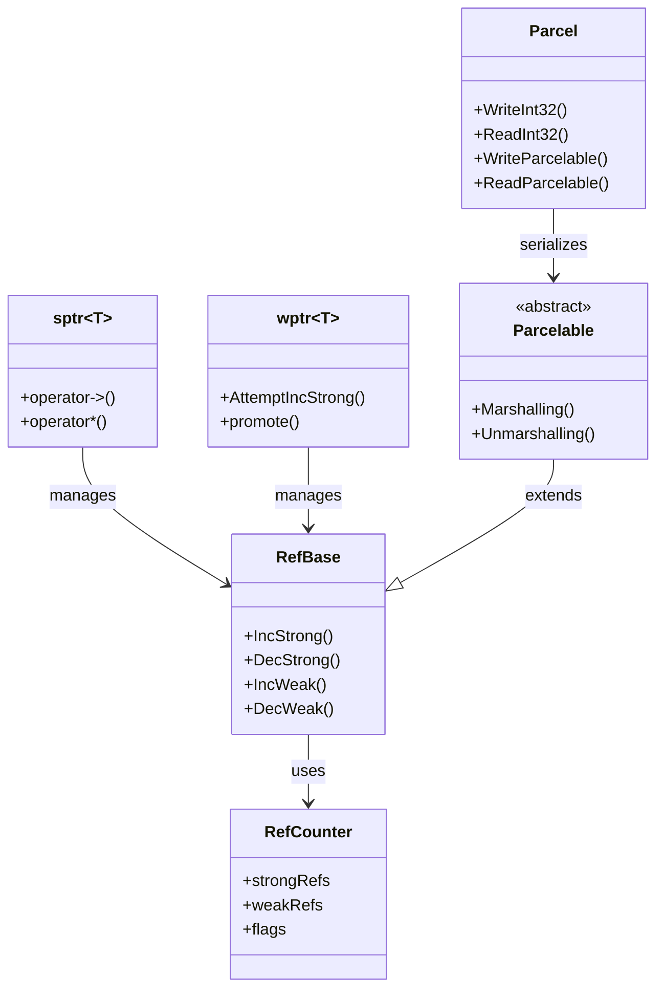
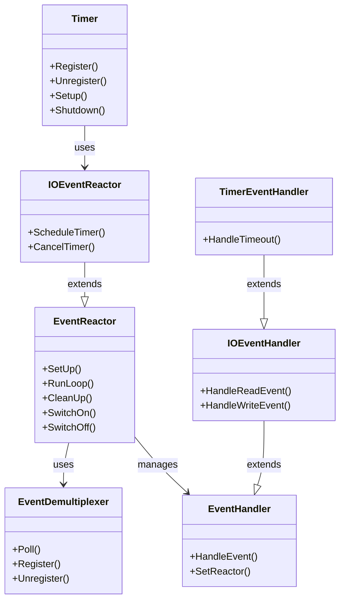
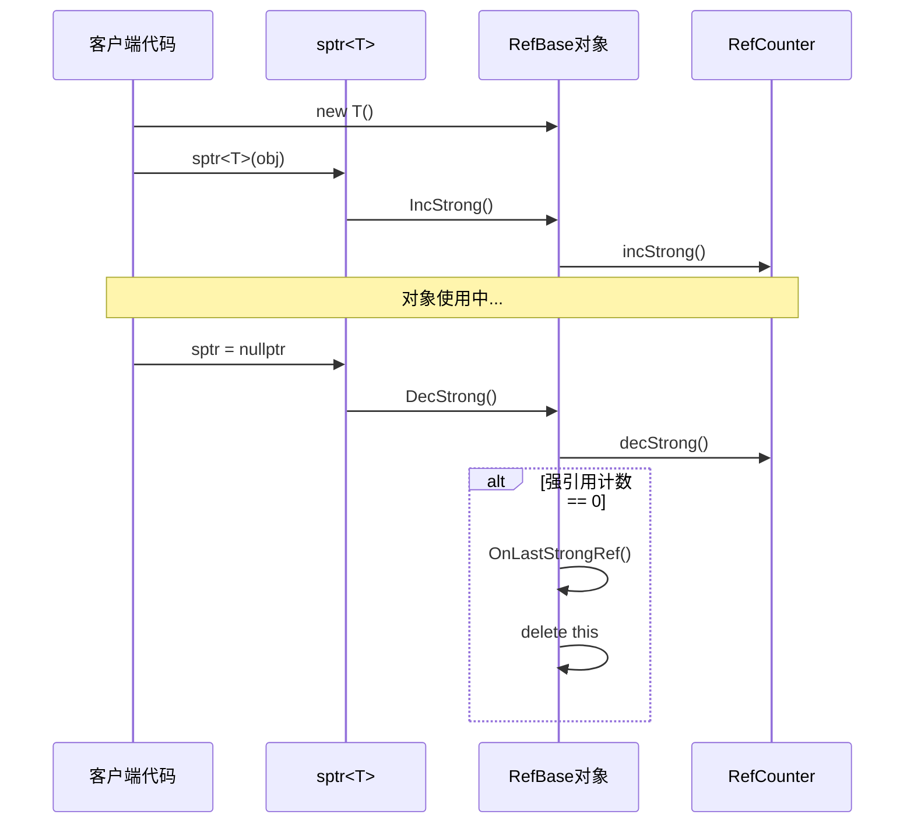
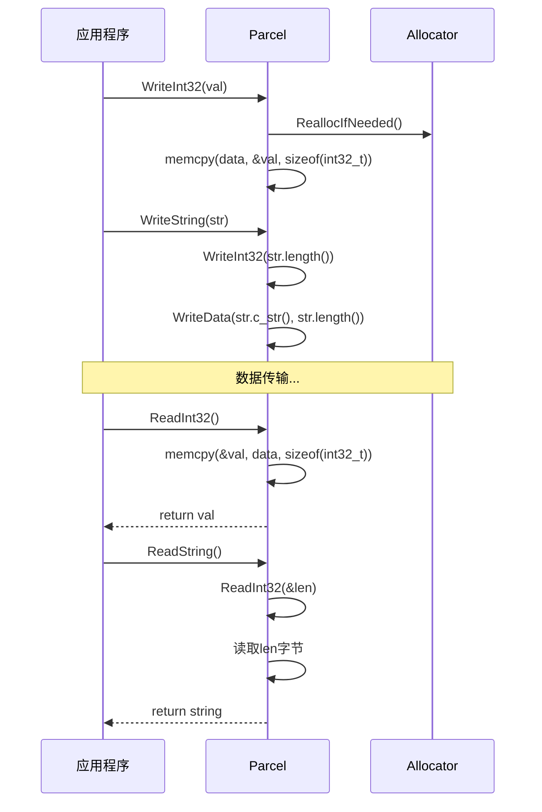
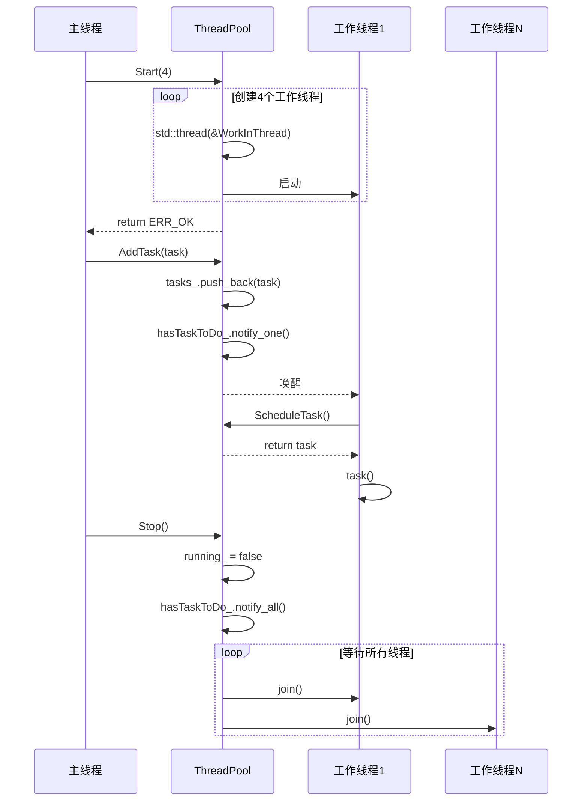

# 架构说明

## 目的

本文档描述 c_utils 的整体架构设计，包括组件关系、数据流、线程模型和关键时序。

## 适用范围

- 架构师评估技术方案
- 开发者理解内部机制
- 代码审查时把握全局

---

## 组件架构图

```
┌─────────────────────────────────────────────────────────────────────────────┐
│                              c_utils 组件架构                                 │
├─────────────────────────────────────────────────────────────────────────────┤
│                                                                             │
│  ┌─────────────────────────────────────────────────────────────────────┐   │
│  │                         对外接口层 (Public API)                       │   │
│  │  ┌──────────┐ ┌──────────┐ ┌──────────┐ ┌──────────┐ ┌──────────┐  │   │
│  │  │refbase.h │ │parcel.h  │ │file_ex.h │ │safe_map.h│ │timer.h   │  │   │
│  │  │unique_fd │ │          │ │directory │ │thread_   │ │observer.h│  │   │
│  │  │flat_obj  │ │          │ │_ex.h     │ │pool.h    │ │          │  │   │
│  │  └──────────┘ └──────────┘ └──────────┘ └──────────┘ └──────────┘  │   │
│  └─────────────────────────────────────────────────────────────────────┘   │
│                                    │                                        │
│                                    ▼                                        │
│  ┌─────────────────────────────────────────────────────────────────────┐   │
│  │                         核心实现层 (Core Implementation)              │   │
│  │                                                                     │   │
│  │   ┌─────────────┐    ┌─────────────┐    ┌─────────────┐            │   │
│  │   │  内存管理    │    │   序列化     │    │   并发控制   │            │   │
│  │   │  RefBase    │◄──►│   Parcel    │    │ ThreadPool  │            │   │
│  │   │  RefCounter │    │  Allocator  │    │  RWLock     │            │   │
│  │   │  sptr/wptr  │    │             │    │  Semaphore  │            │   │
│  │   └─────────────┘    └─────────────┘    └─────────────┘            │   │
│  │                                                                     │   │
│  │   ┌─────────────┐    ┌─────────────┐    ┌─────────────┐            │   │
│  │   │  文件系统    │    │   事件系统   │    │   容器      │            │   │
│  │   │  File/Direct│    │   Timer     │    │  SafeMap    │            │   │
│  │   │  MappedFile │    │ IOEventReac │    │  SafeQueue  │            │   │
│  │   │   Ashmem    │    │    tor      │    │SortedVector │            │   │
│  │   └─────────────┘    └─────────────┘    └─────────────┘            │   │
│  │                                                                     │   │
│  └─────────────────────────────────────────────────────────────────────┘   │
│                                    │                                        │
│                                    ▼                                        │
│  ┌─────────────────────────────────────────────────────────────────────┐   │
│  │                         平台适配层 (Platform Abstraction)             │   │
│  │                                                                     │   │
│  │   ┌──────────┐  ┌──────────┐  ┌──────────┐  ┌──────────┐           │   │
│  │   │  Linux   │  │  OHOS    │  │ Windows  │  │   iOS    │           │   │
│  │   │  (完整)   │  │  (完整)   │  │ (受限)   │  │  (受限)   │           │   │
│  │   └──────────┘  └──────────┘  └──────────┘  └──────────┘           │   │
│  │                                                                     │   │
│  │   平台宏定义: OHOS_PLATFORM, WINDOWS_PLATFORM, IOS_PLATFORM...       │   │
│  │                                                                     │   │
│  └─────────────────────────────────────────────────────────────────────┘   │
│                                    │                                        │
│                                    ▼                                        │
│  ┌─────────────────────────────────────────────────────────────────────┐   │
│  │                         外部依赖层 (External Dependencies)            │   │
│  │                                                                     │   │
│  │   ┌──────────────┐  ┌──────────────┐  ┌──────────────┐             │   │
│  │   │bounds_checking│  │    hilog     │  │  rust_cxx    │             │   │
│  │   │  _function    │  │   (日志)      │  │  (Rust FFI)  │             │   │
│  │   │  (安全C库)    │  │              │  │              │             │   │
│  │   └──────────────┘  └──────────────┘  └──────────────┘             │   │
│  │                                                                     │   │
│  └─────────────────────────────────────────────────────────────────────┘   │
│                                                                             │
└─────────────────────────────────────────────────────────────────────────────┘
```

---

## 关键组件关系

### 1. 内存管理与序列化



### 2. 事件系统架构



---

## 数据流

### 1. Parcel 序列化数据流

```
┌──────────────┐     WriteInt32()      ┌──────────────┐
│   业务对象    │ ─────────────────────►│              │
│  (int32_t)   │                       │   Parcel     │
└──────────────┘                       │   Buffer     │
                                       │              │
┌──────────────┐     WriteString()     │  ┌────────┐  │
│   业务对象    │ ─────────────────────►│  │ Header │  │
│  (string)    │                       │  ├────────┤  │
└──────────────┘                       │  │ Data   │  │
                                       │  │ Section│  │
┌──────────────┐  WriteParcelable()    │  ├────────┤  │
│  Parcelable  │ ─────────────────────►│  │ Object │  │
│    对象      │                       │  │ Section│  │
└──────────────┘                       │  └────────┘  │
                                       └──────────────┘
                                                │
                                                │ IPC/RPC
                                                ▼
                                       ┌──────────────┐
                                       │   对端进程    │
                                       │  ReadXXX()   │
                                       └──────────────┘
```

### 2. 线程池任务流

```
┌──────────────┐
│   提交任务    │
│  AddTask()   │
└──────┬───────┘
       │
       ▼
┌──────────────┐     ┌──────────────┐
│   任务队列    │◄────│   工作线程    │
│  (deque)     │     │  WorkInThread│
└──────┬───────┘     └──────────────┘
       │                     ▲
       │  ScheduleTask()     │
       └─────────────────────┘
              获取并执行任务
```

### 3. 定时器事件流

```
┌──────────────┐
│  Register()  │
│  注册定时器   │
└──────┬───────┘
       │
       ▼
┌──────────────┐     ┌──────────────┐
│  timerfd_    │────►│  epoll_wait  │
│  (timer fd)  │     │  等待事件    │
└──────────────┘     └──────┬───────┘
                            │
                            ▼
                     ┌──────────────┐
                     │  超时事件     │
                     │ OnTimer(fd)  │
                     └──────┬───────┘
                            │
                            ▼
                     ┌──────────────┐
                     │  执行回调     │
                     │   callback   │
                     └──────────────┘
```

---

## 线程模型

### 1. ThreadPool 线程模型

```
主线程                    ThreadPool                    工作线程
  │                          │                             │
  │──► Start(numThreads) ───►│                             │
  │                          │──► 创建 numThreads 个线程 ──►│
  │                          │                             │
  │──► AddTask(task) ───────►│                             │
  │                          │──► 加入任务队列 ────────────►│
  │                          │                             │──► ScheduleTask()
  │                          │◄────────────────────────────│
  │                          │                             │──► 执行任务
  │                          │                             │
  │──► Stop() ──────────────►│                             │
  │                          │──► running_=false ─────────►│
  │                          │◄────────────────────────────│
  │                          │（等待所有线程join）           │
```

**关键实现** (`base/src/thread_pool.cpp:34-56`):
- 使用 `std::thread` 创建工作线程
- 使用 `std::mutex` + `std::condition_variable` 同步
- 任务队列使用 `std::deque<Task>`
- 支持任务数量限制（背压机制）

### 2. Timer 线程模型

```
主线程                      Timer                        定时器线程
  │                          │                              │
  │──► Setup() ─────────────►│                              │
  │                          │──► 创建定时器线程 ───────────►│
  │                          │                              │──► MainLoop()
  │                          │                              │    ├──► reactor_->SetUp()
  │                          │                              │    └──► reactor_->RunLoop()
  │                          │                              │         └──► epoll_wait()
  │──► Register(callback) ──►│                              │
  │                          │──► 创建 timerfd ─────────────►│──► 超时触发
  │                          │                              │    └──► callback()
  │                          │                              │
  │──► Unregister(timerId) ─►│                              │
  │                          │──► 关闭 timerfd ─────────────►│
  │                          │                              │
  │──► Shutdown() ──────────►│                              │
  │                          │──► reactor_->SwitchOff() ────►│──► 退出循环
  │                          │◄─────────────────────────────│（join或detach）
```

**关键实现** (`base/src/timer.cpp:36-78`):
- 独立线程运行事件循环
- 使用 `timerfd` + `epoll` 实现高精度定时
- 支持单次和周期定时器
- 线程名通过 `prctl(PR_SET_NAME)` 设置

### 3. IOEventReactor 线程模型

```
┌─────────────────────────────────────────────────────────────┐
│                    IOEventReactor 线程模型                    │
├─────────────────────────────────────────────────────────────┤
│                                                             │
│   单线程事件循环                                              │
│   ┌─────────────────────────────────────────────────────┐  │
│   │                  Event Loop                         │  │
│   │  ┌─────────────┐                                    │  │
│   │  │  epoll_wait │◄─────────────────────────────┐    │  │
│   │  └──────┬──────┘                              │    │  │
│   │         │ 有事件                               │    │  │
│   │         ▼                                     │    │  │
│   │  ┌─────────────┐     ┌─────────────┐         │    │  │
│   │  │ 查找Handler │────►│ HandleEvent │         │    │  │
│   │  └─────────────┘     └──────┬──────┘         │    │  │
│   │                             │                │    │  │
│   │                             ▼                │    │  │
│   │  ┌─────────────────────────────────────┐    │    │  │
│   │  │          业务回调处理                │    │    │  │
│   │  └─────────────────────────────────────┘    │    │  │
│   │                             │                │    │  │
│   │                             └────────────────┘    │  │
│   │                                                   │  │
│   └───────────────────────────────────────────────────┘  │
│                                                             │
│   事件类型：                                                 │
│   - 读事件 (EPOLLIN)                                        │
│   - 写事件 (EPOLLOUT)                                       │
│   - 定时器事件 (timerfd)                                     │
│                                                             │
└─────────────────────────────────────────────────────────────┘
```

---

## 关键时序

### 1. RefBase 生命周期时序



### 2. Parcel 写入/读取时序



### 3. ThreadPool 启动/停止时序



---

## 依赖关系图

```
┌─────────────────────────────────────────────────────────────────────────────┐
│                           模块依赖关系                                       │
├─────────────────────────────────────────────────────────────────────────────┤
│                                                                             │
│   errors (基础)                                                             │
│     │                                                                       │
│     ├──► refbase ────┬──► parcel ◄──┬──► file_ex                            │
│     │                │              │                                       │
│     │                └──► unique_fd │                                       │
│     │                               │                                       │
│     ├──► safe_map ◄─────────────────┤                                       │
│     │                               │                                       │
│     ├──► safe_queue                 │                                       │
│     │                               │                                       │
│     ├──► thread_pool ◄──────────────┤                                       │
│     │                               │                                       │
│     ├──► timer ◄────────────────────┘                                       │
│     │                                                                       │
│     └──► observer                                                           │
│                                                                             │
│   外部依赖:                                                                  │
│   - bounds_checking_function (所有模块)                                      │
│   - hilog (非Android/iOS平台)                                                │
│                                                                             │
└─────────────────────────────────────────────────────────────────────────────┘
```

---

## 相关跳转

- [目录结构](02_Directory_Structure.md) - 代码组织
- [内部 API](05_Inner_API.md) - 模块接口详情
- [关键调用链](appendix/Callgraphs.md) - 详细调用关系
