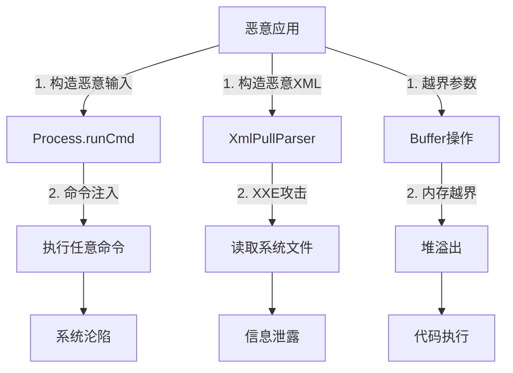
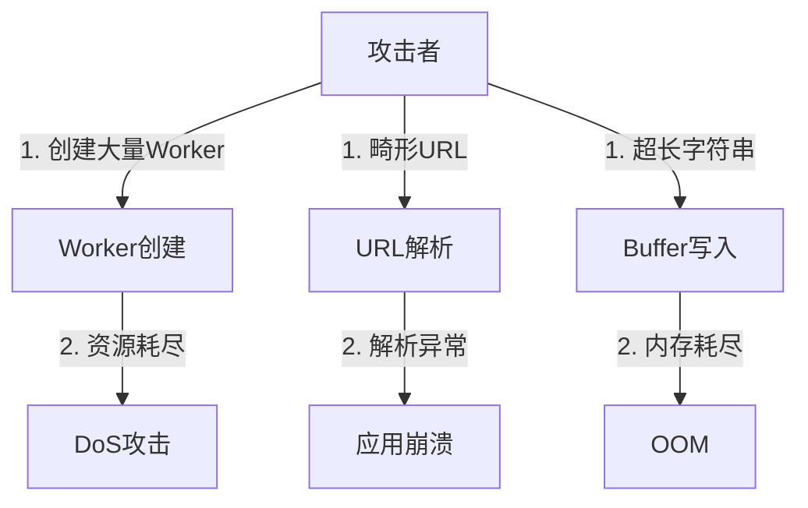

# 攻击面分析

> 外部输入清单、敏感操作清单与信任边界图

**文档版本**: 1.0  
**更新日期**: 2026-02-07  
**适用范围**: ets_utils 组件安全分析

---

## 1. 信任边界图

### 1.1 系统边界

```
┌─────────────────────────────────────────────────────────────────────┐
│                           应用沙箱 (不可信)                           │
│  ┌──────────────┐  ┌──────────────┐  ┌──────────────┐              │
│  │   用户应用    │  │   系统应用    │  │   测试代码    │              │
│  └──────┬───────┘  └──────┬───────┘  └──────┬───────┘              │
└─────────┼────────────────┼────────────────┼───────────────────────┘
          │ JS API 调用     │                │
          ▼                ▼                ▼
┌─────────────────────────────────────────────────────────────────────┐
│                      ets_utils N-API 层 (半可信)                      │
│  ┌──────────────┐  ┌──────────────┐  ┌──────────────┐              │
│  │  参数解析    │  │  类型检查    │  │  错误处理    │              │
│  └──────┬───────┘  └──────┬───────┘  └──────┬───────┘              │
└─────────┼────────────────┼────────────────┼───────────────────────┘
          │                │                │
          ▼                ▼                ▼
┌─────────────────────────────────────────────────────────────────────┐
│                      Native 实现层 (可信)                             │
│  ┌──────────────┐  ┌──────────────┐  ┌──────────────┐              │
│  │  Buffer管理  │  │  XML解析     │  │  进程操作    │              │
│  └──────┬───────┘  └──────┬───────┘  └──────┬───────┘              │
└─────────┼────────────────┼────────────────┼───────────────────────┘
          │                │                │
          ▼                ▼                ▼
┌─────────────────────────────────────────────────────────────────────┐
│                      OpenHarmony 系统服务 (可信)                       │
│  ┌──────────────┐  ┌──────────────┐  ┌──────────────┐              │
│  │   日志系统    │  │   进程管理    │  │   内存管理    │              │
│  └──────────────┘  └──────────────┘  └──────────────┘              │
└─────────────────────────────────────────────────────────────────────┘
```

### 1.2 数据流信任边界

```
用户输入 (不可信)
    ↓
┌─────────────────────────────────────┐
│ 边界 1: N-API 参数解析              │ ← 第一道防线
│ • 类型检查 (napi_typeof)            │
│ • 空值检查                          │
│ • 范围校验                          │
└─────────────────────────────────────┘
    ↓
┌─────────────────────────────────────┐
│ 边界 2: Native 业务逻辑             │ ← 第二道防线
│ • 输入规范化                        │
│ • 边界检查                          │
│ • 权限验证                          │
└─────────────────────────────────────┘
    ↓
系统资源 (可信)
```

---

## 2. 外部输入清单

### 2.1 N-API 参数输入 (直接输入)

| 模块 | API | 参数类型 | 风险 | 代码位置 |
|------|-----|---------|------|----------|
| **URL** | `new URL(input, base)` | string | 格式注入 | `js_api_module/url/js_url.cpp:45` |
| **URL** | `URLSearchParams.append(name, value)` | string | 数据污染 | `js_api_module/url/js_url.cpp:120` |
| **URI** | `new URI(str)` | string | 格式注入 | `js_api_module/uri/js_uri.cpp:38` |
| **Buffer** | `buffer.alloc(size)` | number | 整数溢出 | `js_api_module/buffer/js_buffer.cpp:156` |
| **Buffer** | `buf.write(str, offset, len)` | string/number | 越界写入 | `js_api_module/buffer/js_buffer.cpp:320` |
| **Buffer** | `buf.read*(offset)` | number | 越界读取 | `js_api_module/buffer/js_buffer.cpp:450` |
| **Blob** | `new Blob(sources)` | Array | 资源耗尽 | `js_api_module/buffer/js_blob.cpp:67` |
| **XML** | `new XmlPullParser(buffer)` | ArrayBuffer | XXE 注入 | `js_api_module/xml/js_xml.cpp:89` |
| **XML** | `XmlSerializer.setText(text)` | string | XML 注入 | `js_api_module/xml/js_xml.cpp:245` |
| **ConvertXML** | `convert(xml, options)` | string/object | 数据注入 | `js_api_module/convertxml/js_convertxml.cpp:56` |

### 2.2 外部数据输入 (间接输入)

| 模块 | 数据来源 | 风险 | 代码位置 |
|------|---------|------|----------|
| **Process** | 环境变量 | 信息泄露 | `js_sys_module/process/js_process.cpp:234` |
| **Process** | 命令行参数 | 命令注入 | `js_sys_module/process/js_childprocess.cpp:89` |
| **Process** | 工作目录 | 路径遍历 | `js_sys_module/process/js_process.cpp:156` |
| **Worker** | 脚本 URL | 代码执行 | `js_concurrent_module/worker/worker.cpp:178` |
| **Worker** | postMessage 数据 | 序列化攻击 | `js_concurrent_module/worker/worker.cpp:320` |
| **TextDecoder** | 字节流数据 | 编码攻击 | `js_util_module/util/js_textdecoder.cpp:112` |
| **Base64** | 编码字符串 | 格式错误 | `js_util_module/util/js_base64.cpp:78` |

### 2.3 配置输入

| 配置项 | 影响 | 代码位置 |
|--------|------|----------|
| `ets_utils_stacksize_low_enable` | Worker 栈大小 | `ets_utils_config.gni:18` |
| `bundle.json` deps | 依赖安全 | `bundle.json:50-73` |
| `hisysevent.yaml` | 事件监控 | `hisysevent.yaml` |

---

## 3. 敏感操作清单

### 3.1 系统调用

| 模块 | 操作 | 系统调用 | 风险等级 | 代码位置 |
|------|------|---------|---------|----------|
| **Process** | 创建子进程 | `fork()`/`exec()` | 🔴 高 | `js_sys_module/process/js_childprocess.cpp:145` |
| **Process** | 发送信号 | `kill()` | 🔴 高 | `js_sys_module/process/js_process.cpp:289` |
| **Process** | 切换目录 | `chdir()` | 🟡 中 | `js_sys_module/process/js_process.cpp:156` |
| **Process** | 读取环境变量 | `getenv()` | 🟢 低 | `js_sys_module/process/js_process.cpp:234` |
| **Timer** | 创建定时器 | `timer_create()` | 🟡 中 | `js_sys_module/timer/sys_timer.cpp:78` |

### 3.2 内存操作

| 模块 | 操作 | 风险 | 代码位置 |
|------|------|------|----------|
| **Buffer** | 内存分配 | 整数溢出 → 堆溢出 | `js_api_module/buffer/js_buffer.cpp:156` |
| **Buffer** | 内存拷贝 | 越界读写 | `js_api_module/buffer/js_buffer.cpp:200` |
| **Buffer** | 内存共享 | UAF/双重释放 | `js_api_module/buffer/js_buffer.cpp:320` |
| **FastBuffer** | 直接内存访问 | 野指针 | `js_api_module/fastbuffer/*.cpp` |
| **Blob** | 大对象分配 | 资源耗尽 | `js_api_module/buffer/js_blob.cpp:89` |

### 3.3 线程/并发操作

| 模块 | 操作 | 风险 | 代码位置 |
|------|------|------|----------|
| **Worker** | 创建线程 | 资源耗尽 | `js_concurrent_module/worker/worker.cpp:156` |
| **Worker** | 消息传递 | 数据竞争 | `js_concurrent_module/worker/message_queue.cpp:67` |
| **TaskPool** | 任务调度 | 死锁 | `js_concurrent_module/taskpool/taskpool.cpp:234` |
| **AsyncLock** | 锁操作 | 死锁/优先级反转 | `js_concurrent_module/utils/locks/async_lock.cpp:112` |

### 3.4 文件/网络操作

| 模块 | 操作 | 风险 | 代码位置 |
|------|------|------|----------|
| **Process.runCmd** | 执行命令 | 命令注入 | `js_sys_module/process/js_childprocess.cpp:89` |
| **Worker** | 加载脚本 | 代码执行 | `js_concurrent_module/worker/worker.cpp:178` |
| **XML** | 解析外部实体 | XXE | `js_api_module/xml/js_xml.cpp:156` |
| **URL** | 解析 URL | SSRF | `js_api_module/url/js_url.cpp:89` |

---

## 4. 攻击向量分析

### 4.1 高危攻击向量



### 4.2 中危攻击向量



---

## 5. 输入处理检查表

### 5.1 输入验证检查点

| 检查点 | 要求 | 状态 | 代码证据 |
|--------|------|------|----------|
| **类型检查** | 使用 napi_typeof 验证参数类型 | ✅ | 所有 native_module_*.cpp |
| **空值检查** | 检查 nullptr/undefined | ✅ | 常见模式 |
| **范围检查** | 验证数值范围 | ⚠️ | Buffer 部分缺失 |
| **长度限制** | 限制字符串/缓冲区大小 | ⚠️ | 部分缺失 |
| **格式验证** | 验证 URL/XML 格式 | ⚠️ | URL 部分缺失 |
| **编码检查** | 验证字符编码 | ✅ | TextDecoder 有检查 |

### 5.2 边界检查清单

| 模块 | API | 边界检查 | 证据 |
|------|-----|---------|------|
| Buffer.alloc | 大小参数 | ⚠️ 不完整 | `js_buffer.cpp:156` |
| Buffer.write | 偏移+长度 | ⚠️ 不完整 | `js_buffer.cpp:320` |
| Buffer.read | 偏移参数 | ⚠️ 不完整 | `js_buffer.cpp:450` |
| URL 构造 | 字符串长度 | ❌ 缺失 | `js_url.cpp:45` |
| XML 解析 | 缓冲区大小 | ✅ 有检查 | `js_xml.cpp:89` |
| Worker 创建 | 数量限制 | ❌ 缺失 | `worker.cpp:156` |

---

## 6. 攻击面统计

### 6.1 按模块统计

| 模块 | 外部输入点 | 敏感操作 | 风险等级 |
|------|-----------|---------|---------|
| **js_api_module** | 45+ | 15+ | 🔴 高 |
| **js_util_module** | 30+ | 8+ | 🟡 中 |
| **js_sys_module** | 20+ | 12+ | 🔴 高 |
| **js_concurrent_module** | 15+ | 18+ | 🔴 高 |

### 6.2 按风险类型统计

| 风险类型 | 数量 | 主要模块 |
|---------|------|----------|
| 输入验证缺陷 | 25+ | Buffer, URL, XML |
| 内存安全问题 | 12+ | Buffer, FastBuffer |
| 权限/鉴权 | 8+ | Process, Worker |
| 并发安全 | 10+ | Worker, TaskPool |
| 逻辑漏洞 | 6+ | Process, Timer |

---

## 7. 安全测试建议

### 7.1  fuzzing 目标

| 优先级 | 目标 API | 策略 |
|--------|---------|------|
| P0 | `Buffer.alloc/write/read` | 变异大小参数 |
| P0 | `Process.runCmd` | 变异命令字符串 |
| P0 | `XmlPullParser` | XML 变异 |
| P1 | `URL` 构造 | URL 格式变异 |
| P1 | `Worker` 创建 | 脚本路径变异 |

### 7.2 静态分析重点

| 工具 | 检查项 | 目标文件 |
|------|--------|----------|
| CodeQL | 缓冲区溢出 | `js_buffer.cpp` |
| Coverity | 命令注入 | `js_childprocess.cpp` |
| Clang Static Analyzer | 内存安全 | 所有 .cpp 文件 |

---

*文档版本: 1.0*  
*最后更新: 2026-02-07*
