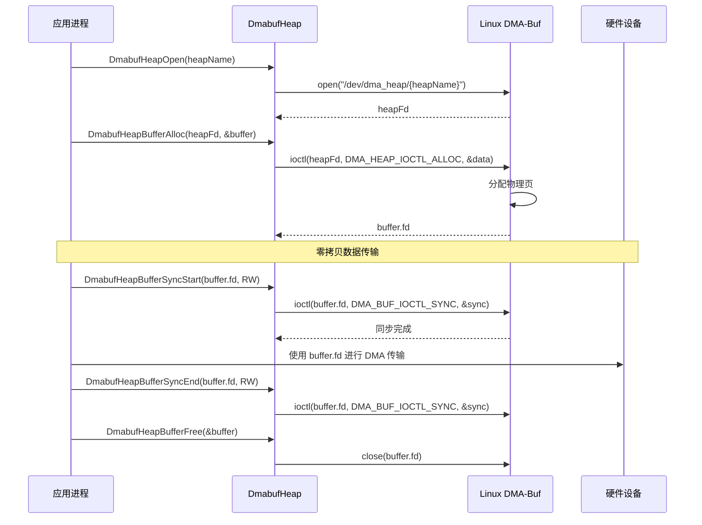
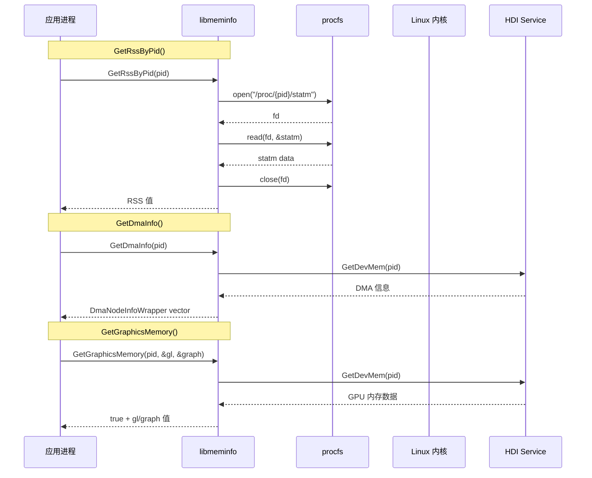
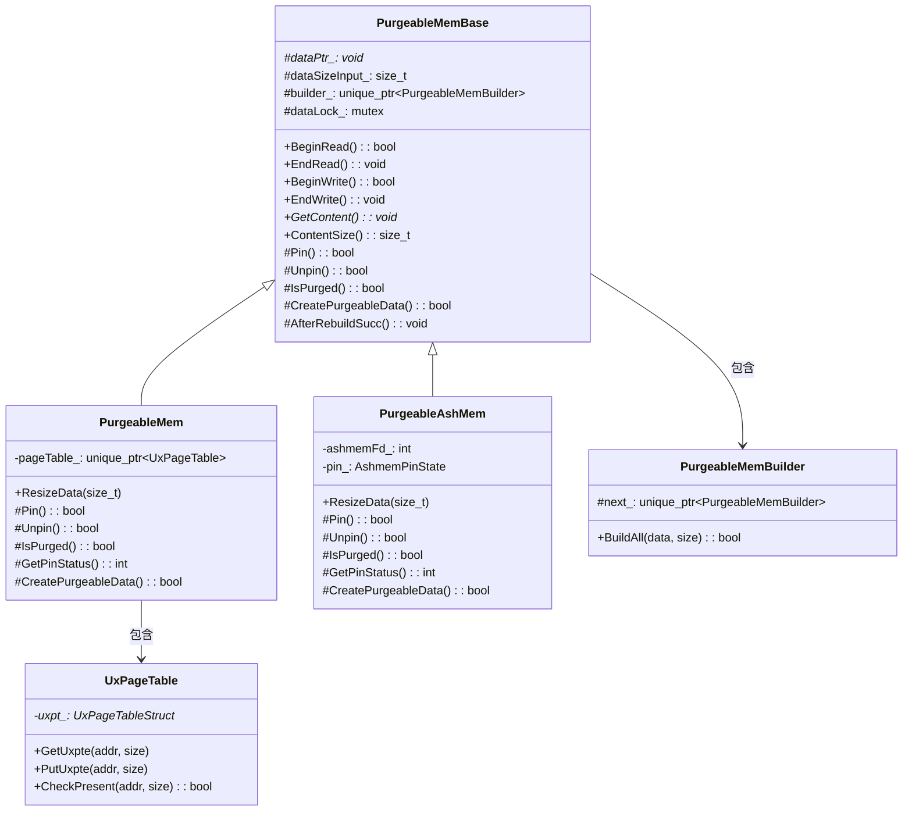
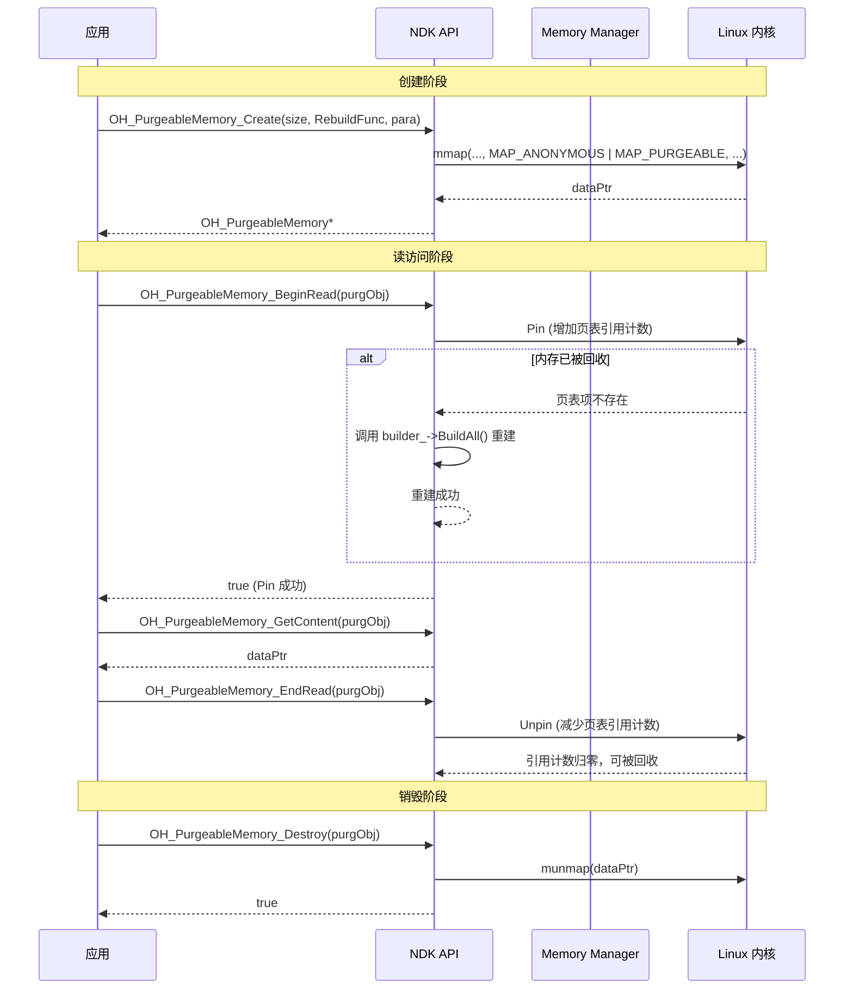
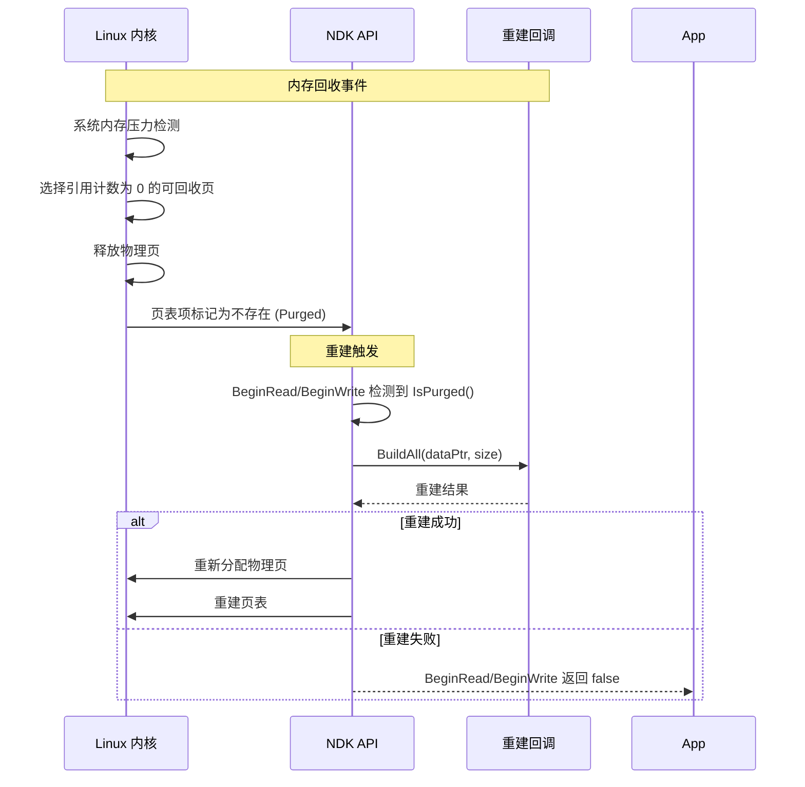

# 架构说明

本文档描述 memory_utils 各模块的架构设计，包括组件图、数据流、线程模型和关键时序。

---

## 整体架构

### 架构图

```
┌─────────────────────────────────────────────────────────────────────────┐
│                          应用层 (Application Layer)                      │
│   ┌──────────────┐  ┌──────────────┐  ┌──────────────┐  ┌──────────┐  │
│   │ 多媒体服务    │  │ 图形图像服务  │  │ 内存管理服务  │  │ 系统服务 │  │
│   └──────┬───────┘  └──────┬───────┘  └──────┬───────┘  └────┬─────┘  │
└──────────┼─────────────────┼─────────────────┼────────────────┼─────────┘
           │                 │                 │                │
           ▼                 ▼                 ▼                ▼
┌─────────────────────────────────────────────────────────────────────────┐
│                        Native 层 (memory_utils)                          │
│                                                                          │
│  ┌─────────────────┐  ┌─────────────────┐  ┌─────────────────┐         │
│  │  libdmabufheap  │  │   libmeminfo    │  │  libpurgeablemem│         │
│  │                 │  │                 │  │                 │         │
│  │  DMA 缓冲区分配 │  │  内存信息查询   │  │  可回收内存管理  │         │
│  │  零拷贝共享     │  │  RSS/PSS/Swap   │  │  匿名/Ashmem    │         │
│  └────────┬────────┘  └────────┬────────┘  └────────┬────────┘         │
└───────────┼────────────────────┼─────────────────────┼───────────────────┘
            │                    │                     │
            ▼                    ▼                     ▼
┌─────────────────────────────────────────────────────────────────────────┐
│                          内核层 (Kernel Layer)                           │
│                                                                          │
│  ┌─────────────────┐  ┌─────────────────┐  ┌─────────────────┐         │
│  │   DMA-Buf       │  │     procfs      │  │  MAP_PURGEABLE  │         │
│  │   /dev/dma_heap │  │   /proc/*       │  │  Ashmem Driver  │         │
│  └─────────────────┘  └─────────────────┘  └─────────────────┘         │
└─────────────────────────────────────────────────────────────────────────┘
```

### 架构说明

| 层级 | 组件 | 职责 |
|------|------|------|
| **应用层** | 多媒体/图形/系统服务 | 内存操作的发起方 |
| **Native 层** | memory_utils | 提供统一的内存操作接口 |
| **内核层** | DMA-Buf/procfs/Ashmem | 提供底层内存管理能力 |

---

## libdmabufheap 架构

### 组件图

```
┌─────────────────────────────────────────────────────────────────┐
│                      libdmabufheap 架构                          │
├─────────────────────────────────────────────────────────────────┤
│                                                                  │
│   ┌─────────────────┐                                           │
│   │   应用进程       │                                           │
│   └────────┬────────┘                                           │
│            │                                                    │
│            ▼                                                    │
│   ┌─────────────────────────────────────────┐                 │
│   │           dmabuf_alloc.h                │                 │
│   │  DmabufHeapOpen/Close/Alloc/Free/Sync │                 │
│   └────────────────┬────────────────────────┘                 │
│                    │                                            │
│   ┌────────────────┴────────────────┐                         │
│   │                                 │                         │
│   ▼                                 ▼                         │
│   ┌─────────────────┐    ┌─────────────────┐                 │
│   │  C 接口实现     │    │  C++ 接口实现   │                 │
│   │ dmabuf_alloc.c  │    │   (如有)        │                 │
│   └────────┬────────┘    └─────────────────┘                 │
│            │                                                   │
│   ┌────────┴────────┐                                           │
│   │                 │                                           │
│   ▼                 ▼                                           │
│   ┌─────────────────┐    ┌─────────────────┐                  │
│   │ open()         │    │ ioctl()         │                  │
│   │ /dev/dma_heap/ │    │ DMA_HEAP_IOCTL  │                  │
│   │ {heapName}     │    │ _ALLOC          │                  │
│   └────────┬────────┘    └────────┬────────┘                  │
│            │                       │                            │
│            └───────────────────────┘                            │
│                         │                                        │
│                         ▼                                        │
│            ┌────────────────────────┐                          │
│            │   Linux DMA-Buf 子系统  │                          │
│            │   /dev/dma_heap/*      │                          │
│            └────────────────────────┘                          │
│                                                                  │
└─────────────────────────────────────────────────────────────────┘
```

### 关键数据结构

```c
// dmabuf_alloc.h:38-42
typedef struct {
    unsigned int fd;      // DMA buffer 文件描述符
    size_t size;          // 缓冲区大小
    __u64 heapFlags;      // 堆标志（用于所有者标识）
} DmabufHeapBuffer;

// dmabuf_alloc.h:44-49
enum DmaHeapFlagOwnerId {
    DMA_OWNER_DEFAULT,    // 默认所有者
    DMA_OWNER_GPU,        // GPU
    DMA_OWNER_MEDIA_CODEC,// 媒体编解码器
};
```

**证据来源**: `libdmabufheap/include/dmabuf_alloc.h:38-49`

### 数据流

```
┌──────────┐    open()     ┌──────────────┐    ioctl()     ┌─────────────┐
│  应用    │ ───────────► │ /dev/dma_heap│ ───────────► │ DMA 堆驱动  │
│          │               │ /{heapName}   │               │             │
└──────────┘               └──────────────┘               └─────────────┘
                              │                                   │
                              │ ioctl()                           │
                              │ DMA_BUF_IOCTL                     │
                              │ _SYNC                             │
                              ▼                                   │
                        ┌──────────────┐                          │
                        │ DMA Buffer   │                          │
                        │ (/fd)        │                          │
                        └──────────────┘                          │
```

### 时序图



### 线程模型

| 特性 | 说明 |
|------|------|
| **线程安全** | 无内部锁，依赖 DMA 堆驱动的并发安全 |
| **锁粒度** | 无（纯函数设计） |
| **适用场景** | 多线程调用安全 |

---

## libmeminfo 架构

### 组件图

```
┌─────────────────────────────────────────────────────────────────┐
│                      libmeminfo 架构                             │
├─────────────────────────────────────────────────────────────────┤
│                                                                  │
│   ┌─────────────────┐                                           │
│   │   应用进程       │                                           │
│   └────────┬────────┘                                           │
│            │                                                    │
│            ▼                                                    │
│   ┌─────────────────────────────────────────┐                 │
│   │              meminfo.h                   │                 │
│   │  GetRssByPid/GetPssByPid/GetDmaInfo... │                 │
│   └────────────────┬────────────────────────┘                 │
│                    │                                            │
│   ┌────────────────┴────────────────┐                         │
│   │                                 │                         │
│   ▼                                 ▼                         │
│   ┌─────────────────┐    ┌─────────────────┐                 │
│   │  procfs 读取    │    │  HDI 调用      │                 │
│   │ /proc/{pid}/*   │    │ MemoryTracker  │                 │
│   └────────┬────────┘    └────────┬────────┘                 │
│            │                       │                          │
│            └───────────────────────┘                          │
│                         │                                      │
│   ┌─────────────────────┴─────────────────────┐              │
│   │                                         │              │
│   ▼                                         ▼              │
│   ┌─────────────────┐           ┌─────────────────┐        │
│   │   /proc/statm   │           │  HDI            │        │
│   │   /proc/smaps   │           │  MemoryTracker  │        │
│   │   _rollup       │           │  GetDevMem()    │        │
│   └─────────────────┘           └─────────────────┘        │
│                                                                  │
└─────────────────────────────────────────────────────────────────┘
```

### 关键数据结构

```cpp
// meminfo.h:27-49
struct DmaNodeInfo {
    char process[MAX_STRING_LEN];
    int process_size;
    int pid;
    int fd;
    int64_t size_bytes;
    int64_t ino;
    // ... 更多字段
};

struct DmaNodeInfoWrapper {
    std::string process;
    int pid, fd;
    int64_t size_bytes, ino;
    bool can_reclaim, is_reclaim;
    std::string buf_name, buf_type, leak_type;
    // ...
};
```

**证据来源**: `libmeminfo/include/meminfo.h:27-85`

### 数据流

```
┌──────────┐    GetRssByPid()    ┌──────────┐    open()    ┌──────────┐
│  应用    │ ──────────────────► │ libmeminfo│ ──────────► │ /proc/*  │
└──────────┘                     └──────────┘              └──────────┘
                                                                │
                                                                │ read()
                                                                ▼
                                                         ┌──────────┐
                                                         │ procfs   │
                                                         │ 内核接口 │
                                                         └──────────┘

┌──────────┐    GetGraphicsMemory()  ┌──────────┐    HDI Call  ┌──────────┐
│  应用    │ ───────────────────────► │ libmeminfo│ ──────────► │ HDI      │
└──────────┘                         └──────────┘             │ Service  │
                                                                └──────────┘
```

### 时序图



### 线程模型

| 特性 | 说明 |
|------|------|
| **线程安全** | 无状态设计，纯查询接口 |
| **锁** | 无 |
| **适用场景** | 多线程并发查询 |

---

## libpurgeablemem 架构

### 组件图

```
┌─────────────────────────────────────────────────────────────────────────┐
│                      libpurgeablemem 架构                               │
├─────────────────────────────────────────────────────────────────────────┤
│                                                                          │
│   ┌─────────────────────────────────────────────────────────────────┐  │
│   │                      应用进程                                     │  │
│   └─────────────────────────────┬───────────────────────────────────┘  │
│                                 │                                        │
│                                 ▼                                        │
│   ┌─────────────────────────────────────────────────────────────────┐  │
│   │                      NDK 接口层                                   │  │
│   │   purgeable_memory.h (C 接口)                                    │  │
│   │   OH_PurgeableMemory_Create/Destroy/BeginRead/EndRead...       │  │
│   └─────────────────────────────┬───────────────────────────────────┘  │
│                                 │                                        │
│   ┌─────────────────────────────┴───────────────────────────────────┐  │
│   │                            │                                      │
│   ▼                            ▼                                      │
│   ┌─────────────────┐    ┌─────────────────┐                         │
│   │  C 接口实现     │    │  C++ 接口实现   │                         │
│   │ purgeable_      │    │ PurgeableMem    │                         │
│   │ memory.c        │    │ PurgeableAshMem │                         │
│   └────────┬────────┘    └────────┬────────┘                         │
│            │                      │                                    │
│   ┌────────┴────────┐    ┌────────┴────────┐                         │
│   │ pthread_rwlock  │    │ std::mutex      │                         │
│   │ 读写锁          │    │ 互斥锁          │                         │
│   └─────────────────┘    └─────────────────┘                         │
│                                                                          │
└─────────────────────────────────────────────────────────────────────────┘
```

### 继承关系图



### 关键数据结构

**C++ 层**:

```cpp
// purgeable_mem_base.h
class PurgeableMemBase {
protected:
    void *dataPtr_ = nullptr;                    // mmap 映射的内存地址
    std::mutex dataLock_;                        // 保护数据访问的互斥锁
    size_t dataSizeInput_ = 0;                   // 用户请求的数据大小
    std::unique_ptr<PurgeableMemBuilder> builder_; // 数据重建器链
    unsigned int buildDataCount_ = 0;            // 重建次数统计
    bool isDataValid_ {true};
};
```

**C 层**:

```c
// purgeable_mem_c.h
struct PurgMem {
    void *dataPtr;
    size_t dataSizeInput;
    struct PurgMemBuilder *builder;
    UxPageTableStruct *uxPageTable;
    pthread_rwlock_t rwlock;      // C 层使用读写锁
    unsigned int buildDataCount;
};
```

**证据来源**: `libpurgeablemem/cpp/include/purgeable_mem_base.h`, `libpurgeablemem/c/src/purgeable_mem_c.c`

### 数据流

```
┌──────────┐    Create()     ┌──────────┐    mmap()    ┌──────────────┐
│  应用    │ ───────────────► │  NDK/C++ │ ───────────► │ MAP_PURGEABLE│
└──────────┘                  └──────────┘              │ / Ashmem     │
                                                         └──────────────┘
                                                               │
                                                               │ 内存不足时
                                                               ▼
                                                         ┌──────────┐
                                                         │ 内核回收  │
                                                         │ 触发重建  │
                                                         └──────────┘
                                                               │
                                                               │ BuildAll()
                                                               ▼
                                                         ┌──────────┐
                                                         │ Builder   │
                                                         │ 回调      │
                                                         └──────────┘
```

### 线程模型

#### C++ 层

| 同步机制 | 类型 | 说明 |
|----------|------|------|
| `std::mutex dataLock_` | 互斥锁 | 保护所有数据访问操作 |
| 锁范围 | BeginRead/EndRead ~ BeginWrite/EndWrite | 读/写期间持有锁 |

#### C 层

| 同步机制 | 类型 | 说明 |
|----------|------|------|
| `pthread_rwlock_t rwlock` | 读写锁 | 支持多读者并发，单写者独占 |
| 读锁 | `pthread_rwlock_rdlock()` | 多个读者可并发访问 |
| 写锁 | `pthread_rwlock_wrlock()` | 写入时独占访问 |

#### 页表操作（无锁）

```c
// 使用 CAS 原子操作
static void UxpteAdd(uxpte_t *pte, size_t incNum) {
    do {
        old = UxpteLoad(pte);
        if (IsUxpteUnderReclaim(old)) {
            sched_yield();  // 正在被回收，让出 CPU
            continue;
        }
        newVal = old + incNum;
    } while (!UxpteCAS_(pte, old, newVal));  // CAS 直到成功
}
```

### 时序图

#### 创建与使用



#### 内存回收与重建



---

## 状态码定义

```c
// pm_state_c.h
typedef enum {
    PM_OK = 0,                       // 成功
    PM_MMAP_PURG_FAIL,               // mmap 可回收内存失败
    PM_MMAP_UXPT_FAIL,               // 用户页表分配失败
    PM_UXPT_OUT_RANGE,               // 地址越界
    PM_UXPT_NO_PRESENT,              // 页表项不存在（已被回收）
    PM_LOCK_READ_FAIL,               // 读锁获取失败
    PMB_BUILD_ALL_FAIL,              // 数据重建失败
    // ... 共 21 种状态
} PMState;
```

**证据来源**: `libpurgeablemem/common/include/pm_state_c.h`

---

## 依赖关系

### libdmabufheap 依赖

| 依赖类型 | 依赖项 | 用途 |
|----------|--------|------|
| 系统库 | libc | 标准 C 库 |
| 内核接口 | linux/dma-buf.h | DMA-Buf 定义 |
| 内核接口 | linux/dma-heap.h | DMA 堆定义 |
| OpenHarmony | c_utils:utils | 工具库 |
| OpenHarmony | hilog:libhilog | 日志 |

### libmeminfo 依赖

| 依赖类型 | 依赖项 | 用途 |
|----------|--------|------|
| 系统库 | libc | 标准 C 库 |
| OpenHarmony | c_utils:utils | 工具库 |
| OpenHarmony | hilog:libhilog | 日志 |
| OpenHarmony | drivers_interface_memorytracker | GPU 内存追踪接口 |

### libpurgeablemem 依赖

| 依赖类型 | 依赖项 | 用途 |
|----------|--------|------|
| 系统库 | libc | 标准 C 库 |
| 系统库 | libpthread | 线程库 |
| OpenHarmony | c_utils:utils | 工具库 |
| OpenHarmony | hilog:libhilog | 日志 |
| OpenHarmony | hitrace:hitrace_meter | 追踪 |
| OpenHarmony | init:libbegetutil | 初始化工具 |
| OpenHarmony | ipc:ipc_core | 进程间通信 |

---

**最后更新**: 2026-02-06
