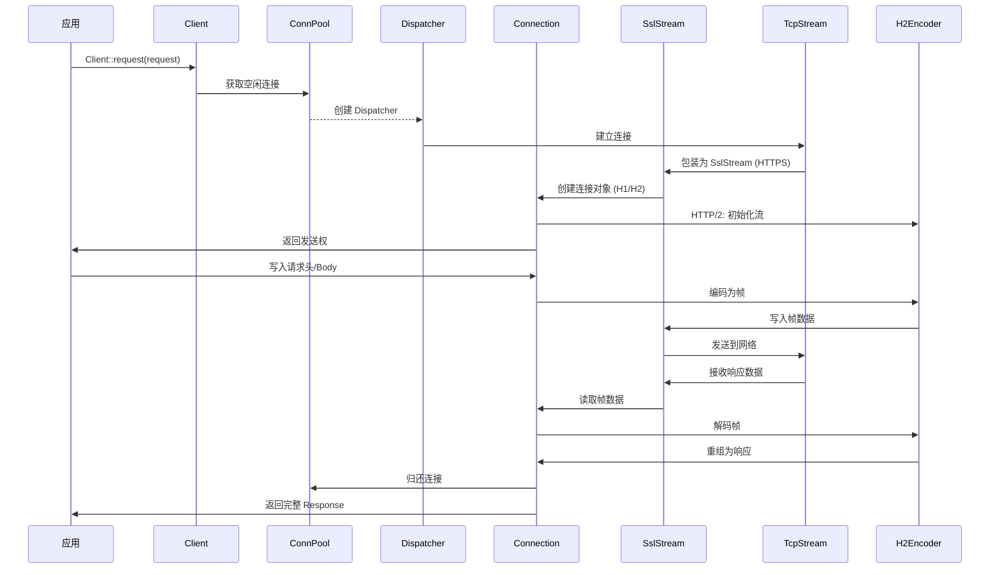
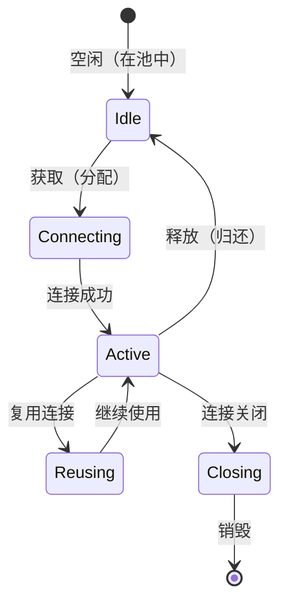

# 架构说明

> 本文档详细说明 ylong_http 的架构设计、组件交互、数据流和线程模型

---

## 目的

本文档的目的是让读者在 30 分钟内理解：
- 项目的整体架构设计
- 组件之间的交互方式
- 数据流和请求处理流程
- 线程模型和并发机制
- 资源生命周期管理

## 适用范围

- ylong_http 和 ylong_http_client 的架构设计
- 同步和异步实现的差异

---

## 关键结论

### 1. 架构分层

```
┌─────────────────────────────────────────────────────────────────┐
│                  应用层 (Application)                 │
│                                                        │
│  ┌──────────────────────────────────────────────────────┐  │
│  │      HTTP 客户端 (ylong_http_client)         │  │
│  │                                            │  │
│  │  ┌────────────────────────────────────┐         │  │
│  │  │  客户端 API 层           │         │  │
│  │  │  - Client                   │         │  │
│  │  │  - ClientBuilder            │         │  │
│  │  │  - Request/Response 接口      │         │  │
│  │  └────────┬─────────────────┘         │  │
│  │             │                           │  │
│  │  ┌─────────────────────────────┐         │  │
│  │  │  连接管理层              │         │  │
│  │  │  - ConnPool              │         │  │
│  │  │  - Dispatcher            │         │  │
│  │  │  - Connector              │         │  │
│  │  └────────┬─────────────────┘         │  │
│  │             │                           │  │
│  │  ┌─────────────────────────────┐         │  │
│  │  │  协议适配层              │         │  │
│  │  │  - H1Conn / H2Conn        │         │  │
│  │  └────────┬─────────────────┘         │  │
│  │             │                           │  │
│  │  ┌─────────────────────────────┐         │  │
│  │  │  TLS 层                  │         │  │
│  │  │  - SslStream               │         │  │
│  │  └────────┬─────────────────┘         │  │
│  │             │                           │  │
│  │  ┌─────────────────────────────┐         │  │
│  │  │  传输层                  │         │  │
│  │  │  - TcpStream              │         │  │
│  │  └────────┬─────────────────┘         │  │
│  │             │                           │  │
│  │             ▼                           │  │
│  │  ┌─────────────────────────────┐         │  │
│  │  │  HTTP 协议层              │         │  │
│  │  │  - RequestEncoder          │         │  │
│  │  │  - ResponseDecoder         │         │  │
│  │  │  - FrameEncoder/Decoder     │         │  │
│  │  └─────────────────────────────┘         │  │
│  └──────────────────────────────────────────────┘         │
│                                                        │
└─────────────────────────────────────────────────────────────┘
```

**证据**:
- `ylong_http_client/src/lib.rs:14-41` - API 层导出
- `ylong_http_client/src/async_impl/client.rs:72` - ConnPool 使用
- `ylong_http_client/src/util/dispatcher.rs` - Dispatcher 实现

### 2. 请求处理流程（异步客户端）



**证据**:
- `ylong_http_client/src/async_impl/client.rs` - Client::request 方法
- `ylong_http_client/src/async_impl/pool.rs` - ConnPool::get 方法
- `ylong_http_client/src/util/dispatcher.rs` - Dispatcher 实现

### 3. 连接池管理

**职责**：复用现有连接，减少 TCP/TLS 握手开销

**关键类型**：
- `ConnPool<C, S>` - 连接池泛型
  - `C`: Connector trait (负责创建连接)
  - `S`: Stream trait (TcpStream 或 SslStream)

**核心方法**：
```rust
impl<C: Connector, S: Stream> ConnPool<C, S> {
    // 从池中获取空闲连接
    async fn get(&self, uri: &Uri) -> Result<Connection<C, S>, HttpClientError>;

    // 连接使用完毕后归还
    fn release(&self, conn: Connection<C, S>);
}
```

**证据**: `ylong_http_client/src/util/pool.rs:37-60`

### 4. 调度器模式

**职责**：管理单个连接的生命周期，根据协议版本分发请求

**连接枚举**：
```rust
pub enum Conn<C, S> {
    Http(HttpConn<C>),
    #[cfg(feature = "http2")]
    H2(H2Conn<C, S>),
    #[cfg(feature = "http3")]
    H3(H3Conn<C, S>),
}
```

**证据**: `ylong_http_client/src/util/dispatcher.rs:60-80`

### 5. 线程模型

#### 5.1 异步客户端

**基于 ylong_runtime/tokio 的事件循环**：
- 使用 `spawn` 创建异步任务
- 使用 `mpsc channel` 进行任务间通信
- 使用 `Arc<Mutex>` 保护共享状态

**证据**:
- `ylong_http_client/src/lib.rs:69-114` - runtime 模块导入
- `ylong_http_client/src/async_impl/pool.rs` - 使用 `tokio::spawn`

#### 5.2 同步客户端

**阻塞式 I/O**：
- 直接在调用线程上执行网络 I/O
- 使用 `std::sync::Mutex` 保护连接池
- 无异步任务调度

**证据**:
- `ylong_http_client/src/sync_impl/pool.rs` - 使用 `std::sync::Mutex`

### 6. 资源生命周期

#### 6.1 连接生命周期



**关键接口**：
- `Stream` trait: `AsyncRead`, `AsyncWrite` (异步) / `Read`, `Write` (同步)
- `Drop` trait: 自动释放资源

**证据**:
- `ylong_http_client/src/async_impl/conn/mod.rs` - Conn 枚举和 Drop 实现

#### 6.2 错误传播机制

**统一错误处理**：
- `HttpClientError` 封装所有客户端错误
- `HttpError` 封装所有协议错误
- 使用 `Result<T, E>` 类型传播

**证据**:
- `ylong_http_client/src/error.rs:21-71` - HttpClientError 定义
- `ylong_http/src/error.rs:35-45` - HttpError 定义

### 7. HTTP/2 多路复用

**流标识**：
- 每个请求/响应分配唯一的流 ID
- 支持并发发送多个请求/响应

**证据**:
- `ylong_http/src/h2/encoder.rs` - 流 ID 分配逻辑
- `ylong_http/src/h2/frame.rs` - HEADERS/DATA 帧定义

### 8. TLS 集成

**OpenSSL FFI 封装**：
- `SslStream` 包装 OpenSSL SSL 对象
- 支持 ALPN 协商（h2, http/1.1）
- 支持证书验证和主机名验证

**证据**:
- `ylong_http_client/src/util/c_openssl/ssl/stream.rs:1` - `pub struct SslStream`
- `ylong_http_client/src/util/config/tls/alpn/mod.rs` - ALPN 配置

---

## 相关跳转

- **[目录结构与模块职责](02_Directory_Structure.md)** - 详细的模块划分
- **[对外 API](04_External_API.md)** - 公共 API 使用指南
- **[内部 API](05_Internal_API.md)** - 扩展点和 trait 定义

---

**文档版本**: 1.0
**作者**: Wiki 生成器（基于代码证据）
**最后更新**: 2026-02-06
