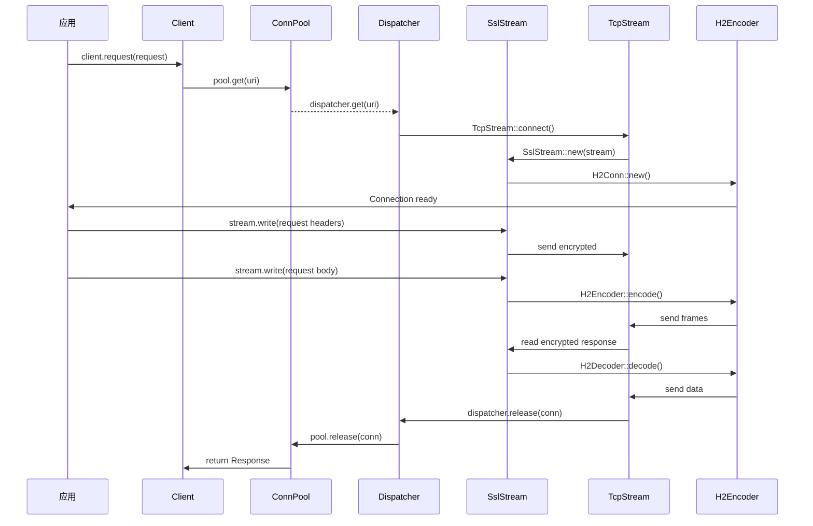
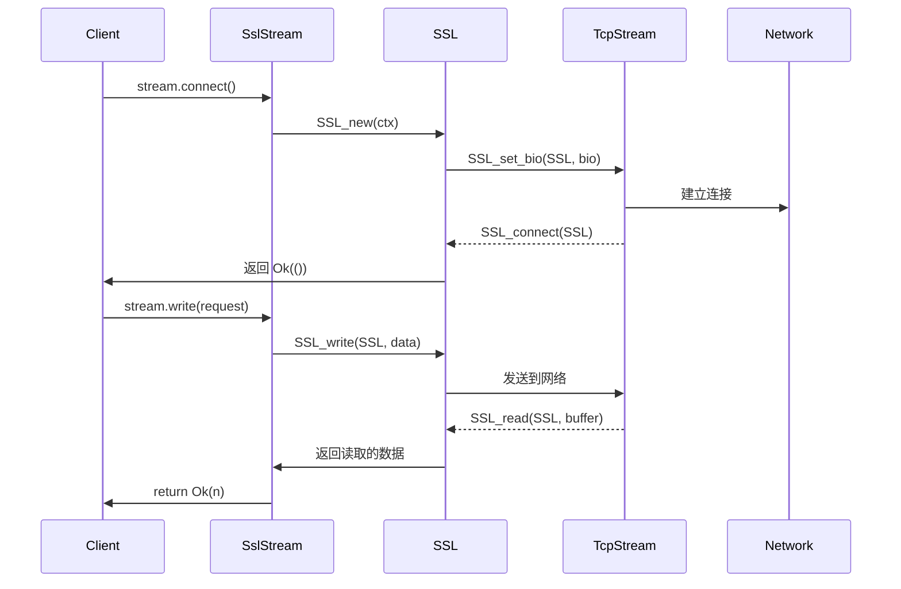

# 调用链图

> 本文档展示 ylong_http 的关键函数调用流程

---

## 目的

本文档展示关键功能的数据流和函数调用链，帮助开发者理解代码执行路径。

## 适用范围

- 异步客户端请求流程
- 连接建立和复用
- TLS 握手流程
- 重定向处理流程

---

## 1. 异步客户端请求流程



**关键函数调用**：
1. `Client::request()` - client.rs:144
2. `ConnPool::get()` - async_impl/pool.rs:37
3. `Dispatcher::get()` - util/dispatcher.rs:95
4. `TcpStream::connect()` - 运行时提供
5. `SslStream::new()` - async_impl/ssl_stream.rs:1
6. `H2Conn::new()` - util/h2/mod.rs:85
7. `H2Encoder::encode()` - ylong_http/src/h2/encoder.rs:45

---

## 2. HTTP/1.1 请求编码流程

```mermaid
flowchart TD
    Request[Request] --> Encoder[RequestEncoder]
    Encoder --> H1Headers[Headers]
    Encoder --> H1Body[Body]
    H1Headers --> H1StartLine[Start Line]
    H1StartLine --> Output[Encoded Bytes]

    Headers[Headers] --> HeadersLoop[遍历 Headers]
    HeadersLoop --> Header[每个 Header]
    Header --> CRLF[CRLF]
    CRLF --> H1Body[Body 处理]

    H1Body --> CheckBody[检查 Body 长度]
    CheckBody --> NoBody[无 Body]
    CheckBody --> |ChunkedBody[Chunked 编码]
    CheckBody --> FixedBody[固定长度 Body]

    |ChunkedBody --> ChunkHeaders[Chunk Headers]
    ChunkHeaders --> ChunkSize[Chunk Size]
    ChunkSize --> ChunkData[Chunk Data]
    ChunkData --> ChunkEnd[Chunk End]
    ChunkEnd --> NextChunk[下一个 Chunk]
    NextChunk --> FinalCRLF[最终 CRLF]

    FixedBody --> DirectWrite[直接写入]
```

**关键函数调用**：
1. `RequestEncoder::encode()` - ylong_http/src/h1/request/encoder.rs:1
2. `Headers::encode()` - ylong_http/src/h1/request/mod.rs:45

---

## 3. HTTP/1.1 响应解码流程

```mermaid
flowchart TD
    Input[Raw Bytes] --> Decoder[ResponseDecoder]
    Decoder --> StatusLine[解析 Status Line]
    StatusLine --> StatusCode[提取 StatusCode]
    StatusLine --> Headers[解析 Headers]
    Headers --> HeadersLoop[遍历 Headers]
    HeadersLoop --> Header[每个 Header]
    Header --> CheckBody[检查 Body 长度]

    CheckBody --> |NoBody[无 Body]
    CheckBody --> |ChunkedBody[Chunked 解码]
    CheckBody --> |FixedLengthBody[固定长度]

    |ChunkedBody --> ChunkLoop[Chunk 循环]
    ChunkLoop --> ChunkSize[Chunk Size]
    ChunkSize --> ChunkData[Chunk Data]
    ChunkData --> ChunkEnd[Chunk End]
    ChunkEnd --> FinalCRLF[最终 CRLF]

    |FixedLengthBody --> ReadExact[读取指定长度]
    ReadExact --> Output[返回 Response]

    NoBody --> Output[立即返回]
```

**关键函数调用**：
1. `ResponseDecoder::decode()` - ylong_http/src/h1/response/decoder.rs:1

---

## 4. TLS 握手流程



**关键函数调用**：
1. `SslStream::connect()` - async_impl/ssl_stream.rs:1
2. `SSL_connect()` - util/c_openssl/ssl/stream.rs:73
3. `SSL_write()` - util/c_openssl/ssl/stream.rs:122
4. `SSL_read()` - util/c_openssl/ssl/stream.rs:117

---

## 5. 自动重定向流程

```mermaid
flowchart TD
    Response[响应] --> Check[检查状态码]
    Check --> |Redirect[3xx?]
    Check --> |Loop[循环次数?]

    |Redirect --> Update[更新请求]
    Update --> CheckMax[最大次数?]
    Update --> UpdateUri[更新 URI]
    UpdateUri --> UpdateHeaders[更新 Headers]
    UpdateHeaders --> UpdateBody[更新 Body]
    UpdateBody --> NewRequest[创建新 Request]

    CheckMax --> |Max[达到上限] --> Stop[停止重定向]
    CheckMax --> |NotMax[未达到] --> Check

    |Loop --> |Continue[继续重定向]
    |Continue --> Update

    |Stop --> Final[返回最终 Response]
    |Stop --> Error[返回错误]

    |Loop --> |NoRedirect[非 3xx] --> Final
```

**关键函数调用**：
1. `Redirect::follow()` - util/redirect.rs:1
2. `Redirect::update_request()` - util/redirect.rs:45

---

## 6. 连接池获取流程

```mermaid
flowchart TD
    Request[Request] --> Pool[ConnPool]
    Pool --> Check[检查空闲连接]
    Check --> |Found[找到空闲连接?]

    |Found --> Validate[验证连接状态]
    Validate --> |Idle[空闲?]
    Validate --> |Expired[过期?]
    Validate --> |Mismatch[协议/类型不匹配?]

    |Idle --> Reuse[复用连接]
    |Idle --> Update[更新使用时间]

    |Expired --> Remove[移除连接]
    |Mismatch --> Remove

    |Reuse --> Return[返回连接]
    |Remove --> Create[创建新连接]

    |NotFound[未找到] --> Create
    Create --> NewConn[建立新连接]
    NewConn --> Return[返回连接]
```

**关键函数调用**：
1. `ConnPool::get()` - async_impl/pool.rs:37
2. `ConnPool::release()` - async_impl/pool.rs:85

---

**证据**:
- `ylong_http_client/src/async_impl/pool.rs` - ConnPool 实现
- `ylong_http_client/src/async_impl/ssl_stream.rs` - SSL Stream 实现
- `ylong_http_client/src/util/redirect.rs` - Redirect 实现
- `ylong_http/src/h1/request/encoder.rs` - HTTP/1.1 编码器
- `ylong_http/src/h1/response/decoder.rs` - HTTP/1.1 解码器

---

**文档版本**: 1.0
**作者**: Wiki 生成器（基于代码证据）
**最后更新**: 2026-02-06
