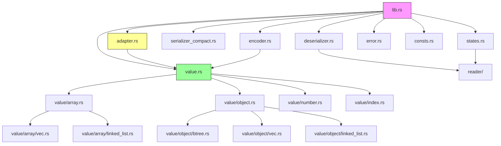
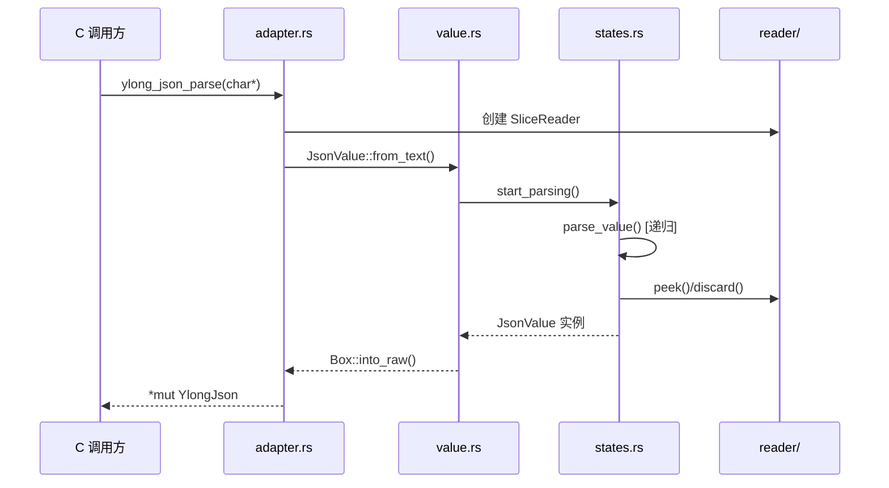
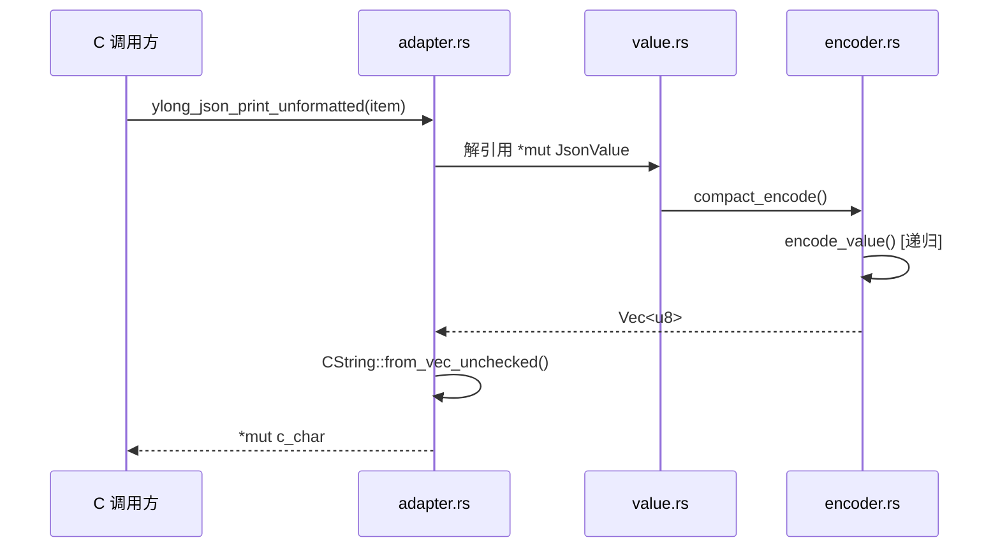
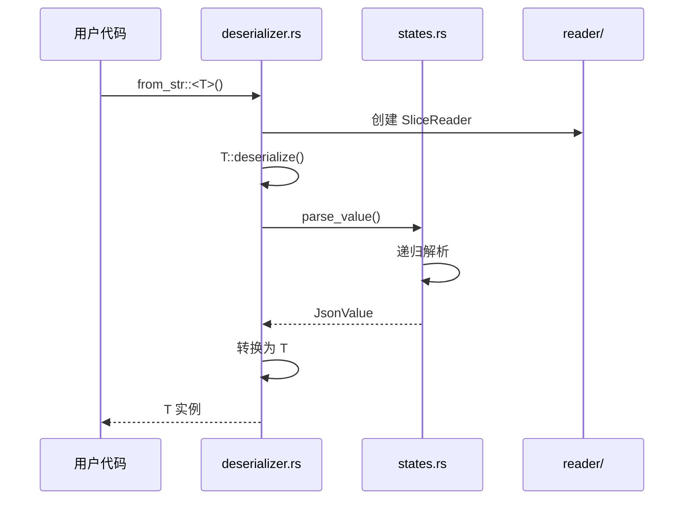

# ylong_json 架构说明

## 目的

本文档描述 `ylong_json` 的整体架构设计，包括组件关系、数据流、模块职责和关键时序。

## 适用范围

- 架构师和高级开发者
- 需要理解内部实现细节的开发者
- 安全审计人员

## 架构概览

ylong_json 采用分层架构设计，主要分为三个子模块：

1. **JsonValue 子模块**: 基础数据结构和操作
2. **Serde 子模块**: 第三方库集成，支持 Rust 结构体序列化
3. **C-FFI 子模块**: C 语言接口适配层

```
┌─────────────────────────────────────────────────────────────┐
│                        用户层                                │
│  ┌─────────────┐  ┌─────────────┐  ┌─────────────────────┐  │
│  │   C 代码     │  │  Rust 代码   │  │  Rust + Serde       │  │
│  └──────┬──────┘  └──────┬──────┘  └──────────┬──────────┘  │
└─────────┼────────────────┼────────────────────┼─────────────┘
          │                │                    │
          ▼                ▼                    ▼
┌─────────────────────────────────────────────────────────────┐
│                      接口层                                  │
│  ┌──────────────────┐  ┌──────────────────────────────────┐ │
│  │   C-FFI 接口      │  │         Rust Public API          │ │
│  │  (adapter.rs)    │  │     (lib.rs 导出)                 │ │
│  └────────┬─────────┘  └──────────────┬─────────────────────┘ │
└───────────┼───────────────────────────┼───────────────────────┘
            │                           │
            ▼                           ▼
┌─────────────────────────────────────────────────────────────┐
│                    核心实现层                                │
│  ┌──────────────┐  ┌──────────────┐  ┌──────────────────┐   │
│  │   JsonValue   │  │    Serde     │  │   Reader/Encoder  │   │
│  │   (value.rs)  │  │ (de/serializer)│  │                  │   │
│  └──────────────┘  └──────────────┘  └──────────────────┘   │
│  ┌──────────────┐  ┌──────────────┐  ┌──────────────────┐   │
│  │ Array/Object  │  │    Number    │  │   Error/Consts    │   │
│  │  (value/)     │  │ (number.rs)  │  │                  │   │
│  └──────────────┘  └──────────────┘  └──────────────────┘   │
└─────────────────────────────────────────────────────────────┘
```

## 组件详细说明

### 1. JsonValue 子模块

**职责**: 提供 JSON 数据结构的内存表示和操作接口

**核心文件**:
- `src/value.rs` - JsonValue 枚举定义
- `src/value/array.rs` - Array 类型（条件编译选择实现）
- `src/value/object.rs` - Object 类型（条件编译选择实现）
- `src/value/number.rs` - Number 枚举定义
- `src/value/index.rs` - 索引访问实现

**数据流**:

```
JSON 文本 → 解析器 → JsonValue 实例 → 操作/查询 → 序列化 → JSON 文本
                ↓
         ┌──────┴──────┐
         ▼             ▼
    Array/Vec    Object/Btree
```

### 2. Serde 子模块

**职责**: 集成 serde 库，支持 Rust 结构体的序列化/反序列化

**核心文件**:
- `src/deserializer.rs` - 反序列化实现
- `src/serializer_compact.rs` - 紧凑格式序列化实现

**优势**:
- 无需手动操作 JsonValue
- 直接映射到用户定义的 Rust 结构体
- 通过 derive 宏自动生成代码

**数据流**:

```
JSON 文本 → Deserializer → 用户结构体
                               ↓
用户结构体 → Serializer → JSON 文本
```

### 3. C-FFI 子模块

**职责**: 为 C 语言提供调用接口

**核心文件**:
- `src/adapter.rs` - 所有 C FFI 函数实现

**关键设计**:
- 使用 `*mut c_void` 作为 YlongJson 句柄
- 使用 `CString` 作为字符串内部表示（c_adapter feature）
- 所有函数标记为 `unsafe extern "C"`
- 调用方负责内存管理

**数据流**:

```
C 字符串 → ylong_json_parse → *mut YlongJson
                                    ↓
*mut YlongJson → 操作函数 → *mut YlongJson
                                    ↓
*mut YlongJson → ylong_json_print_unformatted → C 字符串
```

## 模块依赖关系



## 关键时序图

### JSON 解析时序



### JSON 序列化时序



### Serde 反序列化时序



## 数据结构关系

```
JsonValue (枚举)
├── Null
├── Boolean(bool)
├── Number(Number)
│   ├── Unsigned(u64)
│   ├── Signed(i64)
│   └── Float(f64)
├── String(JsonString)
│   ├── c_adapter: CString
│   └── 默认: String
├── Array(Array)
│   ├── vec_array: Vec<JsonValue>
│   └── list_array: LinkedList<JsonValue>
└── Object(Object)
    ├── btree_object: BTreeMap<String, JsonValue>
    ├── vec_object: Vec<(String, JsonValue)>
    └── list_object: LinkedList<(String, JsonValue)>
```

## 线程模型

ylong_json 是**单线程**库，不提供线程安全保证：

- JsonValue 实例不是 `Send`/`Sync`
- C FFI 接口不处理并发访问
- 调用方需要自行保证线程安全

## 内存管理

### Rust 侧

- 使用标准 Rust 所有权系统
- 无垃圾回收，RAII 模式

### C FFI 侧

- 创建: `ylong_json_create_*` 或 `ylong_json_parse`
- 销毁: `ylong_json_delete`
- 字符串释放: `ylong_json_free_string`
- **注意**: 内存泄漏风险，C 调用方必须负责释放

## 关键结论

1. **分层清晰**: 接口层、核心层、适配层分离
2. **条件编译**: 通过 feature flags 选择不同实现
3. **性能优先**: 使用查找表、预分配等优化手段
4. **安全第一**: 递归深度限制（128层）、空指针检查

## 相关跳转

- [目录结构](02_Directory_Structure.md) - 文件组织详情
- [对外 API](03_Public_API.md) - C FFI 接口
- [内部 API](04_Internal_API.md) - Rust API
- [安全风险](07_Security_Analysis.md) - 安全审计
