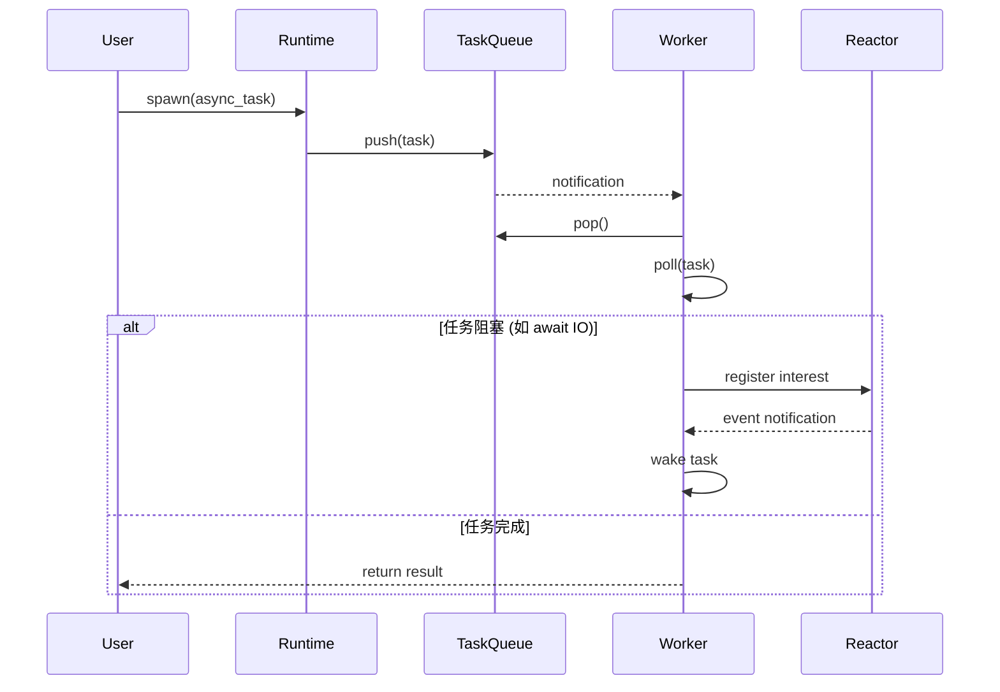
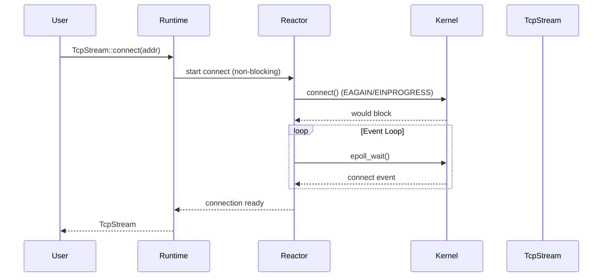

# 架构说明

## 整体架构

```
┌─────────────────────────────────────────────────────────────────┐
│                         用户代码                                  │
│    spawn(), TcpStream::connect(), Mutex::lock() 等               │
└──────────────────────────┬──────────────────────────────────────┘
                           │
                           ▼
┌─────────────────────────────────────────────────────────────────┐
│                      ylong_runtime API 层                        │
│  ┌──────────┐ ┌──────────┐ ┌──────────┐ ┌──────────┐             │
│  │   Task   │ │  Sync    │ │   Net    │ │   Time   │             │
│  └──────────┘ └──────────┘ └──────────┘ └──────────┘             │
│  ┌──────────┐ ┌──────────┐ ┌──────────┐                        │
│  │   FS     │ │  Iter    │ │ Process  │                        │
│  └──────────┘ └──────────┘ └──────────┘                        │
└──────────────────────────┬──────────────────────────────────────┘
                           │
                           ▼
┌─────────────────────────────────────────────────────────────────┐
│                      Reactor (IO Event Loop)                     │
│  ┌────────────────┐  ┌────────────────┐                          │
│  │   IO Driver    │  │  Timer Driver  │                          │
│  │  (epoll/kqueue │  │   (时间轮)     │                          │
│  │   /iocp)       │  │                │                          │
│  └───────┬────────┘  └───────┬────────┘                          │
│          │                   │                                    │
│          ▼                   ▼                                    │
│  ┌─────────────────────────────────────┐                          │
│  │         Event Poll Loop             │                          │
│  │   (阻塞等待系统事件，超时控制)        │                          │
│  └─────────────────────────────────────┘                          │
└──────────────────────────┬──────────────────────────────────────┘
                           │
                           ▼
┌─────────────────────────────────────────────────────────────────┐
│                      Executor (Task Scheduler)                   │
│  ┌─────────────────────────────────────────────────────┐          │
│  │              Task Queue (MPSC)                     │          │
│  │    接收用户提交的任务和 Reactor 唤醒的任务          │          │
│  └────────────────────────┬──────────────────────────┘          │
│                           │                                       │
│         ┌─────────────────┼─────────────────┐                    │
│         ▼                 ▼                 ▼                    │
│  ┌──────────┐      ┌──────────┐      ┌──────────┐              │
│  │  Worker  │      │  Worker  │      │  Worker  │              │
│  │ Thread 1 │      │ Thread 2 │      │ Thread N │              │
│  └──────────┘      └──────────┘      └──────────┘              │
│                           │                                       │
└───────────────────────────┼───────────────────────────────────────┘
                            │
            ┌───────────────┴───────────────┐
            ▼                               ▼
┌─────────────────────┐         ┌─────────────────────┐
│  ylong executor     │         │   FFRT executor     │
│  (Rust 实现)        │         │   (C++ FFI)         │
│                     │         │                     │
│  - 完整的生命周期    │         │  - 系统级调度优化    │
│  - 任务状态追踪     │         │  - 与系统服务集成    │
└─────────────────────┘         └─────────────────────┘
```

## 调度器选择

**证据**: `ylong_runtime/BUILD.gn:23-29`

```gn
features = [
  "fs",
  "macros",
  "net",
  "sync",
  "time",
]
```

| Feature | 依赖调度器 | 说明 |
|---------|-----------|------|
| 无 (默认) | ylong executor | 需指定 runtime 类型 |
| `current_thread_runtime` | ylong executor | 单线程运行时 |
| `multi_instance_runtime` | ylong executor | 多线程运行时 |
| `ffrt` | FFRT executor | OpenHarmony 默认，Linux only |

**注意**: `ffrt` 与 `current_thread_runtime`/`multi_instance_runtime` 互斥

## 线程模型

### 多线程 Runtime (multi_instance_runtime)

```
┌────────────────────────────────────────────────────────────┐
│                    Runtime Instance                         │
│  ┌──────────────────────────────────────────────────────┐  │
│  │              Shared State (Arc)                       │  │
│  │  - 任务队列                                           │  │
│  │  - worker 线程池                                      │  │
│  │  - 定时器驱动                                         │  │
│  └──────────────────────────────────────────────────────┘  │
│                                                             │
│  ┌─────┐  ┌─────┐  ┌─────┐  ┌─────┐                      │
│  │Worker│  │Worker│  │Worker│  │Worker│  ... N threads    │
│  └─────┘  └─────┘  └─────┘  └─────┘                      │
└────────────────────────────────────────────────────────────┘
```

### 单线程 Runtime (current_thread_runtime)

```
┌────────────────────────────────────────────────────────────┐
│                    Runtime Instance                         │
│  ┌──────────────────────────────────────────────────────┐  │
│  │              Single Thread                             │  │
│  │  - 任务执行 + IO 轮询 + 定时器                         │  │
│  │  - 协程切换                                            │  │
│  └──────────────────────────────────────────────────────┘  │
└────────────────────────────────────────────────────────────┘
```

### FFRT Runtime

```
┌────────────────────────────────────────────────────────────┐
│                    ylong_runtime                            │
│  ┌──────────────────────────────────────────────────────┐  │
│  │              FFRT FFI Layer                            │  │
│  │  - 任务提交                                            │  │
│  │  - 依赖声明                                            │  │
│  │  - 等待/唤醒                                           │  │
│  └──────────────────────────────────────────────────────┘  │
│                            │                                 │
│                            ▼ (FFI)                          │
│  ┌──────────────────────────────────────────────────────┐  │
│  │                    FFRT (C++)                         │  │
│  │  - 系统级任务调度                                       │  │
│  │  - 线程池管理                                          │  │
│  │  - 负载均衡                                            │  │
│  └──────────────────────────────────────────────────────┘  │
└────────────────────────────────────────────────────────────┘
```

## 关键调用链

### 任务 spawn 流程



### 异步 IO 流程



## 组件交互

| 组件 | 职责 | 交互对象 |
|------|------|----------|
| `Executor` | 任务调度执行 | TaskQueue, Worker, Reactor |
| `Reactor` | IO 事件监听 | Kernel (epoll/kqueue/iocp), Timer |
| `Task` | 异步任务封装 | Executor, JoinHandle |
| `Waker` | 任务唤醒机制 | Reactor, Task |
| `Driver` | IO/Timer 驱动 | Reactor, epoll/kqueue |

**证据**: `ylong_runtime/src/executor/driver.rs`, `ylong_runtime/src/executor/worker.rs`
