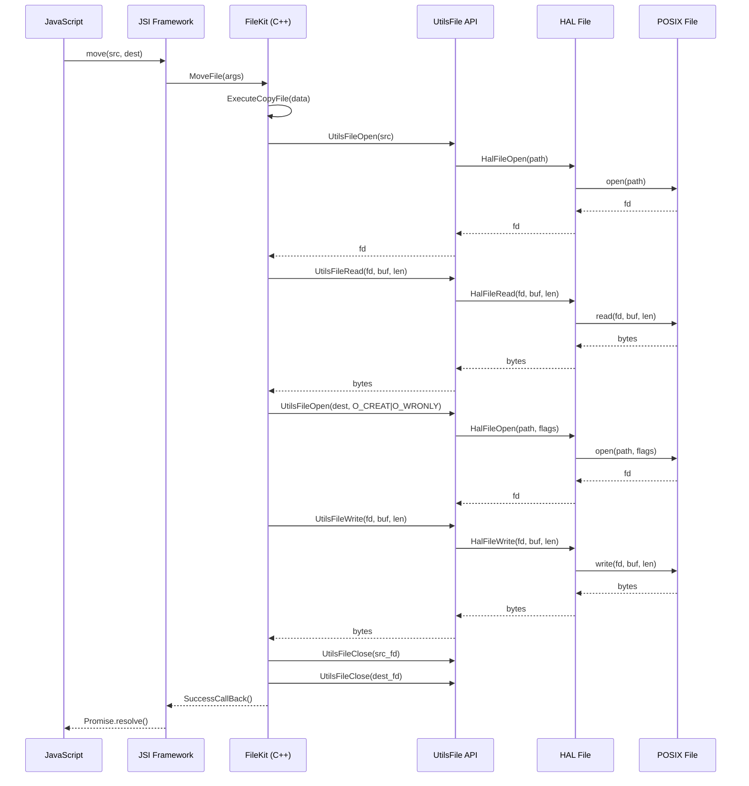

# 架构说明

> 理解 utils_lite 的整体架构设计、组件关系与数据流。

## 架构概述

utils_lite 采用**分层架构**设计，从上到下分为四层：

```
┌─────────────────────────────────────────────────────────────────┐
│                    JavaScript API Layer                         │
│                    (JSI Framework)                              │
│  ┌─────────────┐  ┌─────────────┐  ┌─────────────┐          │
│  │  FileKit    │  │ KVStoreKit  │  │DeviceInfoKit│          │
│  └─────────────┘  └─────────────┘  └─────────────┘          │
└─────────────────────────────────────────────────────────────────┘
                              │
                              ▼
┌─────────────────────────────────────────────────────────────────┐
│                     C/C++ API Layer                             │
│  ┌─────────────────┐  ┌─────────────────┐  ┌───────────────┐  │
│  │   UtilsFile     │  │    KV Store     │  │  Timer Task   │  │
│  └─────────────────┘  └─────────────────┘  └───────────────┘  │
└─────────────────────────────────────────────────────────────────┘
                              │
                              ▼
┌─────────────────────────────────────────────────────────────────┐
│                  HAL / KAL Abstraction Layer                    │
│  ┌─────────────────┐  ┌─────────────────┐  ┌───────────────┐  │
│  │   HAL File      │  │   KAL Timer     │  │   Memory Pool │  │
│  └─────────────────┘  └─────────────────┘  └───────────────┘  │
└─────────────────────────────────────────────────────────────────┘
                              │
                              ▼
┌─────────────────────────────────────────────────────────────────┐
│                    Platform / OS Layer                          │
│  ┌─────────────────┐  ┌─────────────────┐  ┌───────────────┐  │
│  │  POSIX File     │  │ POSIX Timer     │  │  File System  │  │
│  │  (open/read/    │  │ (timer_create/  │  │  (SPIFFS/     │  │
│  │   write/close)  │  │   timer_settime)│  │   ext4)       │  │
│  └─────────────────┘  └─────────────────┘  └───────────────┘  │
└─────────────────────────────────────────────────────────────────┘
```

## 组件关系

### 文件操作模块

```
┌─────────────────────────────────────────────────────────────────┐
│                        File Operation                           │
├─────────────────────────────────────────────────────────────────┤
│                                                                 │
│  JS Layer                    C Layer                           │
│  ┌──────────────┐           ┌──────────────────────┐         │
│  │   FileKit    │──────────▶│   UtilsFile API      │         │
│  │ (nativeapi_  │           │   (utils_file.h)      │         │
│  │    fs.cpp)   │           └───────────┬──────────┘         │
│  └──────────────┘                       │                      │
│                                        ▼                      │
│                              ┌──────────────────────┐         │
│                              │   HAL File API        │         │
│                              │   (hal_file.h)        │         │
│                              └───────────┬──────────┘         │
│                                          ▼                      │
│                              ┌──────────────────────┐         │
│                              │   POSIX File API      │         │
│                              │   (open/read/write)  │         │
│                              └──────────────────────┘         │
└─────────────────────────────────────────────────────────────────┘
```

**证据来源**：
- JS 层：`js/builtin/filekit/src/nativeapi_fs.cpp:513-530`
- C API：`include/utils_file.h`
- HAL 层：`hals/file/hal_file.h`
- 实现：`file/src/file_impl_hal/file.c:26-28`

### KV 存储模块

```
┌─────────────────────────────────────────────────────────────────┐
│                      KV Store Operation                         │
├─────────────────────────────────────────────────────────────────┤
│                                                                 │
│  JS Layer                    C Layer                           │
│  ┌──────────────┐           ┌──────────────────────┐         │
│  │ KVStoreKit   │──────────▶│   KV Store API       │         │
│  │ (nativeapi_  │           │   (kv_store.h)       │         │
│  │    kv.cpp)   │           └───────────┬──────────┘         │
│  └──────────────┘                       │                      │
│                                        ▼                      │
│                              ┌──────────────────────┐         │
│                              │   File System         │         │
│                              │   (persistent storage)│         │
│                              └──────────────────────┘         │
│                                          │                      │
│                                          ▼                      │
│                              ┌──────────────────────┐         │
│                              │   Optional Cache      │         │
│                              │   (FEATURE_KV_CACHE)  │         │
│                              └──────────────────────┘         │
└─────────────────────────────────────────────────────────────────┘
```

**证据来源**：
- JS 层：`js/builtin/kvstorekit/src/nativeapi_kv.cpp:255-261`
- C API：`include/kv_store.h`
- 实现：`js/builtin/kvstorekit/src/nativeapi_kv_impl.c`

### 定时器模块

```
┌─────────────────────────────────────────────────────────────────┐
│                       Timer Operation                           │
├─────────────────────────────────────────────────────────────────┤
│                                                                 │
│  JS Layer                    C Layer                           │
│  ┌──────────────┐           ┌──────────────────────┐         │
│  │ Timer Task   │──────────▶│   Timer Task API     │         │
│  │              │           │   (nativeapi_timer_   │         │
│  │              │           │    task.h)           │         │
│  └──────────────┘           └───────────┬──────────┘         │
│                                        │                      │
│                                        ▼                      │
│                              ┌──────────────────────┐         │
│                              │   KAL Timer API      │         │
│                              │   (kal.h)            │         │
│                              └───────────┬──────────┘         │
│                                          │                      │
│                                          ▼                      │
│                              ┌──────────────────────┐         │
│                              │   POSIX Timer API    │         │
│                              │   (timer_create/     │         │
│                              │    timer_settime)    │         │
│                              └──────────────────────┘         │
└─────────────────────────────────────────────────────────────────┘
```

**证据来源**：
- Timer Task：`timer_task/include/nativeapi_timer_task.h:29-32`
- KAL：`kal/timer/include/kal.h:39-44`
- 实现：`timer_task/src/nativeapi_timer_task.c:26-46`

## 数据流

### 同步 vs 异步

所有 JS API 都是**异步**的，通过 `JsAsyncWork::DispatchAsyncWork()` 分发到工作线程执行：

```
JS Call
    │
    ▼
JSI::SetModuleAPI(exports, "methodName", Handler)
    │
    ▼
HandlerFunc(thisVal, args)
    │
    ▼
ExecuteAsyncWork()  ──▶ JsAsyncWork::DispatchAsyncWork()
                                        │
                                        ▼
                                ExecuteFunc(void* data)
                                        │
                                        ▼
                                底层 C 实现 (HAL/KAL)
                                        │
                                        ▼
                                SuccessCallBack / FailCallBack
                                        │
                                        ▼
                                JSI::CallFunction() ──▶ JS Promise
```

**证据来源**：`js/builtin/kvstorekit/src/nativeapi_kv.cpp:118-156`

## 线程模型

### 工作线程

JS API 调用通过 `JsAsyncWork` 分发到独立工作线程执行，避免阻塞 JS 线程。

### POSIX 定时器

KAL 层使用 POSIX 实时定时器 (`timer_create` + `CLOCK_REALTIME`)，回调在信号处理上下文中执行。

**证据来源**：`kal/timer/src/kal.c:50-76`

### 链表非线程安全

`utils_list.h` 提供的双向链表操作**非线程安全**，使用时需自行同步。

**证据来源**：`include/utils_list.h`（文档注释）

## 关键时序图

### 文件复制操作



## 稳定性标注

| 模块 | 稳定性 | 依据 |
|------|--------|------|
| JSI API | 稳定 | JS 层导出接口 |
| UtilsFile API | 稳定 | C API 头文件 |
| KV Store API | 稳定 | C API 头文件 |
| HAL File | 稳定 | HAL 接口 |
| KAL Timer | 稳定 | KAL 接口 |
| utils_list | 非线程安全 | 文档未标注线程安全 |

## 相关跳转

- [概述](00_Overview.md) - 项目定位与能力
- [目录结构](01_Directory_Structure.md) - 模块布局
- [N-API 参考](03_NAPI_Reference.md) - JS API 详情
- [内部 API](04_Inner_API.md) - C/C++ 接口
- [GN 构建](05_GN_Build.md) - 构建配置
