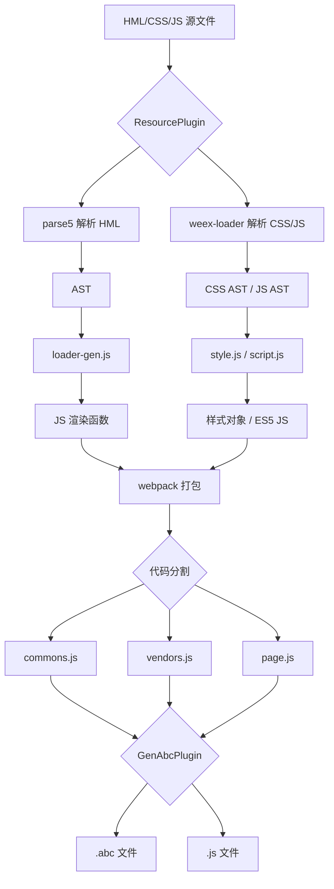
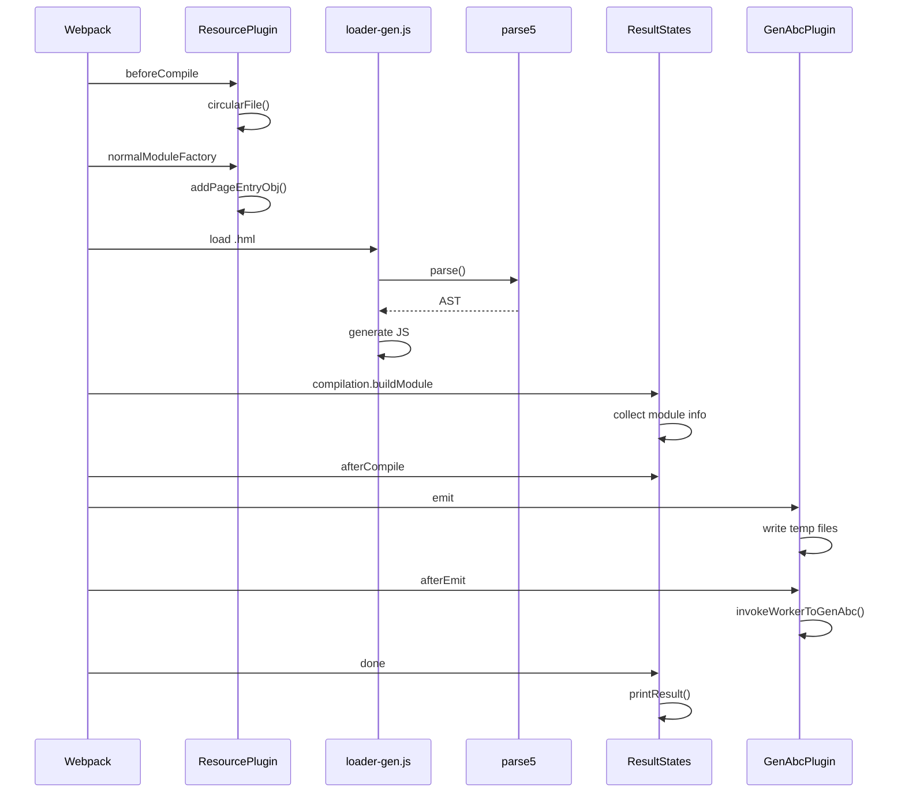

# 03 - 架构说明

## 整体架构

```
┌─────────────────────────────────────────────────────────────────────┐
│                        ace_js2bundle 架构                           │
├─────────────────────────────────────────────────────────────────────┤
│                                                                      │
│  ┌──────────────────────────────────────────────────────────────┐  │
│  │                      输入层 (Input)                           │  │
│  │  ┌─────────┐  ┌─────────┐  ┌─────────┐  ┌─────────┐         │  │
│  │  │  .hml   │  │  .css   │  │  .js    │  │  .json  │         │  │
│  │  │ (模板)   │  │ (样式)   │  │ (逻辑)   │  │ (配置)   │         │  │
│  │  └────┬────┘  └────┬────┘  └────┬────┘  └────┬────┘         │  │
│  └───────┼────────────┼────────────┼────────────┼──────────────┘  │
│          │            │            │            │                  │
│          ▼            ▼            ▼            ▼                  │
│  ┌──────────────────────────────────────────────────────────────┐  │
│  │                    解析层 (Parser)                            │  │
│  │  ┌─────────────────┐  ┌─────────────────┐                    │  │
│  │  │   parse5        │  │   weex-loader   │                    │  │
│  │  │  (HML→AST)      │  │  (CSS/JS解析)    │                    │  │
│  │  └────────┬────────┘  └────────┬────────┘                    │  │
│  └───────────┼────────────────────┼─────────────────────────────┘  │
│              │                    │                                │
│              ▼                    ▼                                │
│  ┌──────────────────────────────────────────────────────────────┐  │
│  │                    转换层 (Transform)                         │  │
│  │  ┌─────────────┐  ┌─────────────┐  ┌─────────────┐          │  │
│  │  │   loader-   │  │   style.    │  │   script.   │          │  │
│  │  │   gen.js    │  │   js        │  │   js        │          │  │
│  │  │ (模板→JS)   │  │ (CSS→对象)   │  │ (JS→ES5)    │          │  │
│  │  └──────┬──────┘  └──────┬──────┘  └──────┬──────┘          │  │
│  └─────────┼────────────────┼────────────────┼─────────────────┘  │
│            │                │                │                    │
│            ▼                ▼                ▼                    │
│  ┌──────────────────────────────────────────────────────────────┐  │
│  │                    构建层 (Build)                             │  │
│  │  ┌──────────────────────────────────────────────────────┐   │  │
│  │  │                    webpack                            │   │  │
│  │  │  ┌──────────┐  ┌──────────┐  ┌──────────┐          │   │  │
│  │  │  │ resource │  │ compile  │  │  split   │          │   │  │
│  │  │  │ -plugin  │  │ -plugin  │  │ chunks   │          │   │  │
│  │  │  └──────────┘  └──────────┘  └──────────┘          │   │  │
│  │  └──────────────────────────────────────────────────────┘   │  │
│  └──────────────────────────────────────────────────────────────┘  │
│                              │                                      │
│                              ▼                                      │
│  ┌──────────────────────────────────────────────────────────────┐  │
│  │                    输出层 (Output)                            │  │
│  │  ┌─────────┐  ┌─────────┐  ┌─────────┐                      │  │
│  │  │  .js    │  │  .abc   │  │  .bin   │                      │  │
│  │  │ (Bundle)│  │ (Ark字节码)│  │ (二进制) │                      │  │
│  │  └─────────┘  └─────────┘  └─────────┘                      │  │
│  └──────────────────────────────────────────────────────────────┘  │
│                                                                      │
└─────────────────────────────────────────────────────────────────────┘
```

## 数据流

### 编译流程数据流



### 插件执行时序

```
┌─────────────────────────────────────────────────────────────────┐
│                     Webpack 编译生命周期                          │
├─────────────────────────────────────────────────────────────────┤
│                                                                  │
│  beforeCompile ───────────────────────────────────────────────┐ │
│       │                                                        │ │
│       ▼                                                        │ │
│  ResourcePlugin.circularFile()                                  │ │
│       │                                                        │ │
│       ▼                                                        │ │
│  normalModuleFactory ─────────────────────────────────────────┐ │
│       │                                                        │ │
│       ▼                                                        │ │
│  ResourcePlugin.addPageEntryObj()                               │ │
│       │                                                        │ │
│       ▼                                                        │ │
│  compilation ─────────────────────────────────────────────────┐ │
│       │                                                        │ │
│       ▼                                                        │ │
│  ResultStates.buildModule()                                     │ │
│  CommonAsset.PROCESS_ASSETS_STAGE_ADDITIONS                     │ │
│       │                                                        │ │
│       ▼                                                        │ │
│  afterCompile ────────────────────────────────────────────────┐ │
│       │                                                        │ │
│       ▼                                                        │ │
│  ResultStates.copyFindModule()                                  │ │
│       │                                                        │ │
│       ▼                                                        │ │
│  emit ────────────────────────────────────────────────────────┐ │
│       │                                                        │ │
│       ▼                                                        │ │
│  GenAbcPlugin.emit()                                            │ │
│       │                                                        │ │
│       ▼                                                        │ │
│  afterEmit ───────────────────────────────────────────────────┐ │
│       │                                                        │ │
│       ▼                                                        │ │
│  GenAbcPlugin.afterEmit()                                       │ │
│  invokeWorkerToGenAbc()                                         │ │
│       │                                                        │ │
│       ▼                                                        │ │
│  done ────────────────────────────────────────────────────────┘ │
│       │                                                        │ │
│       ▼                                                        │ │
│  ResultStates.printResult()                                     │ │
│  ResourcePlugin.copyManifest()                                  │ │
│                                                                  │ │
└─────────────────────────────────────────────────────────────────┘ │
```

## 核心组件详解

### 1. ResourcePlugin

**文件**: `ace-loader/src/resource-plugin.js:118-179`

**职责**:
- 资源文件扫描与复制
- 页面入口生成
- Worker 文件处理
- 主题文件构建

**关键方法**:
```javascript
// 扫描并复制资源文件
circularFile(input, output, ext)

// 添加页面入口
addPageEntryObj()

// 加载 Worker
loadWorker(entryObj)

// 主题文件构建
themeFileBuild(customThemePath, customThemeBuild)
```

### 2. ResultStates (compile-plugin)

**文件**: `ace-loader/src/compile-plugin.js:51-181`

**职责**:
- 模块发现与缓存
- 公共资源处理 (common/i18n)
- 编译结果报告
- 全局模块缓存注入

**关键方法**:
```javascript
// 构建模块时收集信息
buildModule.tap("findModule", (module) => {...})

// 处理资源
processAssets.tap({...})

// 打印编译结果
printResult(buildPath)
```

### 3. GenAbcPlugin

**文件**: `ace-loader/src/genAbc-plugin.js:71-130`

**职责**:
- JS Bundle 包装
- 临时文件生成
- 调用 ts2abc/es2abc 生成 ABC
- 多线程 Worker 管理

**关键方法**:
```javascript
// 包装 JS Bundle
forward + newContent + last

// 生成 ABC
invokeWorkerToGenAbc()

// 多线程处理
processWorkersOfBuildMode()
processWorkersOfPreviewMode()
```

### 4. loader-gen.js

**文件**: `ace-loader/src/loader-gen.js:172-209`

**职责**:
- HML 文件加载
- Loader 链生成
- 代码生成

**关键函数**:
```javascript
// 生成 HML 和 CSS 代码
codegenHmlAndCss()

// 生成输出
generateOutput(that, type, jsFileName, isElement)
```

## 瘦设备特殊处理

### 模板转换差异

| 特性 | 富设备 | 瘦设备 |
|------|--------|--------|
| 转换文件 | `loader-gen.js` | `lite-transform-template.js` |
| 输出格式 | 完整 JS | 精简 render 函数 |
| 指令支持 | 完整 | 精简 |
| 事件绑定 | 完整 | 简化 |

**代码证据**:
- `ace-loader/src/lite/lite-transform-template.js:138-147`
- `ace-loader/webpack.lite.config.js` (对比 rich config)

### 瘦设备数据流

```
HML → parse5 → AST → lite-transform-template.js → 精简 render 函数
                                                        ↓
CSS → weex-loader → lite-transform-style.js → 样式对象
                                                        ↓
                                                    webpack → BIN
```

## 卡片特殊处理

### 卡片编译流程

```
HML → card-loader.js → JSON 配置 + 模板 + 样式
                              ↓
                        AfterEmitPlugin → 合并输出
                              ↓
                        GenAbcPlugin → ABC
```

**代码证据**: `ace-loader/src/card-loader.js:33-109`

## 线程模型

### 构建模式 (Build Mode)

```
主进程 (Master)
    │
    ├── fork Worker 1 ──→ 处理 chunk 1 ──→ 生成 ABC
    ├── fork Worker 2 ──→ 处理 chunk 2 ──→ 生成 ABC
    ├── fork Worker N ──→ 处理 chunk N ──→ 生成 ABC
    │
    └── 等待所有 Worker 完成 ──→ 合并结果
```

**代码证据**: `ace-loader/src/genAbc-plugin.js:702-738`

### 预览模式 (Preview Mode)

```
主进程
    │
    └── execSync(manage-bundle-workers.js)
            │
            └── 同步调用 ts2abc
```

**代码证据**: `ace-loader/src/genAbc-plugin.js:688-699`

## 缓存机制

### 文件系统缓存

```javascript
// webpack 配置
config.cache = {
  type: 'filesystem',
  cacheDirectory: path.resolve(process.env.cachePath, '.rich_cache', ...)
}
```

**代码证据**: `ace-loader/webpack.rich.config.js:167-169`

### ABC 增量缓存

```javascript
// 基于文件哈希的缓存
filterIntermediateJsBundleByHashJson(buildPath, inputPaths)
writeHashJson()
```

**代码证据**: `ace-loader/src/genAbc-plugin.js:296-359`

## 关键时序图

### 页面编译时序



## 相关文档

- [目录结构](./02_Directory_Structure.md)
- [内部 API](./05_Internal_API.md)
- [构建系统](./06_Build_System.md)
