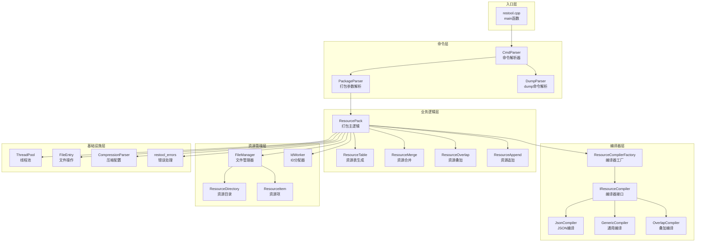
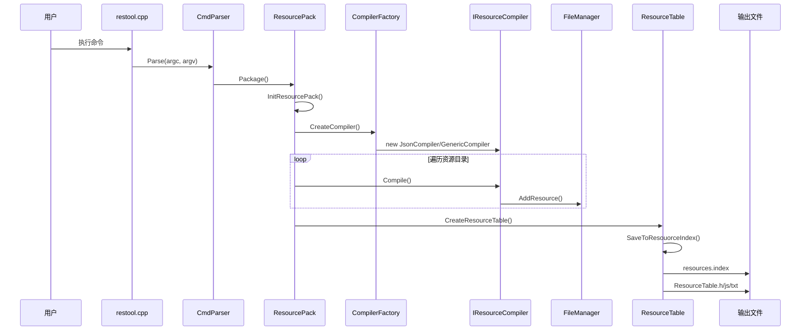
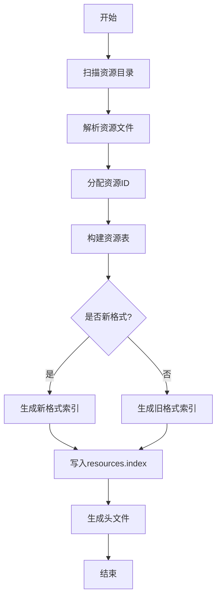
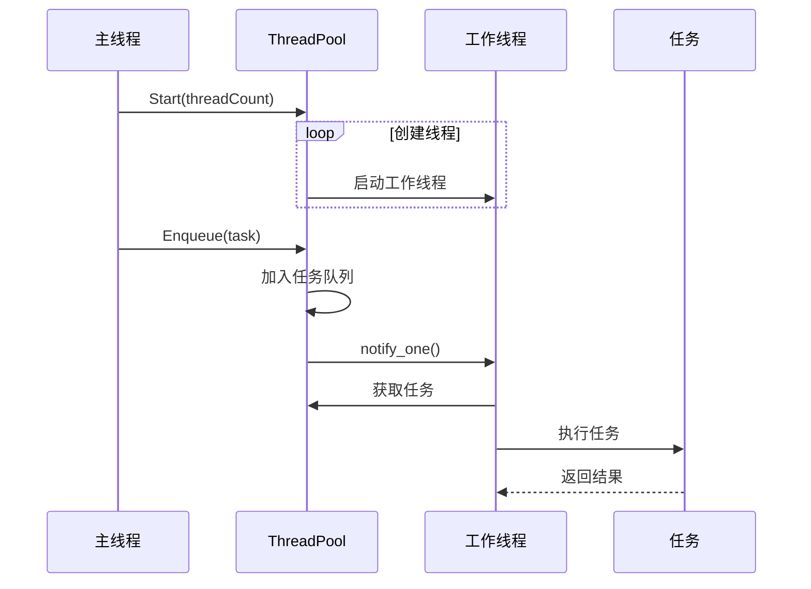
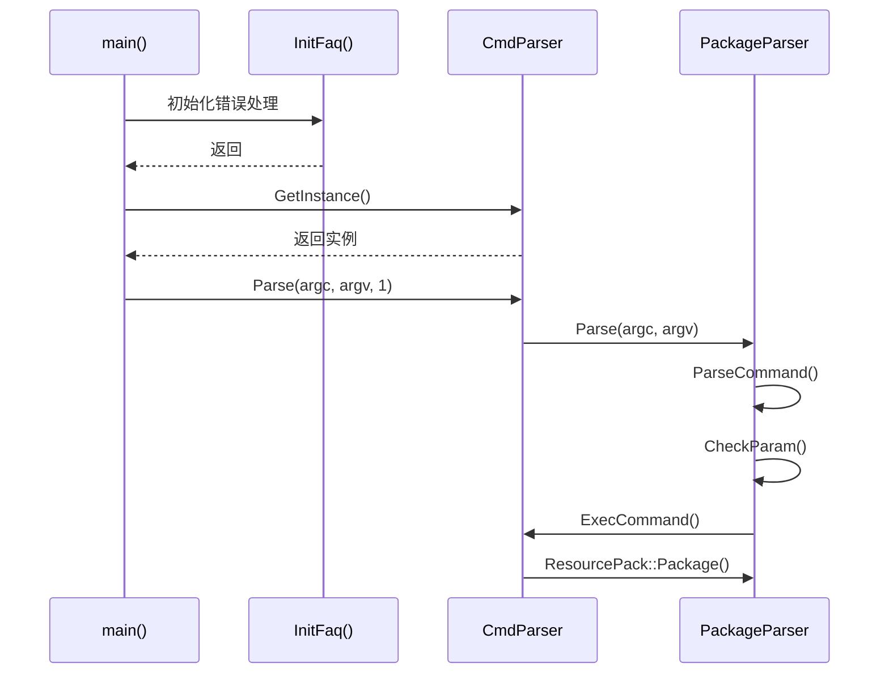
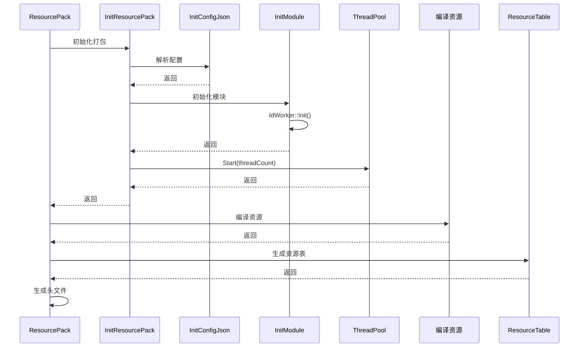

# 架构说明

## 目的与适用范围

本文档介绍 `global_resource_tool` 的系统架构、组件关系、数据流和线程模型。

**适用对象**: 架构师、高级开发者、安全审计人员

---

## 系统架构

### 整体架构图



---

## 组件职责

### 1. 入口层

**restool.cpp** (`src/restool.cpp:24`)
- 程序入口 `main()`
- 初始化 FAQ 系统
- 调用命令解析器

### 2. 命令层

**CmdParser** (`src/cmd/cmd_parser.cpp`)
- 命令分发基类
- 注册子命令（dump）
- 显示帮助信息

**PackageParser** (`src/cmd/package_parser.cpp`)
- 解析打包命令参数
- 参数校验
- 调用 ResourcePack 执行打包

**DumpParser** (`src/cmd/dump_parser.cpp`)
- 解析 dump 子命令
- 输出 HAP 资源信息

### 3. 业务逻辑层

**ResourcePack** (`src/resource_pack.cpp`)
- 打包主逻辑
- 协调各模块工作
- 支持多种打包模式（普通/叠加/追加/合并）

**ResourceTable** (`src/resource_table.cpp`)
- 生成资源索引文件
- 支持新旧两种索引格式
- 生成 ID 定义文件

**ResourceMerge** (`src/resource_merge.cpp`)
- 合并多个资源目录

**ResourceOverlap** (`src/resource_overlap.cpp`)
- 资源叠加编译

**ResourceAppend** (`src/resource_append.cpp`)
- 资源追加编译

### 4. 编译器层

**ResourceCompilerFactory** (`src/resource_compiler_factory.cpp`)
- 根据资源类型创建对应编译器

**IResourceCompiler** (`src/i_resource_compiler.cpp`)
- 编译器接口基类

**JsonCompiler** (`src/json_compiler.cpp`)
- 编译 JSON 格式资源

**GenericCompiler** (`src/generic_compiler.cpp`)
- 编译通用文件资源

### 5. 资源管理层

**FileManager** (`src/file_manager.cpp`)
- 单例模式管理所有资源
- 资源去重
- 资源查询

**ResourceDirectory** (`src/resource_directory.cpp`)
- 扫描资源目录
- 解析限定词

**ResourceItem** (`src/resource_item.cpp`)
- 资源项数据结构
- 资源属性存储

**IdWorker** (`src/id_worker.cpp`)
- 单例模式分配资源 ID
- 支持自定义起始 ID

### 6. 基础设施层

**ThreadPool** (`src/thread_pool.cpp`)
- 线程池实现
- 任务队列管理

**FileEntry** (`src/file_entry.cpp`)
- 文件/目录操作封装
- 支持 Windows 长路径

**CompressionParser** (`src/compression_parser.cpp`)
- 纹理压缩配置解析
- 动态加载压缩库

**restool_errors** (`src/restool_errors.cpp`)
- 错误码定义
- 错误信息格式化

---

## 数据流

### 资源编译数据流



### 资源索引生成流程



---

## 线程模型

### ThreadPool 设计

**实现** (`include/thread_pool.h`):
```cpp
class ThreadPool {
    std::vector<std::thread> workerThreads_;  // 工作线程
    std::queue<std::function<void()>> tasks_; // 任务队列
    std::mutex queueMutex_;                   // 队列互斥锁
    std::condition_variable condition_;       // 条件变量
    bool running_;                            // 运行状态
};
```

**工作流程**:


**使用场景**:
- 多文件并行编译
- 纹理压缩并行处理

---

## 关键时序

### 启动时序



### 打包时序



---

## 设计模式

### 1. 单例模式

**应用**:
- `CmdParser` (`include/cmd/cmd_parser.h`)
- `FileManager` (`include/file_manager.h`)
- `IdWorker` (`include/id_worker.h`)
- `ThreadPool` (`include/thread_pool.h`)

**实现** (`include/singleton.h`):
```cpp
template<typename T>
class Singleton {
public:
    static T &GetInstance() {
        static T instance;
        return instance;
    }
};
```

### 2. 工厂模式

**应用**:
- `ResourceCompilerFactory` - 创建编译器
- `ResourcePackerFactory` - 创建打包器

### 3. 策略模式

**应用**:
- `IResourceCompiler` 接口，不同资源类型使用不同编译策略
- `Header` 类，支持多种头文件格式生成

### 4. 命令模式

**应用**:
- `CmdParserBase` 基类
- `DumpParser`、`PackageParser` 具体命令

---

## 关键数据结构

### 资源类型枚举

**定义** (`include/resource_data.h:85-104`):
```cpp
enum class ResType {
    ELEMENT = 0,
    RAW = 6,
    INTEGER = 8,
    STRING = 9,
    // ... 更多类型
};
```

### 文件信息结构

**定义** (`include/resource_data.h:330-334`):
```cpp
struct FileInfo : DirectoryInfo {
    std::string filePath;
    std::string filename;
    ResType fileType;
};
```

### 资源索引 Header

**结构** (`src/resource_table.cpp`):
```cpp
struct IndexHeader {
    char tag[4];           // 魔数 "RES"
    uint32_t version;      // 版本号
    uint32_t count;        // 资源数量
    uint64_t dataOffset;   // 数据偏移
};
```

---

## 相关文档

- [项目概览](00_Overview.md) - 项目定位和核心能力
- [目录结构](01_Directory_Structure.md) - 代码组织方式
- [内部接口](04_Internal_API.md) - 模块接口详情
- [安全风险评审](06_SecurityReview.md) - 安全分析
