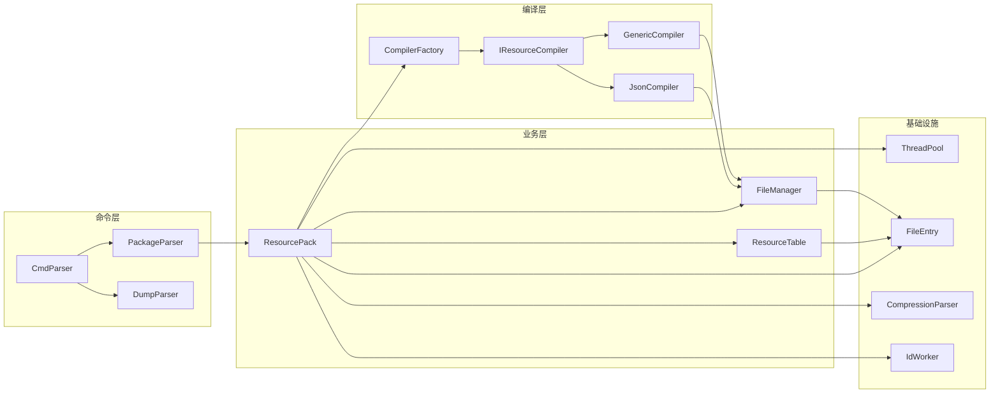

# 内部接口

## 目的与适用范围

本文档介绍 `global_resource_tool` 的内部模块接口，包括类设计、方法签名和模块间依赖关系。

**适用对象**: 核心开发者、架构师、代码维护人员

---

## 接口稳定性说明

| 稳定性级别 | 说明 | 示例 |
|------------|------|------|
| 稳定 | 接口不会随意变更 | `ResourcePack::Package()` |
| 不稳定 | 可能随需求变更 | 内部解析器实现细节 |
| 内部 | 不建议外部使用 | 私有方法 |

---

## 核心模块接口

### 1. ResourcePack（资源打包）

**头文件**: `include/resource_pack.h`

**类定义**:
```cpp
class ResourcePack : public NoCopyAble {
public:
    explicit ResourcePack(const PackageParser &packageParser);
    uint32_t Package();
    
private:
    uint32_t InitResourcePack();
    uint32_t Pack();
    uint32_t PackAppend();
    uint32_t PackCombine();
    // ... 更多私有方法
};
```

**关键方法**:
| 方法 | 签名 | 说明 | 稳定性 |
|------|------|------|--------|
| Package | `uint32_t Package()` | 主打包入口 | 稳定 |
| InitResourcePack | `uint32_t InitResourcePack()` | 初始化打包环境 | 稳定 |
| GenerateHeader | `uint32_t GenerateHeader() const` | 生成资源头文件 | 稳定 |

**依赖方向**:
```
ResourcePack
    ├── PackageParser (输入参数)
    ├── ResourceTable
    ├── FileManager
    ├── ThreadPool
    └── CompressionParser
```

---

### 2. IResourceCompiler（编译器接口）

**头文件**: `include/i_resource_compiler.h`

**类定义**:
```cpp
class IResourceCompiler : public NoCopyAble {
public:
    IResourceCompiler(const ResourceDirectory &resourceDirectory, 
                      const FileInfo &fileInfo);
    virtual ~IResourceCompiler() = default;
    virtual uint32_t Compile() = 0;
    
protected:
    uint32_t SaveResourceItem(const ResourceItem &resourceItem);
    FileInfo fileInfo_;
};
```

**派生类**:
| 类名 | 文件 | 职责 |
|------|------|------|
| JsonCompiler | `json_compiler.h/cpp` | 编译 JSON 资源 |
| GenericCompiler | `generic_compiler.h/cpp` | 编译通用文件 |
| OverlapCompiler | `overlap_compiler.h/cpp` | 叠加编译 |
| AppendCompiler | `append_compiler.h/cpp` | 追加编译 |

**使用示例**:
```cpp
// 通过工厂创建编译器
auto compiler = ResourceCompilerFactory::CreateCompiler(
    resourceDirectory, fileInfo);
if (compiler) {
    compiler->Compile();
}
```

---

### 3. ResourceTable（资源表）

**头文件**: `include/resource_table.h`

**类定义**:
```cpp
class ResourceTable : public NoCopyAble {
public:
    explicit ResourceTable(bool isNewModule = false);
    ~ResourceTable();
    
    uint32_t CreateResourceTable();
    uint32_t CreateResourceTable(
        const std::map<int64_t, std::vector<std::shared_ptr<ResourceItem>>> &items);
    
    static uint32_t LoadResTable(const std::string path, 
                                  std::map<int64_t, std::vector<ResourceItem>> &resInfos);
};
```

**关键方法**:
| 方法 | 签名 | 说明 |
|------|------|------|
| CreateResourceTable | `uint32_t CreateResourceTable()` | 从 FileManager 创建资源表 |
| LoadResTable | `static uint32_t LoadResTable(...)` | 加载已有资源索引 |

---

### 4. FileManager（文件管理器）

**头文件**: `include/file_manager.h`

**类定义** (单例):
```cpp
class FileManager : public Singleton<FileManager> {
public:
    uint32_t AddResource(const ResourceItem &resourceItem);
    const std::map<int64_t, std::vector<ResourceItem>> &GetResources() const;
    void Clear();
    
private:
    std::map<int64_t, std::vector<ResourceItem>> resources_;
};
```

**使用方式**:
```cpp
FileManager::GetInstance().AddResource(resourceItem);
auto &resources = FileManager::GetInstance().GetResources();
```

---

### 5. IdWorker（ID 分配器）

**头文件**: `include/id_worker.h`

**类定义** (单例):
```cpp
class IdWorker : public Singleton<IdWorker> {
public:
    uint32_t Init(ResourceIdCluster hapType);
    uint32_t Init(ResourceIdCluster hapType, int64_t startId);
    int64_t GenerateId(ResType type, const std::string &name);
    int64_t GenerateId(ResType type, const std::string &name, int64_t id);
};
```

**关键方法**:
| 方法 | 签名 | 说明 |
|------|------|------|
| Init | `uint32_t Init(ResourceIdCluster hapType)` | 初始化（自动分配起始 ID） |
| Init | `uint32_t Init(ResourceIdCluster hapType, int64_t startId)` | 初始化（指定起始 ID） |
| GenerateId | `int64_t GenerateId(ResType type, const std::string &name)` | 生成资源 ID |

---

### 6. ThreadPool（线程池）

**头文件**: `include/thread_pool.h`

**类定义** (单例):
```cpp
class ThreadPool : public NoCopyAble {
public:
    uint32_t Start(const size_t &threadCount);
    void Stop();
    
    template <class F, class... Args>
    std::future<typename std::result_of<F(Args...)>::type> 
    Enqueue(F &&f, Args &&...args);
    
    static ThreadPool &GetInstance();
};
```

**使用示例**:
```cpp
// 启动线程池
ThreadPool::GetInstance().Start(8);

// 提交任务
auto future = ThreadPool::GetInstance().Enqueue([](int x) {
    return x * x;
}, 42);

// 获取结果
int result = future.get();
```

---

### 7. FileEntry（文件操作）

**头文件**: `include/file_entry.h`

**类定义**:
```cpp
class FileEntry : public NoCopyAble {
public:
    explicit FileEntry(const std::string &path);
    ~FileEntry();
    
    bool Init();
    const std::vector<std::unique_ptr<FileEntry>> GetChilds() const;
    bool IsFile() const;
    const FilePath &GetFilePath() const;
    
    // 静态工具方法
    static bool Exist(const std::string &path);
    static bool RemoveAllDir(const std::string &path);
    static bool RemoveFile(const std::string &path);
    static bool CreateDirs(const std::string &path);
    static bool CopyFileInner(const std::string &src, const std::string &dst);
    static bool IsDirectory(const std::string &path);
    static std::string RealPath(const std::string &path);
    
    // 内部类
    class FilePath {
    public:
        explicit FilePath(const std::string &path);
        FilePath Append(const std::string &path);
        FilePath ReplaceExtension(const std::string &extension);
        FilePath GetParent();
        const std::string &GetPath() const;
        const std::string &GetFilename() const;
        const std::string &GetExtension() const;
    };
};
```

---

### 8. CompressionParser（压缩配置）

**头文件**: `include/compression_parser.h`

**类定义**:
```cpp
class CompressionParser : public NoCopyAble {
public:
    explicit CompressionParser(const std::string &filePath);
    ~CompressionParser();
    
    uint32_t Init();
    bool NeedCompress(const std::string &path);
    uint32_t Compress(const std::string &src, const std::string &dst);
    void SetOutPath(const std::string &outPath);
    
    static std::shared_ptr<CompressionParser> GetCompressionParser(
        const std::string &filePath);
    static std::shared_ptr<CompressionParser> GetCompressionParser();
};
```

---

## 数据类型定义

### 资源类型

**定义** (`include/resource_data.h`):
```cpp
enum class ResType {
    ELEMENT = 0,
    RAW = 6,
    INTEGER = 8,
    STRING = 9,
    STRARRAY = 10,
    INTARRAY = 11,
    BOOLEAN = 12,
    COLOR = 14,
    ID = 15,
    THEME = 16,
    PLURAL = 17,
    FLOAT = 18,
    MEDIA = 19,
    PROF = 20,
    PATTERN = 22,
    SYMBOL = 23,
    RES = 24,
    INVALID_RES_TYPE = -1,
};
```

### 限定词类型

**定义** (`include/resource_data.h`):
```cpp
enum class KeyType {
    LANGUAGE = 0,
    REGION = 1,
    RESOLUTION = 2,
    ORIENTATION = 3,
    DEVICETYPE = 4,
    SCRIPT = 5,
    NIGHTMODE = 6,
    MCC = 7,
    MNC = 8,
    INPUTDEVICE = 10,
};
```

### 关键结构体

**ResourceItem** (`include/resource_item.h`):
```cpp
class ResourceItem {
public:
    void SetKeyParams(const std::vector<KeyParam> &keyParams);
    void SetResType(ResType resType);
    void SetName(const std::string &name);
    void SetFilePath(const std::string &filePath);
    void SetData(const std::string &data);
    // ... getter 方法
};
```

**FileInfo** (`include/resource_data.h`):
```cpp
struct FileInfo : DirectoryInfo {
    std::string filePath;
    std::string filename;
    ResType fileType;
};

struct DirectoryInfo {
    std::string limitKey;
    std::string fileCluster;
    std::string dirPath;
    std::vector<KeyParam> keyParams;
    ResType dirType;
};
```

---

## 模块依赖图



---

## 接口使用最佳实践

### 1. 资源编译流程

```cpp
// 1. 初始化
ThreadPool::GetInstance().Start(threadCount);
IdWorker::GetInstance().Init(ResourceIdCluster::RES_ID_APP);

// 2. 扫描并编译资源
for (auto &file : files) {
    auto compiler = ResourceCompilerFactory::CreateCompiler(dir, file);
    if (compiler) {
        compiler->Compile();  // 内部调用 FileManager::AddResource
    }
}

// 3. 生成资源表
ResourceTable table;
table.CreateResourceTable();

// 4. 清理
ThreadPool::GetInstance().Stop();
FileManager::GetInstance().Clear();
```

### 2. 错误处理

```cpp
uint32_t result = SomeOperation();
if (result != RESTOOL_SUCCESS) {
    PrintError(GetError(ERR_CODE_XXX));
    return RESTOOL_ERROR;
}
```

---

## 相关文档

- [架构说明](02_Architecture.md) - 系统架构和数据流
- [目录结构](01_Directory_Structure.md) - 代码组织方式
- [安全风险评审](06_SecurityReview.md) - 安全分析
