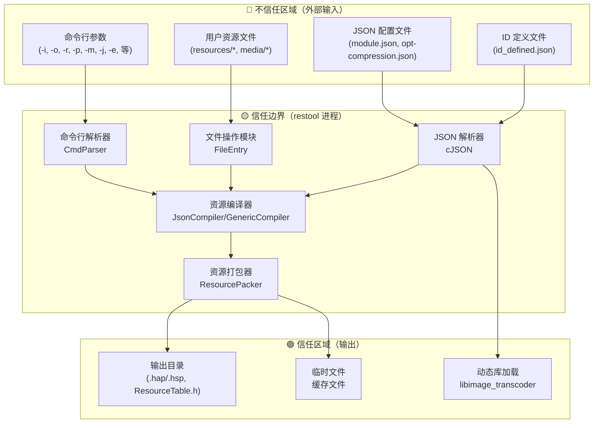

# 攻击面分析

> **文档版本**: 1.0  
> **最后更新**: 2026-02-07  
> **适用对象**: 安全研究员、渗透测试工程师、安全架构师

---

## 1. 目的与范围

本文档系统性地分析 `restool`（OpenHarmony 资源编译工具）的**攻击面**，识别所有外部输入入口、敏感操作和信任边界跨越点。

**不在本文档范围**：
- 第三方依赖库内部漏洞（cJSON、libpng、bounds_checking_function）
- 运行时攻击（restool 为编译时工具）
- 社会工程学攻击

---

## 2. 信任边界模型

### 2.1 信任边界图



### 2.2 信任边界说明

| 区域 | 信任级别 | 说明 |
|------|---------|------|
| **命令行参数** | 不信任 | 用户可任意输入，需严格校验 |
| **用户资源文件** | 不信任 | 内容由用户提供，可能恶意构造 |
| **JSON 配置文件** | 不信任 | 格式和内容由用户提供 |
| **ID 定义文件** | 不信任 | 可能包含恶意 ID 值 |
| **输出目录** | 信任 | restool 创建的目录 |
| **临时文件** | 信任 | restool 管理的缓存 |
| **动态库路径** | ⚠️ 部分信任 | 由配置文件指定，存在劫持风险 |

---

## 3. 外部输入清单

### 3.1 命令行参数

| 参数 | 类型 | 用途 | 风险等级 |
|------|------|------|---------|
| `-i <path>` | 输入路径 | 指定资源目录 | 🔴 高 |
| `-o <path>` | 输出路径 | 指定输出目录 | 🔴 高 |
| `-r <path>` | 文件路径 | ResourceTable.h 输出路径 | 🔴 高 |
| `-p <name>` | 包名 | 指定包名 | 🟡 中 |
| `-m <names>` | 模块名 | 指定模块列表 | 🟡 中 |
| `-j <path>` | JSON 路径 | module.json 路径 | 🟡 中 |
| `-f` | 标志 | 强制覆盖输出 | 🟡 中 |
| `-e <mask>` | ID 掩码 | 起始 ID | 🟡 中 |
| `--thread <num>` | 数值 | 线程数 | 🟡 中 |
| `--compressed-config <path>` | JSON 路径 | 压缩配置 | 🔴 高 |
| `--ignore-file <regex>` | 正则 | 忽略文件模式 | 🟡 中 |
| `--ignore-path <regex>` | 正则 | 忽略路径模式 | 🟡 中 |
| `-d <subcmd>` | 子命令 | dump 子命令 | 🟡 中 |

**证据来源**：`src/cmd/cmd_parser.cpp:39` CmdParser::Parse()

### 3.2 文件输入

| 文件类型 | 路径来源 | 风险等级 | 说明 |
|---------|---------|---------|------|
| **资源文件** | `-i` 参数指定 | 🔴 高 | 任意用户文件 |
| **module.json** | `-j` 参数指定 | 🔴 高 | JSON 格式配置文件 |
| **opt-compression.json** | `--compressed-config` | 🔴 高 | 指定动态库路径 |
| **id_defined.json** | 编译时内置 | 🟡 中 | ID 定义 |
| **限定词目录** | 资源目录结构 | 🟡 中 | 如 `zh_CN`, `phone` |

**证据来源**：
- 资源解析：`src/resource_directory.cpp`
- JSON 解析：`src/config_parser.cpp`
- 压缩配置：`src/compression_parser.cpp:89-122`

### 3.3 环境输入

| 输入源 | 用途 | 风险等级 |
|--------|------|---------|
| **当前工作目录** | 相对路径解析 | 🟡 中 |
| **临时目录 TMPDIR/TEMP** | 临时文件存储 | 🟡 中 |
| **PATH 环境变量** | 动态库搜索 | 🟢 低 |

---

## 4. 敏感操作清单

### 4.1 文件系统操作

| 操作 | API | 文件 | 风险等级 |
|------|-----|------|---------|
| **创建目录** | `mkdir()` | 输出目录、限定词目录 | 🔴 高 |
| **删除目录** | `rmdir()` | 临时目录、清理目录 | 🔴 高 |
| **删除文件** | `remove()` | 临时文件、覆盖文件 | 🔴 高 |
| **复制文件** | `ifstream/ofstream` | 资源打包 | 🔴 高 |
| **读取文件** | `ifstream` | 资源解析 | 🟡 中 |
| **写入文件** | `ofstream` | 输出文件、ResourceTable.h | 🔴 高 |

**证据来源**：`src/file_entry.cpp`

```cpp
// src/file_entry.cpp:347 - 创建目录
return mkdir(path.c_str(), S_IRWXU | S_IRGRP | S_IXGRP | S_IROTH | S_IXOTH) == 0;

// src/file_entry.cpp:314 - 删除文件
bool result = remove(path.c_str()) == 0;

// src/file_entry.cpp:331 - 删除目录
bool result = rmdir(path.c_str()) == 0;
```

### 4.2 动态库加载

| 操作 | API | 用途 | 风险等级 |
|------|-----|------|---------|
| **加载动态库** | `dlopen()` / `LoadLibrary()` | 纹理压缩 | 🔴 高 |
| **函数符号解析** | `dlsym()` | 获取导出函数 | 🔴 高 |
| **卸载动态库** | `dlclose()` / `FreeLibrary()` | 清理 | 🟢 低 |

**证据来源**：`src/compression_parser.cpp:61-69`

```cpp
// src/compression_parser.cpp:103 - 加载动态库
if (!LoadImageTranscoder()) {
    return RESTOOL_ERROR;
}

// src/compression_parser.cpp:61-69 - 卸载动态库
#ifdef __WIN32
    if (handle_) {
        FreeLibrary(handle_);
        handle_ = nullptr;
    }
#else
    if (handle_) {
        dlclose(handle_);
        handle_ = nullptr;
    }
#endif
```

### 4.3 系统调用

| 调用 | 用途 | 风险等级 |
|------|------|---------|
| **正则表达式编译** | `--ignore-file/path` 参数 | 🟡 中 |
| **线程创建** | `--thread` 参数 | 🟡 中 |
| **内存分配** | JSON 解析、资源加载 | 🟡 中 |

---

## 5. 攻击面分类详解

### 5.1 路径操作攻击面

**涉及模块**：`FileEntry`、`FileManager`、`PackageParser`

**输入入口**：
```
命令行参数: -i, -o, -r
    ↓
CmdParser::Parse()
    ↓
PackageParser::AddInput() / AddOutput() / AddResourceHeader()
    ↓
FileEntry::CreateDirs() / RemoveAllDir() / RemoveFile()
```

**关键代码**：
- `src/file_entry.cpp:168-169` - 文件复制
- `src/file_entry.cpp:304-338` - 递归删除
- `src/file_entry.cpp:347` - 创建目录
- `src/file_entry.cpp:389-397` - Windows 长路径适配

**风险**：路径遍历（Path Traversal）

### 5.2 JSON 解析攻击面

**涉及模块**：`ConfigParser`、`CompressionParser`、`IdDefinedParser`

**输入入口**：
```
配置文件: -j, --compressed-config
    ↓
cJSON_Parse()
    ↓
各模块 Parse() 函数
```

**关键代码**：
- `src/config_parser.cpp` - module.json 解析
- `src/compression_parser.cpp:89-122` - 压缩配置解析
- `src/id_defined_parser.cpp` - ID 定义解析

**风险**：拒绝服务（DoS）、类型混淆

### 5.3 动态库加载攻击面

**涉及模块**：`CompressionParser`

**输入入口**：
```
--compressed-config 参数
    ↓
CompressionParser::Init()
    ↓
ParseContext() 读取 extensionPath
    ↓
LoadImageTranscoder()
    ↓
dlopen() / LoadLibrary()
```

**关键代码**：
- `src/compression_parser.cpp:61-69` - 库加载/卸载
- `src/compression_parser.cpp:103` - LoadImageTranscoder()

**风险**：DLL/SO 劫持、任意代码执行

### 5.4 正则表达式攻击面

**涉及模块**：`PackageParser`、`ResourceUtil`

**输入入口**：
```
--ignore-file <regex>
--ignore-path <regex>
    ↓
PackageParser::ParseIgnoreRegex()
    ↓
正则编译和匹配
```

**关键代码**：
- `src/cmd/package_parser.cpp:472-487` - ParseIgnoreRegex()

**风险**：ReDoS（正则表达式拒绝服务）

### 5.5 线程资源攻击面

**涉及模块**：`ThreadPool`

**输入入口**：
```
--thread <num>
    ↓
PackageParser::ParseThreadCount()
    ↓
ThreadPool::Start(count)
```

**关键代码**：
- `src/cmd/package_parser.cpp:452-470` - 线程数解析
- `src/thread_pool.cpp` - 线程池实现

**风险**：资源耗尽

---

## 6. 攻击面优先级矩阵

| 攻击面 | 可利用性 | 影响范围 | 风险等级 | 对应章节 |
|--------|---------|---------|---------|---------|
| 动态库加载劫持 | ⭐⭐⭐ 高 | 完整控制 | 🔴 高危 | [7.1] |
| 路径遍历攻击 | ⭐⭐⭐ 高 | 文件系统 | 🔴 高危 | [7.2] |
| JSON 拒绝服务 | ⭐⭐ 中 | 可用性 | 🟡 中危 | [7.3] |
| ReDoS 拒绝服务 | ⭐⭐ 中 | 可用性 | 🟡 中危 | [7.4] |
| 线程资源耗尽 | ⭐⭐ 中 | 可用性 | 🟡 中危 | [7.5] |
| 错误信息泄露 | ⭐ 低 | 信息 | 🟢 低危 | [7.6] |
| TOCTOU 竞态条件 | ⭐ 低 | 文件系统 | 🟢 低危 | [7.7] |

---

## 7. 风险详情索引

| 风险 ID | 风险名称 | 风险等级 | 详情章节 |
|---------|---------|---------|---------|
| RESTOOL-SEC-001 | 路径遍历攻击 | 🔴 高危 | [7.1 路径遍历攻击] |
| RESTOOL-SEC-002 | 动态库加载劫持 | 🔴 高危 | [7.2 动态库加载劫持] |
| RESTOOL-SEC-003 | JSON 解析拒绝服务 | 🟡 中危 | [7.3 JSON 解析拒绝服务] |
| RESTOOL-SEC-004 | ReDoS 拒绝服务 | 🟡 中危 | [7.4 正则表达式拒绝服务] |
| RESTOOL-SEC-005 | 线程池资源耗尽 | 🟡 中危 | [7.5 线程池资源耗尽] |
| RESTOOL-SEC-006 | 错误信息泄露 | 🟢 低危 | [7.6 错误信息泄露] |
| RESTOOL-SEC-007 | TOCTOU 竞争条件 | 🟢 低危 | [7.7 TOCTOU 竞争条件] |

---

## 8. 缓解措施建议

### 8.1 输入校验

| 攻击面 | 建议措施 | 优先级 |
|--------|---------|-------|
| 路径操作 | 路径规范化 + 基目录检查 | P0 |
| 动态库加载 | 白名单 + 路径限制 | P0 |
| 线程数 | 上限限制（≤64） | P1 |
| JSON 解析 | 深度/大小限制 | P1 |
| 正则表达式 | 超时 + 复杂度检查 | P2 |

### 8.2 运行时保护

| 措施 | 适用攻击面 |
|------|-----------|
| 降权运行 | 全部 |
| 沙箱隔离 | 文件操作 |
| 资源限制 | 线程、内存 |

---

## 9. 相关文档

| 文档 | 说明 |
|------|------|
| [安全风险评审](06_SecurityReview.md) | 详细风险分析、修复建议 |
| [架构说明](02_Architecture.md) | 系统架构、数据流 |
| [对外接口](03_Public_API.md) | 命令行参数详情 |
| [内部接口](04_Internal_API.md) | 模块接口安全要求 |
