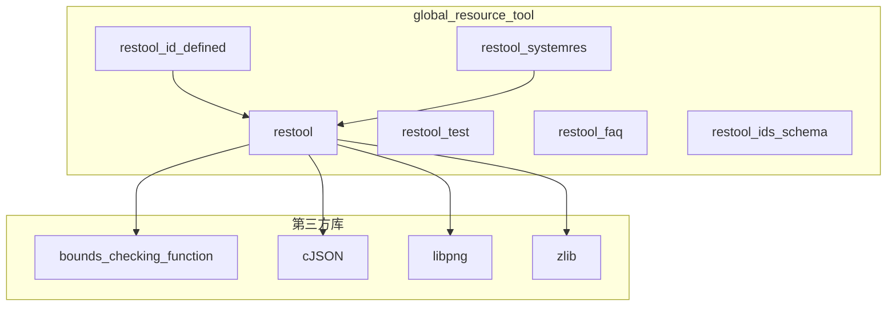

# GN 构建目标

## 目的与适用范围

本文档介绍 `global_resource_tool` 的 GN 构建配置，包括所有 targets、依赖关系和构建参数。

**适用对象**: 构建工程师、系统集成人员

---

## 构建文件清单

| 文件 | 路径 | 说明 |
|------|------|------|
| BUILD.gn | `//developtools/global_resource_tool/BUILD.gn` | 主构建脚本 |
| restool.gni | `//developtools/global_resource_tool/restool.gni` | 变量定义 |
| bundle.json | `//developtools/global_resource_tool/bundle.json` | 组件配置 |

---

## GN Targets

### 1. restool（主可执行文件）

**定义** (`BUILD.gn:18-93`):
```gn
ohos_executable("restool") {
  sources = [
    "src/append_compiler.cpp",
    "src/binary_file_packer.cpp",
    "src/cmd/cmd_parser.cpp",
    "src/cmd/dump_parser.cpp",
    "src/cmd/package_parser.cpp",
    "src/compression_parser.cpp",
    "src/config_parser.cpp",
    "src/file_entry.cpp",
    "src/file_manager.cpp",
    "src/generic_compiler.cpp",
    "src/header.cpp",
    "src/i_resource_compiler.cpp",
    "src/id_defined_parser.cpp",
    "src/id_worker.cpp",
    "src/json_compiler.cpp",
    "src/key_parser.cpp",
    "src/overlap_binary_file_packer.cpp",
    "src/overlap_compiler.cpp",
    "src/reference_parser.cpp",
    "src/resconfig_parser.cpp",
    "src/resource_append.cpp",
    "src/resource_check.cpp",
    "src/resource_compiler_factory.cpp",
    "src/resource_directory.cpp",
    "src/resource_dumper.cpp",
    "src/resource_item.cpp",
    "src/resource_merge.cpp",
    "src/resource_module.cpp",
    "src/resource_overlap.cpp",
    "src/resource_pack.cpp",
    "src/resource_packer_factory.cpp",
    "src/resource_table.cpp",
    "src/resource_util.cpp",
    "src/restool.cpp",
    "src/restool_errors.cpp",
    "src/select_compile_parse.cpp",
    "src/thread_pool.cpp",
    "src/translatable_parser.cpp",
  ]

  include_dirs = [
    "include",
    "//third_party/bounds_checking_function/include",
  ]

  deps = [
    "//third_party/bounds_checking_function:libsec_static",
    "//third_party/cJSON:cjson_static",
    "//third_party/libpng:libpng_static",
  ]

  if (is_arkui_x) {
    deps += [ "//third_party/zlib:libz" ]
  } else {
    external_deps = [ "zlib:libz" ]
  }
  use_exceptions = true
  cflags = [ "-std=c++17" ]
  if (is_mingw) {
    ldflags = [
      "-static",
      "-lws2_32",
      "-lshlwapi",
    ]
  }
  if (is_linux) {
    defines = [ "__LINUX__" ]
  }
  if (is_mac) {
    defines = [ "__MAC__" ]
  }
  subsystem_name = "developtools"
  part_name = "global_resource_tool"
}
```

**属性说明**:
| 属性 | 值 | 说明 |
|------|-----|------|
| 类型 | `ohos_executable` | 可执行文件 |
| 源文件 | 38 个 .cpp | 完整源码列表 |
| 包含目录 | `include` + 第三方 | 头文件搜索路径 |
| 编译标准 | C++17 | `-std=c++17` |
| 异常支持 | 开启 | `use_exceptions = true` |
| 子系统 | developtools | 所属子系统 |
| 组件名 | global_resource_tool | 组件标识 |

**平台特定配置**:
| 平台 | 配置 |
|------|------|
| Windows (MinGW) | 静态链接，链接 ws2_32 和 shlwapi |
| Linux | 定义 `__LINUX__` |
| macOS | 定义 `__MAC__` |
| ArkUI-X | 使用第三方 zlib |
| 其他 | 使用系统 zlib |

---

### 2. restool_test（单元测试）

**定义** (`BUILD.gn:95-97`):
```gn
ohos_unittest_py("restool_test") {
  sources = [ "test/test.py" ]
}
```

**说明**:
- 类型: Python 单元测试
- 测试脚本: `test/test.py`
- 运行方式: `python test.py ./restool ./out`

---

### 3. restool_id_defined（ID 定义文件复制）

**定义** (`BUILD.gn:99-106`):
```gn
ohos_copy("restool_id_defined") {
  sources = [ "${id_defined_path}" ]
  outputs = [ get_label_info(":restool($host_toolchain)", "root_out_dir") +
              "/developtools/global_resource_tool/{{source_file_part}}" ]
  deps = [ ":restool($host_toolchain)" ]
  subsystem_name = "developtools"
  part_name = "global_resource_tool"
}
```

**说明**:
- 类型: 文件复制任务
- 源文件: `${id_defined_path}` 变量指向的文件
- 目标: 构建输出目录
- 依赖: restool 可执行文件

---

### 4. restool_systemres（系统资源预构建）

**定义** (`BUILD.gn:108-112`):
```gn
ohos_prebuilt_etc("restool_systemres") {
  source = "${id_defined_path}"
  subsystem_name = "developtools"
  part_name = "global_resource_tool"
}
```

**说明**:
- 类型: 预构建配置
- 源文件: `${id_defined_path}`
- 用途: 系统资源 ID 定义

---

### 5. restool_faq（FAQ 配置）

**定义** (`BUILD.gn:114-119`):
```gn
ohos_prebuilt_etc("restool_faq") {
  source = "${restool_faq_path}"
  subsystem_name = "developtools"
  part_name = "global_resource_tool"
  install_enable = false
}
```

**说明**:
- 类型: 预构建配置
- 源文件: `${restool_faq_path}`
- 安装: 不安装到系统（仅构建时使用）

---

### 6. restool_ids_schema（ID Schema）

**定义** (`BUILD.gn:121-126`):
```gn
ohos_prebuilt_etc("restool_ids_schema") {
  source = "${ids_schema_path}"
  subsystem_name = "developtools"
  part_name = "global_resource_tool"
  install_enable = false
}
```

**说明**:
- 类型: 预构建配置
- 源文件: `${ids_schema_path}`
- 用途: ID 定义文件 schema

---

## 变量定义

### restool.gni

**定义** (`restool.gni:14-16`):
```gn
id_defined_path = "//base/global/system_resources/systemres/main/resources/base/element/id_defined.json"
restool_faq_path = "//developtools/global_resource_tool/restool_faq.json"
ids_schema_path = "//developtools/global_resource_tool/id_defines.json"
```

**变量说明**:
| 变量 | 路径 | 说明 |
|------|------|------|
| `id_defined_path` | `//base/global/system_resources/.../id_defined.json` | 系统资源 ID 定义 |
| `restool_faq_path` | `//developtools/global_resource_tool/restool_faq.json` | FAQ 配置 |
| `ids_schema_path` | `//developtools/global_resource_tool/id_defines.json` | ID Schema |

---

## 依赖关系

### 第三方依赖

| 依赖 | Target | 用途 |
|------|--------|------|
| bounds_checking_function | `//third_party/bounds_checking_function:libsec_static` | 安全函数 |
| cJSON | `//third_party/cJSON:cjson_static` | JSON 解析 |
| libpng | `//third_party/libpng:libpng_static` | PNG 处理 |
| zlib | `//third_party/zlib:libz` 或 `zlib:libz` | 压缩 |

### 依赖图



---

## 构建命令

### 完整构建

```bash
# 构建 restool 可执行文件
gn gen out
ninja -C out developtools/global_resource_tool:restool
```

### 构建所有目标

```bash
ninja -C out developtools/global_resource_tool:all
```

### 运行测试

```bash
ninja -C out developtools/global_resource_tool:restool_test
```

---

## 组件配置

### bundle.json

**定义** (`bundle.json`):
```json
{
    "name": "@ohos/global_resource_tool",
    "description": "OpenHarmony resource compile.",
    "version": "4.0",
    "license": "Apache License 2.0",
    "pubiishAs": "code-segment",
    "segment": {
      "destPath": "developtools/global_resource_tool"
    },
    "component": {
      "name": "global_resource_tool",
      "subsystem": "developtools",
      "syscap": [],
      "feature": [],
      "adapted_system_type": [ "mini", "small", "standard" ],
      "rom": "0KB",
      "ram": "0KB",
      "deps": {
        "components": [
          "zlib"
        ],
        "third_party": [
          "bounds_checking_function",
          "cJSON",
          "libpng"
        ]
      },
      "build": {
        "sub_component": [ "//developtools/global_resource_tool:restool" ],
        "inner_kits": [],
        "test": []
      }
    }
}
```

**关键配置**:
| 字段 | 值 | 说明 |
|------|-----|------|
| name | `@ohos/global_resource_tool` | 组件名 |
| subsystem | `developtools` | 所属子系统 |
| version | `4.0` | 版本号 |
| adapted_system_type | mini, small, standard | 适配系统类型 |
| deps.components | zlib | 系统组件依赖 |
| deps.third_party | bounds_checking_function, cJSON, libpng | 第三方依赖 |
| build.sub_component | `//developtools/global_resource_tool:restool` | 构建入口 |

---

## 编译选项详解

### C++ 标准

```gn
cflags = [ "-std=c++17" ]
```

使用 C++17 标准编译。

### 异常支持

```gn
use_exceptions = true
```

启用 C++ 异常处理。

### 平台宏定义

| 平台 | 宏定义 | 用途 |
|------|--------|------|
| Linux | `__LINUX__` | 平台特定代码 |
| macOS | `__MAC__` | 平台特定代码 |
| Windows | `_WIN32` | 平台特定代码（代码中定义） |

### Windows 链接选项

```gn
ldflags = [
  "-static",       # 静态链接
  "-lws2_32",      # Winsock2
  "-lshlwapi",     # Shell API
]
```

---

## 相关文档

- [编译产物](08_Build_Artifacts.md) - 构建输出文件
- [项目概览](00_Overview.md) - 项目定位
