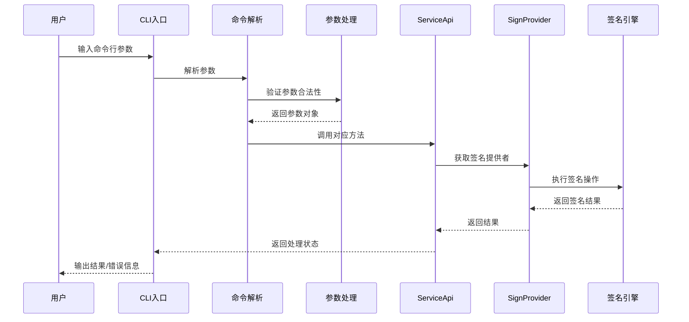
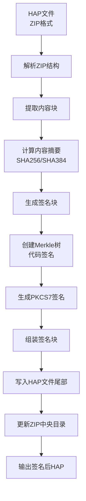
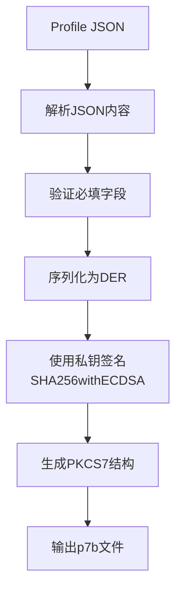
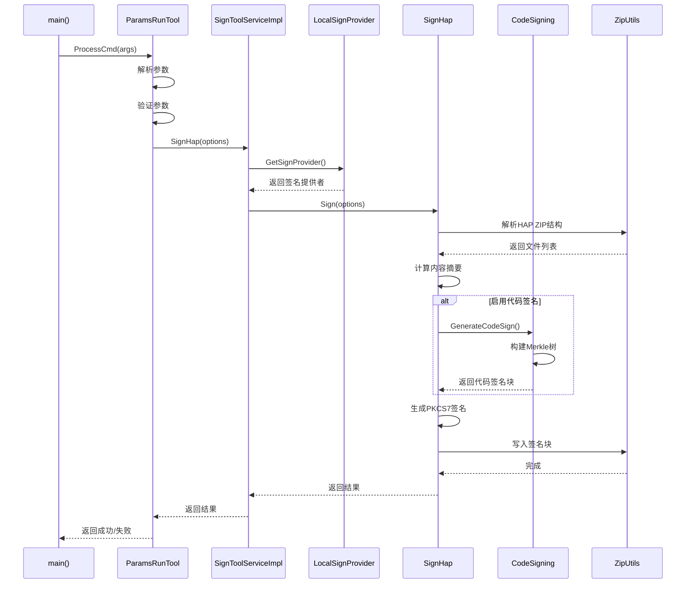
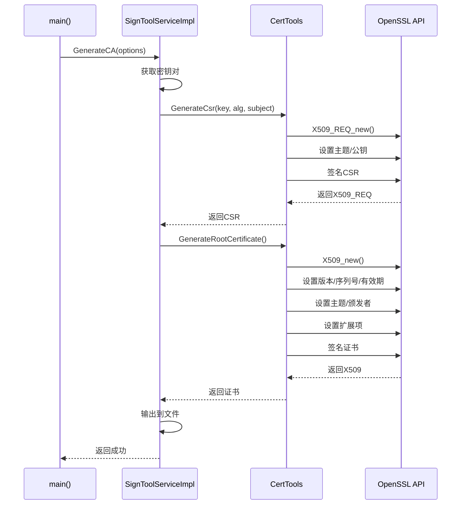

# 架构说明

## 目的

本文档介绍 hapsigner 的系统架构，包括组件关系、数据流和关键时序，帮助开发者理解系统设计和实现原理。

## 适用范围

- 需要理解系统架构的开发者
- 需要扩展或修改功能的维护者

---

## 架构概览

### 整体架构图

```
┌─────────────────────────────────────────────────────────────────────────────┐
│                              用户接口层                                       │
│  ┌─────────────────┐    ┌─────────────────┐    ┌─────────────────┐         │
│  │   CLI 命令行     │    │   Java API      │    │   C++ API       │         │
│  │  (hap-sign-tool)│    │ (ServiceApi)    │    │ (ServiceApi)    │         │
│  └────────┬────────┘    └────────┬────────┘    └────────┬────────┘         │
└───────────┼──────────────────────┼──────────────────────┼──────────────────┘
            │                      │                      │
            ▼                      ▼                      ▼
┌─────────────────────────────────────────────────────────────────────────────┐
│                              服务接口层                                       │
│  ┌─────────────────────────────────────────────────────────────────────┐   │
│  │                      ServiceApi 接口定义                              │   │
│  │  ┌─────────────┐ ┌─────────────┐ ┌─────────────┐ ┌────────────────┐ │   │
│  │  │GenerateKeyStore│ │ GenerateCsr │ │ GenerateCert│ │ GenerateCA     │ │   │
│  │  └─────────────┘ └─────────────┘ └─────────────┘ └────────────────┘ │   │
│  │  ┌─────────────┐ ┌─────────────┐ ┌─────────────┐ ┌────────────────┐ │   │
│  │  │GenerateAppCert │ │GenerateProfileCert│ │ SignProfile │ │ VerifyProfile  │ │   │
│  │  └─────────────┘ └─────────────┘ └─────────────┘ └────────────────┘ │   │
│  │  ┌─────────────┐ ┌─────────────────┐                                 │   │
│  │  │   SignHap   │ │ VerifyHapSigner │                                 │   │
│  │  └─────────────┘ └─────────────────┘                                 │   │
│  └─────────────────────────────────────────────────────────────────────┘   │
└─────────────────────────────────────────────────────────────────────────────┘
            │
            ▼
┌─────────────────────────────────────────────────────────────────────────────┐
│                              业务逻辑层                                       │
│  ┌──────────────┐  ┌──────────────┐  ┌──────────────┐  ┌──────────────┐    │
│  │   Signer     │  │   Profile    │  │   HAP Sign   │  │ Code Signing │    │
│  │   模块       │  │   模块       │  │   模块       │  │   模块       │    │
│  │              │  │              │  │              │  │              │    │
│  │ • LocalSigner│  │ • ProfileSign│  │ • SignHap    │  │ • FsVerity   │    │
│  │ • RemoteSigner│ │ • ProfileVerify│ │ • SignElf    │  │ • MerkleTree │    │
│  │ • SignerFactory│ │ • PKCS7Data  │  │ • SignBin    │  │ • CodeSignBlock│  │
│  └──────┬───────┘  └──────┬───────┘  └──────┬───────┘  └──────┬───────┘    │
└─────────┼─────────────────┼─────────────────┼─────────────────┼────────────┘
          │                 │                 │                 │
          ▼                 ▼                 ▼                 ▼
┌─────────────────────────────────────────────────────────────────────────────┐
│                              基础能力层                                       │
│  ┌──────────────┐  ┌──────────────┐  ┌──────────────┐  ┌──────────────┐    │
│  │   CertTools  │  │   ZipUtils   │  │   OpenSSL    │  │   FileUtils  │    │
│  │   证书工具    │  │   ZIP工具    │  │   加密库     │  │   文件工具    │    │
│  └──────────────┘  └──────────────┘  └──────────────┘  └──────────────┘    │
└─────────────────────────────────────────────────────────────────────────────┘
```

---

## 组件关系

### 1. 命令处理流程



### 2. HAP 签名数据流



### 3. Profile 签名数据流



---

## 核心模块详解

### 1. 签名器模块 (Signer)

**职责**: 提供不同类型的签名实现

**类图**:
```
┌─────────────────────────────────────────────────────────┐
│                      <<interface>>                       │
│                        ISigner                           │
│  + sign(data: byte[]): byte[]                            │
│  + getCertificateChain(): List<Certificate>              │
└─────────────────────────┬───────────────────────────────┘
                          │
          ┌───────────────┼───────────────┐
          │               │               │
          ▼               ▼               ▼
┌─────────────────┐ ┌─────────────────┐ ┌─────────────────┐
│   LocalSigner   │ │  RemoteSigner   │ │   LocalJKSSign  │
│   (本地签名)     │ │   (远程签名)     │ │   Provider      │
│                 │ │                 │ │   (JKS提供者)   │
│ • 使用本地私钥   │ │ • 调用远程服务   │ │                 │
│ • PKCS7签名     │ │ • 网络通信       │ │ • 密钥库管理    │
└─────────────────┘ └─────────────────┘ └─────────────────┘
```

**代码证据**: `hapsigntool/hap_sign_tool_lib/src/main/java/com/ohos/hapsigntool/signer/ISigner.java`

### 2. HAP 签名模块

**职责**: 处理 HAP 文件的签名和验证

**关键类**:

| 类名 | 职责 | 代码位置 |
|------|------|----------|
| SignHap | HAP 签名主逻辑 | `hap/sign/SignHap.java` |
| VerifyHap | HAP 验签主逻辑 | `hap/verify/VerifyHap.java` |
| SigningBlock | 签名块数据结构 | `hap/entity/SigningBlock.java` |
| SignProvider | 签名提供者抽象 | `hap/provider/SignProvider.java` |

**签名块结构**:
```
┌─────────────────────────────────────────────────────────────┐
│                      HAP 文件结构                            │
├─────────────────────────────────────────────────────────────┤
│  ZIP 内容区                                                   │
│  ┌─────────────┐ ┌─────────────┐ ┌─────────────┐            │
│  │ 文件内容1   │ │ 文件内容2   │ │ ...         │            │
│  └─────────────┘ └─────────────┘ └─────────────┘            │
├─────────────────────────────────────────────────────────────┤
│  签名块 (Signing Block)                                       │
│  ┌─────────────────────────────────────────────────────────┐ │
│  │ 签名块头 (SignHead)                                      │ │
│  │  - 魔数: 0x6e75616f6e6168 ("haonuan")                    │ │
│  │  - 版本号                                                │ │
│  │  - 块大小                                                │ │
│  ├─────────────────────────────────────────────────────────┤ │
│  │ 签名内容信息 (SignContentInfo)                           │ │
│  │  - 摘要算法 (SHA256/SHA384)                              │ │
│  │  - 内容摘要值                                            │ │
│  ├─────────────────────────────────────────────────────────┤ │
│  │ PKCS7 签名数据                                           │ │
│  │  - 证书链                                                │ │
│  │  - 签名值                                                │ │
│  ├─────────────────────────────────────────────────────────┤ │
│  │ 代码签名数据 (可选)                                       │ │
│  │  - FsVerity 描述符                                       │ │
│  │  - Merkle 树根哈希                                       │ │
│  └─────────────────────────────────────────────────────────┘ │
├─────────────────────────────────────────────────────────────┤
│  ZIP 中央目录                                                 │
└─────────────────────────────────────────────────────────────┘
```

### 3. 代码签名模块 (Code Signing)

**职责**: 实现基于 fsverity 的强制代码签名

**架构图**:
```
┌─────────────────────────────────────────────────────────────┐
│                    代码签名流程                               │
├─────────────────────────────────────────────────────────────┤
│                                                             │
│  1. 文件分块                                                  │
│     ┌─────────┐ ┌─────────┐ ┌─────────┐ ┌─────────┐        │
│     │ Block 0 │ │ Block 1 │ │ Block 2 │ │ Block 3 │ ...    │
│     │ 4KB     │ │ 4KB     │ │ 4KB     │ │ 4KB     │        │
│     └────┬────┘ └────┬────┘ └────┬────┘ └────┬────┘        │
│          │           │           │           │              │
│          ▼           ▼           ▼           ▼              │
│     ┌─────────┐ ┌─────────┐ ┌─────────┐ ┌─────────┐        │
│     │ Hash 0  │ │ Hash 1  │ │ Hash 2  │ │ Hash 3  │        │
│     └────┬────┘ └────┬────┘ └────┬────┘ └────┬────┘        │
│          └───────────┴───────────┴───────────┘              │
│                      │                                      │
│                      ▼                                      │
│               ┌─────────────┐                               │
│               │  Merkle Tree │                               │
│               │   构建      │                               │
│               │             │                               │
│               │   Root      │                               │
│               │   Hash      │                               │
│               └──────┬──────┘                               │
│                      │                                      │
│                      ▼                                      │
│               ┌─────────────┐                               │
│               │ FsVerity    │                               │
│               │ Descriptor  │                               │
│               │  + 签名     │                               │
│               └─────────────┘                               │
│                                                             │
└─────────────────────────────────────────────────────────────┘
```

**关键类**:

| 类名 | 职责 | 代码位置 |
|------|------|----------|
| CodeSigning | 代码签名主入口 | `codesigning/sign/CodeSigning.java` |
| FsVerityGenerator | FsVerity 结构生成 | `codesigning/fsverity/FsVerityGenerator.java` |
| MerkleTreeBuilder | Merkle 树构建 | `codesigning/fsverity/MerkleTreeBuilder.java` |

**代码证据**: `hapsigntool_cpp/codesigning/fsverity/include/fs_verity_generator.h`

### 4. Profile 签名模块

**职责**: 处理应用分发配置文件的签名和验证

**数据流**:
```
┌──────────────┐     ┌──────────────┐     ┌──────────────┐
│ Profile JSON │────▶│  字段验证    │────▶│  DER编码    │
└──────────────┘     └──────────────┘     └──────┬───────┘
                                                 │
┌──────────────┐     ┌──────────────┐           │
│  私钥 (P12)  │────▶│  PKCS7签名   │◀──────────┘
└──────────────┘     └──────┬───────┘
                            │
                            ▼
                     ┌──────────────┐
                     │   p7b文件    │
                     └──────────────┘
```

---

## 线程模型

### Java 版本

**线程策略**: 单线程执行

**说明**:
- CLI 工具为命令行批处理工具，无需多线程
- 每个命令独立执行，执行完成后进程退出
- 密码输入使用交互式终端读取（非多线程安全）

### C++ 版本

**线程策略**: 单线程执行

**说明**:
- 与 Java 版本保持一致的设计理念
- 使用 OpenSSL 的默认配置（非线程安全模式）
- 资源管理使用 RAII 模式

---

## 关键时序

### 1. 应用签名时序



### 2. 证书生成时序



---

## 数据模型

### 1. Options 参数模型

**代码证据**: `hapsigntool_cpp/common/include/options.h`

```cpp
// 核心参数类型
class Options {
    // 密钥相关
    KEY_ALIAS           // 密钥别名
    KEY_PWD             // 密钥密码
    KEY_STORE_FILE      // 密钥库文件
    KEY_STORE_PWD       // 密钥库密码
    
    // 证书相关
    ISSUER              // 颁发者
    ISSUER_KEY_ALIAS    // 颁发者密钥别名
    SUBJECT             // 主题
    SIGN_ALG            // 签名算法
    
    // 文件相关
    IN_FILE             // 输入文件
    OUT_FILE            // 输出文件
    PROFILE_FILE        // Profile文件
    APP_CERT_FILE       // 应用证书文件
    
    // 模式相关
    MODE                // 签名模式(localSign/remoteSign)
    SIGN_CODE           // 是否启用代码签名
    IN_FORM             // 输入格式(zip/elf/bin)
}
```

### 2. 签名块数据结构

**代码证据**: `hapsigntool_cpp/hap/entity/include/signing_block.h`

```cpp
// 签名块头部
struct SignHead {
    uint64_t magic;           // 魔数: 0x6e75616f6e6168
    uint32_t version;         // 版本号
    uint32_t blockSize;       // 块大小
};

// 签名内容信息
struct SignContentInfo {
    int32_t digestAlgorithm;  // 摘要算法
    std::vector<uint8_t> digest;  // 摘要值
};
```

---

## 相关链接

- [目录结构](01_Directory_Structure.md) - 了解代码组织
- [API 参考](03_API_Reference.md) - 查看接口详情
- [构建系统](04_Build_System.md) - 了解构建配置
