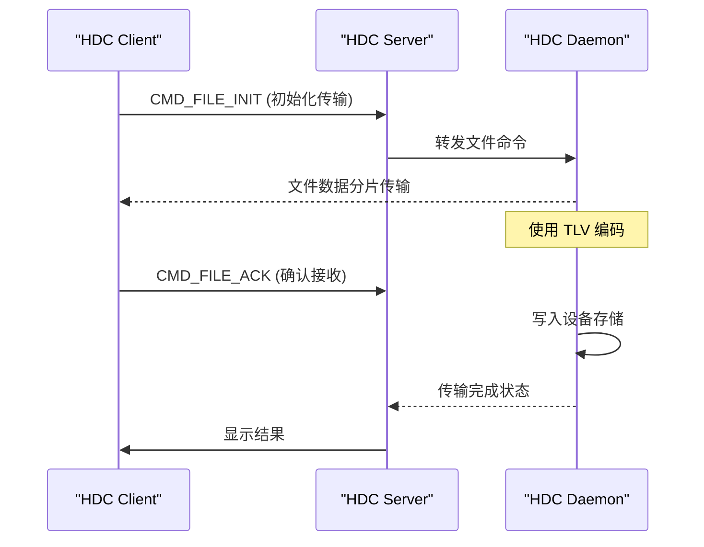
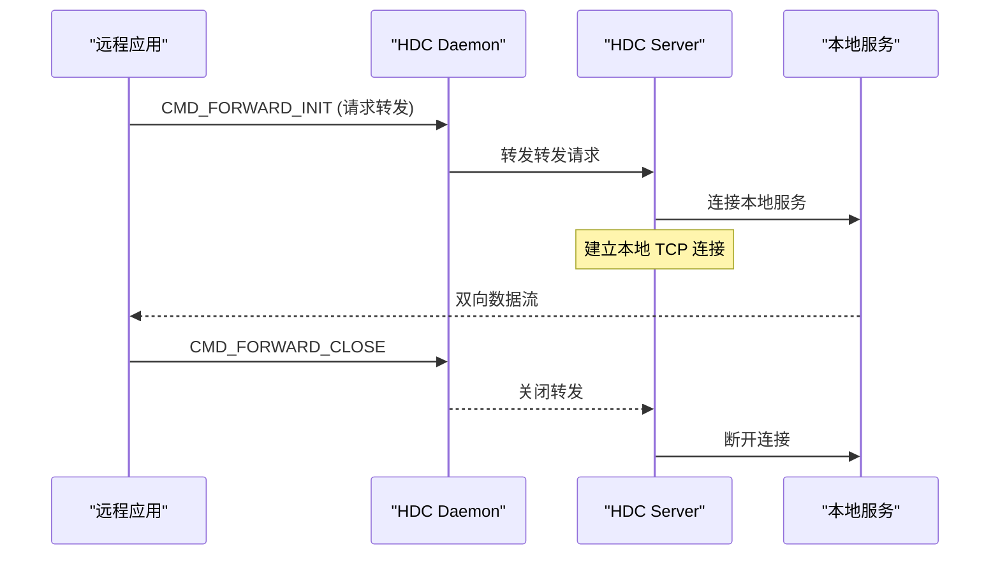
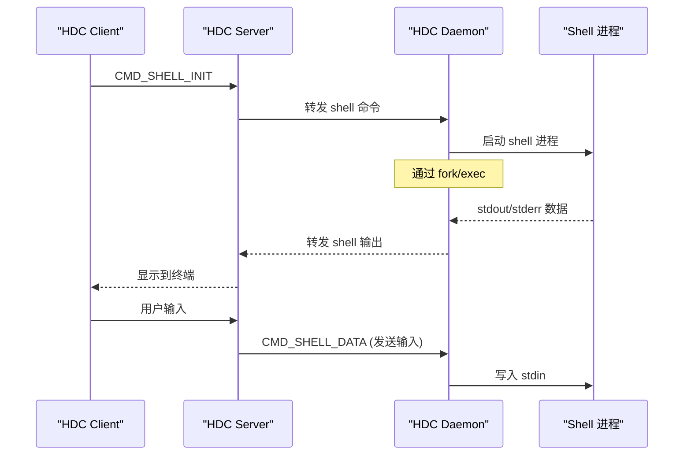
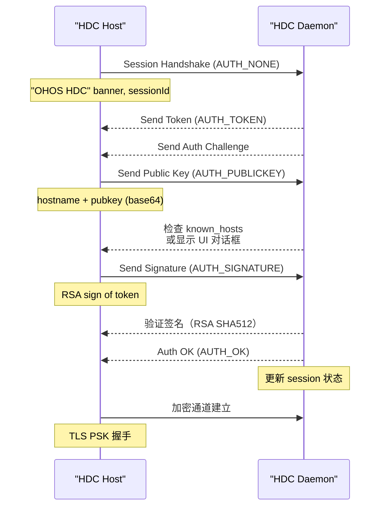
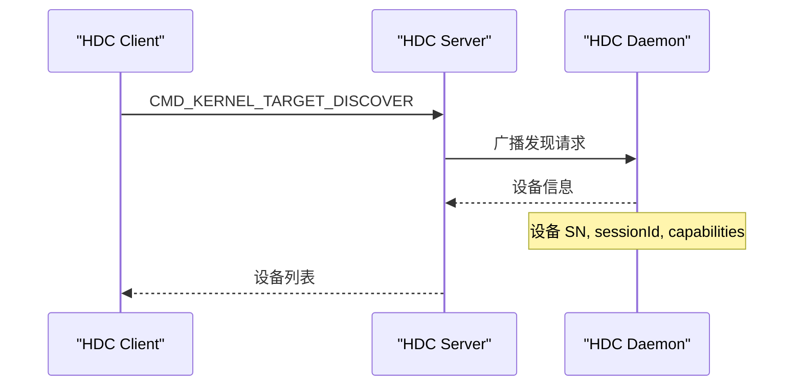

# 架构说明

## 目的

描述 hdc 的三部分架构、组件图、数据流、线程模型和关键时序。

## 适用范围

本文档适用于：
- 理解 Client/Server/Daemon 三部分架构
- 理解通信协议和数据流
- 理解线程模型和并发机制

## 相关跳转

- [项目概览](./00_Overview.md) - 项目定位和核心能力
- [目录结构](./02_Directory_Structure.md) - 模块职责详情
- [对外 API](./04_External_API.md) - JDWP 接口
- [内部 API](./05_Internal_API.md) - 模块间接口

---

## 三部分架构

### 整体架构

```
┌──────────────────────────────────────────────────────────────────────┐
│                     OpenHarmony 开发环境（PC）                  │
├──────────────────────────────────────────────────────────────────────┤
│                                                              │
│  ┌──────────────┐                ┌──────────────┐      │
│  │  HDC Client  │                │  HDC Server  │      │
│  │  (命令行)   │◄─────────►│  (后台进程)  │      │
│  └──────────────┘                └───────┬─────┘      │
│                                           │              │
│                                           ▼              │
├──────────────────────────────────────────────────────────────────────┤
│                         USB / TCP / UART               │
└───────────────────────────────────────┬────────────────────────┘
                                      │
                                      ▼
┌──────────────────────────────────────────────────────────────────────┐
│                   OpenHarmony 设备                          │
│                                                               │
│  ┌──────────────┐                                          │
│  │ HDC Daemon  │                                          │
│  │ (守护进程)   │                                          │
│  └──────────────┘                                          │
│         │                                                     │
│         ▼                                                     │
└──────────────────────────────────────────────────────────────────────┘
```

### 三部分说明

#### 1. HDC Client

**位置**：`src/host/client.cpp`

**职责**：
- 解析命令行参数
- 向 HDC Server 发送请求
- 显示响应结果
- 处理文件 I/O（stdin/stdout）

**证据**：`README_zh.md:22`

#### 2. HDC Server

**位置**：`src/host/server.cpp`

**职责**：
- 管理多个 Client 连接
- 管理到 Device 的 Session
- 连接复用（多个 Client 共享一个 Daemon 连接）
- 处理本地命令（如 checkserver）

**证据**：`README_zh.md:24`

#### 3. HDC Daemon

**位置**：`src/daemon/daemon.cpp`

**职责**：
- 接受来自 Host Server 的连接
- 处理认证握手
- 分发命令到具体任务（Shell、文件、转发等）
- 管理设备资源（USB、文件系统等）

**证据**：`README_zh.md:26`

---

## 通信协议

### 协议层次

```
┌─────────────────────────────────────────────────────────┐
│              应用层命令（HdcCommand）           │
└───────────────┬─────────────────────────────────────┘
                │
                ▼
┌─────────────────────────────────────────────────────────┐
│            TLV 编码层（TlvBuf）              │
└───────────────┬─────────────────────────────────────┘
                │
                ▼
┌─────────────────────────────────────────────────────────┐
│         传输层（Session/Channel）             │
│         - 控制通道（socketpair/uds/tcp）     │
│         - 数据通道（socketpair/tcp/usb）      │
└───────────────┬─────────────────────────────────────┘
                │
                ▼
┌─────────────────────────────────────────────────────────┐
│       物理传输层（USB/TCP/UART）         │
└─────────────────────────────────────────────────────────┘
```

### 消息格式

#### 控制消息结构

**证据**：`src/common/session.h:50-55`

```cpp
struct CtrlStruct {
    InnerCtrlCommand command;      // 命令类型
    uint32_t channelId;         // 通道 ID
    uint8_t dataSize;           // 数据大小
    uint8_t data[BUF_SIZE_MICRO];  // 数据载荷
};
```

#### 负载保护

**证据**：`src/common/session.h:56-61`

```cpp
struct PayloadProtect {
    uint32_t channelId;         // 通道 ID
    uint32_t commandFlag;        // 命令标志
    uint8_t checkSum;           // 校验和（可选）
    uint8_t vCode;              // 版本码
};
```

#### USB 协议头

**证据**：`src/common/define_plus.h:78-83`

```cpp
#pragma pack(push)
#pragma pack(1)
struct USBHead {
    uint8_t flag[2];           // "HW" 标记
    uint8_t option;            // USB_OPTION_HEADER/RESET 等
    uint32_t sessionId;        // 会话 ID
    uint32_t dataSize;         // 载荷大小
};
#pragma pack(pop)
```

---

## 数据流

### 文件传输数据流



### 端口转发数据流



### Shell 执行数据流



---

## 线程模型

### libuv 线程池

**证据**：`BUILD.gn:20-23`

```gn
declare_args() {
    hdcd_uv_thread_size = 4     # Daemon UV 线程数
    hdc_uv_thread_size = 128   # Host UV 线程数
}
```

**说明**：
- **Host 端**：128 个 UV 工作线程（处理大量 client 请求）
- **Daemon 端**：4 个 UV 工作线程（设备端资源受限）
- **异步 I/O**：使用 libuv 事件循环

### Session 工作线程

**证据**：`src/common/session.h:142`

```cpp
HdcSessionBase(bool serverOrDaemonIn, size_t uvThreadSize = SIZE_THREAD_POOL);
```

**说明**：
- 每个 Session 有独立的 uv_loop_t
- 主线程和工作线程通过 socketpair 通信
- `ctrlFd[2]` - 控制通道
- `dataFd[2]` - 数据通道

### USB 工作线程

**证据**：`src/common/define_plus.h:118-178`

```cpp
struct HdcUSB {
    ...
    HostUSBEndpoint hostBulkIn;
    HostUSBEndpoint hostBulkOut;
    ...
};
```

**说明**：
- USB Bulk IN/OUT 端点使用独立的线程
- 使用 mutex 保护 USB 设备句柄
- 使用 condition_variable 同步传输完成

---

## 关键时序

### 认证握手时序



### 设备发现时序



---

## 组件依赖关系

```
HdcSessionBase (session.h)
    ├── HdcDaemon (daemon.h) - Device 端实现
    │   ├── HdcFile (file.cpp) - 文件传输任务
    │   ├── HdcForward (forward.cpp) - 端口转发
    │   ├── HdcShell (shell.cpp) - Shell 执行
    │   └── HdcDaemonUnity (daemon_unity.cpp) - Unity 集成
    │
    └── HdcServer (server.h) - PC Server 实现
        ├── HdcClient (client.cpp) - PC Client 实现
        └── 多个 HdcChannel (channel.cpp) - 逻辑通道

Common Modules (src/common/)
    ├── HdcAuth (auth.cpp) - RSA 认证
    ├── HdcSSL (hdc_ssl.cpp) - TLS 加密
    ├── HdcUSBBase (usb.cpp) - USB 传输
    ├── HdcTCPBase (tcp.cpp) - TCP 传输
    ├── TlvBuf (tlv.cpp) - TLV 编码
    ├── Compress/Decompress (compress.cpp/decompress.cpp) - 压缩
    └── MemoryPool (memory_pool.cpp) - 内存池
```

---

## 关键结论

1. **三部分架构清晰**：Client、Server、Daemon 各司其职
2. **自定义协议**：不使用 Binder/SystemAbility，使用 Socket
3. **libuv 异步模型**：Host 端使用大线程池（128），Daemon 使用小线程池（4）
4. **协议层次分明**：应用层 → TLV 层 → 传输层 → 物理层
5. **认证机制完善**：支持 RSA 公钥认证和 TLS PSK 加密
6. **多传输方式支持**：USB、TCP、UART 统一抽象

---

## 待确认事项

**TODO(需确认)**：
1. 各传输方式的性能指标对比
2. 并发 Session 的资源限制
3. 网络断线重连机制细节
