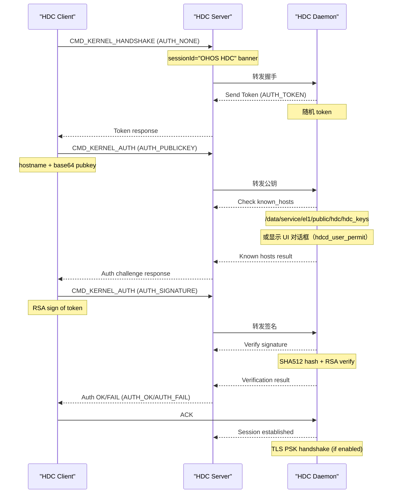
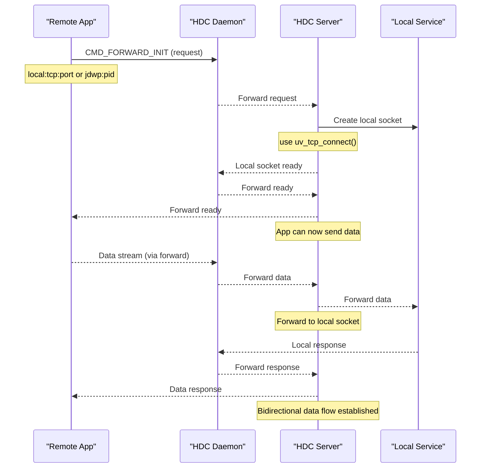
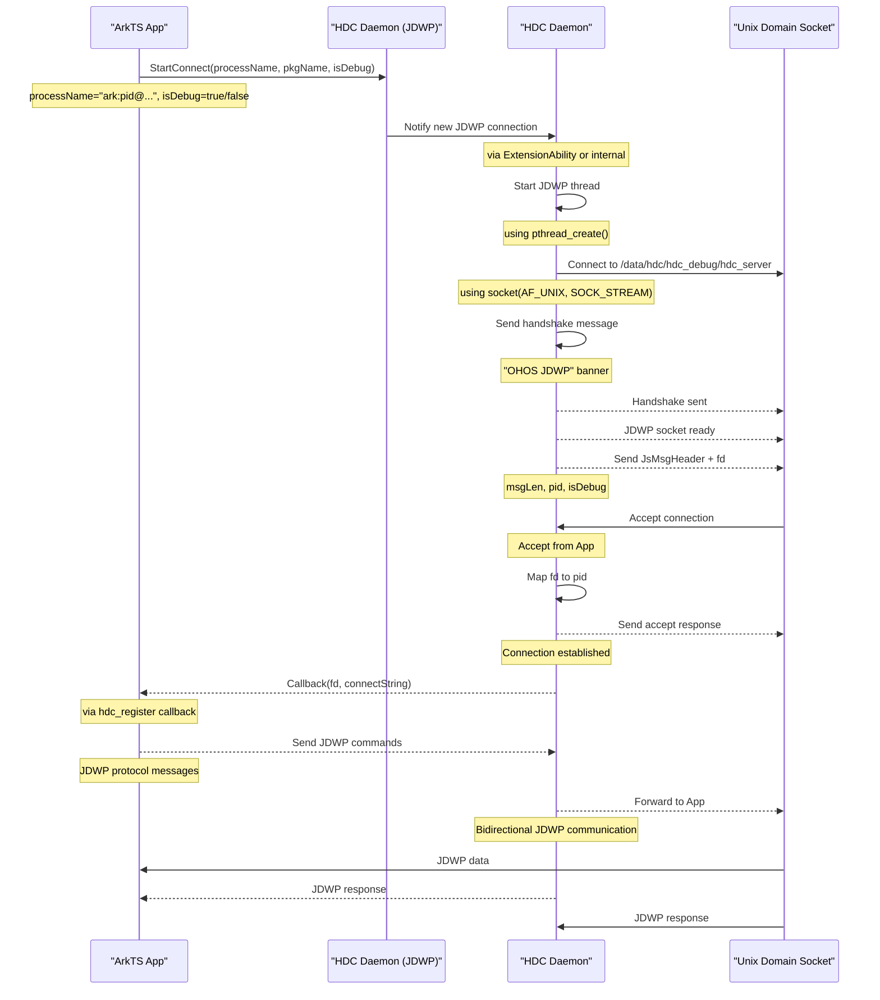

# 关键调用链图

## 目的

描述 hdc 项目中的关键调用链，从入口到核心逻辑的完整流程。

## 适用范围

本文档适用于：
- 理解数据流向
- 跟踪函数调用路径
- 调试和性能分析

## 相关跳转

- [架构说明](./03_Architecture.md) - 组件关系和数据流
- [内部 API](./05_Internal_API.md) - 模块间接口

---

## 认证调用链

### Client → Server → Daemon 认证流程



**关键代码路径**：
- 握手：`src/common/session.h:28-48` - `SessionHandShake` 结构
- Token 生成：`src/daemon/daemon.cpp` - TODO(需确认)
- 公钥发送：`src/common/auth.cpp` - RSA 加密/签名
- 已知主机检查：`src/daemon/daemon.cpp:463-485` - `AlreadyInKnownHosts()`
- 签名验证：`src/daemon/daemon.cpp:590-626` - `RsaSignVerify()`

---

## 文件传输调用链

### Client → Server → Daemon 文件发送流程

```mermaid
sequenceDiagram
    participant Client as "HDC Client"
    participant Server as "HDC Server"
    participant Daemon as "HDC Daemon"

    Client->>Server: CMD_FILE_INIT (init)
    Note over Client: file path, options
    Server->>Daemon: 转发文件命令
    Daemon-->>Server: Request first chunk
    Server-->>Client: ACK
    Client->>Server: Send file data (chunk 1)
    Note over Client: Use TLV encoding
    Server->>Daemon: Forward chunk 1
    Daemon-->>Server: ACK
    Client->>Server: Send file data (chunk 2)
    Server->>Daemon: Forward chunk 2
    Daemon-->>Server: ACK
    loop Loop (repeat for each chunk)
    Client->>Server: CMD_FILE_END (end)
    Server->>Daemon: Forward end
    Daemon->>Daemon: Write to device storage
    Note over Daemon: use Base::WriteBinFile()
    Daemon-->>Server: Transfer complete
    Server-->>Client: File result
    Note over Server: success/failure status
```

**关键代码路径**：
- 文件命令：`src/common/define_enum.h:3000-3099` - `CMD_FILE_INIT`, `CMD_FILE_END`
- 文件任务：`src/common/transfer.h` - `HdcFile` 类
- TLV 编码：`src/common/tlv.cpp` - `TlvBuf` 类
- 文件 I/O：`src/common/base.cpp:1752-1778` - `WriteBinFile()` 函数

---

## 端口转发调用链

### Client → Server → Daemon 转发初始化



**关键代码路径**：
- 转发命令：`src/common/define_enum.h:2500-2599` - `CMD_FORWARD_INIT`
- Daemon 转发：`src/daemon/daemon_forward.cpp`
- Server 转发：`src/host/host_forward.cpp`
- 转发类型：`src/common/forward.h:34-41` - `FORWARD_TYPE` 枚举

---

## JDWP 连接调用链

### App → JDWP Simulator → JVM



**关键代码路径**：
- JDWP 启动：`src/register/hdc_connect.cpp:141-160` - `StartConnect()` 函数
- JDWP 模拟器：`src/daemon/jdwp.cpp` - JDWP socket 管理
- JDWP 消息头：`src/daemon/jdwp.h:44-52` - `JsMsgHeader` 结构
- 回调接口：`src/register/hdc_connect.h:22-33` - `Callback` 类型

---

## Shell 执行调用链

### Client → Server → Daemon Shell 流程

```mermaid
sequenceDiagram
    participant Terminal as "User Terminal"
    participant Server as "HDC Server"
    participant Daemon as "HDC Daemon"
    participant Shell as "Shell Process"

    Terminal->>Client: Type command
    Note over Terminal: user input
    Client->>Server: CMD_SHELL_INIT (init)
    Note over Client: options (tty mode, environment vars)
    Server->>Daemon: Forward shell init
    Daemon->>Daemon: Create shell task
    Note over Daemon: use AdminTask()
    Daemon->>Shell: Fork + exec shell
    Note over Daemon: via fork(), execv()
    Shell-->>Daemon: stdout/stderr data
    Daemon-->>Server: Shell output (chunk 1)
    Server-->>Terminal: Display output
    Terminal->>Client: Type next command
    Client->>Server: CMD_SHELL_DATA (input)
    Note over Client: user input to forward
    Server->>Daemon: Forward input
    Daemon->>Shell: Write to stdin
    Note over Daemon: forward to shell stdin
    Shell-->>Daemon: stderr/stdout (output)
    Daemon-->>Server: Shell output (chunk 2)
    Server-->>Terminal: Display output
    Loop until user exits or Ctrl+C
    Terminal->>Client: Exit command
    Client->>Server: CMD_SHELL_CLOSE
    Server->>Daemon: Close shell
    Daemon->>Shell: Terminate process
    Note over Daemon: send SIGTERM
    Daemon-->>Server: Close result
    Server-->>Terminal: Exit result
```

**关键代码路径**：
- Shell 命令：`src/common/define_enum.h:2000-2099` - `CMD_SHELL_INIT/DATA/CLOSE`
- Shell 执行：`src/daemon/shell.cpp` - Shell 进程管理
- 任务创建：`src/common/task.h:22-29` - `TaskCommandDispatch()` 模板

---

## 数据流汇总

### Client 端

```
用户输入
    ↓
HdcClient 解析命令
    ↓
通过 UDS/TCP 发送到 HdcServer
    ↓
HdcServer 处理请求
    ↓
管理 Client 连接
    ↓
显示响应
```

### Server 端

```
HdcServer 接收 Client 请求
    ↓
通过 UDS/TCP 转发到 HdcDaemon
    ↓
管理 Session 和 Channel
    ↓
处理设备连接（USB/TCP）
    ↓
响应 Client
```

### Daemon 端

```
HdcDaemon 接收来自 Server 的请求
    ↓
分发到具体 Task
    ↓
  ├─→ HdcFile: 文件操作
  ├─→ HdcForward: 端口转发
  ├─→ HdcShell: Shell 执行
  └─→ HdcApp: 应用管理
    ↓
与系统交互（文件系统、USB 等）
```

---

## 关键路径索引

| 功能 | 起始点 | 关键文件 | 关键函数 |
|--------|---------|----------|----------|
| 认证 | Client 命令行 | src/daemon/daemon.cpp | `HandDaemonAuth()`, `RsaSignVerify()` |
| 文件传输 | Client 命令行 | src/common/transfer.h | `HdcFile::CommandDispatch()` |
| 端口转发 | Client 命令行 | src/common/forward.h | `HdcForwardBase::BeginForward()` |
| Shell 执行 | Client 命令行 | src/daemon/shell.cpp | `ExecuteShell()` |
| JDWP | App (外部） | src/register/hdc_connect.cpp | `StartConnect()` |

---

## 性能分析点

### 热路径

1. **认证流程**：`src/daemon/daemon.cpp:73-89` - `HandDaemonAuth()`
   - 已知主机检查：文件 I/O（`/data/service/el1/public/hdc/hdc_keys`）
   - 签名验证：RSA 运算（SHA512 + Verify）

2. **文件传输**：`src/common/transfer.h`
   - TLV 编码：CPU 密集型操作（`TlvBuf::Append()`）
   - 压缩：LZ4 算法（如果启用）

3. **TCP/USB 传输**：`src/common/tcp.cpp`, `src/common/usb.cpp`
   - 网络等待：`uv_read_start()`, `libusb_bulk_transfer()`
   - 缓冲区管理：循环缓冲区、USB bulk endpoints

---

## 待确认事项

**TODO(需确认)**：
1. 各调用链的详细性能指标
2. 错误处理和重试机制的详细分析
3. 并发控制和资源限制的具体策略
