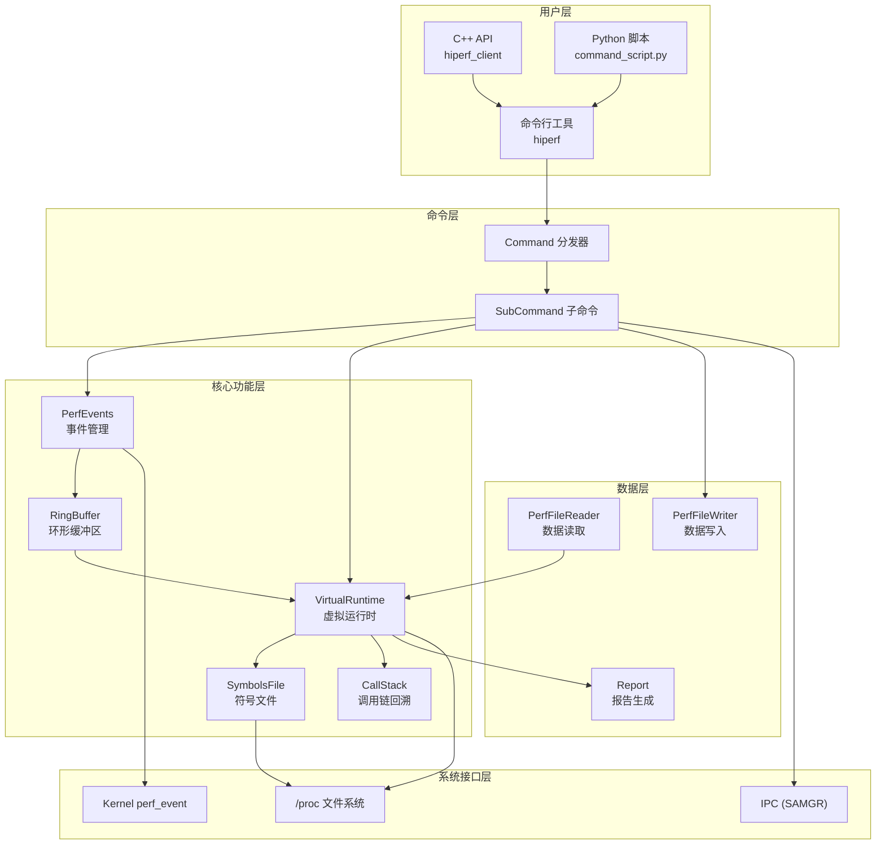
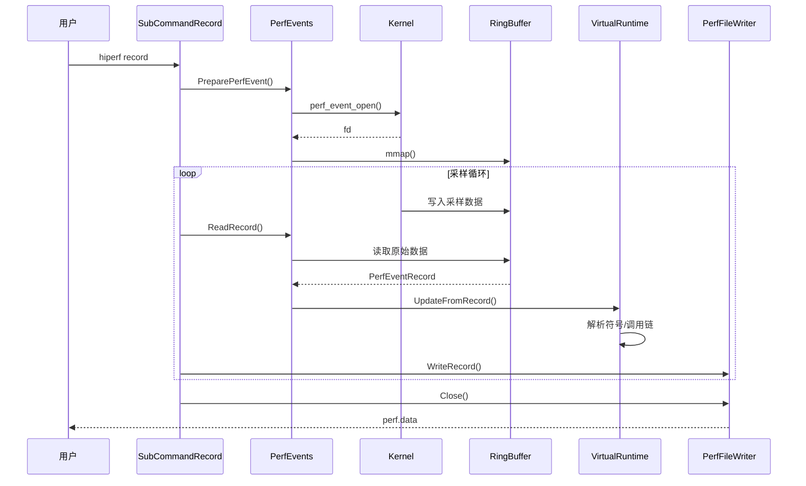
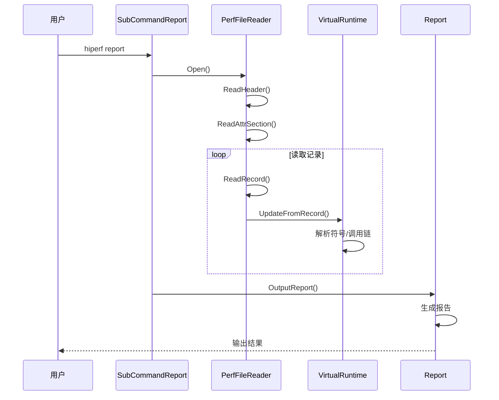
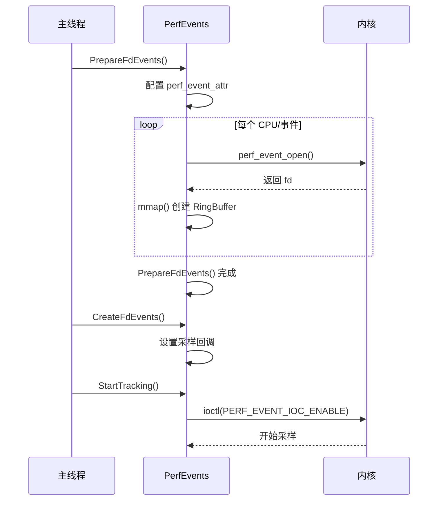
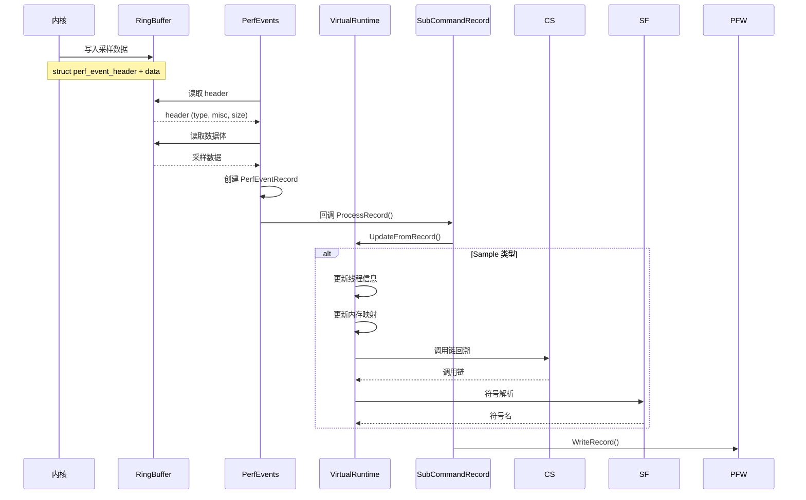
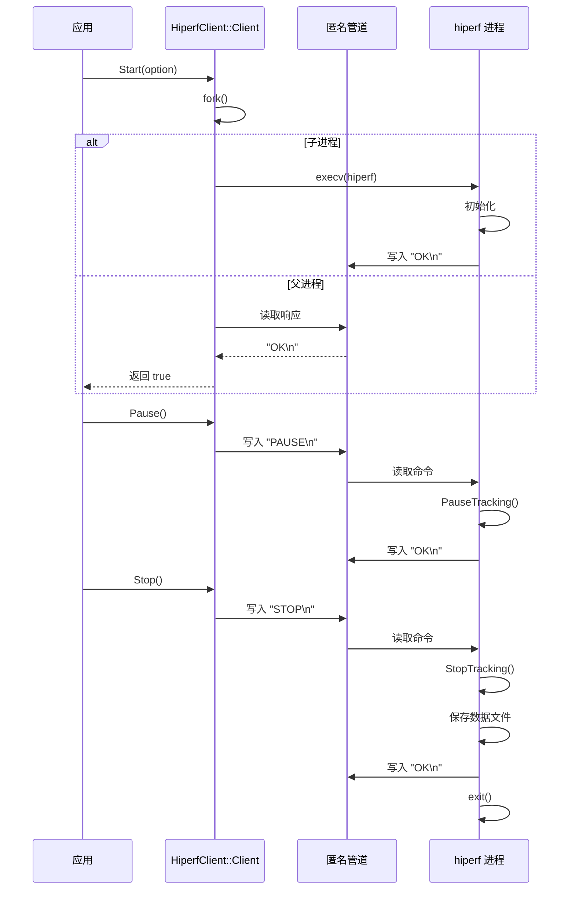

# 架构说明

## 目的

本文档说明 hiperf 的系统架构、组件关系、数据流、线程模型和关键时序。

## 适用范围

- 系统架构师
- 性能优化开发者
- 需要理解内部实现的人员

## 系统架构图



## 组件关系

### 1. 命令分发组件

```
┌─────────────────────────────────────────┐
│              main.cpp                   │
│         (程序入口，权限检查)              │
└─────────────────┬───────────────────────┘
                  │
                  ▼
┌─────────────────────────────────────────┐
│           Command 类                    │
│      (命令解析和分发)                    │
│  ┌─────────────────────────────────┐   │
│  │  RegisterCommandComponent()     │   │
│  │  - RegisterMainCommandDebug()   │   │
│  │  - RegisterSubCommandHelp()     │   │
│  │  - RegisterSubCommandStat()     │   │
│  │  - RegisterSubCommandRecord()   │   │
│  │  - RegisterSubCommandDump()     │   │
│  │  - RegisterSubCommandReport()   │   │
│  └─────────────────────────────────┘   │
└─────────────────┬───────────────────────┘
                  │
                  ▼
┌─────────────────────────────────────────┐
│         SubCommand 子命令               │
│  ┌─────────┐ ┌─────────┐ ┌─────────┐   │
│  │  list   │ │  stat   │ │ record  │   │
│  └─────────┘ └─────────┘ └─────────┘   │
│  ┌─────────┐ ┌─────────┐               │
│  │  dump   │ │ report  │               │
│  └─────────┘ └─────────┘               │
└─────────────────────────────────────────┘
```

### 2. 核心功能组件

#### PerfEvents - 事件管理

**职责**: 管理 perf_event 的创建、配置和数据采集

**关键类**: `PerfEvents` (`include/perf_events.h`)

```
┌─────────────────────────────────────────┐
│            PerfEvents                   │
├─────────────────────────────────────────┤
│  事件配置                                │
│  - PERF_HW_CONFIGS (硬件事件)            │
│  - PERF_SW_CONFIGS (软件事件)            │
│  - PERF_RAW_CONFIGS (原始事件)           │
├─────────────────────────────────────────┤
│  事件组管理                              │
│  - AddEvents()                          │
│  - AddEventsToGroup()                   │
├─────────────────────────────────────────┤
│  数据采集                                │
│  - StartTracking()                      │
│  - StopTracking()                       │
│  - PauseTracking()                      │
│  - ResumeTracking()                     │
├─────────────────────────────────────────┤
│  环形缓冲区                              │
│  - RingBuffer 数组                       │
└─────────────────────────────────────────┘
```

#### VirtualRuntime - 虚拟运行时

**职责**: 维护进程、线程、内存映射和符号信息

**关键类**: `VirtualRuntime` (`include/virtual_runtime.h`)

```
┌─────────────────────────────────────────┐
│          VirtualRuntime                 │
├─────────────────────────────────────────┤
│  线程管理                                │
│  - virtualThreads_ (pid -> VirtualThread)│
├─────────────────────────────────────────┤
│  符号文件管理                             │
│  - symbolsFiles_ (SymbolsFile 列表)      │
├─────────────────────────────────────────┤
│  内核符号                                │
│  - kernelSymbols_                       │
│  - kernelThreadSymbols_                 │
├─────────────────────────────────────────┤
│  调用链回溯                              │
│  - CallStack 实例                        │
└─────────────────────────────────────────┘
```

#### SymbolsFile - 符号文件

**职责**: 解析 ELF/HAP 文件的符号信息

**关键类**: `SymbolsFile` (`include/symbols_file.h`)

```
┌─────────────────────────────────────────┐
│           SymbolsFile                   │
├─────────────────────────────────────────┤
│  文件类型                                │
│  - SYMBOL_ELF_FILE                      │
│  - SYMBOL_KERNEL_FILE                   │
│  - SYMBOL_HAP_FILE                      │
├─────────────────────────────────────────┤
│  符号解析                                │
│  - LoadDebugInfo()                      │
│  - GetSymbolWithVaddr()                 │
├─────────────────────────────────────────┤
│  特殊处理                                │
│  - HAP 文件解析                          │
│  - MiniDebugInfo 解析                    │
│  - VDSO 处理                             │
└─────────────────────────────────────────┘
```

## 数据流

### 采样数据流（record 命令）



### 报告数据流（report 命令）



## 线程模型

### 1. 主线程（record 命令）

```
┌─────────────────────────────────────────┐
│              主线程                      │
├─────────────────────────────────────────┤
│  1. 解析命令参数                         │
│  2. 准备 PerfEvent                       │
│  3. 创建采样线程                         │
│  4. 等待采样完成                         │
│  5. 后处理和数据写入                      │
└─────────────────────────────────────────┘
```

### 2. 采样线程

```
┌─────────────────────────────────────────┐
│            采样线程                      │
├─────────────────────────────────────────┤
│  while (running) {                      │
│    1. poll() 等待数据                    │
│    2. 从 RingBuffer 读取数据              │
│    3. 解析 PerfEventRecord               │
│    4. 调用回调函数处理                    │
│  }                                      │
└─────────────────────────────────────────┘
```

代码位置: `src/perf_events.cpp` (具体实现在 `ReadRecords()` 相关函数)

### 3. 控制线程（Client API）

当使用 `hiperf_client` API 时，会创建额外的控制线程：

```
┌─────────────────────────────────────────┐
│           Client 控制线程                │
├─────────────────────────────────────────┤
│  ClientCommandHandle()                  │
│  - 读取管道命令                          │
│  - 执行控制操作（start/stop/pause）       │
├─────────────────────────────────────────┤
│  ReplyCommandHandle()                   │
│  - 发送响应到客户端                      │
└─────────────────────────────────────────┘
```

代码位置: `src/subcommand_record.cpp:346-348`

## 关键时序

### 1. 采样启动时序



### 2. 单条采样记录处理时序



### 3. API 调用时序



## 内存模型

### RingBuffer 布局

```
┌─────────────────────────────────────────────────────────────┐
│                     RingBuffer 内存布局                      │
├─────────────────────────────────────────────────────────────┤
│  ┌─────────────────────────────────────────────────────┐   │
│  │              perf_event_mmap_page                   │   │
│  │  (元数据页，包含读写位置、事件计数等)                   │   │
│  └─────────────────────────────────────────────────────┘   │
│                         ↓                                   │
│  ┌─────────────────────────────────────────────────────┐   │
│  │              数据页 (mmap_pages 个)                  │   │
│  │  ┌─────────┐ ┌─────────┐ ┌─────────┐               │   │
│  │  │ Record 1│ │ Record 2│ │ Record 3│ ...            │   │
│  │  └─────────┘ └─────────┘ └─────────┘               │   │
│  └─────────────────────────────────────────────────────┘   │
└─────────────────────────────────────────────────────────────┘
```

代码位置: `include/ring_buffer.h`

### VirtualRuntime 数据关系

```
┌─────────────────────────────────────────┐
│         VirtualRuntime                  │
│  ┌─────────────────────────────────┐   │
│  │   virtualThreads_               │   │
│  │   (map<pid_t, VirtualThread>)   │   │
│  │                                 │   │
│  │   pid=1000 ────────┐            │   │
│  │   pid=1001 ────────┼──────┐     │   │
│  │   ...              │      │     │   │
│  └────────────────────┼──────┼─────┘   │
│                       │      │          │
│                       ▼      ▼          │
│  ┌─────────────────────────────────┐   │
│  │        VirtualThread            │   │
│  │  ┌─────────────────────────┐   │   │
│  │  │      threadMaps_        │   │   │
│  │  │  (vector<MemMap>)       │   │   │
│  │  │                         │   │   │
│  │  │  map[0] ──────┐         │   │   │
│  │  │  map[1] ──────┼────┐    │   │   │
│  │  └───────────────┼────┼────┘   │   │
│  │                  │    │        │   │
│  │                  ▼    ▼        │   │
│  │  ┌─────────────────────────┐   │   │
│  │  │  MemMap (内存映射)       │   │   │
│  │  │  - beginVaddr           │   │   │
│  │  │  - len                  │   │   │
│  │  │  - offset               │   │   │
│  │  │  - symbolFileIndex ────┼───┼───┼────┐
│  │  └─────────────────────────┘   │   │    │
│  └─────────────────────────────────┘   │    │
│                                        │    │
│  ┌─────────────────────────────────┐   │    │
│  │      symbolsFiles_              │   │    │
│  │  (vector<unique_ptr<SymbolsFile>>)│   │    │
│  │                                 │   │    │
│  │  [0] ──────────────────────────┼───┘    │
│  │  [1] ──────────────────────────┼────────┘
│  └─────────────────────────────────┘
└─────────────────────────────────────────┘
```

## 关键结论

1. **分层架构**: 用户层 → 命令层 → 核心层 → 系统层，职责清晰
2. **事件驱动**: 基于 Linux perf_event 的事件驱动架构
3. **零拷贝**: 通过 mmap 实现内核到用户空间的零拷贝数据传输
4. **延迟解析**: 符号解析延迟到数据读取阶段，减少采样开销
5. **插件化**: 子命令模式支持功能扩展

## 相关跳转

- [目录结构](02_Directory_Structure.md) - 代码组织
- [对外 API](04_Public_API.md) - API 使用
- [内部 API](05_Internal_API.md) - 内部接口
- [调用链附录](appendix/Callgraphs.md) - 详细调用链
