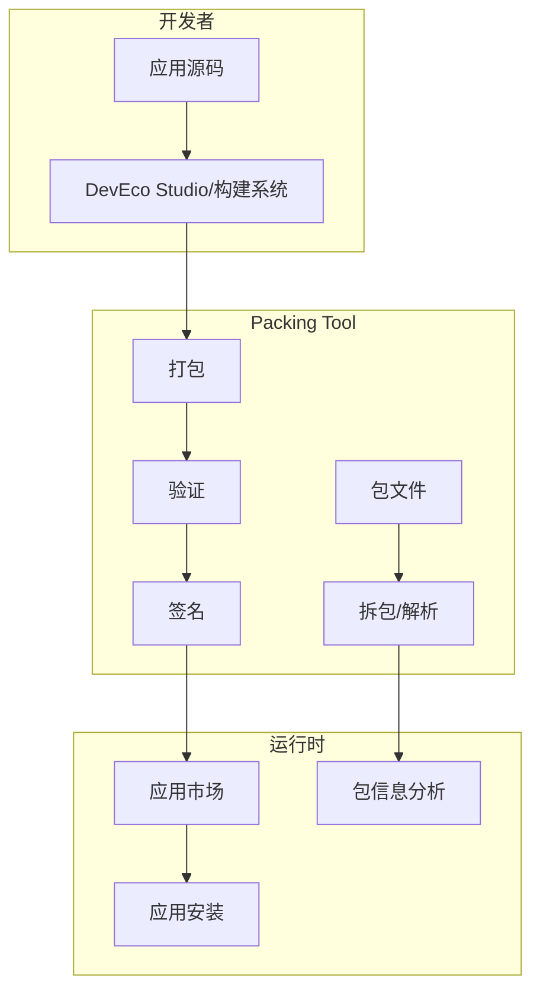
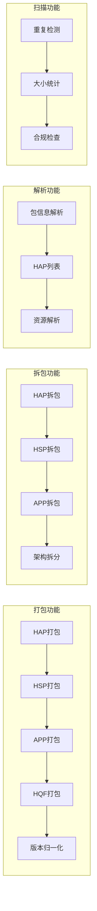
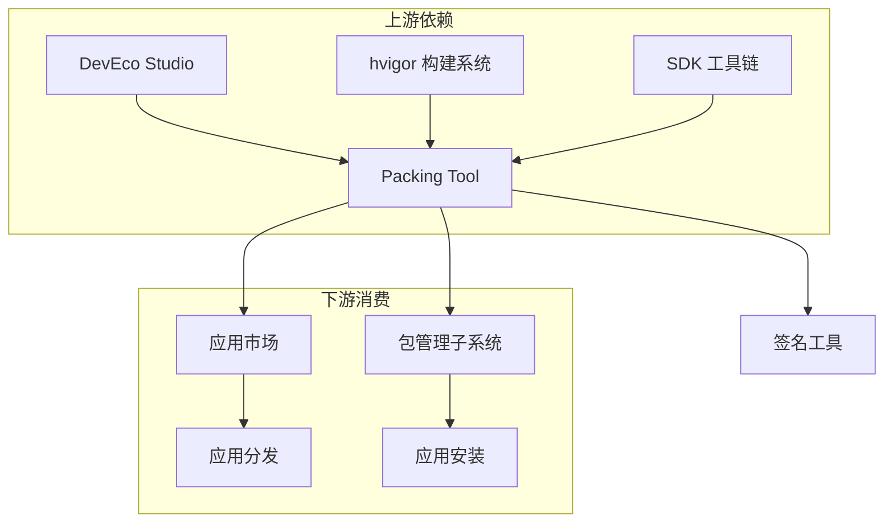

# 项目概述

## 项目定位

**Packing Tool** 是 OpenHarmony 生态系统的核心基础设施组件，负责应用包的全生命周期管理。作为构建系统和应用分发之间的桥梁，它确保应用包的正确生成、验证和解析。



## 项目边界

### 职责范围

| 包含 | 不包含 |
|-----|-------|
| HAP/HSP/APP/HQF/APPQF/HAR/RES 包的创建 | 应用签名（仅支持签名文件打包） |
| 包结构验证 | 代码编译 |
| 包内容解析 | 运行时安装 |
| 资源处理 | 应用沙箱管理 |
| 版本归一化 | 权限动态申请 |

### 系统定位

```
┌─────────────────────────────────────────────────────────────┐
│                    OpenHarmony 应用生态                      │
├─────────────────────────────────────────────────────────────┤
│  应用开发  │  构建系统  │  【Packing Tool】 │  应用分发  │  运行时  │
│           │           │   • 打包          │           │         │
│  DevEco   │  hvigor   │   • 验证          │  应用市场  │  包管理  │
│  Studio   │  gn       │   • 解析          │           │         │
└─────────────────────────────────────────────────────────────┘
```

## 核心能力

### 1. 多包类型支持

| 包类型 | 文件扩展名 | 主要用途 | 关键特性 |
|-------|-----------|---------|---------|
| **HAP** | `.hap` | 应用能力包 | 支持 Stage/FA 模型，Entry/Feature 类型 |
| **HSP** | `.hsp` | 共享包 | 跨应用共享，动态加载 |
| **APP** | `.app` | 应用分发包 | 多 HAP/HSP 组合，签名验证 |
| **HQF** | `.hqf` | 快速修复包 | 热更新补丁，增量更新 |
| **APPQF** | `.appqf` | 多修复包组合 | 批量热修复管理 |
| **HAR** | `.har` | 静态共享库 | 编译时依赖，资源合并 |
| **RES** | `.res` | 资源包 | 卡片资源，主题资源 |

### 2. 双模型支持

支持 OpenHarmony 两种应用开发模型：

#### Stage 模型（推荐）
- 配置文件: `module.json`
- 特点: 组件化架构，生命周期管理，支持多模块
- 适用: API 9+ 新开发应用

#### FA 模型（传统）
- 配置文件: `config.json`
- 特点: 传统页面栈模型
- 适用: 存量应用兼容

### 3. 核心功能矩阵



## 运行环境

### 支持的操作系统类型

根据 `bundle.json` 配置：

| 系统类型 | 说明 | 适配状态 |
|---------|------|---------|
| **mini** | 轻量系统（设备内存 < 128MB） | ✅ 支持 |
| **small** | 小型系统（128MB ≤ 内存 < 1GB） | ✅ 支持 |
| **standard** | 标准系统（内存 ≥ 1GB） | ✅ 支持 |

### 依赖组件

```json
{
  "deps": {
    "components": [
      "bounds_checking_function",  // 边界检查
      "cJSON",                      // C 语言 JSON 解析
      "hilog",                      // 日志系统
      "json",                       // JSON 库
      "openssl",                    // 加密库
      "zlib"                        // 压缩库
    ]
  }
}
```

## 关键概念

### 1. 包结构

#### HAP 包内部结构

```
example.hap
├── module.json          # 模块配置（Stage 模型）
├── config.json          # 应用配置（FA 模型）
├── pack.info            # 包信息
├── resources.index      # 资源索引
├── resources/           # 资源目录
│   ├── base/           # 基础资源
│   ├── rawfile/        # 原始文件
│   └── resfile/        # 资源文件
├── ets/                # ArkTS 代码
├── libs/               # 原生库
│   └── arm64-v8a/      # 架构特定库
└── assets/             # 资产文件
```

### 2. 关键配置项

#### module.json 关键字段

```json
{
  "module": {
    "name": "entry",           // 模块名称
    "type": "entry",           // 类型: entry/feature/shared
    "deviceTypes": ["phone"],  // 支持设备
    "deliveryWithInstall": true,
    "installationFree": false,
    "pages": "$profile:main_pages",
    "abilities": [...],
    "extensionAbilities": [...]
  },
  "app": {
    "bundleName": "com.example.app",
    "versionCode": 1000000,
    "versionName": "1.0.0",
    "minAPIVersion": 9,
    "targetAPIVersion": 12
  }
}
```

### 3. 验证规则

#### APP 打包时的 HAP 合法性校验

打包生成 APP 包时，需要保证所有 HAP/HSP 满足：

| 校验项 | 要求 |
|-------|------|
| bundleName | 必须相同 |
| bundleType | 必须相同 |
| versionCode | 必须相同 |
| debug | 必须相同 |
| moduleName | 必须唯一 |
| minCompatibleVersionCode | HAP ≥ HSP 最大值 |
| targetAPIVersion | HAP ≥ HSP 最大值 |
| minAPIVersion | HAP ≥ HSP 最大值 |

## 版本演进

### API 版本支持

| API 版本 | 新增特性 |
|---------|---------|
| API 9 | Stage 模型基础支持 |
| API 12 | 不再校验 versionName |
| API 16 | minCompatibleVersionCode/targetAPIVersion 放宽校验 |
| API 20 | minAPIVersion 放宽校验 |
| API 21 | deduplicateHar、querySchemes 检查 |

## 与其他组件的关系



## 使用场景

### 场景 1: 开发阶段打包

```bash
# DevEco Studio 调用打包工具
java -jar app_packing_tool.jar --mode hap \
    --json-path entry/src/main/module.json \
    --resources-path entry/build/default/intermediates/res/default \
    --ets-path entry/build/default/intermediates/ets/default \
    --out-path entry/build/default/outputs/default/entry-default-signed.hap
```

### 场景 2: 应用市场解析

```java
// 解析上传的 APP 包获取信息
UncompressResult result = UncompressEntrance.parseApp(
    appPath, 
    UncompressEntrance.ParseAppMode.ALL,
    null
);
// 获取 HAP 列表、版本信息、权限等
```

### 场景 3: 热修复生成

```bash
# 生成 HQF 补丁包
java -jar app_packing_tool.jar --mode hqf \
    --json-path patch.json \
    --lib-path libs \
    --out-path fix.hqf
```

## 相关文档

- [架构说明](02_Architecture.md) - 详细架构设计
- [目录结构](03_Directory_Structure.md) - 代码组织结构
- [对外 API](04_API_Reference.md) - API 使用指南
- [使用说明](../README_zh.md) - 完整命令行参考
