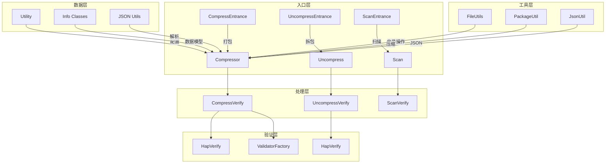
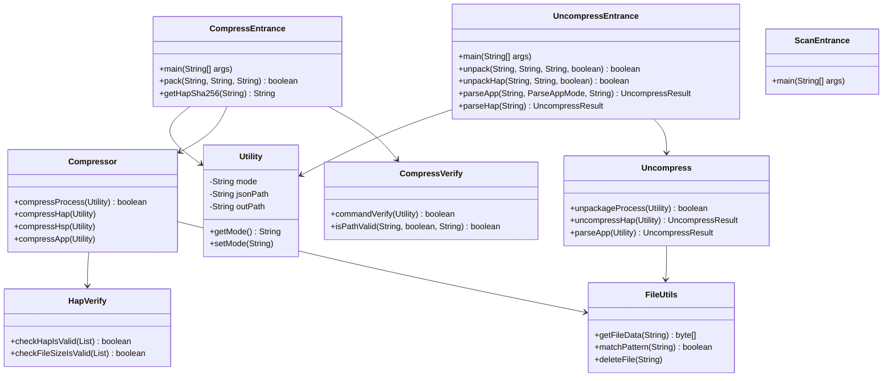
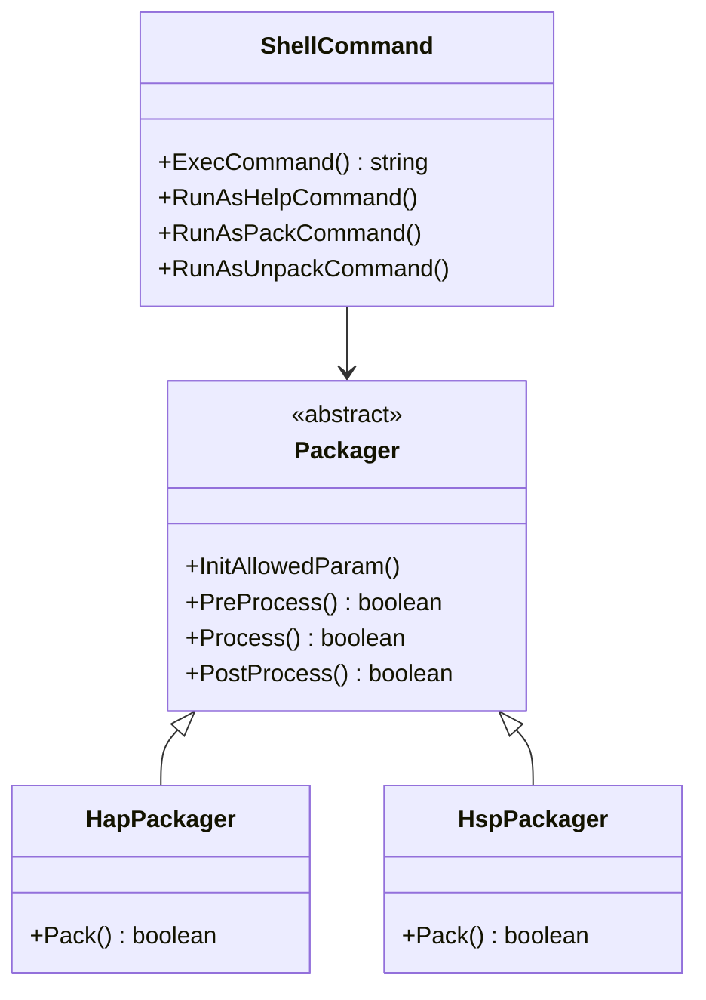
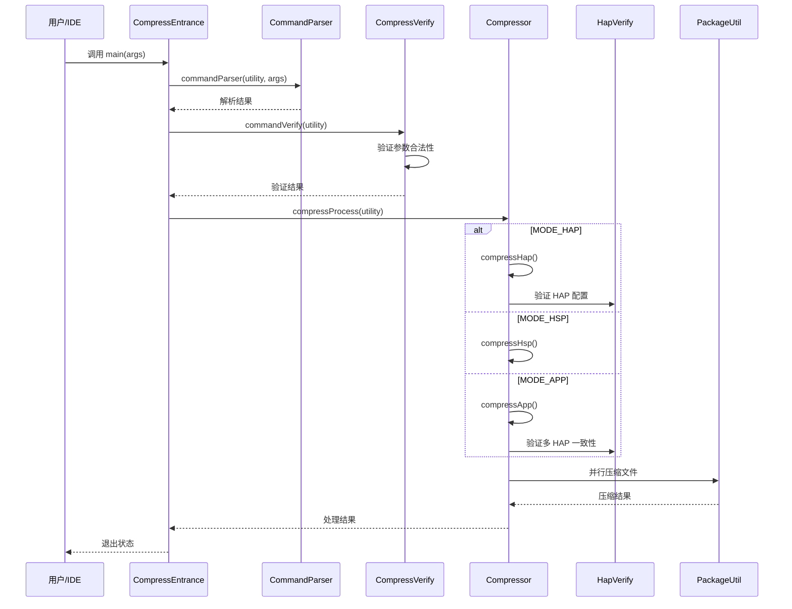
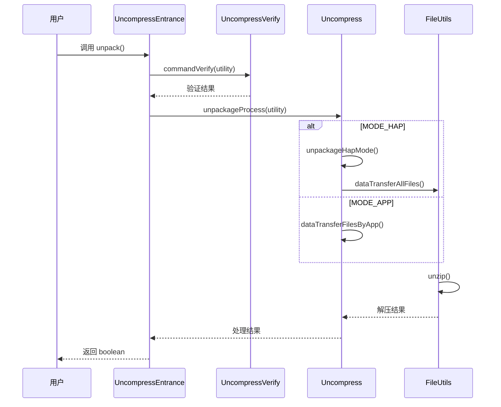
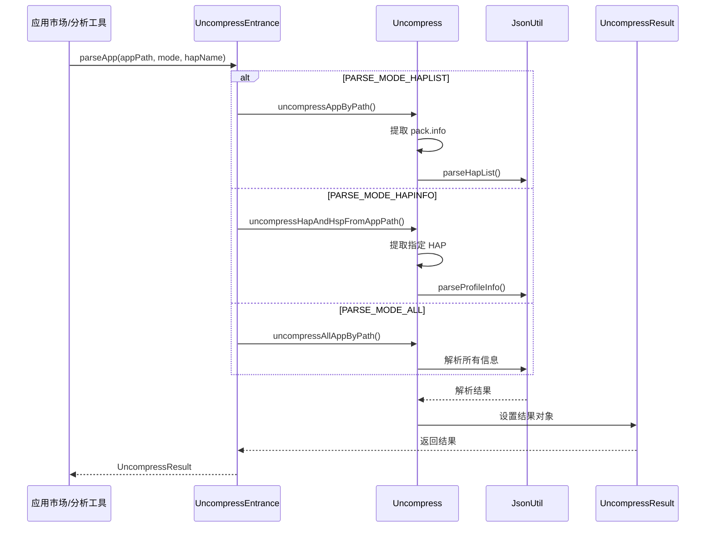
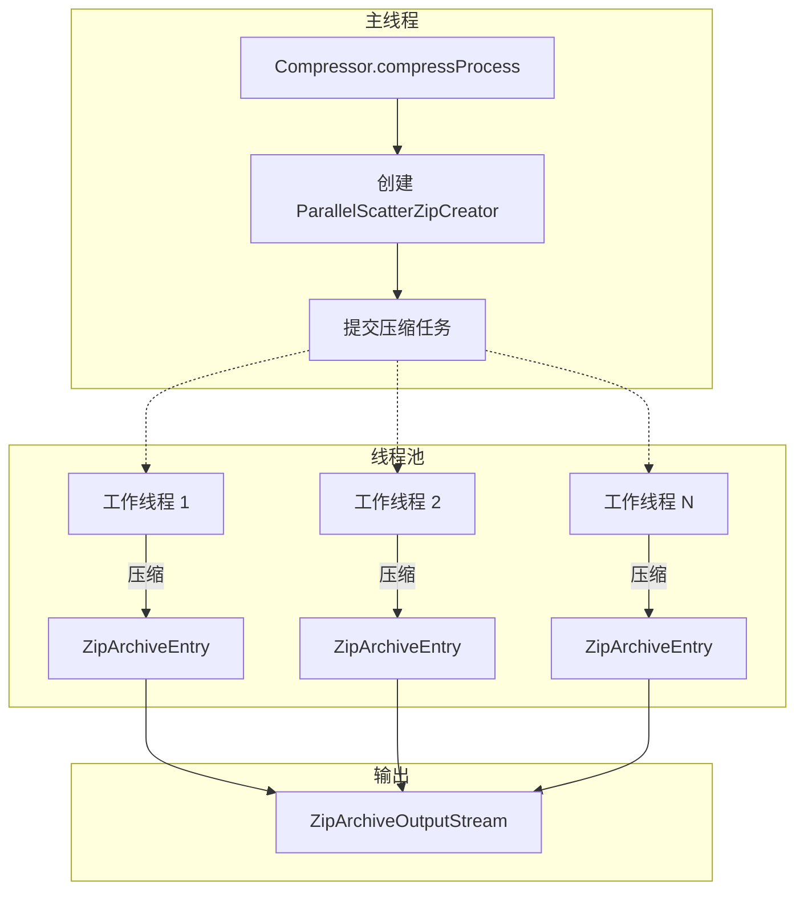
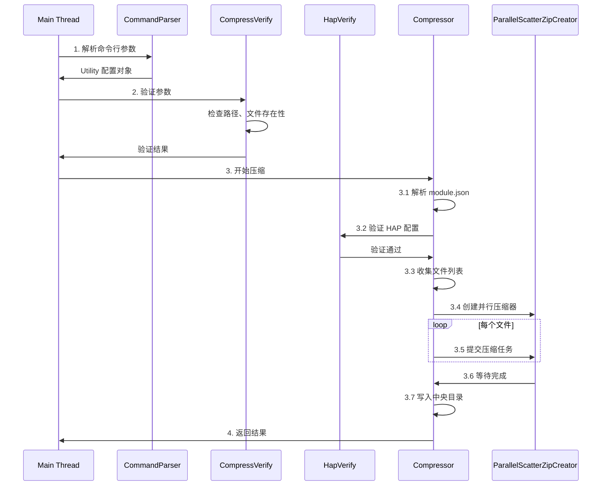
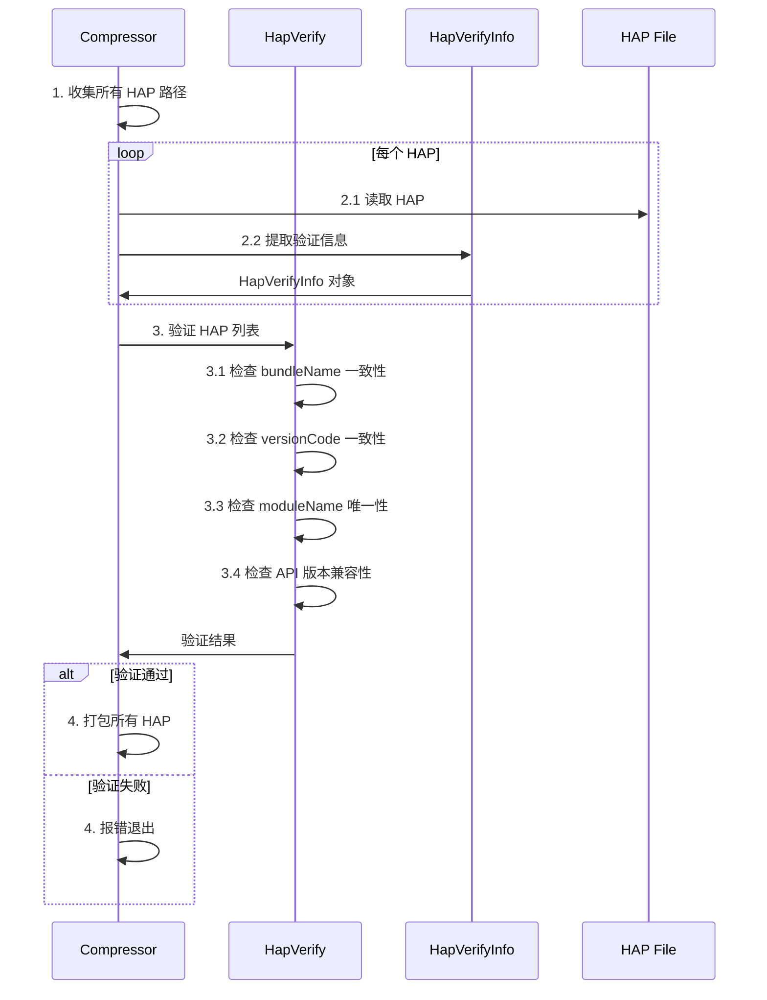
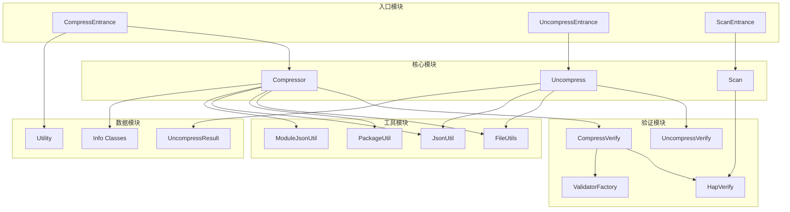

# 架构说明

## 系统架构

### 整体架构图

## 组件架构

### Java 实现架构

### C++ 实现架构

## 数据流

### 打包流程数据流

### 拆包流程数据流

### 解析流程数据流

## 线程模型

### 并行压缩架构

### 线程安全设计

| 组件 | 线程安全策略 |
|-----|------------|
| **Compressor** | 每次调用创建新实例，无共享状态 |
| **Utility** | 配置对象，单线程使用 |
| **FileUtils** | 静态工具方法，无状态 |
| **PackageUtil** | 并行压缩使用线程池，线程安全 |

## 关键时序

### HAP 打包时序

### APP 打包时序（多 HAP 验证）

## 模块依赖关系

## 设计模式应用

| 模式 | 应用位置 | 说明 |
|-----|---------|------|
| **模板方法** | `AbstractPackValidator` | `validate()` 定义流程，子类实现 `isVerifyValid()` |
| **工厂模式** | `PackValidatorFactory` | 根据类型创建对应验证器 |
| **策略模式** | `ResourcesParser` | `ResourcesParserV1/V2` 实现不同解析策略 |
| **单例模式** | `Log` | 日志工具类 |
| **建造者模式** | `Utility` | 通过 setter 构建配置对象 |
