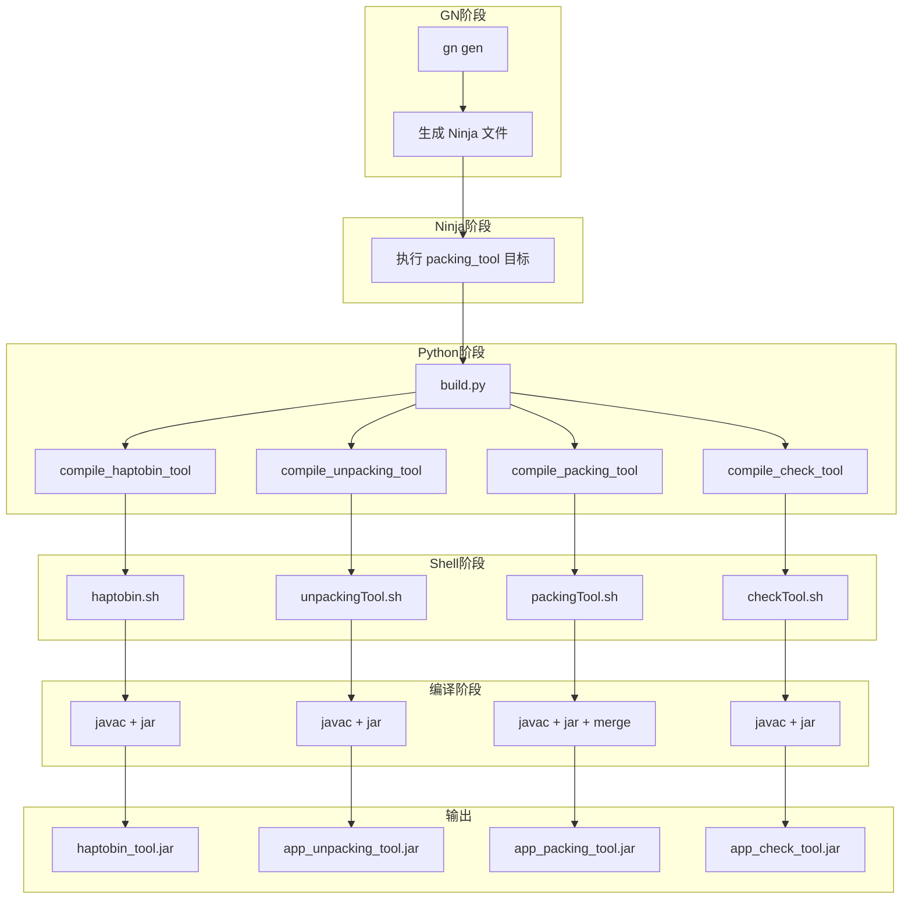
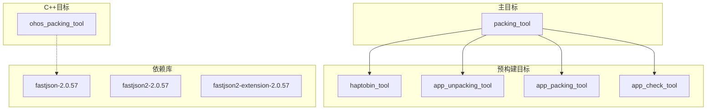

# GN 构建目标

## 概述

Packing Tool 使用 GN (Generate Ninja) 构建系统，通过自定义模板和 Python 脚本实现 Java 和 C++ 代码的混合构建。

## 构建文件清单

### 主要构建文件

| 文件 | 路径 | 用途 |
|-----|------|------|
| `BUILD.gn` | 根目录 | 定义主目标和预构建依赖 |
| `packingtool.gni` | 根目录 | 自定义 `packing_tool` 模板 |
| `build.py` | 根目录 | Python 构建脚本 |
| `BUILD.gn` | `packing_tool/frameworks/` | C++ 完整版可执行文件 |
| `BUILD.gn` | `ohos_packing_tool/frameworks/` | C++ 轻量版可执行文件 |

### 辅助构建脚本

| 文件 | 用途 |
|-----|------|
| `packingTool.sh` | 编译 app_packing_tool.jar |
| `unpackingTool.sh` | 编译 app_unpacking_tool.jar |
| `checkTool.sh` | 编译 app_check_tool.jar |
| `haptobin.sh` | 编译 haptobin_tool.jar |

## 根 BUILD.gn 详解

**文件**: `BUILD.gn`

### 主目标 packing_tool

```gn
packing_tool("packing_tool") {
  sources = [
    "//developtools/packing_tool/adapter/ohos",     # Java 源码目录
    "//developtools/packing_tool/checkTool.sh",     # 构建脚本
    "//developtools/packing_tool/haptobin.sh",
    "//developtools/packing_tool/packingTool.sh",
    "//developtools/packing_tool/unpackingTool.sh",
  ]
  outputs = [
    "${target_out_dir}/jar/haptobin_tool.jar",      # 输出产物
    "${target_out_dir}/jar/app_unpacking_tool.jar",
    "${target_out_dir}/jar/app_packing_tool.jar",
    "${target_out_dir}/jar",
    "${target_out_dir}/jar/app_check_tool.jar",
  ]
}
```

**说明**:
- 使用自定义 `packing_tool` 模板
- 输入包括 Java 源码和构建脚本
- 输出 4 个 JAR 文件

### 预构建目标

```gn
# haptobin_tool JAR
ohos_prebuilt_etc("haptobin_tool") {
  list = get_target_outputs(":packing_tool")
  source = list[0]                                    # haptobin_tool.jar
  deps = [ ":packing_tool" ]
  install_enable = false
}

# app_unpacking_tool JAR
ohos_prebuilt_etc("app_unpacking_tool") {
  list = get_target_outputs(":packing_tool")
  source = list[1]                                    # app_unpacking_tool.jar
  deps = [ ":packing_tool" ]
  install_enable = false
}

# app_packing_tool JAR
ohos_prebuilt_etc("app_packing_tool") {
  list = get_target_outputs(":packing_tool")
  source = list[2]                                    # app_packing_tool.jar
  deps = [ ":packing_tool" ]
  install_enable = false
}

# app_check_tool JAR
ohos_prebuilt_etc("app_check_tool") {
  list = get_target_outputs(":packing_tool")
  source = list[4]                                    # app_check_tool.jar
  deps = [ ":packing_tool" ]
  install_enable = false
}
```

### 预构建依赖库

```gn
# fastjson 库
ohos_prebuilt_etc("fastjson-2.0.57") {
  source = "//prebuilts/packing_tool/fastjson2mid/fastjson-2.0.57.jar"
  install_enable = false
}

ohos_prebuilt_etc("fastjson2-2.0.57") {
  source = "//prebuilts/packing_tool/fastjson2/fastjson2-2.0.57.jar"
  install_enable = false
}

ohos_prebuilt_etc("fastjson2-extension-2.0.57") {
  source = "//prebuilts/packing_tool/fastjson2ext/fastjson2-extension-2.0.57.jar"
  install_enable = false
}
```

### 分组目标

```gn
ohos_group("ohos_packing_tool") {
  deps = [ "packing_tool/frameworks:ohos_packing_tool" ]
}
```

## 自定义模板 packingtool.gni

**文件**: `packingtool.gni`

### 模板定义

```gn
template("packing_tool") {
  action_with_pydeps(target_name) {
    forward_variables_from(invoker,
                           [
                             "sources",
                             "outputs",
                           ])
    script = "//developtools/packing_tool/build.py"
    args = [
      "--haptobin",
      rebase_path(sources[0], root_build_dir),
      "--haptobinOutput",
      rebase_path(outputs[0], root_build_dir),
      "--unpackOutput",
      rebase_path(outputs[1], root_build_dir),
      "--packOutput",
      rebase_path(outputs[2], root_build_dir),
      "--outpath",
      rebase_path(outputs[3], root_build_dir),
      "--checkOutput",
      rebase_path(outputs[4], root_build_dir),
      "--toolchain",
      current_toolchain,
    ]
    if (build_ohos_sdk) {
      args += [
        "--compileTarget",
        "sdk",
      ]
    } else {
      args += [
        "--compileTarget",
        "image",
      ]
    }
    print(args)
  }
}
```

### 模板说明

| 参数 | 来源 | 说明 |
|-----|------|------|
| `sources[0]` | 输入 | Java 源码目录 |
| `outputs[0]` | 输出 | haptobin_tool.jar |
| `outputs[1]` | 输出 | app_unpacking_tool.jar |
| `outputs[2]` | 输出 | app_packing_tool.jar |
| `outputs[3]` | 输出 | JAR 输出目录 |
| `outputs[4]` | 输出 | app_check_tool.jar |
| `current_toolchain` | 变量 | 当前工具链 |
| `build_ohos_sdk` | 条件 | SDK 编译标志 |

## C++ 构建配置

### packing_tool/frameworks/BUILD.gn（完整版）

```gn
ohos_executable("ohos_packing_tool") {
  branch_protector_ret = "pac_ret"              # 分支保护
  
  sanitize = {                                   # 安全加固
    boundary_sanitize = true                     # 边界检查
    cfi = true                                   # 控制流完整性
    cfi_cross_dso = true
    debug = false
    integer_overflow = true                      # 整数溢出检查
    ubsan = true                                 # 未定义行为检查
  }
  
  public_configs = [ ":ohos_packing_tool_config" ]
  
  sources = [                                    # 80 个源文件
    "src/app_packager.cpp",
    "src/appqf_packager.cpp",
    "src/fast_app_packager.cpp",
    "src/general_normalize.cpp",
    "src/hap_packager.cpp",
    "src/hqf_packager.cpp",
    "src/hqf_verify.cpp",
    "src/hsp_packager.cpp",
    # ... 更多源文件
    "src/zip_wrapper.cpp",
    "src/incremental_pack.cpp",
  ]
  
  cflags = [ "-fstack-protector-strong" ]        # 栈保护
  
  external_deps = [
    "json:nlohmann_json_static",                 # JSON 库
    "openssl:libcrypto_shared",                  # OpenSSL
    "zlib:libz",                                 # zlib
    "bounds_checking_function:libsec_static",    # 边界检查
    "cJSON:cjson_static",                        # C JSON
    "hilog:libhilog",                            # 日志
  ]
  
  install_enable = false
  subsystem_name = "developtools"
  part_name = "packing_tool"
}

config("ohos_packing_tool_config") {
  include_dirs = [
    "include",
    "include/json",
  ]
  cflags_cc = [
    "-fexceptions",                              # 启用异常
    "-fstack-protector-strong",                  # 栈保护
  ]
}
```

### ohos_packing_tool/frameworks/BUILD.gn（轻量版）

```gn
ohos_executable("ohos_packing_tool") {
  branch_protector_ret = "pac_ret"
  
  sanitize = {
    boundary_sanitize = true
    cfi = true
    cfi_cross_dso = true
    debug = false
    integer_overflow = true
    ubsan = true
  }
  
  include_dirs = [ "include" ]
  sources = [                                    # 5 个源文件
    "src/hap_packager.cpp",
    "src/hsp_packager.cpp",
    "src/main.cpp",
    "src/packager.cpp",
    "src/shell_command.cpp",
  ]
  
  cflags = [ "-fstack-protector-strong" ]
  
  external_deps = [
    "json:nlohmann_json_static",
    "zlib:libz",
  ]
  
  install_enable = false
  subsystem_name = "developtools"
  part_name = "packing_tool"
}
```

## 构建流程



## build.py 构建逻辑

### 主函数流程

```python
def main():
    # 1. 解析参数
    parser = argparse.ArgumentParser()
    parser.add_argument('--haptobin', required=True)
    parser.add_argument('--haptobinOutput', required=True)
    parser.add_argument('--unpackOutput', required=True)
    parser.add_argument('--packOutput', required=True)
    parser.add_argument('--checkOutput', required=True)
    parser.add_argument('--outpath', required=True)
    parser.add_argument('--toolchain', required=True)
    parser.add_argument('--compileTarget', required=True)
    args = parser.parse_args()
    
    # 2. 设置路径
    root_dir = os.path.dirname(os.path.realpath(__file__))
    src_dir = os.path.join(root_dir, "./adapter/ohos/")
    
    # 3. 设置依赖库路径
    fastjson_jar = os.path.join(root_dir, '../../prebuilts/packing_tool/fastjson2mid/fastjson-2.0.57.jar')
    fastjson2_jar = os.path.join(root_dir, '../../prebuilts/packing_tool/fastjson2/fastjson2-2.0.57.jar')
    fastjson2ext_jar = os.path.join(root_dir, '../../prebuilts/packing_tool/fastjson2ext/fastjson2-extension-2.0.57.jar')
    compress_jar = os.path.join(root_dir, '../../prebuilts/packing_tool/compress/commons-compress-1.27.1.jar')
    io_jar = os.path.join(root_dir, '../../prebuilts/packing_tool/io/commons-io-2.19.0-bin/commons-io-2.19.0/commons-io-2.19.0.jar')
    
    # 4. 编译各个工具
    compile_haptobin_tool(...)
    compile_unpacking_tool(...)
    compile_packing_tool(...)
    compile_check_tool(...)
```

### Java 源码分组

#### haptobin_tool（9 个文件）

```python
java_sources = [
    'BinaryTool.java',
    'BundleException.java',
    'ConvertHapToBin.java',
    'ErrorMsg.java',
    'FileUtils.java',
    'Log.java',
    'PackFormatter.java',
    'PackingToolErrMsg.java',
    'Utility.java'
]
```

#### app_unpacking_tool（63 个文件）

包括：AbilityInfo, AppInfo, CommandParser, Uncompress, UncompressEntrance, JsonUtil 等

#### app_packing_tool（51 个文件）

包括：Compressor, CompressEntrance, HapVerify, Scan, 以及 validator 包

#### app_check_tool（11 个文件）

包括：Scan, ScanEntrance, ScanVerify, ScanStatDuplicate 等

## 目标依赖关系



## 构建配置选项

### 编译目标类型

| 目标 | 说明 | 条件 |
|-----|------|------|
| `sdk` | SDK 编译 | `build_ohos_sdk = true` |
| `image` | 系统镜像编译 | `build_ohos_sdk = false` |

### 安全编译选项

| 选项 | 说明 | 应用目标 |
|-----|------|---------|
| `branch_protector_ret = "pac_ret"` | 分支保护 | C++ 可执行文件 |
| `boundary_sanitize = true` | 边界检查 | C++ 可执行文件 |
| `cfi = true` | 控制流完整性 | C++ 可执行文件 |
| `integer_overflow = true` | 整数溢出检查 | C++ 可执行文件 |
| `ubsan = true` | 未定义行为检查 | C++ 可执行文件 |
| `-fstack-protector-strong` | 栈保护 | C++ 可执行文件 |

## 输出路径

### Java 工具输出

```
${target_out_dir}/jar/
├── haptobin_tool.jar
├── app_unpacking_tool.jar
├── app_packing_tool.jar
└── app_check_tool.jar
```

### C++ 工具输出

```
${root_out_dir}/
└── developtools/packing_tool/
    └── ohos_packing_tool  (可执行文件)
```

## 常用构建命令

```bash
# 生成构建文件
gn gen out --args='target_os="ohos" target_cpu="arm64"'

# 构建所有目标
ninja -C out packing_tool

# 构建特定目标
ninja -C out app_packing_tool
ninja -C out ohos_packing_tool

# 清理构建
ninja -C out -t clean
```
