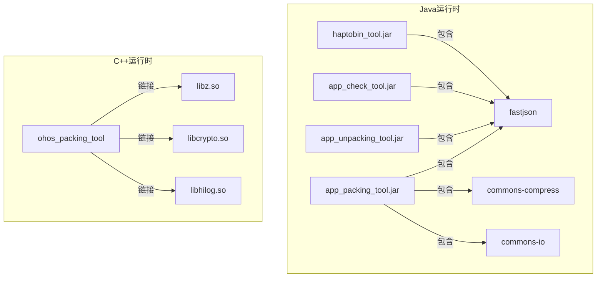

# 编译产物说明

## 产物清单

### Java 工具产物

| 产物名称 | 类型 | 大小估算 | 主要功能 |
|---------|------|---------|---------|
| `app_packing_tool.jar` | Fat JAR | ~15MB | 打包工具（HAP/HSP/APP/HQF） |
| `app_unpacking_tool.jar` | Fat JAR | ~12MB | 拆包/解析工具 |
| `app_check_tool.jar` | Fat JAR | ~8MB | 扫描检查工具 |
| `haptobin_tool.jar` | Fat JAR | ~5MB | HAP 转二进制工具 |

### C++ 工具产物

| 产物名称 | 类型 | 大小估算 | 主要功能 |
|---------|------|---------|---------|
| `ohos_packing_tool` | 可执行文件 | ~2MB | C++ 原生打包工具（轻量版） |

## 产物详细说明

### app_packing_tool.jar

**构建来源**: `adapter/ohos/` 下 51 个 Java 源文件

**包含的依赖**（合并到 JAR 中）:
- fastjson-2.0.57.jar
- fastjson2-2.0.57.jar
- fastjson2-extension-2.0.57.jar
- commons-compress-1.27.1.jar
- commons-io-2.19.0.jar

**入口类**: `ohos.CompressEntrance`

**支持功能**:
- HAP 打包（Stage/FA 模型）
- HSP 打包
- APP 打包（多 HAP 组合）
- HQF 打包（热修复）
- APPQF 打包
- 版本归一化
- 包归一化

**使用方式**:
```bash
java -jar app_packing_tool.jar --mode hap --json-path module.json --out-path out.hap
```

### app_unpacking_tool.jar

**构建来源**: `adapter/ohos/` 下 63 个 Java 源文件

**包含的依赖**:
- fastjson-2.0.57.jar
- fastjson2-2.0.57.jar
- fastjson2-extension-2.0.57.jar

**入口类**: `ohos.UncompressEntrance`

**支持功能**:
- HAP 拆包
- HSP 拆包
- APP 拆包
- HAR 拆包
- APPQF 拆包
- 包解析（API 接口）
- 资源解析

**使用方式**:
```bash
# 拆包
java -jar app_unpacking_tool.jar --mode hap --hap-path in.hap --out-path out/

# 解析
java -jar app_unpacking_tool.jar --mode app --app-path in.app --parse-mode all
```

### app_check_tool.jar

**构建来源**: `adapter/ohos/` 下 11 个 Java 源文件

**包含的依赖**:
- fastjson-2.0.57.jar
- fastjson2-2.0.57.jar
- fastjson2-extension-2.0.57.jar

**入口类**: `ohos.ScanEntrance`

**支持功能**:
- 重复文件检测
- 文件大小统计
- 后缀名统计
- 合规性检查

**使用方式**:
```bash
java -jar app_check_tool.jar --mode scan --hap-path in.hap
```

### haptobin_tool.jar

**构建来源**: `adapter/ohos/` 下 9 个 Java 源文件

**包含的依赖**:
- fastjson-2.0.57.jar
- fastjson2-2.0.57.jar
- fastjson2-extension-2.0.57.jar

**入口类**: `ohos.BinaryTool`

**支持功能**:
- HAP 转二进制格式
- 用于轻量设备

### ohos_packing_tool（C++）

**构建来源**: 
- 完整版: `packing_tool/frameworks/` 下 80 个 C++ 文件
- 轻量版: `ohos_packing_tool/frameworks/` 下 5 个 C++ 文件

**依赖库**（动态链接）:
- libz.so (zlib)
- libcrypto.so (OpenSSL)
- libhilog.so

**入口函数**: `main()`

**支持功能**:
- 基础 HAP 打包
- 基础 HSP 打包
- 命令行界面

**使用方式**:
```bash
./ohos_packing_tool pack --mode hap --json module.json --out out.hap
```

## 产物输出路径

### 标准构建输出

```
${root_out_dir}/
├── developtools/packing_tool/
│   └── jar/
│       ├── haptobin_tool.jar
│       ├── app_unpacking_tool.jar
│       ├── app_packing_tool.jar
│       └── app_check_tool.jar
│
└── developtools/packing_tool/packing_tool/frameworks/
    └── ohos_packing_tool  (C++ 可执行文件)
```

### SDK 构建输出

```
${root_out_dir}/
└── sdk/
    └── tools/
        ├── app_packing_tool.jar
        ├── app_unpacking_tool.jar
        └── ...
```

## 运行时加载关系



## 产物依赖关系

### Java 工具依赖图

```
app_packing_tool.jar
├── ohos.CompressEntrance
├── ohos.Compressor
├── ohos.CompressVerify
├── ohos.HapVerify
├── validator/AbstractPackValidator
├── validator/HapValidator
├── validator/HspValidator
└── [依赖库合并]
    ├── com.alibaba.fastjson
    ├── org.apache.commons.compress
    └── org.apache.commons.io

app_unpacking_tool.jar
├── ohos.UncompressEntrance
├── ohos.Uncompress
├── ohos.UncompressVerify
└── [依赖库合并]
    └── com.alibaba.fastjson

app_check_tool.jar
├── ohos.ScanEntrance
├── ohos.Scan
├── ohos.ScanVerify
└── [依赖库合并]
    └── com.alibaba.fastjson
```

## 安装路径

### 系统镜像安装

```
/system/
└── bin/
    └── packing_tool/  (可选安装)
```

### SDK 安装

```
${SDK_ROOT}/
└── tools/
    ├── app_packing_tool.jar
    ├── app_unpacking_tool.jar
    ├── app_check_tool.jar
    └── haptobin_tool.jar
```

### DevEco Studio 集成

```
${DEVECO_HOME}/
└── tools/
    └── packing-tool/
        ├── app_packing_tool.jar
        └── app_unpacking_tool.jar
```

## 产物版本信息

### JAR 清单信息

每个 JAR 文件包含以下元数据：

```
Manifest-Version: 1.0
Main-Class: ohos.CompressEntrance  # 或对应入口类
Implementation-Version: 3.2
Implementation-Vendor: OpenHarmony
```

### 版本检查

```bash
# 查看 JAR 版本
unzip -p app_packing_tool.jar META-INF/MANIFEST.MF

# 查看 C++ 版本
./ohos_packing_tool --version
```

## 产物使用场景

### 场景 1: DevEco Studio 构建

```
DevEco Studio --> hvigor --> app_packing_tool.jar --> .hap 文件
```

### 场景 2: 应用市场解析

```
上传 APP --> 应用市场 --> app_unpacking_tool.jar --> 解析信息
```

### 场景 3: CI/CD 流水线

```
源码 --> 编译 --> app_packing_tool.jar --> 打包 --> 签名 --> 发布
                |
                v
         app_check_tool.jar --> 质量检查
```

### 场景 4: 轻量设备部署

```
HAP --> haptobin_tool.jar --> 二进制格式 --> 轻量设备
```

## 产物大小优化

### 当前大小分析

| 产物 | 大小 | 主要贡献者 |
|-----|------|-----------|
| app_packing_tool.jar | ~15MB | commons-compress (1.5MB) + fastjson2 (2MB) + 代码 |
| app_unpacking_tool.jar | ~12MB | fastjson2 (2MB) + 代码 |
| app_check_tool.jar | ~8MB | fastjson2 (2MB) + 代码 |
| haptobin_tool.jar | ~5MB | fastjson2 (2MB) + 代码 |

### 优化建议

1. **按需加载**: 将功能拆分为更小的 JAR
2. **依赖瘦身**: 移除未使用的 fastjson 版本
3. **代码压缩**: 使用 ProGuard 压缩代码
4. **分离资源**: 将资源文件分离出 JAR

## 故障排查

### JAR 文件损坏

```bash
# 验证 JAR 完整性
jar tf app_packing_tool.jar > /dev/null && echo "OK" || echo "Corrupted"

# 重新生成
ninja -C out app_packing_tool
```

### 类找不到

```bash
# 检查 JAR 内容
jar tf app_packing_tool.jar | grep CompressEntrance

# 检查 MANIFEST
unzip -p app_packing_tool.jar META-INF/MANIFEST.MF
```

### 依赖冲突

```bash
# 检查重复类
jar tf app_packing_tool.jar | grep "fastjson" | head -20
```
