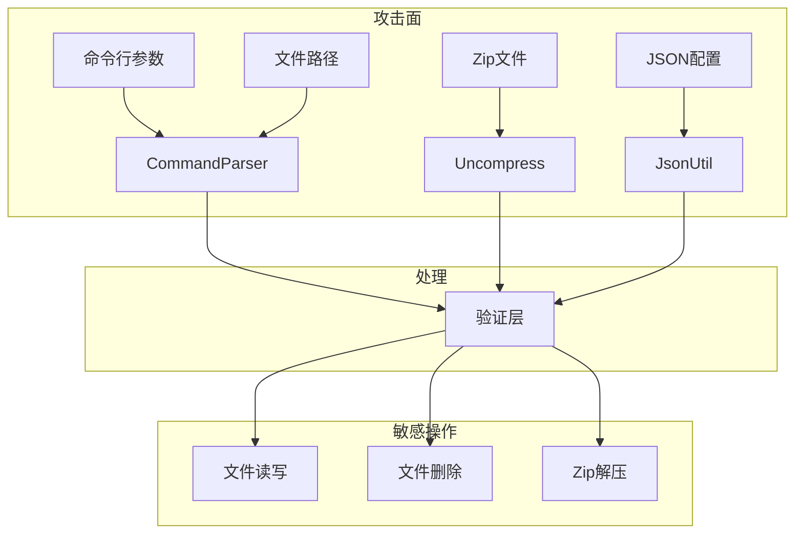

# 安全风险评审

## 概述

本文档基于对 packing_tool 源代码的静态分析，识别潜在的安全风险点，并提供修复建议。

**分析范围**:
- Java 源码: `adapter/ohos/` 目录下 97 个文件
- C++ 源码: `packing_tool/frameworks/` 和 `ohos_packing_tool/frameworks/`
- 构建脚本: `build.py`, `*.sh`

**分析维度**:
- 输入验证
- 路径遍历
- 文件操作
- 压缩/解压安全
- JSON 解析安全
- 资源管理

## 攻击面分析

### 1. 外部输入接口



### 2. 信任边界

| 边界 | 不可信输入 | 可信处理 |
|-----|-----------|---------|
| 命令行接口 | 用户输入的参数 | 参数解析和验证 |
| 文件系统接口 | 外部文件路径 | 路径规范化验证 |
| Zip 解析接口 | 外部 Zip 文件 | 条目验证和解压 |
| JSON 解析接口 | 外部配置文件 | Schema 验证 |

## 可被利用点

### 风险 1: Zip Slip（路径遍历）

**风险等级**: 🔴 高危

**证据位置**:
- `adapter/ohos/FileUtils.java` - `unzip()` 方法
- `adapter/ohos/Uncompress.java` - `dataTransferAllFiles()` 方法

**问题描述**:
Zip 条目名称可能包含 `../` 序列，导致文件解压到预期目录之外。

**代码片段** (`Uncompress.java:687`):
```java
String tempPath = destDirPath + LINUX_FILE_SEPARATOR + entry.getName();
File destFile = new File(tempPath);
```

**利用路径**:
1. 构造包含 `../../../etc/critical` 条目的恶意 HAP
2. 调用拆包功能
3. 文件被写入系统关键目录

**影响**: 任意文件覆盖，可能导致系统破坏或代码执行

**修复建议**:
```java
// 修复方案：验证规范化后的路径
String entryName = entry.getName();
File destFile = new File(destDirPath, entryName);
String canonicalPath = destFile.getCanonicalPath();
String canonicalDest = new File(destDirPath).getCanonicalPath();

if (!canonicalPath.startsWith(canonicalDest + File.separator)) {
    throw new BundleException("Zip entry outside target directory: " + entryName);
}
```

### 风险 2: 不安全的文件删除

**风险等级**: 🟡 中危

**证据位置**:
- `adapter/ohos/FileUtils.java` - `deleteFile()`, `deleteDirectory()`
- `adapter/ohos/Compressor.java` - 临时文件清理

**问题描述**:
递归删除目录时可能存在竞争条件，或在符号链接场景下误删。

**代码片段** (`FileUtils.java`):
```java
public static void deleteDirectory(File file) {
    if (file.isDirectory()) {
        File[] files = file.listFiles();
        for (File f : files) {
            deleteDirectory(f);  // 递归删除
        }
    }
    file.delete();
}
```

**影响**: 条件竞争可能导致非预期文件删除

**修复建议**:
```java
// 使用 Files.walkFileTree 进行安全删除
// 或使用 try-with-resources 管理临时目录
Path tempDir = Files.createTempDirectory("packing_");
try {
    // 使用 tempDir
} finally {
    Files.walkFileTree(tempDir, new SimpleFileVisitor<Path>() {
        @Override
        public FileVisitResult visitFile(Path file, BasicFileAttributes attrs) 
                throws IOException {
            Files.delete(file);
            return FileVisitResult.CONTINUE;
        }
        // ...
    });
}
```

### 风险 3: JSON 解析安全风险

**风险等级**: 🟡 中危

**证据位置**:
- `adapter/ohos/JsonUtil.java`
- `adapter/ohos/Compressor.java` - JSON 解析多处

**问题描述**:
使用 FastJSON 库进行 JSON 解析，该库历史上存在多个反序列化漏洞。

**代码片段** (`JsonUtil.java`):
```java
public static Optional<JSONObject> parseJson(String jsonPath) {
    // 使用 FastJSON 解析
    JSONObject jsonObject = JSON.parseObject(jsonString);
}
```

**影响**: 如果解析不可信来源的 JSON，可能导致远程代码执行

**修复建议**:
1. 升级到最新版 FastJSON2
2. 启用 SafeMode:
```java
ParserConfig.getGlobalInstance().setSafeMode(true);
```
3. 使用白名单限制反序列化类:
```java
ParserConfig.getGlobalInstance().addAccept("ohos.");
```

### 风险 4: 路径验证绕过

**风险等级**: 🟡 中危

**证据位置**:
- `adapter/ohos/FileUtils.java` - `matchPattern()`

**问题描述**:
路径验证使用简单的正则表达式，可能存在绕过。

**代码片段** (`FileUtils.java`):
```java
public static boolean matchPattern(String filePath) {
    return filePath.matches("[0-9A-Za-z/].{0,4095}");
}
```

**问题**:
- 允许 `..` 序列
- 不验证路径是否在允许范围内

**修复建议**:
```java
public static boolean isPathSafe(String filePath, String basePath) {
    try {
        File file = new File(filePath);
        File base = new File(basePath);
        String canonicalFile = file.getCanonicalPath();
        String canonicalBase = base.getCanonicalPath();
        return canonicalFile.startsWith(canonicalBase);
    } catch (IOException e) {
        return false;
    }
}
```

### 风险 5: 资源耗尽（DoS）

**风险等级**: 🟡 中危

**证据位置**:
- `adapter/ohos/Compressor.java` - 并行压缩
- `adapter/ohos/Uncompress.java` - 解压大文件

**问题描述**:
1. 并行压缩可能创建大量线程
2. 解压大文件可能耗尽内存
3. 没有文件大小限制检查

**代码片段** (`Compressor.java`):
```java
ParallelScatterZipCreator scatterZipCreator = new ParallelScatterZipCreator();
// 可能提交大量任务
for (String file : fileList) {
    scatterZipCreator.addArchiveEntry(entry, supplier);
}
```

**修复建议**:
```java
// 1. 限制并发线程数
ThreadPoolExecutor executor = new ThreadPoolExecutor(
    4, 8, 60L, TimeUnit.SECONDS,
    new LinkedBlockingQueue<>(100)
);

// 2. 限制文件大小
long maxFileSize = 1024 * 1024 * 1024; // 1GB
if (file.length() > maxFileSize) {
    throw new BundleException("File too large: " + file.getName());
}

// 3. 限制 Zip 条目数量
int maxEntries = 10000;
if (entryCount > maxEntries) {
    throw new BundleException("Too many entries in zip");
}
```

### 风险 6: 敏感信息泄露

**风险等级**: 🟢 低危

**证据位置**:
- 日志输出
- 错误消息

**问题描述**:
错误日志可能包含敏感路径或内部信息。

**代码片段**:
```java
LOG.error("File not found: " + filePath);  // 可能泄露绝对路径
```

**修复建议**:
```java
// 只记录相对路径或文件名
LOG.error("File not found: " + file.getName());
// 详细路径记录到 debug 级别
LOG.debug("Full path: " + filePath);
```

## 安全检查清单

### 输入验证

| 检查项 | 状态 | 证据 |
|-------|------|------|
| 命令行参数验证 | ✅ | `CommandParser.java` 有参数校验 |
| 文件路径验证 | ⚠️ | 有 `matchPattern()` 但不够严格 |
| 文件扩展名检查 | ✅ | `CompressVerify.java` 检查扩展名 |
| 数值范围检查 | ✅ | 压缩级别、版本号等有范围检查 |
| 空值检查 | ✅ | 多处 null/empty 检查 |

### 文件操作安全

| 检查项 | 状态 | 证据 |
|-------|------|------|
| 路径规范化 | ⚠️ | 部分使用 `getCanonicalPath()` |
| 目录遍历防护 | ❌ | 缺少 Zip Slip 防护 |
| 符号链接检查 | ❌ | 未检查符号链接 |
| 文件权限检查 | ❌ | 未检查文件权限 |
| 临时文件清理 | ✅ | 有 `deleteFile()` 但方式不够安全 |

### 压缩/解压安全

| 检查项 | 状态 | 证据 |
|-------|------|------|
| Zip 炸弹防护 | ❌ | 未检查压缩比 |
| 条目数量限制 | ❌ | 无限制 |
| 条目名称验证 | ⚠️ | 有 `matchPattern()` 但不充分 |
| 路径遍历防护 | ❌ | 无防护 |

### JSON 解析安全

| 检查项 | 状态 | 证据 |
|-------|------|------|
| Schema 验证 | ⚠️ | 有 JSON Schema 但主要用于外部校验 |
| 反序列化白名单 | ❌ | FastJSON 未配置 SafeMode |
| 深度限制 | ❌ | 未限制 JSON 嵌套深度 |
| 大小限制 | ❌ | 未限制 JSON 文件大小 |

## 修复建议汇总

### 高优先级

1. **修复 Zip Slip 漏洞**
   - 文件: `Uncompress.java`, `FileUtils.java`
   - 方案: 添加路径规范化验证
   - 时间: 立即

2. **加固 FastJSON 配置**
   - 文件: 所有使用 FastJSON 的地方
   - 方案: 启用 SafeMode，配置白名单
   - 时间: 立即

### 中优先级

3. **改进路径验证**
   - 文件: `FileUtils.java`
   - 方案: 使用规范化路径比较
   - 时间: 1-2 周

4. **添加资源限制**
   - 文件: `Compressor.java`, `Uncompress.java`
   - 方案: 限制文件大小、条目数量、线程数
   - 时间: 1-2 周

5. **安全删除文件**
   - 文件: `FileUtils.java`
   - 方案: 使用 NIO.2 的 `Files.walkFileTree`
   - 时间: 1-2 周

### 低优先级

6. **日志脱敏**
   - 文件: 所有日志输出
   - 方案: 避免记录绝对路径
   - 时间: 下次迭代

7. **符号链接检查**
   - 文件: `FileUtils.java`
   - 方案: 检测并处理符号链接
   - 时间: 下次迭代

## 安全测试建议

### 静态分析

```bash
# 使用 SpotBugs 进行 Java 安全扫描
spotbugs -textui -include spotbugs-security.xml adapter/ohos/

# 使用 CodeQL 进行代码分析
codeql database create --language=java packing-tool-db
codeql analyze packing-tool-db java-security.qls
```

### 模糊测试

```bash
# 对 Zip 解析进行模糊测试
java -jar jazzer.jar --cp=app_packing_tool.jar --target_class=ohos.Uncompress

# 对 JSON 解析进行模糊测试
java -jar jazzer.jar --cp=app_packing_tool.jar --target_class=ohos.JsonUtil
```

### 渗透测试

1. **Zip Slip 测试**: 构造包含 `../` 的恶意 HAP
2. **Zip 炸弹测试**: 使用高压缩比的 Zip 文件
3. **路径遍历测试**: 尝试各种路径绕过技巧
4. **JSON 注入测试**: 构造恶意 JSON 进行测试

## 合规性检查

### OWASP Top 10 映射

| OWASP 风险 | 本项目相关 | 缓解状态 |
|-----------|-----------|---------|
| A01:2021-Broken Access Control | 路径遍历 | 部分缓解 |
| A03:2021-Injection | JSON 注入 | 需改进 |
| A05:2021-Security Misconfiguration | FastJSON 配置 | 需改进 |
| A06:2021-Vulnerable Components | FastJSON 版本 | 需检查 |
| A08:2021-Data Integrity Failures | Zip 验证 | 需改进 |

### CWE 映射

| CWE ID | 描述 | 相关代码 |
|-------|------|---------|
| CWE-22 | Path Traversal | `Uncompress.java` |
| CWE-23 | Relative Path Traversal | `FileUtils.java` |
| CWE-502 | Deserialization of Untrusted Data | `JsonUtil.java` |
| CWE-400 | Uncontrolled Resource Consumption | `Compressor.java` |
| CWE-552 | Files and Directories Accessible to External Parties | 多处 |

## 总结

### 风险统计

| 等级 | 数量 | 描述 |
|-----|------|------|
| 🔴 高危 | 1 | Zip Slip 路径遍历 |
| 🟡 中危 | 4 | JSON 安全、资源限制、路径验证 |
| 🟢 低危 | 1 | 信息泄露 |

### 建议行动计划

1. **立即行动**（本周）:
   - 修复 Zip Slip 漏洞
   - 配置 FastJSON SafeMode

2. **短期行动**（1-2 周）:
   - 添加资源限制
   - 改进路径验证
   - 安全文件删除

3. **长期行动**（下次迭代）:
   - 日志脱敏
   - 符号链接检查
   - 安全测试集成
