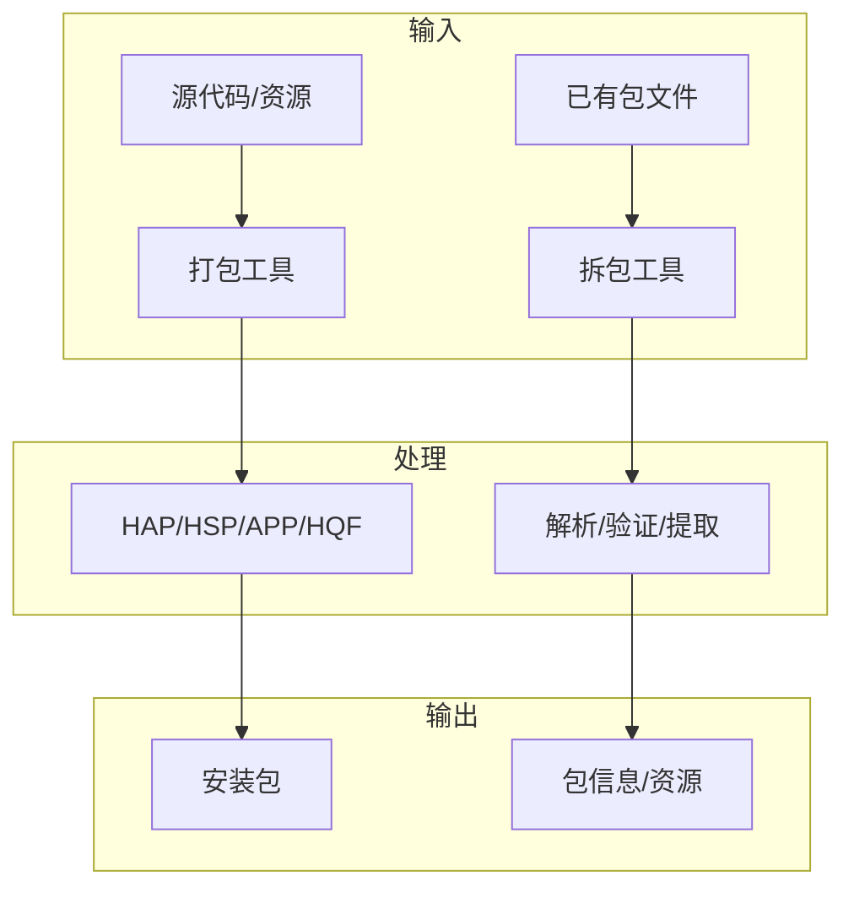
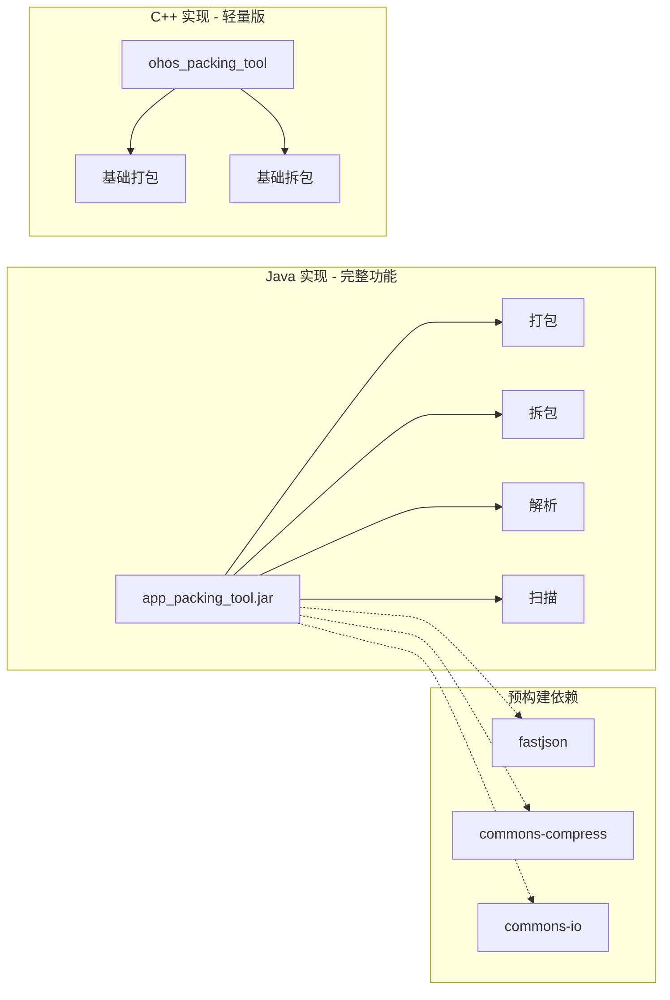

# Packing Tool - 首页

## 项目简介

**Packing Tool** 是 OpenHarmony 的打包拆包工具子系统，用于处理 OpenHarmony 应用包的生命周期管理，包括打包、拆包、验证和解析等功能。



## 核心能力

### 1. 打包功能

支持多种包类型的创建：

| 包类型 | 说明 | 典型场景 |
|-------|------|---------|
| **HAP** | HarmonyOS Ability Package | 应用主包、功能模块 |
| **HSP** | HarmonyOS Shared Package | 共享库模块 |
| **APP** | 应用分发包 | 应用市场分发 |
| **HQF** | HarmonyOS Quick Fix | 热修复补丁 |
| **APPQF** | 多 HQF 组合包 | 批量热修复 |
| **HAR** | HarmonyOS Archive | 静态共享库 |
| **RES** | 资源包 | 卡片资源 |

### 2. 拆包功能

- **完整拆包**: 将包文件解压到指定目录
- **选择性提取**: 按需提取特定文件（如 rpcid、libs）
- **架构拆分**: 按 CPU 架构拆分 libs 目录

### 3. 解析功能

- **包信息解析**: 提取 pack.info、module.json 等配置
- **HAP 列表获取**: 获取支持特定设备类型的 HAP 列表
- **资源解析**: 解析 resources.index 资源索引

### 4. 扫描功能

- **重复文件检测**: 检测包内重复文件
- **文件大小统计**: 按后缀名统计文件大小
- **合规性检查**: 验证包结构和内容合规性

## 技术架构

### 双语言实现



### 关键特性

- **并行压缩**: 使用 Apache Commons Compress 实现多线程压缩
- **JSON 处理**: 使用 FastJSON2 进行高性能 JSON 解析
- **安全加固**: C++ 版本启用 CFI、UBSan、边界检查等安全特性
- **跨平台**: 支持标准系统、小型系统、轻量系统

## 快速开始

### 命令行使用

```bash
# 打包 HAP
java -jar app_packing_tool.jar --mode hap \
    --json-path module.json \
    --resources-path resources \
    --ets-path ets \
    --out-path output.hap

# 拆包 HAP
java -jar app_unpacking_tool.jar --mode hap \
    --hap-path input.hap \
    --out-path output_dir

# 解析 APP
java -jar app_unpacking_tool.jar --mode app \
    --app-path input.app \
    --parse-mode all
```

### 编程接口

```java
// 打包
boolean result = CompressEntrance.pack(hapPath, packInfoPath, outPath);

// 拆包
boolean result = UncompressEntrance.unpack(appPath, outPath, deviceType, unpackApk);

// 解析
UncompressResult result = UncompressEntrance.parseHap(hapPath);
```

## 项目信息

| 属性 | 值 |
|-----|---|
| **组件名称** | packing_tool |
| **所属子系统** | developtools |
| **版本** | 3.2 |
| **许可证** | Apache License 2.0 |
| **源码路径** | `developtools/packing_tool/` |

## 相关链接

- [项目概述](01_Overview.md) - 详细的项目定位与边界说明
- [架构说明](02_Architecture.md) - 详细的架构设计文档
- [对外 API](04_API_Reference.md) - 完整的 API 参考手册
- [使用说明](../README_zh.md) - 详细的命令行使用说明
