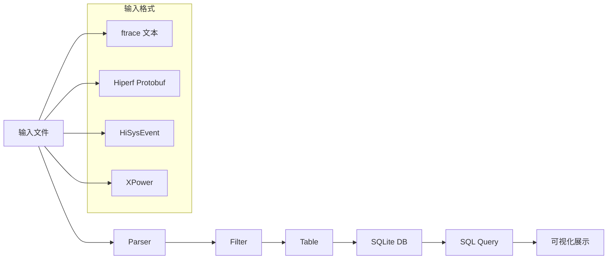
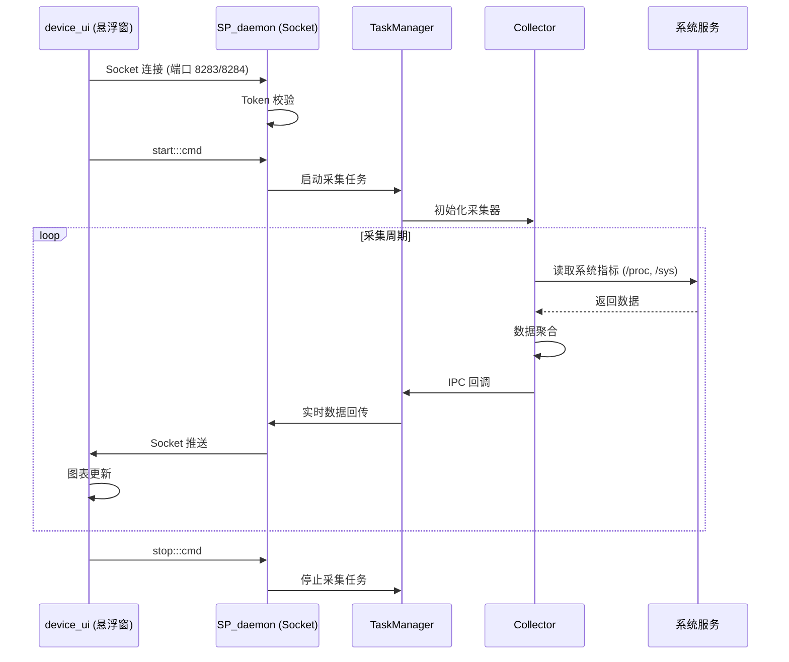
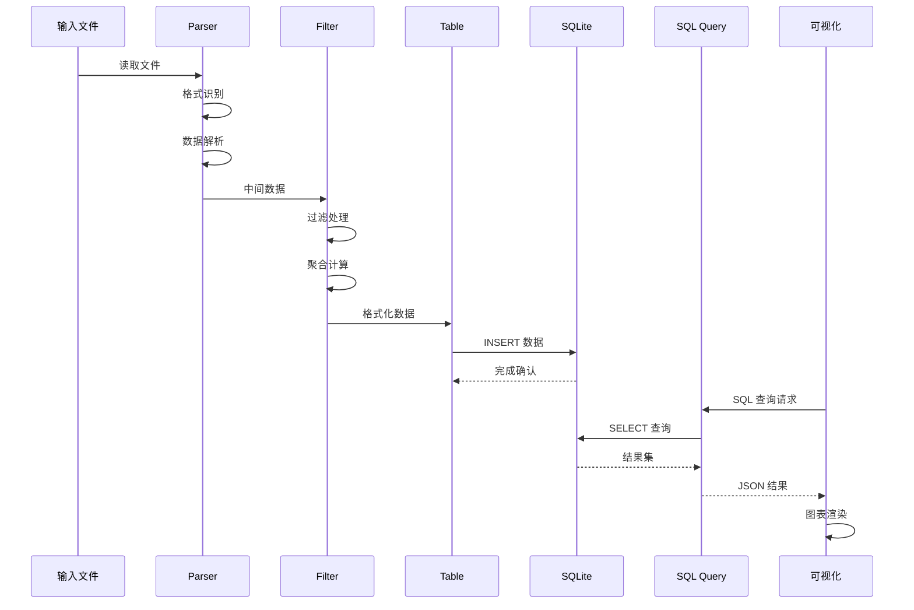

# SmartPerf 系统架构

## 架构概述

SmartPerf 采用分层架构设计，分为 **Device 端**（设备采集）和 **Host 端**（PC 分析）两大模块，通过多层次的通信机制实现完整的性能分析闭环。

```
┌─────────────────────────────────────────────────────────────────────────────┐
│                              SmartPerf 架构总览                              │
├─────────────────────────────────────────────────────────────────────────────┤
│                                                                              │
│   ┌─────────────────────────────────────────────────────────────────────┐   │
│   │                        SmartPerf Host (PC 端)                        │   │
│   │  ┌───────────────────────────────────────────────────────────────┐  │   │
│   │  │                           IDE                                │  │   │
│   │  │  ┌──────────────┐  ┌──────────────┐  ┌──────────────┐       │  │   │
│   │  │  │ Trace 分析   │  │ 在线录制控制 │  │  设备管理    │       │  │   │
│   │  │  │ (TypeScript)│  │  (TypeScript)│  │  (HDC/Go)    │       │  │   │
│   │  │  └──────────────┘  └──────────────┘  └──────────────┘       │  │   │
│   │  └─────────────────────────┬───────────────────────────────────┘  │   │
│   │                            │ WASM                               │   │
│   │                            ▼                                      │   │
│   │  ┌───────────────────────────────────────────────────────────────┐  │   │
│   │  │                     trace_streamer                           │  │   │
│   │  │  ┌────────┐ ┌────────┐ ┌────────┐ ┌────────┐ ┌────────┐    │  │   │
│   │  │  │ Parser │ │ Filter │ │ Table  │ │ RPC    │ │ Wasm   │    │  │   │
│   │  │  └────────┘ └────────┘ └────────┘ └────────┘ └────────┘    │  │   │
│   │  └───────────────────────────────────────────────────────────────┘  │   │
│   └─────────────────────────────────────────────────────────────────────┘   │
│                                    │                                       │
│                              HDC / USB / Network                            │
│                                    ▼                                       │
│   ┌─────────────────────────────────────────────────────────────────────┐   │
│   │                      SmartPerf Device (设备端)                       │   │
│   │  ┌───────────────────────────────────────────────────────────────┐  │   │
│   │  │                    device_ui (HAP)                           │  │   │
│   │  │  ┌──────────────┐  ┌──────────────┐  ┌──────────────┐       │  │   │
│   │  │  │ 悬浮窗监控   │  │  实时图表    │  │  本地报告    │       │  │   │
│   │  │  │ (ArkTS)     │  │  (ArkTS)     │  │  (ArkTS)     │       │  │   │
│   │  │  └──────────────┘  └──────────────┘  └──────────────┘       │  │   │
│   │  └─────────────────────────┬───────────────────────────────────┘  │   │
│   │                            │ Socket IPC                          │   │
│   │                            ▼                                      │   │
│   │  ┌───────────────────────────────────────────────────────────────┐  │   │
│   │  │                    SP_daemon (C++)                           │  │   │
│   │  │  ┌────────┐ ┌────────┐ ┌────────┐ ┌────────┐ ┌────────┐    │  │   │
│   │  │  │ Collector│ │  Cmd   │ │Services│ │ Task   │ │ Utils │    │  │   │
│   │  │  └────────┘ └────────┘ └────────┘ └────────┘ └────────┘    │  │   │
│   │  └───────────────────────────────────────────────────────────────┘  │   │
│   └─────────────────────────────────────────────────────────────────────┘   │
│                                                                              │
│   ┌─────────────────────────────────────────────────────────────────────┐   │
│   │                       系统服务层 (OpenHarmony)                        │   │
│   │  ┌────────┐ ┌────────┐ ┌────────┐ ┌────────┐ ┌────────┐          │   │
│   │  │ IPC    │ │ SAMgr  │ │Graphic2d│ │ Window │ │ Ability │          │   │
│   │  └────────┘ └────────┘ └────────┘ └────────┘ └────────┘          │   │
│   └─────────────────────────────────────────────────────────────────────┘   │
│                                                                              │
└─────────────────────────────────────────────────────────────────────────────┘
```

## 模块职责

### 1. device_ui (UI 悬浮窗)

**代码位置**: `smartperf_device/device_ui/entry/src/main/ets/`

**核心职责**:
- 提供可视化悬浮窗，实时展示性能数据
- 支持选择目标应用进行监控
- 生成本地测试报告

**核心组件**:

| 组件 | 路径 | 职责 |
|------|------|------|
| MainAbility | `MainAbility/MainAbility.ts` | UIAbility 入口 |
| FloatBall | `pages/FloatBall.ets` | 悬浮窗组件 |
| ProfilerFactory | `common/profiler/` | 采集器工厂 |
| BaseProfiler | `common/profiler/base/BaseProfiler.ets` | 采集器基类 |

**数据流**:
```
用户操作 → FloatBall → Socket 连接 → SP_daemon
                ←──────── 数据回传 ────────
                → 实时图表更新 → 悬浮窗展示
```

### 2. SP_daemon (命令行采集器)

**代码位置**: `smartperf_device/device_command/`

**核心职责**:
- 提供命令行性能数据采集
- 支持 CSV 数据导出
- 支持在线录制 trace

**子模块**:

| 子模块 | 路径 | 职责 |
|--------|------|------|
| collector | `collector/src/` | 25+ 种数据采集器 |
| cmds | `cmds/src/` | 命令行命令处理 |
| services/ipc | `services/ipc/src/` | Socket IPC 通信 |
| services/task_mgr | `services/task_mgr/src/` | 任务调度管理 |
| scenarios | `scenarios/src/` | 场景化采集逻辑 |
| utils | `utils/src/` | 工具函数 |

**关键类**:

| 类名 | 文件 | 职责 |
|------|------|------|
| SpServerSocket | `services/ipc/src/sp_server_socket.cpp` | Socket 服务端 |
| SpThreadSocket | `services/ipc/src/sp_thread_socket.cpp` | Socket 线程处理 |
| TaskManager | `services/task_mgr/src/task_manager.cpp` | 任务管理器 |
| ThreadPool | `services/task_mgr/src/thread_pool.cpp` | 线程池 |
| SpProfilerFactory | `utils/src/sp_profiler_factory.cpp` | 采集器工厂 |

### 3. trace_streamer (Trace 解析引擎)

**代码位置**: `smartperf_host/trace_streamer/src/`

**核心职责**:
- 将 trace 文件解析为 SQLite 数据库
- 支持 WASM 在浏览器中运行
- 提供 SQL 查询和 Metrics 计算

**处理流程**:



**子模块**:

| 子模块 | 路径 | 职责 |
|--------|------|------|
| parser | `parser/` | 多种格式的 trace 解析器 |
| filter | `filter/` | 数据过滤处理器 |
| table | `table/` | SQLite 数据表定义 |
| rpc | `rpc/` | RPC/WASM 接口 |
| proto_reader | `proto_reader/` | Protobuf 读取器 |

### 4. ide (Web 分析工具)

**代码位置**: `smartperf_host/ide/src/`

**核心职责**:
- 提供 Web 可视化分析界面
- 支持 trace 文件加载和在线录制
- 图表展示和数据分析

**核心组件**:

| 组件 | 路径 | 职责 |
|------|------|------|
| SpApplication | `trace/SpApplication.ts` | 应用入口 |
| SpSystemTrace | `trace/component/SpSystemTrace.ts` | Trace 分析主组件 |
| HdcDeviceManager | `hdc/HdcDeviceManager.ts` | HDC 设备管理 |
| TraceWorker | `trace/database/TraceWorker.ts` | WASM 调用工作线程 |

## 通信机制

### 1. Socket IPC (device_ui ↔ SP_daemon)

**端口分配**:

| 端口 | 协议 | 用途 |
|------|------|------|
| 8283 | UDP | 控制命令通道 |
| 8284 | TCP | 数据传输通道 |
| 8285 | UDP | 扩展控制通道 |

**代码位置**: `smartperf_device/device_command/services/ipc/`

**关键文件**:

| 文件 | 职责 |
|------|------|
| `sp_server_socket.cpp` | Socket 服务端初始化和监听 |
| `sp_thread_socket.cpp` | 连接处理、Token 校验、消息分发 |

**消息格式**:
```
命令格式: command:::token
示例: start:::abc123token
```

**命令类型**:

| 命令 | 用途 |
|------|------|
| `init:::` | 初始化采集任务 |
| `start:::` | 开始采集 |
| `stop:::` | 停止采集 |
| `startRecord:::` | 开始录制 |
| `stopRecord:::` | 停止录制 |
| `set_pkgName:::` | 设置目标包名 |

### 2. Token 安全机制

**代码位置**: `sp_thread_socket.cpp` (行 111-137, 289-317)

```cpp
// Token 校验流程
bool CheckTcpToken() {
    // 提取消息中的 Token
    // 与本地存储的 checkToken 比对
    // 失败返回 TOKEN_CHECK_FAILED
}

bool CheckUdpToken() {
    // UDP 消息 Token 校验
    // HDC Shell 模式可跳过校验
}
```

### 3. WASM 调用 (ide ↔ trace_streamer)

**代码位置**: `smartperf_host/trace_streamer/src/rpc/wasm_func.cpp`

**调用方式**:
```typescript
// JS 调用 WASM 示例
wasmModule._Initialize(callbackPtr);
wasmModule._TraceStreamerParseDataEx(fileData, isFinish);
wasmModule._TraceStreamerSqlQueryEx(querySQL);
```

### 4. HDC 通信 (ide ↔ Device)

**代码位置**: `smartperf_host/ide/src/hdc/`

**功能**:
- 设备发现和连接管理
- 在线录制控制
- 数据拉取

## 线程模型

### SP_daemon 线程架构

```
┌─────────────────────────────────────────────────────────────────┐
│                        SP_daemon 线程模型                         │
├─────────────────────────────────────────────────────────────────┤
│                                                                  │
│   ┌───────────────────────────────────────────────────────────┐  │
│   │                    主线程 (main)                         │  │
│   │  - smartperf_main.cpp                                    │  │
│   │  - 参数解析 (argument_parser.cpp)                         │  │
│   │  - 服务初始化                                             │  │
│   └───────────────────────────────────────────────────────────┘  │
│                              │                                  │
│                              ▼                                  │
│   ┌───────────────────────────────────────────────────────────┐  │
│   │              Socket 服务线程 (1-N)                        │  │
│   │  - sp_server_socket.cpp                                  │  │
│   │  - 每个连接一个线程 (sp_thread_socket)                     │  │
│   │  - Token 校验、消息解析、命令分发                          │  │
│   └───────────────────────────────────────────────────────────┘  │
│                              │                                  │
│              ┌───────────────┼───────────────┐                  │
│              ▼               ▼               ▼                  │
│   ┌──────────────────┐ ┌──────────────────┐ ┌────────────────┐│
│   │  采集器线程池      │ │  任务调度线程    │ │  采集回调线程   ││
│   │  (ThreadPool)    │ │  (TaskManager)  │ │  (Collector)   ││
│   │  - CPU/GPU/FPS   │ │  - 任务队列管理  │ │  - 数据采集     ││
│   │  - RAM/Network   │ │  - 定时任务      │ │  - 实时回传     ││
│   │  - Temperature   │ │  - 状态同步      │ │  - IPC 回调     ││
│   └──────────────────┘ └──────────────────┘ └────────────────┘│
│                                                                  │
└─────────────────────────────────────────────────────────────────┘
```

### trace_streamer 线程架构

```
┌─────────────────────────────────────────────────────────────────┐
│                     trace_streamer 线程模型                      │
├─────────────────────────────────────────────────────────────────┤
│                                                                  │
│   ┌───────────────────────────────────────────────────────────┐  │
│   │                    主线程                                │  │
│   │  - main.cpp (独立进程模式)                                 │  │
│   │  - RPC 服务初始化                                          │  │
│   └───────────────────────────────────────────────────────────┘  │
│                              │                                  │
│                              ▼                                  │
│   ┌───────────────────────────────────────────────────────────┐  │
│   │              Parser 工作线程 (可选)                        │  │
│   │  - 大文件分块解析                                          │  │
│   │  - FFRT 并行处理                                          │  │
│   └───────────────────────────────────────────────────────────┘  │
│                                                                  │
│   ┌───────────────────────────────────────────────────────────┐  │
│   │              SQLite 读写线程                               │  │
│   │  - 数据表创建和写入                                        │  │
│   │  - SQL 查询响应                                            │  │
│   └───────────────────────────────────────────────────────────┘  │
│                                                                  │
│   [WASM 模式]                                                   │
│   ┌───────────────────────────────────────────────────────────┐  │
│   │              Web Worker 线程 (浏览器)                       │  │
│   │  - WASM 模块加载                                           │  │
│   │  - 解析任务调度                                            │  │
│   │  - 回调函数执行                                           │  │
│   └───────────────────────────────────────────────────────────┘  │
│                                                                  │
└─────────────────────────────────────────────────────────────────┘
```

## 数据流

### 1. 设备端数据采集流程



### 2. Trace 解析流程



## 相关文档

- [项目概览](00_Overview.md)
- [WASM 接口](02_WASM_API.md)
- [Inner Kit API](03_InnerAPI.md)
- [GN 构建配置](04_GNBuild.md)
