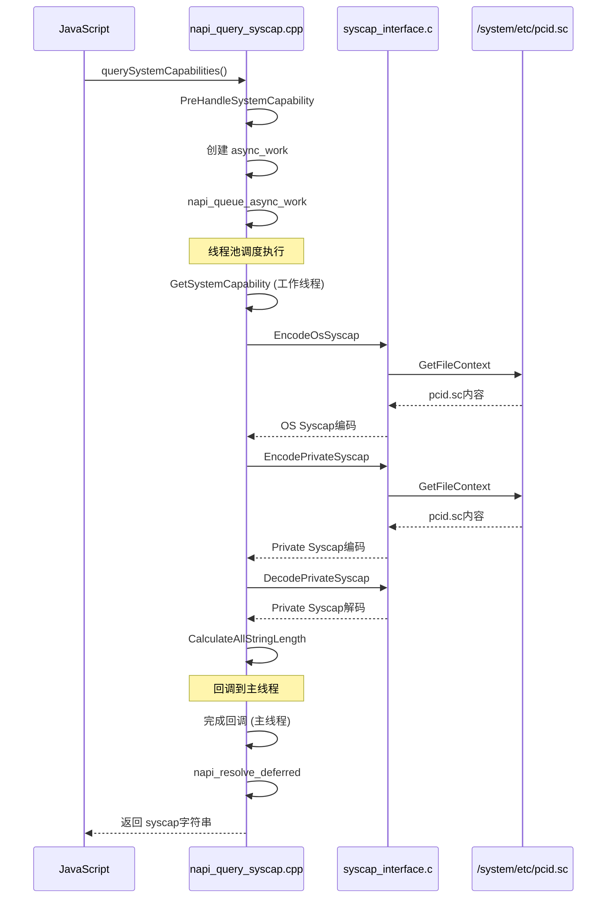

# 02_Architecture - 架构说明

## 目的

本文档介绍 `syscap_codec` 的架构设计，包括组件图、数据流、线程模型和关键时序。

## 适用范围

- 需要理解系统设计的开发人员
- 进行代码审查或优化的工程师

## 架构概览

### 分层架构

```
┌─────────────────────────────────────────────────────────────────┐
│ Layer 4: 应用接口层 (Application Interface)                      │
│ ┌──────────────────┐  ┌──────────────────────────────────────┐ │
│ │   N-API (传统)    │  │   ANI/Taihe (新)                      │ │
│ │   query_syscap.js │  │   ohos.systemCapability.taihe         │ │
│ └────────┬─────────┘  └──────────────┬─────────────────────────┘ │
└──────────┼──────────────────────────┼───────────────────────────┘
           │                          │
           ▼                          ▼
┌─────────────────────────────────────────────────────────────────┐
│ Layer 3: Native桥接层 (Native Bridge)                            │
│ ┌──────────────────┐  ┌──────────────────────────────────────┐ │
│ │ napi_query_      │  │   ani_constructor.cpp                 │ │
│ │ syscap.cpp       │  │   ohos.systemCapability.impl.cpp      │ │
│ │ (异步工作队列)    │  │   (同步调用)                           │ │
│ └────────┬─────────┘  └──────────────┬─────────────────────────┘ │
└──────────┼──────────────────────────┼───────────────────────────┘
           │                          │
           └────────────┬─────────────┘
                        ▼
┌─────────────────────────────────────────────────────────────────┐
│ Layer 2: 内部API层 (Inner API)                                   │
│              interfaces/inner_api/syscap_interface.c             │
│              提供稳定的C接口供上层调用                            │
└────────────────────────┬────────────────────────────────────────┘
                         │
        ┌────────────────┼────────────────┐
        │                │                │
        ▼                ▼                ▼
┌──────────────┐ ┌──────────────┐ ┌──────────────┐
│   PCID编解码  │ │  RPCID编解码  │ │   工具函数    │
│ create_pcid.c│ │ syscap_tool.c│ │ context_tool.│
│              │ │ (RPCID部分)   │ │ c            │
└──────────────┘ └──────────────┘ └──────────────┘
                        │
                        ▼
┌─────────────────────────────────────────────────────────────────┐
│ Layer 1: 基础层 (Foundation)                                     │
│ ┌──────────────┐ ┌──────────────┐ ┌──────────────────────────┐ │
│ │  大小端转换   │ │   安全函数    │ │     JSON解析             │ │
│ │endian_intern.│ │ securec.h    │ │     cJSON                │ │
│ │c             │ │              │ │                          │ │
│ └──────────────┘ └──────────────┘ └──────────────────────────┘ │
└─────────────────────────────────────────────────────────────────┘
```

## 组件图

### 核心组件

```mermaid
graph TB
    subgraph "应用接口层"
        JS[JavaScript应用]
        NAPI_JS[query_syscap.js]
        ANI_IDL[ohos.systemCapability.taihe]
    end
    
    subgraph "Native桥接层"
        NAPI_CPP[napi_query_syscap.cpp]
        ANI_CPP[ohos.systemCapability.impl.cpp]
        ANI_CON[ani_constructor.cpp]
    end
    
    subgraph "内部API层"
        INNER_IF[syscap_interface.c]
    end
    
    subgraph "核心逻辑层"
        PCID[create_pcid.c]
        RPCID[syscap_tool.c]
        CONTEXT[context_tool.c]
    end
    
    subgraph "基础层"
        ENDIAN[endian_internal.c]
        SECUREC[securec库]
        CJSON[cJSON库]
    end
    
    subgraph "数据存储"
        PCID_FILE[/system/etc/pcid.sc]
    end
    
    JS --> NAPI_JS
    NAPI_JS --> NAPI_CPP
    JS --> ANI_IDL
    ANI_IDL --> ANI_CPP
    ANI_CPP --> ANI_CON
    
    NAPI_CPP --> INNER_IF
    ANI_CPP --> INNER_IF
    
    INNER_IF --> PCID
    INNER_IF --> RPCID
    
    PCID --> CONTEXT
    RPCID --> CONTEXT
    
    PCID --> ENDIAN
    RPCID --> ENDIAN
    CONTEXT --> CJSON
    
    INNER_IF --> PCID_FILE
    
    style PCID_FILE fill:#f9f,stroke:#333,stroke-width:2px
```

## 数据流

### PCID编码数据流

```
┌──────────────┐     ┌──────────────┐     ┌──────────────┐
│  JSON输入    │────▶│  cJSON解析   │────▶│  提取字段    │
│  pcid.json   │     │              │     │              │
└──────────────┘     └──────────────┘     └──────┬───────┘
                                                  │
       ┌──────────────────────────────────────────┼──────────────────┐
       │                                          │                  │
       ▼                                          ▼                  ▼
┌──────────────┐     ┌──────────────┐     ┌──────────────┐   ┌──────────────┐
│  设置Header   │     │  设置OS      │     │  设置Private │   │  网络字节序  │
│  apiVersion  │     │  Syscap位图  │     │  Syscap      │   │  转换        │
│  systemType  │     │              │     │              │   │              │
│  manufacturer│     │              │     │              │   │              │
└──────┬───────┘     └──────┬───────┘     └──────┬───────┘   └──────┬───────┘
       │                    │                    │                  │
       └────────────────────┴────────────────────┘                  │
                          │                                         │
                          ▼                                         │
                   ┌──────────────┐                                 │
                   │  组装PCID    │◀────────────────────────────────┘
                   │  结构体      │
                   └──────┬───────┘
                          │
                          ▼
                   ┌──────────────┐
                   │  写入文件    │
                   │  pcid.sc     │
                   └──────────────┘
```

### 运行时查询数据流

```
┌──────────────────────────────────────────────────────────────────────┐
│                         JavaScript 调用                               │
│  systemCapability.querySystemCapabilities()                          │
└───────────────────────────────┬──────────────────────────────────────┘
                                │
                                ▼
┌──────────────────────────────────────────────────────────────────────┐
│                      N-API / ANI 桥接层                               │
│  ┌─────────────────────────────┐  ┌────────────────────────────────┐ │
│  │   N-API: QuerySystemCapability│  │   ANI: querySystemCapabilitie() │ │
│  │   - 创建异步工作              │  │   - 同步调用                    │ │
│  │   - 线程池执行               │  │                                 │ │
│  │   - Promise/Callback返回     │  │                                 │ │
│  └─────────────┬───────────────┘  └────────────┬───────────────────┘ │
└────────────────┼───────────────────────────────┼─────────────────────┘
                 │                               │
                 └───────────────┬───────────────┘
                                 ▼
┌──────────────────────────────────────────────────────────────────────┐
│                      内部API层 (syscap_interface.c)                   │
│  1. EncodeOsSyscap()      → 读取 /system/etc/pcid.sc 前128字节       │
│  2. EncodePrivateSyscap() → 读取私有syscap字符串                     │
│  3. DecodePrivateSyscap() → 解码私有syscap                           │
└───────────────────────────────┬──────────────────────────────────────┘
                                │
                                ▼
┌──────────────────────────────────────────────────────────────────────┐
│                      数据组装                                         │
│  1. OS Syscap (32个uint32) → 字符串数组                              │
│  2. Private Syscap → 字符串数组                                      │
│  3. 合并为逗号分隔的大字符串                                          │
└───────────────────────────────┬──────────────────────────────────────┘
                                │
                                ▼
┌──────────────────────────────────────────────────────────────────────┐
│                      返回JS层                                         │
│  格式: "header1,header2,u32_1,u32_2,...,private1,private2,..."        │
└──────────────────────────────────────────────────────────────────────┘
```

## 线程模型

### N-API 异步模型

```
主线程 (JS线程)                          工作线程 (libuv线程池)
     │                                          │
     │  1. 调用 QuerySystemCapability()         │
     │─────────────────────────────────────────▶│
     │                                          │
     │  2. 创建 async_work                      │
     │                                          │
     │  3. 加入队列 (napi_queue_async_work)     │
     │─────────────────────────────────────────▶│
     │                                          │
     │         (线程池调度)                      │
     │                                          │
     │                                          │  4. 执行 GetSystemCapability()
     │                                          │     - 读取文件
     │                                          │     - 编码解码
     │                                          │     - 组装字符串
     │                                          │
     │         (回调到主线程)                    │
     │                                          │
     │  5. 执行完成回调                         │
     │◀─────────────────────────────────────────│
     │     - 创建JS返回值                       │
     │     - Resolve Promise / 调用Callback     │
     │     - 清理资源                           │
     │                                          │
```

**关键代码位置**:
- 异步工作创建: `napi/napi_query_syscap.cpp:184-224`
- 执行函数: `napi/napi_query_syscap.cpp:186-194`
- 完成回调: `napi/napi_query_syscap.cpp:196-223`

### ANI 同步模型

```
JS线程 (同步执行)
     │
     │  1. 调用 querySystemCapabilitie()
     │
     │  2. 直接执行 GetSystemCapability()
     │     - 读取文件
     │     - 编码解码
     │     - 组装字符串
     │
     │  3. 直接返回结果
     │
```

**关键代码位置**:
- ANI实现: `taihe/syscap/src/ohos.systemCapability.impl.cpp:144-162`

## 关键时序

### 命令行工具时序

```mermaid
sequenceDiagram
    participant User as 用户
    participant Main as main.c
    participant Tool as syscap_tool.c
    participant Create as create_pcid.c
    participant Context as context_tool.c
    
    User->>Main: 执行 syscap_tool -Rei input.json
    Main->>Main: 解析命令行参数 (getopt_long)
    Main->>Main: 设置操作位图 (SetBitMap)
    Main->>Main: 根据位图分发操作 (OperateByBitMap)
    
    alt RPCID编码
        Main->>Tool: RPCIDEncode(input, output)
        Tool->>Context: CheckFileAndGetFileContext(input)
        Context-->>Tool: 文件内容
        Tool->>Tool: cJSON_Parse
        Tool->>Tool: 提取syscap数组
        Tool->>Tool: 填充RPCIDHead
        Tool->>Tool: 网络字节序转换
        Tool->>Context: ConvertedContextSaveAsFile
    else PCID编码
        Main->>Create: CreatePCID(input, output)
        Create->>Context: CheckFileAndGetFileContext
        Create->>Create: cJSON_Parse
        Create->>Create: 设置Header
        Create->>Create: 设置OS Syscap位图
        Create->>Create: 设置Private Syscap
        Create->>Context: ConvertedContextSaveAsFile
    end
```

### N-API查询时序



## 关键数据结构关系

```
┌─────────────────────────────────────────────────────────────────────┐
│                         Syscap定义                                  │
│  include/codec_config/syscap_define.h                               │
│                                                                     │
│  ┌─────────────────────────────────────────────────────────────┐   │
│  │  enum SyscapNum {                                            │   │
│  │      ACCOUNT_APPACCOUNT,      // 0                           │   │
│  │      ACCOUNT_OSACCOUNT,       // 1                           │   │
│  │      ...                                                     │   │
│  │      DEVELOPTOOLS_SYSCAP,     // 本项目                      │   │
│  │      ...                                                     │   │
│  │      SYSCAP_BASIC_END = 500                                 │   │
│  │  }                                                           │   │
│  └─────────────────────────────────────────────────────────────┘   │
│                                                                     │
│  ┌─────────────────────────────────────────────────────────────┐   │
│  │  const SyscapWithNum g_arraySyscap[] = {                     │   │
│  │      {"SystemCapability.Account.AppAccount", 0},             │   │
│  │      {"SystemCapability.Account.OsAccount", 1},              │   │
│  │      ...                                                     │   │
│  │  }                                                           │   │
│  └─────────────────────────────────────────────────────────────┘   │
└─────────────────────────────────────────────────────────────────────┘
                                    │
                                    │ 索引映射
                                    ▼
┌─────────────────────────────────────────────────────────────────────┐
│                         PCID文件格式                                │
│                                                                     │
│  ┌─────────────┬─────────────┬─────────────┬─────────────────────┐ │
│  │  RPCIDHead  │  SysCapType │ SysCapLen   │   SysCap数据        │ │
│  │  (4 bytes)  │  (2 bytes)  │ (2 bytes)   │   (变长)            │ │
│  └─────────────┴─────────────┴─────────────┴─────────────────────┘ │
│                                                                     │
│  RPCIDHead:                                                         │
│  - apiVersion (15 bits)                                             │
│  - apiVersionType (1 bit) = 1 (RPCID)                               │
│                                                                     │
│  SysCapType = 2 (Required Cap)                                      │
│  SysCapLen = syscap数量 * 256 (SINGLE_FEAT_LEN)                     │
│  SysCap数据 = 去掉"SystemCapability."前缀的字符串数组               │
└─────────────────────────────────────────────────────────────────────┘
                                    │
                                    │ 编码/解码
                                    ▼
┌─────────────────────────────────────────────────────────────────────┐
│                         PCID文件格式                                │
│                                                                     │
│  ┌─────────────┬─────────────┬─────────────┬──────────┬───────────┐ │
│  │  PCIDHeader │  osSyscap   │  priSyscap  │          │           │ │
│  │  (8 bytes)  │  (120 bytes)│  (变长)     │          │           │ │
│  └─────────────┴─────────────┴─────────────┴──────────┴───────────┘ │
│                                                                     │
│  PCIDHeader:                                                        │
│  - apiVersion (15 bits)                                             │
│  - apiVersionType (1 bit) = 0 (PCID)                                │
│  - systemType (3 bits)                                              │
│  - reserved (13 bits)                                               │
│  - manufacturerID (32 bits)                                         │
│                                                                     │
│  osSyscap: 位图，每个bit代表一个SyscapNum                            │
│  priSyscap: 逗号分隔的字符串 (格式: "Feature1,Feature2,...")         │
└─────────────────────────────────────────────────────────────────────┘
```

## 相关跳转

- [项目概览](00_Overview.md) - 项目定位和核心概念
- [目录结构](01_Directory_Structure.md) - 代码组织方式
- [N-API接口](03_NAPI_Interface.md) - JS接口详细说明
- [内部API](04_Inner_API.md) - C/C++接口详细说明
- [调用链附录](appendix/Callgraphs.md) - 详细调用链
