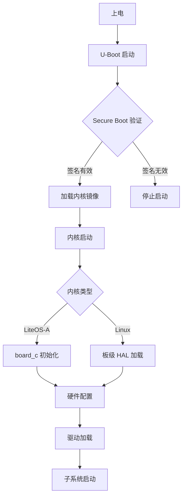
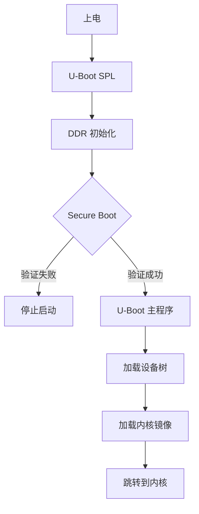
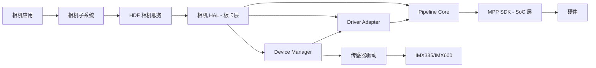
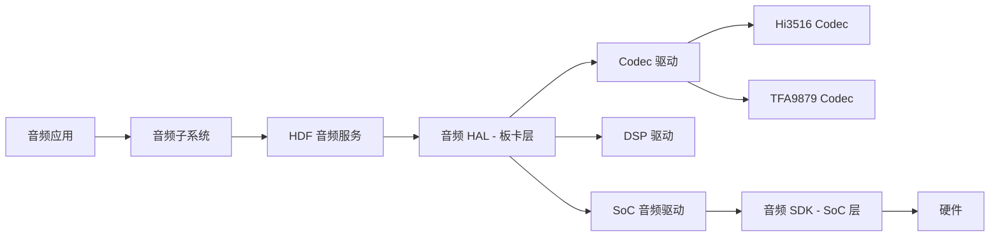
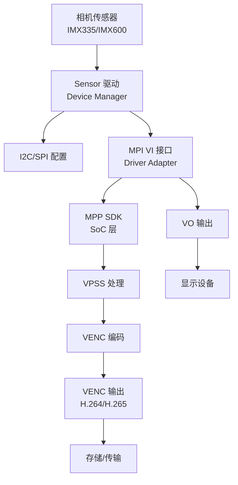
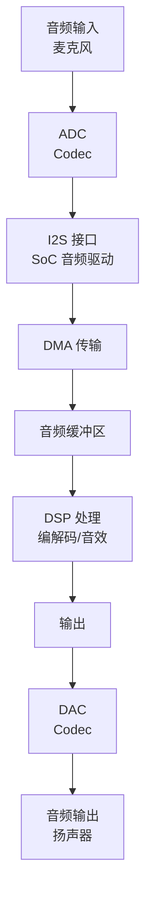
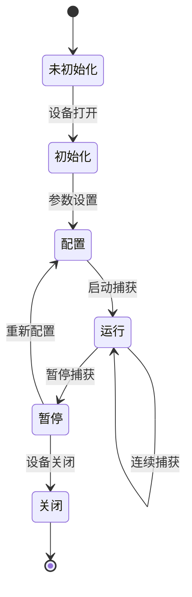

# 架构说明

## 目的

本文档说明 OpenHarmony Hisilicon 板卡仓库的系统架构，包括组件关系、数据流、线程模型和关键时序。

## 适用范围

本文档适用于：
- 系统架构师理解整体设计
- 高级开发者了解组件交互
- 安全工程师分析信任边界

---

## 架构概览

### 系统分层架构

```
┌─────────────────────────────────────────────────────────────┐
│                   OpenHarmony 应用层                       │
│              （N-API、JS 应用）                             │
│                    ❌ 本仓库不包含                           │
└─────────────────────────────────────────────────────────────┘
                          ↓
┌─────────────────────────────────────────────────────────────┐
│                  OpenHarmony 子系统层                       │
│          （相机、音频、显示、网络等）                           │
│                                                            │
│  ┌──────────────┐  ┌──────────────┐  ┌──────────────┐ │
│  │ 相机子系统     │  │ 音频子系统     │  │ 显示子系统     │ │
│  └──────────────┘  └──────────────┘  └──────────────┘ │
└─────────────────────────────────────────────────────────────┘
                          ↓
┌─────────────────────────────────────────────────────────────┐
│                    硬件驱动框架 (HDF)                     │
│               (Hardware Driver Foundation)                   │
│                  统一驱动接口，支持多内核                         │
└─────────────────────────────────────────────────────────────┘
                          ↓
┌─────────────────────────────────────────────────────────────┐
│                      板卡层 ← 本仓库                       │
│                                                            │
│  ┌──────────────┐  ┌──────────────┐  ┌──────────────┐ │
│  │ 相机 HAL       │  │ 音频 HAL      │  │ 显示 HAL      │ │
│  │ (camera/)     │  │ (audio_...)  │  │ (display_...) │ │
│  └──────────────┘  └──────────────┘  └──────────────┘ │
│                                                            │
│  ┌──────────────┐  ┌──────────────┐  ┌──────────────┐ │
│  │ 板级初始化    │  │ U-Boot       │  │ Secure Boot  │ │
│  │ (board/)     │  │ (uboot/)     │  │ (secureboot/)│ │
│  └──────────────┘  └──────────────┘  └──────────────┘ │
└─────────────────────────────────────────────────────────────┘
                          ↓
┌─────────────────────────────────────────────────────────────┐
│                      SoC 层                               │
│          (device_soc_hisilicon 仓库)                       │
│                                                            │
│  ┌──────────────┐  ┌──────────────┐  ┌──────────────┐ │
│  │ MPP SDK       │  │ 音频 SDK     │  │ 显示 SDK     │ │
│  │ (Hi3518/...) │  │ (Hi3516/...) │  │ (Hi3751/...) │ │
│  └──────────────┘  └──────────────┘  └──────────────┘ │
└─────────────────────────────────────────────────────────────┘
                          ↓
┌─────────────────────────────────────────────────────────────┐
│                        硬件                               │
│     (CPU、存储、外设、相机传感器、音频编解码器等)                 │
└─────────────────────────────────────────────────────────────┘
```

**证据**:
- `hispark_taurus/BUILD.gn:10-23` - 板卡层依赖 SoC 层的 MPP 和 SDK
- `hispark_taurus/camera/BUILD.gn:4` - 导入 HDF 框架
- `hispark_taurus/camera/driver_adapter/include/mpi_adapter.h` - MPI 接口适配 SoC 层 MPP

---

## 核心组件

### 1. 板级初始化

#### 启动流程



#### LiteOS-A 板级初始化

**入口**: `hispark_taurus/liteos_a/board/board.c`

**关键任务**:
1. **硬件配置**
   - CPU 配置（Cortex-A7）
   - 时钟初始化
   - 内存配置
   - 外设控制器初始化

2. **外设初始化**
   - UART（串口）
   - GPIO
   - SPI/I2C
   - 存储（NOR Flash, eMMC）

**硬件抽象头文件** (`include/hisoc/`):
- `nand.h` - NAND 控制器
- `mmc.h` - MMC/eMMC 控制器
- `uart.h` - UART 驱动
- `timer.h` - 定时器
- `dmac.h` - DMA 控制器
- `mmu_config.h` - MMU 配置
- `clock.h` - 时钟控制
- `flash.h` - Flash 控制器

**证据**:
- `hispark_taurus/liteos_a/board/board.c:1` - 板级初始化实现
- `hispark_taurus/liteos_a/board/include/hisoc/*.h` - 硬件抽象头文件

---

### 2. U-Boot + Secure Boot

#### U-Boot 启动流程



#### Secure Boot 机制

**验证流程**:
1. **签名验证**: U-Boot 验证内核镜像的 RSA 签名
2. **证书链验证**: 验证 X.509 证书链有效性
3. **密钥验证**: 使用存储的公钥验证签名

**密钥管理**:
- `rsa2048pem/` - RSA 2048 位公钥/私钥
- `rsa4096pem/` - RSA 4096 位公钥/私钥
- `x509_creater/` - X.509 证书生成工具

**证据**:
- `hispark_aries/uboot/secureboot_ohos/` - OpenHarmony 安全启动
- `hispark_aries/uboot/secureboot_release/rsa2048pem/` - RSA 2048 密钥
- `hispark_aries/uboot/secureboot_release/rsa4096pem/` - RSA 4096 密钥

---

### 3. 相机 HAL 架构

#### 组件关系图



#### 关键组件职责

**1. Device Manager** (`device_manager/`)
- **职责**: 管理相机传感器设备
- **功能**:
  - 传感器初始化和配置
  - I2C/SPI 通信
  - 传感器参数设置（分辨率、帧率、曝光等）

- **支持的传感器**:
  - Sony IMX335 (2000万像素)
  - Sony IMX600 (4800万像素)

**证据**:
- `hispark_taurus/camera/device_manager/src/imx335.cpp` - IMX335 驱动实现
- `hispark_taurus/camera/device_manager/src/imx600.cpp` - IMX600 驱动实现

**2. Driver Adapter** (`driver_adapter/`)
- **职责**: 适配 MPI (Media Processing Interface)
- **功能**:
  - MPI 接口封装
  - VI (Video Input) 对象管理
  - VO (Video Output) 对象管理
  - VPSS (Video Process Sub-System) 管理
  - VENC (Video Encode) 对象管理

**证据**:
- `hispark_taurus/camera/driver_adapter/include/mpi_adapter.h` - MPI 适配器
- `hispark_taurus/camera/driver_adapter/include/ivi_object.h` - VI 对象
- `hispark_taurus/camera/driver_adapter/include/ivo_object.h` - VO 对象

**3. Pipeline Core** (`pipeline_core/`)
- **职责**: 相机流水线管理
- **功能**:
  - IPP (Image Post Processing) 算法
  - 流水线配置和调度
  - 图像格式转换

**证据**:
- `hispark_taurus/camera/pipeline_core/src/ipp_algo_example.c` - IPP 算法示例
- `hispark_taurus/camera/BUILD.gn:41-73` - 流水线配置生成

---

### 4. 音频 HAL 架构

#### 组件关系图



#### 关键组件职责

**1. Codec 驱动** (`codec/`)
- **职责**: 音频编解码器驱动
- **支持的编解码器**:
  - Hi3516 SoC 内置编解码器
  - TFA9879 外部编解码器

**证据**:
- `hispark_taurus/audio_drivers/codec/hi3516/src/hi3516_codec_impl.c` - Hi3516 实现
- `hispark_taurus/audio_drivers/codec/tfa9879/src/tfa9879_codec_ops.c` - TFA9879 操作

**2. DSP 驱动** (`dsp/`)
- **职责**: DSP (数字信号处理器) 驱动
- **功能**: 音频处理、编解码加速

**3. SoC 音频驱动** (`soc/`)
- **职责**: SoC 音频控制器驱动
- **功能**: I2S、PCM、DMA 等音频外设控制

---

## 数据流

### 相机数据流



**证据**:
- `hispark_taurus/camera/driver_adapter/include/mpi_adapter.h` - MPI 接口定义

### 音频数据流



**证据**:
- `hispark_taurus/audio_drivers/codec/hi3516/src/hi3516_codec_ops.c` - Codec 操作

---

## 线程模型

### LiteOS-A 线程模型

**单核 Cortex-A7**:
- 主线程: 内核初始化
- 中断线程: 外设中断处理
- 应用线程: 用户空间任务

**证据**:
- `hispark_aries/liteos_a/config.gni:21` - `board_cpu = "cortex-a7"`
- LiteOS-A 单核运行（Hi3518EV300）

### Linux 线程模型

**多核 Cortex-A53 (Phoenix) / Cortex-A7 (Taurus Linux)**:
- 内核线程: 驱动处理
- 用户线程: 应用进程
- 中断处理: 硬件中断

**证据**:
- `hispark_phoenix/README_zh.md:21` - "多核 ARM A53 CPU"

---

## 资源生命周期

### 相机 HAL 资源生命周期



**证据**:
- `hispark_taurus/camera/device_manager/src/imx335.cpp` - 传感器生命周期管理

### U-Boot 生命周期

```mermaid
stateDiagram-v2
    [*] --> SPL: 上电
    SPL --> DDR 初始化: Secure Boot 验证
    DDR 初始化 --> U-Boot 主程序: 加载镜像
    U-Boot 主程序 --> 内核: 跳转
    内核 --> [*]
```

**证据**:
- `hispark_aries/uboot/secureboot_release/ddr_init/` - DDR 初始化二进制

---

## 错误传播机制

### 板级初始化错误处理

**机制**:
- 断言检查（assert）
- 返回错误码
- 日志记录

**证据**:
- `hispark_taurus/liteos_a/board/board.c` - 初始化代码（需检查实际错误处理）

### Secure Boot 错误处理

**机制**:
- 签名验证失败 → 停止启动
- 证书链无效 → 停止启动
- 密钥不匹配 → 停止启动

**证据**:
- `hispark_aries/uboot/secureboot_release/` - 安全启动脚本（需检查实际错误处理）

---

## 相关跳转

- [项目概览](00_Overview.md) - 项目定位和核心能力
- [目录结构](01_Directory_Structure.md) - 详细的目录组织
- [内部 API](03_Inner_API.md) - 模块接口和稳定性
- [安全评审](06_Security_Review.md) - 安全边界和攻击面
