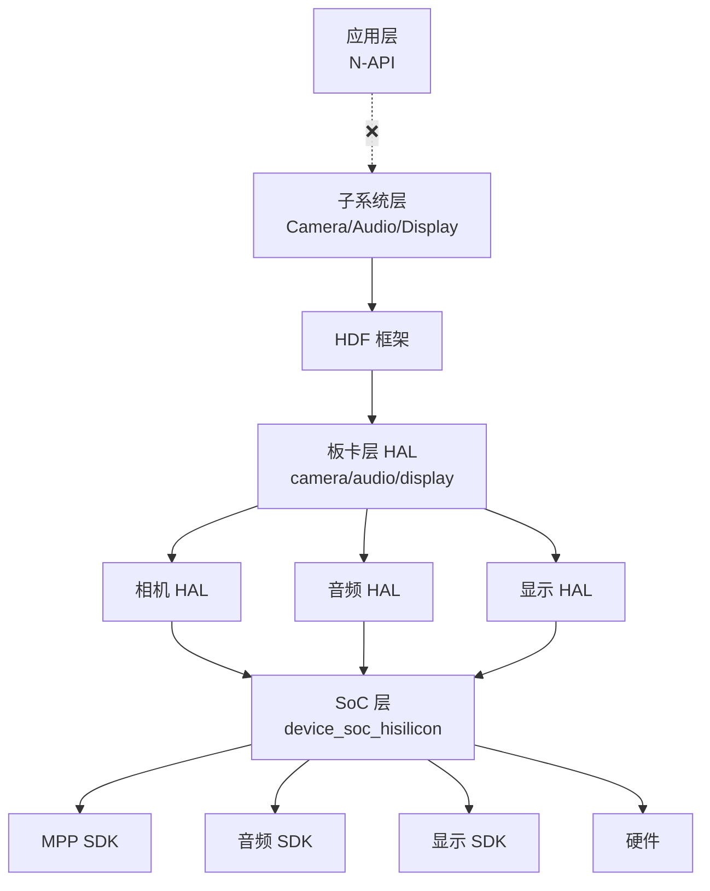

# 内部 API

## 目的

本文档说明 OpenHarmony Hisilicon 板卡仓库的内部 API 接口、模块依赖方向、接口稳定性和可替换点。

## 适用范围

本文档适用于：
- 驱动开发者了解内部接口
- 系统工程师评估模块依赖
- 架构师设计可扩展性

---

## 内部 API 概述

**定义**: 本仓库提供的内部接口，供 SoC 层和 Vendor 层使用

**特点**:
- ✅ 板级配置接口
- ✅ HAL (Hardware Abstraction Layer) 接口
- ✅ 硬件抽象头文件
- ❌ 无 N-API 接口（应用层）
- ❌ 无 IPC/ServiceAbility 接口（系统服务层）

---

## 板级配置 API

### config.gni 接口

**位置**: `liteos_a/config.gni`, `linux/config.gni`

**用途**: 定义内核编译选项和工具链配置

**关键变量**:

| 变量名 | 类型 | 说明 | 示例 |
|-------|------|------|------|
| `kernel_type` | string | 内核类型 | `"liteos_a"`, `"linux"` |
| `kernel_version` | string | 内核版本 | `""` |
| `board_cpu` | string | CPU 类型 | `"cortex-a7"` |
| `board_arch` | string | 架构 | `""` |
| `board_toolchain` | string | 工具链名称 | `""` |
| `board_toolchain_path` | string | 工具链路径 | `""` |
| `board_toolchain_type` | string | 工具链类型 | `"clang"`, `"gcc"` |
| `board_cflags` | list | C 编译标志 | `["-mfloat-abi=softfp", "-mfpu=neon-vfpv4"]` |
| `board_cxx_flags` | list | C++ 编译标志 | `["-mfloat-abi=softfp", "-mfpu=neon-vfpv4"]` |
| `board_ld_flags` | list | 链接标志 | `[]` |
| `board_include_dirs` | list | 头文件搜索路径 | `[]` |
| `board_adapter_dir` | string | HAL 适配目录 | `"//device/soc/hisilicon/common/hal"` |
| `storage_type` | string | 存储类型 | `"spinor"` |

**证据**:
- `hispark_aries/liteos_a/config.gni:14-62` - 完整配置定义
- `hispark_taurus/liteos_a/config.gni` - Taurus 配置

**稳定性**: ⚠️ 部分稳定（编译选项可变）

**可替换性**: ✅ 可替换（不同板卡可定义不同值）

---

### device.gni 接口

**位置**: `device.gni`

**用途**: 定义板卡设备和子系统配置

**关键变量**:

| 变量名 | 类型 | 说明 | 默认值 |
|-------|------|------|-------|
| `soc_company` | string | SoC 厂商 | `"hisilicon"` |
| `soc_name` | string | SoC 型号 | `"hi3516dv300"`, `"hi3751v350"` |
| `product_config_path` | string | 产品配置路径 | `"//vendor/hisilicon/..."` |
| `board_camera_path` | string | 相机 HAL 路径 | `"//device/board/hisilicon/hispark_taurus/camera"` |
| `is_support_mpi` | bool | 是否支持 MPI | `true` |
| `is_support_v4l2` | bool | 是否支持 V4L2 | `false` |
| `defines` | list | 预定义宏 | `[]` |
| `chipset_build_deps` | string | 芯片构建依赖 | `"$board_camera_path:hispark_taurus_build"` |
| `camera_device_manager_deps` | string | 相机设备管理依赖 | `"$board_camera_path/device_manager:camera_device_manager"` |
| `camera_pipeline_core_deps` | string | 相机流水线依赖 | `"$board_camera_path/pipeline_core:camera_pipeline_core"` |

**证据**:
- `hispark_taurus/device.gni:14-37` - 完整配置定义
- `hispark_phoenix/device.gni:14-33` - Phoenix 配置

**稳定性**: ⚠️ 部分稳定（SoC 相关稳定，产品路径可变）

**可替换性**: ✅ 可替换（不同板卡可定义不同配置）

---

## 硬件抽象 API (HISoC)

### HISoC 头文件接口

**位置**: `liteos_a/board/include/hisoc/`

**用途**: 提供硬件外设的抽象接口

**核心头文件**:

| 头文件 | 用途 | 稳定性 |
|-------|------|--------|
| `nand.h` | NAND Flash 控制器 | ⚠️ SoC 依赖 |
| `mmc.h` | MMC/eMMC 控制器 | ⚠️ SoC 依赖 |
| `uart.h` | UART 串口 | ✅ 稳定 |
| `timer.h` | 定时器 | ✅ 稳定 |
| `dmac.h` | DMA 控制器 | ⚠️ SoC 依赖 |
| `mmu_config.h` | MMU 配置 | ⚠️ 内核依赖 |
| `cpu.h` | CPU 相关 | ⚠️ SoC 依赖 |
| `flash.h` | Flash 控制器 | ⚠️ SoC 依赖 |
| `clock.h` | 时钟控制 | ⚠️ SoC 依赖 |
| `random.h` | 随机数生成 | ✅ 稳定 |
| `usb3.h` | USB 3.0 控制器 | ⚠️ SoC 依赖 |
| `net.h` | 网络控制器 | ⚠️ SoC 依赖 |
| `spinand.h` | SPI NAND | ⚠️ SoC 依赖 |
| `spinor.h` | SPI NOR | ✅ 稳定 |
| `sys_ctrl.h` | 系统控制器 | ⚠️ SoC 依赖 |

**证据**:
- `hispark_taurus/liteos_a/board/include/hisoc/*.h` - 所有硬件抽象头文件

**稳定性说明**:
- ✅ **稳定**: 标准外设（UART, Timer, SPI NOR），跨 SoC 通用
- ⚠️ **部分稳定**: SoC 特定外设（NAND, MMC, USB, Network），同系列 SoC 可复用
- ❌ **不稳定**: 专用控制器（特定 SoC 型号）

**可替换性**: ⚠️ 依赖 SoC 兼容性

---

## 相机 HAL API

### Device Manager API

**位置**: `camera/device_manager/`

**功能**: 相机传感器设备管理

**关键接口** (基于代码推断):

| 函数/类 | 功能 | 稳定性 | 可替换性 |
|---------|------|--------|---------|
| `IMX335` | Sony IMX335 传感器驱动 | ⚠️ 传感器特定 | ✅ 可替换其他传感器 |
| `IMX600` | Sony IMX600 传感器驱动 | ⚠️ 传感器特定 | ✅ 可替换其他传感器 |

**证据**:
- `hispark_taurus/camera/device_manager/src/imx335.cpp` - IMX335 实现
- `hispark_taurus/camera/device_manager/src/imx600.cpp` - IMX600 实现

**依赖方向**:
```
Device Manager
    ↓ 使用
Driver Adapter (MPI)
    ↓ 依赖
MPP SDK (SoC 层)
```

**稳定性**: ⚠️ 传感器驱动稳定性较低，依赖具体硬件

**可替换性**: ✅ 可替换不同传感器驱动（需适配 Driver Adapter 接口）

---

### Driver Adapter API (MPI)

**位置**: `camera/driver_adapter/`

**功能**: MPI (Media Processing Interface) 适配层

**关键接口**:

| 头文件 | 用途 | 稳定性 |
|-------|------|--------|
| `mpi_adapter.h` | MPI 适配器 | ⚠️ SoC 依赖 |
| `ivi_object.h` | VI (Video Input) 对象 | ⚠️ SoC 依赖 |
| `ivo_object.h` | VO (Video Output) 对象 | ⚠️ SoC 依赖 |
| `ivpss_object.h` | VPSS (Video Process) 对象 | ⚠️ SoC 依赖 |
| `isys_object.h` | 输入系统 | ⚠️ SoC 依赖 |
| `ivenc_object.h` | VENC (Video Encode) 对象 | ⚠️ SoC 依赖 |

**证据**:
- `hispark_taurus/camera/driver_adapter/include/mpi_adapter.h` - MPI 适配器头文件
- `hispark_taurus/camera/driver_adapter/include/ivi_object.h` - VI 对象
- `hispark_taurus/camera/driver_adapter/include/ivo_object.h` - VO 对象

**依赖方向**:
```
相机子系统
    ↓ 调用
Driver Adapter (MPI)
    ↓ 依赖
MPP SDK (device_soc_hisilicon)
```

**稳定性**: ⚠️ MPI 接口稳定性依赖 SoC 层 MPP SDK

**可替换性**: ⚠️ 可替换不同 SoC 的 MPI 适配（需重新实现）

---

### Pipeline Core API

**位置**: `camera/pipeline_core/`

**功能**: 相机流水线管理和 IPP 算法

**关键组件**:

| 组件 | 用途 | 稳定性 | 可替换性 |
|------|------|--------|---------|
| `ipp_algo_example.c` | IPP 算法示例 | ⚠️ 示例代码 | ✅ 可替换为生产算法 |
| `config.c` | 流水线配置（编译生成） | ⚠️ 动态生成 | ✅ 可替换 |
| `params.c` | 流水线参数（编译生成） | ⚠️ 动态生成 | ✅ 可替换 |

**证据**:
- `hispark_taurus/camera/pipeline_core/src/ipp_algo_example.c` - IPP 算法示例
- `hispark_taurus/camera/BUILD.gn:56-74` - 配置和参数生成

**依赖方向**:
```
Driver Adapter
    ↓ 使用
Pipeline Core
    ↓ 可选
IPP 算法
```

**稳定性**: ⚠️ 流水线配置动态生成，需跟随 HDF 配置变化

**可替换性**: ✅ IPP 算法可完全替换

---

## 音频 HAL API

### Codec 驱动 API

**位置**: `audio_drivers/codec/`

**功能**: 音频编解码器驱动

**关键接口**:

| 组件 | 用途 | 稳定性 | 可替换性 |
|------|------|--------|---------|
| `hi3516_codec_adapter.c` | Hi3516 编解码器适配 | ⚠️ SoC 特定 | ⚠️ 依赖 SoC |
| `hi3516_codec_impl.c` | Hi3516 编解码器实现 | ⚠️ SoC 特定 | ⚠️ 依赖 SoC |
| `hi3516_codec_ops.c` | Hi3516 操作接口 | ⚠️ SoC 特定 | ⚠️ 依赖 SoC |
| `tfa9879_codec_adapter.c` | TFA9879 编解码器适配 | ✅ 独立 | ✅ 可替换 |
| `tfa9879_codec_ops.c` | TFA9879 操作接口 | ✅ 独立 | ✅ 可替换 |

**证据**:
- `hispark_taurus/audio_drivers/codec/hi3516/src/hi3516_codec_impl.c` - Hi3516 实现
- `hispark_taurus/audio_drivers/codec/tfa9879/src/tfa9879_codec_ops.c` - TFA9879 操作

**依赖方向**:
```
音频子系统
    ↓ 调用
Codec 驱动
    ↓ 依赖
SoC 音频 SDK (device_soc_hisilicon)
```

**稳定性**:
- ⚠️ **Hi3516 Codec**: SoC 特定，稳定性依赖 SoC 层
- ✅ **TFA9879 Codec**: 独立编解码器，接口相对稳定

**可替换性**:
- ⚠️ **Hi3516 Codec**: 依赖 SoC，替换困难
- ✅ **TFA9879 Codec**: 可替换其他外部编解码器

---

### DSP 驱动 API

**位置**: `audio_drivers/dsp/`

**功能**: DSP 驱动

**稳定性**: ⚠️ SoC 特定

**可替换性**: ⚠️ 依赖 SoC DSP 架构

**证据**:
- `hispark_taurus/audio_drivers/dsp/` 目录存在

---

### SoC 音频驱动 API

**位置**: `audio_drivers/soc/`

**功能**: SoC 音频控制器驱动

**稳定性**: ⚠️ SoC 特定

**可替换性**: ⚠️ 依赖 SoC 架构

**证据**:
- `hispark_taurus/audio_drivers/soc/` 目录存在

---

## 模块依赖方向

### 依赖关系图



**证据**:
- `hispark_taurus/BUILD.gn:10-23` - 板卡层依赖 SoC 层
- `hispark_taurus/device.gni:17` - `import("//device/soc/${soc_company}/${soc_name}/soc.gni")`

### 无环依赖验证

**依赖层次**:
1. **板卡层** (本仓库) → 依赖 → **SoC 层**
2. **SoC 层** → 依赖 → **硬件**
3. **Vendor 层** → 依赖 → **板卡层** (配置)

**无环**: ✅ 依赖层次清晰，无循环依赖

**证据**:
- `hispark_taurus/camera/BUILD.gn:23` - `product_config_path = "//vendor/hisilicon/..."` (Vendor 提供配置)

---

## 接口稳定性总结

### 按稳定性分类

| 稳定性 | 说明 | 示例 |
|-------|------|------|
| ✅ **稳定** | 标准外设，跨 SoC 通用 | UART, Timer, SPI NOR |
| ⚠️ **部分稳定** | SoC 特定但同系列可复用 | MMC, NAND, MPP, Audio Codec |
| ❌ **不稳定** | 专用控制器，特定 SoC | Hi3516 编解码器, IMX335 传感器 |

### 按可替换性分类

| 可替换性 | 说明 | 示例 |
|---------|------|------|
| ✅ **可替换** | 接口抽象良好，易于替换 | 传感器驱动 (IMX335/IMX600) |
| ⚠️ **部分可替换** | 需适配，依赖 SoC | MPI 适配层, Codec 驱动 |
| ❌ **不可替换** | SoC 绑定，替换困难 | Hi3516 内部编解码器 |

---

## 可替换点

### 1. 相机传感器

**位置**: `camera/device_manager/`

**替换方式**: 添加新的传感器驱动文件（如 `imxxxx.cpp`）

**要求**:
- 实现 Driver Adapter 定义的接口
- 适配 I2C/SPI 通信
- 支持标准分辨率和帧率

**证据**:
- `hispark_taurus/camera/device_manager/src/imx335.cpp` - IMX335 驱动示例

---

### 2. 音频编解码器

**位置**: `audio_drivers/codec/`

**替换方式**: 添加新的编解码器目录（如 `newcodec/`）

**要求**:
- 实现标准音频接口
- 支持 I2S/PCM 通信
- 提供配置和操作接口

**证据**:
- `hispark_taurus/audio_drivers/codec/tfa9879/` - TFA9879 编解码器示例

---

### 3. IPP 算法

**位置**: `camera/pipeline_core/src/ipp_algo_example.c`

**替换方式**: 替换 `ipp_algo_example.c` 为生产算法

**要求**:
- 符合 Pipeline Core 接口
- 支持 HCS 配置参数

**证据**:
- `hispark_taurus/camera/pipeline_core/src/ipp_algo_example.c` - 算法示例

---

## 相关跳转

- [目录结构](01_Directory_Structure.md) - 详细的目录组织和模块职责
- [架构说明](02_Architecture.md) - 系统架构和组件关系
- [GN Targets](04_GN_Targets.md) - 构建系统和依赖关系
