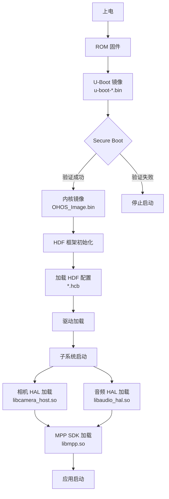
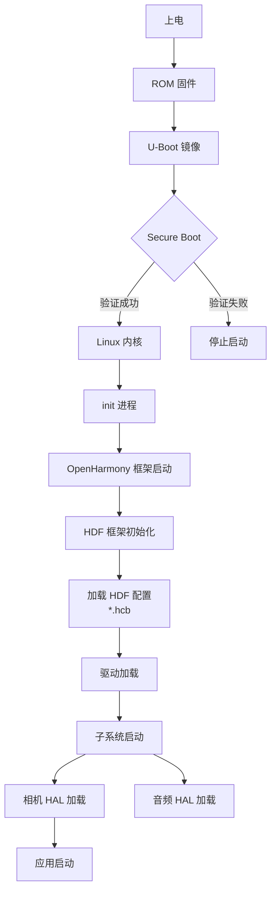

# 编译产物与运行时

## 目的

本文档说明 OpenHarmony Hisilicon 板卡仓库的编译产物、安装路径和运行时加载关系。

## 适用范围

本文档适用于：
- 运维人员了解镜像和库的安装位置
- 测试工程师理解运行时加载关系
- 开发者排查编译输出问题

---

## 编译产物概览

### 产物分类

| 产物类型 | 说明 | 示例 |
|---------|------|------|
| **U-Boot 镜像** | 引导加载器二进制 | `u-boot-*.bin` |
| **内核镜像** | LiteOS/Linux 内核 | `OHOS_Image.bin` |
| **HDF 配置** | HDF 配置二进制 | `*.hcb` |
| **MPP 库** | 媒体处理平台库 | `libmpp.so`, `libmpi.so` |
| **相机 HAL 库** | 相机驱动库 | `libcamera_host.so` |
| **音频 HAL 库** | 音频驱动库 | `libaudio_hal.so` |
| **WiFi 固件** | WiFi 芯片固件 | `wifi_*.bin` |

---

## HiSpark Aries (Hi3518EV300) 产物

### U-Boot 产物

**编译位置**: `hispark_aries/uboot/`

**输出目录**: `hispark_aries/uboot/out/boot/`

**产物**:
- `u-boot-hi3518ev300.bin` - U-Boot 镜像

**安装位置**: Flash 分区（boot 分区）

**运行时加载**: 上电 → ROM → U-Boot → 内核

**证据**:
- `hispark_aries/README_zh.md:48-53` - "生成的U-Boot存放在hispark_aries\\uboot\\out\\boot目录下"

### MPP 库产物

**来源**: SoC 层 (`device_soc_hisilicon/hi3518ev300/mpp`)

**输出**: 动态库 (`.so`)

**安装位置**: `/vendor/lib/` 或 `/system/lib/`

**运行时加载**: 相机子系统启动时动态加载

**证据**:
- `hispark_aries/BUILD.gn:6` - `"//device/soc/hisilicon/hi3518ev300/mpp:copy_mpp_libs"`

---

## HiSpark Pegasus (Hi3861V100) 产物

### 内核镜像

**来源**: LiteOS-M 编译

**输出**: `OHOS_Image.bin` (或类似命名）

**安装位置**: Flash 分区

**运行时加载**: 上电 → ROM → 内核 → 应用

---

## HiSpark Phoenix (Hi3751V350) 产物

### Linux 系统镜像

**编译位置**: `hispark_phoenix/linux/`

**输出**: 完整的系统镜像

**安装位置**: eMMC 分区

**运行时加载**: U-Boot → Linux 内核 → init → OpenHarmony 系统

---

## HiSpark Taurus (Hi3516DV300) 产物

### U-Boot 产物

**编译位置**: `hispark_taurus/uboot/`

**输出目录**: `hispark_taurus/uboot/out/boot/`

**产物**:
- `u-boot-hi3516dv300.bin` - U-Boot 镜像

**安装位置**: Flash 分区（boot 分区）

**运行时加载**: 上电 → ROM → U-Boot → 内核

**证据**:
- `hispark_taurus/README_zh.md:56-61` - U-Boot 编译说明

### HDF 配置产物

**生成位置**: GN 构建输出 (`target_gen_dir/`)

**产物**:
- `camera_host_config.hcb` - 相机 HDF 配置
- `ipp_algo_config.hcb` - IPP 算法配置
- `mpp_config.hcb` - MPP 配置

**安装位置**:
- LiteOS: `$root_out_dir/etc/camera/`
- Linux: `/vendor/chipsets/.../hdfconfig/`

**运行时加载**: HDF 框架启动时解析配置

**证据**:
- `hispark_taurus/camera/BUILD.gn:40-44` - `outputs = ["$target_gen_dir/hdi_impl/{{source_name_part}}.hcb"]`
- `hispark_taurus/camera/BUILD.gn:50` - `install_images = [ chipset_base_dir ]`

### MPP SDK 产物

**来源**: SoC 层 (`device_soc_hisilicon/hi3516dv300/sdk_linux` 或 `sdk_liteos`)

**输出**: MPP 库和头文件

**安装位置**:
- `/vendor/lib/` (库文件）
- `/vendor/include/` (头文件）

**运行时加载**: 相机 HAL 启动时链接加载

**证据**:
- `hispark_taurus/BUILD.gn:10` - `"//device/soc/hisilicon/hi3516dv300/sdk_linux:hispark_taurus_sdk"`

### 相机 HAL 产物

**生成位置**: GN 构建输出

**产物**:
- `config.c` - 流水线配置（编译生成）
- `params.c` - 流水线参数（编译生成）
- 相机 HAL 库 (`.so`)

**安装位置**: `/vendor/lib/` 或 `/system/lib/`

**运行时加载**: 相机子系统启动时加载

**证据**:
- `hispark_taurus/camera/BUILD.gn:76-77` - `config.c` 和 `params.c` 生成

### WiFi 固件产物

**来源**: SoC 层 (`device_soc_hisilicon/common/platform/wifi/hi3881v100/firmware`)

**输出**: WiFi 固件二进制 (`.bin`)

**安装位置**: `/vendor/firmware/`

**运行时加载**: WiFi 驱动启动时加载

**证据**:
- `hispark_taurus/BUILD.gn:8` - `"//device/soc/hisilicon/common/platform/wifi/hi3881v100/firmware:wifi_firmware"`

---

## 运行时加载关系

### 启动流程（LiteOS-A）



**证据**:
- `hispark_aries/uboot/secureboot_release/` - Secure Boot 实现
- `hispark_taurus/camera/BUILD.gn:40-44` - HDF 配置加载

### 启动流程（Linux）



---

## 安装路径汇总

### HiSpark Aries (LiteOS-A)

| 产物 | 源路径 | 安装路径 |
|------|--------|---------|
| U-Boot | `uboot/out/boot/` | Flash boot 分区 |
| 内核 | 构建输出 | Flash 系统分区 |
| MPP 库 | SoC 编译输出 | `/vendor/lib/` |
| HDF 配置 | GN 输出 | `/etc/camera/` |

### HiSpark Taurus (Linux)

| 产物 | 源路径 | 安装路径 |
|------|--------|---------|
| U-Boot | `uboot/out/boot/` | Flash boot 分区 |
| 内核 | 构建输出 | Flash 内核分区 |
| 系统镜像 | 构建输出 | Flash system 分区 |
| HDF 配置 | GN 输出 | `/vendor/chipsets/.../hdfconfig/` |
| MPP SDK | SoC 编译输出 | `/vendor/lib/`, `/vendor/include/` |
| 相机 HAL | 构建输出 | `/vendor/lib/` |
| 音频 HAL | 构建输出 | `/vendor/lib/` |
| WiFi 固件 | SoC 编译输出 | `/vendor/firmware/` |

---

## 运行时依赖

### 相机 HAL 依赖链

```
相机应用
    ↓ 动态链接
libcamera_host.so (相机 HAL)
    ↓ 链接
libmpi.so (MPP SDK)
    ↓ 调用
硬件 (MPP 硬件接口)
```

**运行时检查**:
1. 应用启动时，链接器加载 `libcamera_host.so`
2. `libcamera_host.so` 初始化时链接 `libmpi.so`
3. `libmpi.so` 调用硬件 MPP 接口

**证据**:
- `hispark_taurus/device.gni:28` - `is_support_mpi = true`
- `hispark_taurus/camera/driver_adapter/include/mpi_adapter.h` - MPI 接口定义

### 音频 HAL 依赖链

```
音频应用
    ↓ 动态链接
libaudio_hal.so (音频 HAL)
    ↓ 链接
SoC 音频库
    ↓ 调用
硬件 (音频接口)
```

---

## 相关跳转

- [目录结构](01_Directory_Structure.md) - 详细的目录组织
- [GN Targets](04_GN_Targets.md) - 构建系统和目标依赖
- [FAQ](07_FAQ.md) - 常见构建和运行问题
