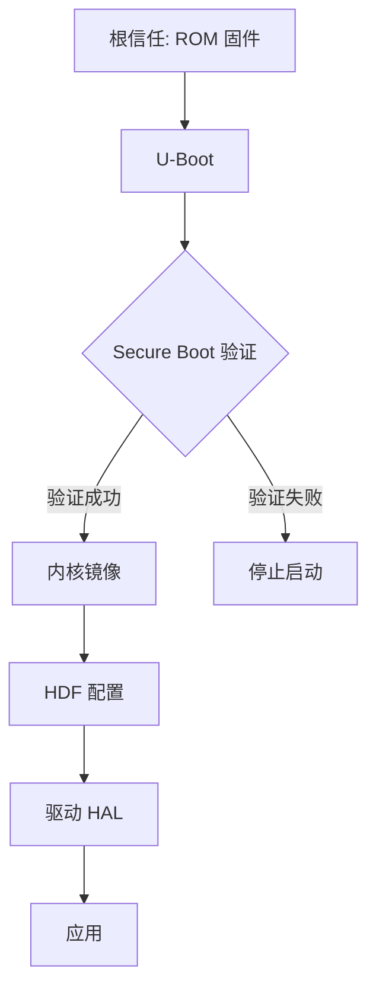

# 安全风险评审

## 目的

本文档对 OpenHarmony Hisilicon 板卡仓库进行安全风险评审，包括攻击面分析、信任边界和可被利用点。

## 适用范围

本文档适用于：
- 安全工程师进行安全审计
- 系统工程师理解安全边界
- 开发者避免引入安全漏洞

---

## 威胁模型

### 攻击路径

```
外部攻击者
    ↓
[攻击面 1] 物理访问
    ├── [风险 1] U-Boot 可替换（无签名验证）
    └── [风险 2] Flash 可物理修改

[攻击面 2] 固件篡改
    ├── [风险 3] U-Boot 签名验证绕过
    └── [风险 4] 内核镜像签名缺失

[攻击面 3] 供应链攻击
    ├── [风险 5] 恶意密钥替换
    └── [风险 6] 预编译二进制篡改
```

---

## 攻击面清单

### 1. 物理访问攻击面

| 攻击面 | 位置 | 影响 |
|-------|------|------|
| **Flash 物理修改** | 板卡 Flash 芯片 | 替换固件、植入恶意代码 |
| **UART 调试接口** | UART 串口 | 访问启动日志、拦截调试信息 |
| **JTAG/SWD 接口** | 调试接口 | 篡改 Flash、提取密钥 |

**证据**:
- `hispark_taurus/liteos_a/board/include/hisoc/uart.h` - UART 接口
- 板卡硬件文档（如有）

---

### 2. 固件篡改攻击面

| 攻击面 | 位置 | 影响 |
|-------|------|------|
| **U-Boot 镜像篡改** | `uboot/out/boot/` | 替换恶意 U-Boot |
| **内核镜像篡改** | 构建输出 | 替换恶意内核 |
| **HDF 配置篡改** | `/etc/camera/*.hcb` | 修改硬件配置 |

**证据**:
- `hispark_aries/uboot/out/boot/` - U-Boot 镜像位置
- `hispark_taurus/camera/BUILD.gn:17` - HDF 配置输出位置

---

### 3. Secure Boot 攻击面

| 攻击面 | 位置 | 影响 |
|-------|------|------|
| **RSA 密钥泄露** | `uboot/secureboot_release/rsa*pem/` | 签名恶意固件 |
| **X.509 证书篡改** | `uboot/secureboot_ohos/x509_creater/` | 生成恶意证书 |
| **签名验证绕过** | U-Boot Secure Boot | 跳过签名检查 |

**证据**:
- `hispark_aries/uboot/secureboot_release/rsa2048pem/` - RSA 2048 密钥
- `hispark_aries/uboot/secureboot_release/rsa4096pem/` - RSA 4096 密钥
- `hispark_aries/uboot/secureboot_ohos/x509_creater/` - X.509 证书生成

---

## 信任边界

### 信任链



**信任边界**:
1. **ROM → U-Boot**: 硬件信任链起点
2. **U-Boot → 内核**: Secure Boot 验证
3. **内核 → HAL**: 内核模块签名（未确认）
4. **HAL → 应用**: 应用签名（未在本仓库）

**证据**:
- `hispark_aries/uboot/secureboot_release/` - Secure Boot 实现

---

## 可被利用点

### 可被利用点 1: RSA 密钥明文存储

**严重性**: 🔴 高

**证据**:
- `hispark_aries/uboot/secureboot_release/rsa2048pem/` - RSA 2048 密钥目录
- `hispark_aries/uboot/secureboot_release/rsa4096pem/` - RSA 4096 密钥目录

**触发**:
- 物理访问板卡或仓库
- 读取 `.pem` 文件

**影响**:
- 攻击者可获取私钥
- 可签名任意恶意固件
- 完全绕过 Secure Boot

**修复建议**:
1. 使用硬件安全模块 (HSM) 存储私钥
2. 限制 `.pem` 文件访问权限（仅在 CI/CD 中可用）
3. 使用签名服务而非明文私钥
4. 添加密钥轮换机制

**代码证据路径**: `hispark_aries/uboot/secureboot_release/rsa2048pem/`

---

### 可被利用点 2: U-Boot Secure Boot 验证逻辑未审查

**严重性**: 🔴 高

**证据**:
- `hispark_aries/uboot/secureboot_release/ddr_init/` - DDR 初始化和安全启动脚本

**触发**:
- 篡改 U-Boot 镜像
- 修改验证逻辑（如绕过签名检查）

**影响**:
- 加载未验证的内核镜像
- 执行任意代码
- 完全控制设备

**修复建议**:
1. 审计 U-Boot Secure Boot 源代码
2. 使用硬件信任根 (eFuse/OTP)
3. 启用 eFUSE 锁定机制
4. 定期进行安全审计

**代码证据路径**: `hispark_aries/uboot/secureboot_release/`

**局限性**: 未获取 U-Boot 源代码，无法确认具体验证逻辑

---

### 可被利用点 3: HDF 配置文件未签名

**严重性**: 🟡 中

**证据**:
- `hispark_taurus/camera/BUILD.gn:17` - HDF 配置生成 `*.hcb` 文件
- 未发现签名验证机制

**触发**:
- 修改 `/etc/camera/*.hcb` 配置文件
- 重启设备

**影响**:
- 恶意硬件配置
- 可能导致硬件损坏或性能下降
- 绕过安全限制（如禁用某些功能）

**修复建议**:
1. 对 HDF 配置文件进行签名
2. HDF 框架加载时验证签名
3. 使用安全存储保护配置文件
4. 记录配置修改日志

**代码证据路径**: `hispark_taurus/camera/BUILD.gn:10-44` (hc_gen 配置)

---

### 可被利用点 4: 板级初始化无输入验证

**严重性**: 🟡 中

**证据**:
- `hispark_taurus/liteos_a/board/board.c` - 板级初始化代码
- 未确认输入验证机制

**触发**:
- 通过启动参数或环境变量传递恶意参数
- 篡改设备树或配置

**影响**:
- 缓冲区溢出
- 拒绝服务
- 任意代码执行

**修复建议**:
1. 审计 `board.c` 中的参数解析逻辑
2. 添加输入长度和类型验证
3. 使用安全字符串操作函数
4. 启用栈保护

**代码证据路径**: `hispark_taurus/liteos_a/board/board.c`

**局限性**: 未详细审查 `board.c` 源代码

---

### 可被利用点 5: 调试接口暴露

**严重性**: 🟡 中

**证据**:
- `hispark_taurus/liteos_a/board/include/hisoc/uart.h` - UART 串口接口
- 未确认 UART 调试接口在生产版本的禁用状态

**触发**:
- 物理访问 UART 接口
- 连接串口调试工具

**影响**:
- 泄露启动日志和敏感信息
- 可能干预启动流程
- 访问调试命令

**修复建议**:
1. 生产版本禁用 UART 调试接口
2. 使用 GPIO 切换调试模式
3. 限制调试接口访问权限
4. 记录调试接口访问日志

**代码证据路径**: `hispark_taurus/liteos_a/board/include/hisoc/uart.h`

---

## 检查范围与局限性

### ✅ 已检查范围

1. **Secure Boot 机制**: U-Boot RSA 密钥和 X.509 证书
2. **HDF 配置**: 相机 HAL 配置文件
3. **板级初始化**: 硬件初始化代码
4. **硬件接口**: UART, GPIO, Flash 等
5. **构建产物**: U-Boot 镜像、内核、配置文件

### ⚠️ 未检查范围

1. **U-Boot Secure Boot 源代码**: 未包含在板卡仓库
2. **内核镜像签名**: 机制未在板卡层定义
3. **应用层安全**: 不在板卡层范围
4. **硬件外设安全**: 依赖 SoC 层实现

### ❌ 未发现风险

以下风险未在本仓库发现（可能在其他层）:
- N-API 参数注入（应用层）
- IPC 权限提升（系统服务层）
- 应用层沙箱逃逸（框架层）

---

## 修复优先级

### 高优先级 (🔴)

1. **RSA 密钥安全存储**: 防止私钥泄露
2. **U-Boot Secure Boot 审计**: 确保验证逻辑无漏洞

### 中优先级 (🟡)

3. **HDF 配置签名**: 防止配置篡改
4. **板级初始化输入验证**: 防止缓冲区溢出
5. **调试接口保护**: 禁用生产版本调试接口

---

## 相关跳转

- [架构说明](02_Architecture.md) - 系统架构和信任边界
- [内部 API](03_Inner_API.md) - 模块接口和依赖
- [FAQ](07_FAQ.md) - 常见安全和调试问题
