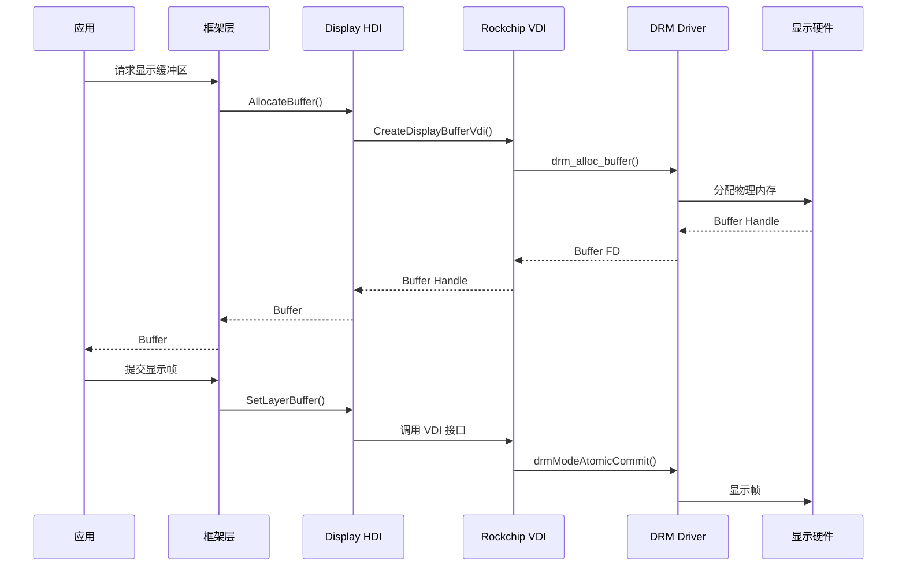
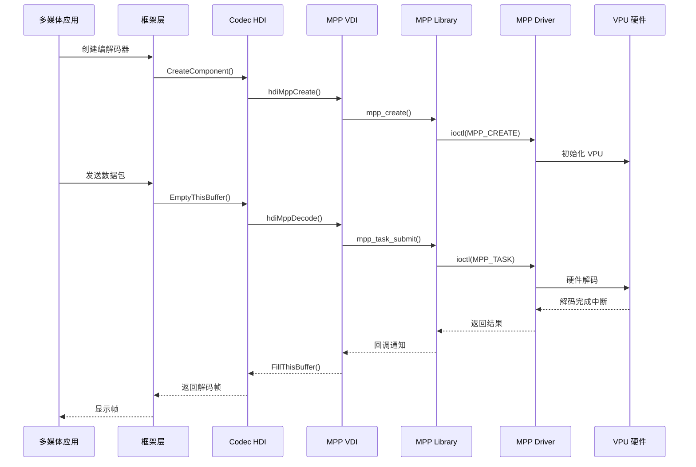
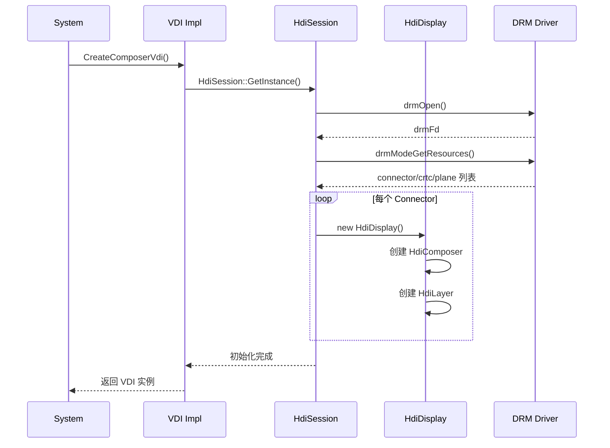
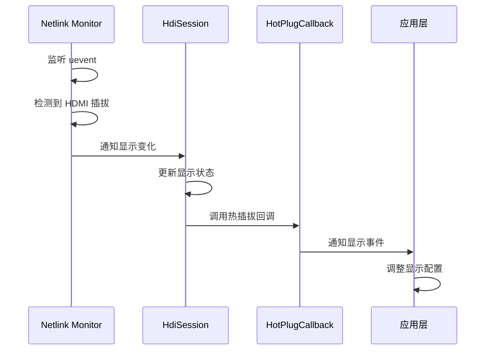

# 架构说明

## 文档信息

- **目的**: 说明 Rockchip OpenHarmony 仓库的系统架构、组件关系和数据流
- **适用范围**: 所有芯片平台
- **关键结论**: 采用分层架构，通过 HDI/VDI 接口实现硬件抽象

## 系统架构

### 整体架构图

```
┌─────────────────────────────────────────────────────────────────┐
│                        应用层                                    │
│  ┌─────────────┐  ┌─────────────┐  ┌─────────────┐             │
│  │   系统应用   │  │   三方应用   │  │   系统服务   │             │
│  └──────┬──────┘  └──────┬──────┘  └──────┬──────┘             │
└─────────┼────────────────┼────────────────┼────────────────────┘
          │                │                │
┌─────────┼────────────────┼────────────────┼────────────────────┐
│         │           框架层 (Framework)    │                    │
│  ┌──────┴──────┐  ┌──────┴──────┐  ┌──────┴──────┐             │
│  │  ArkUI/ACE  │  │ AbilityMgr  │  │ BundleMgr   │             │
│  └──────┬──────┘  └──────┬──────┘  └──────┬──────┘             │
│         │                │                │                    │
│  ┌──────┴────────────────┴────────────────┴──────┐             │
│  │              N-API / IPC 接口                  │             │
│  └─────────────────────┬──────────────────────────┘             │
└────────────────────────┼────────────────────────────────────────┘
                         │
┌────────────────────────┼────────────────────────────────────────┐
│                        │           HDI 层                       │
│  ┌─────────────────────┴──────────────────────────┐             │
│  │        OpenHarmony HDI 标准接口                 │             │
│  │  (drivers/peripheral/display, codec, etc.)    │             │
│  └─────────────────────┬──────────────────────────┘             │
│                        │                                        │
└────────────────────────┼────────────────────────────────────────┘
                         │
┌────────────────────────┼────────────────────────────────────────┐
│                        │         VDI 层 (本仓库)                 │
│  ┌─────────────────────┴──────────────────────────┐             │
│  │           Rockchip VDI 实现                     │             │
│  │  ┌─────────┐ ┌─────────┐ ┌─────────┐ ┌────────┐│             │
│  │  │ Display │ │  MPP    │ │  RGA    │ │ Codec  ││             │
│  │  │  VDI    │ │  VDI    │ │  VDI    │ │  VDI   ││             │
│  │  └────┬────┘ └────┬────┘ └────┬────┘ └───┬────┘│             │
│  └───────┼───────────┼───────────┼──────────┼─────┘             │
└──────────┼───────────┼───────────┼──────────┼────────────────────┘
           │           │           │          │
┌──────────┼───────────┼───────────┼──────────┼────────────────────┐
│          │           │       内核驱动层                        │
│  ┌───────┴───┐ ┌─────┴────┐ ┌───┴────┐ ┌───┴────┐             │
│  │   DRM     │ │  MPP     │ │  RGA   │ │ V4L2   │             │
│  │  Driver   │ │  Driver  │ │ Driver │ │ Driver │             │
│  └─────┬─────┘ └────┬─────┘ └───┬────┘ └───┬────┘             │
└────────┼────────────┼───────────┼──────────┼────────────────────┘
         │            │           │          │
┌────────┴────────────┴───────────┴──────────┴────────────────────┐
│                        硬件层                                    │
│         Rockchip SoC (RK2206/RK3399/RK3566/RK3568/RK3588)       │
└─────────────────────────────────────────────────────────────────┘
```

## 组件架构

### Display 子系统

```
┌─────────────────────────────────────────────────────────────┐
│                    Display HDI 架构                          │
├─────────────────────────────────────────────────────────────┤
│  OpenHarmony HDI Interface                                  │
│  (IDisplayComposerVdi, IDisplayBufferVdi)                  │
├─────────────────────────────────────────────────────────────┤
│  Rockchip VDI Implementation                                │
│  ┌─────────────────┐  ┌─────────────────┐                  │
│  │ DisplayComposer │  │ DisplayBuffer   │                  │
│  │ VdiImpl         │  │ VdiImpl         │                  │
│  └────────┬────────┘  └────────┬────────┘                  │
├───────────┼────────────────────┼────────────────────────────┤
│  HDI::DISPLAY::HdiSession      │                            │
│  ┌────────┴────────────────────┴────────┐                   │
│  │  HdiDisplay / HdiComposer / HdiLayer │                   │
│  └────────┬────────────────────┬────────┘                   │
├───────────┼────────────────────┼────────────────────────────┤
│  DRM/KMS  │                    │ GBM                        │
│  ┌────────┴────────┐  ┌────────┴────────┐                  │
│  │  drm_display    │  │  gralloc        │                  │
│  │  drm_crtc       │  │  hi_gbm         │                  │
│  │  drm_connector  │  │                 │                  │
│  └─────────────────┘  └─────────────────┘                  │
└─────────────────────────────────────────────────────────────┘
```

### MPP 子系统

```
┌─────────────────────────────────────────────────────────────┐
│                    MPP HDI 架构                              │
├─────────────────────────────────────────────────────────────┤
│  OpenHarmony Codec HDI                                      │
│  (ICodecComponent)                                         │
├─────────────────────────────────────────────────────────────┤
│  Rockchip Codec VDI                                         │
│  ┌─────────────────────────────────────────┐               │
│  │  hdi_mpp.c / codec_jpeg_decoder.cpp    │               │
│  └──────────────────┬──────────────────────┘               │
├─────────────────────┼───────────────────────────────────────┤
│  MPP MPI Interface  │                                       │
│  ┌──────────────────┴──────────────────────┐               │
│  │  hdiMppCreate / hdiMppInit / hdiMppDecode│              │
│  │  hdiMppEncode / hdiMppDestroy            │              │
│  └──────────────────┬──────────────────────┘               │
├─────────────────────┼───────────────────────────────────────┤
│  MPP Library        │                                       │
│  ┌──────────────────┴──────────────────────┐               │
│  │  mpp_create / mpp_init / mpp_task       │              │
│  └──────────────────┬──────────────────────┘               │
├─────────────────────┼───────────────────────────────────────┤
│  Kernel Driver      │                                       │
│  ┌──────────────────┴──────────────────────┐               │
│  │  mpp_service / vcodec_service           │              │
│  └─────────────────────────────────────────┘               │
└─────────────────────────────────────────────────────────────┘
```

## 数据流

### 显示数据流



### 视频编解码数据流



## 线程模型

### Display 线程模型

```
┌─────────────────────────────────────────────────────────────┐
│                    Display 线程架构                          │
├─────────────────────────────────────────────────────────────┤
│                                                             │
│  ┌─────────────┐    ┌─────────────┐    ┌─────────────┐     │
│  │ 主线程      │    │ VSync 线程  │    │ Worker 线程  │     │
│  │             │    │             │    │             │     │
│  │ - HDI 调用  │    │ - 等待 VBlank│   │ - 图层合成   │     │
│  │ - 状态管理  │    │ - 触发渲染  │    │ - 内存拷贝   │     │
│  │ - 事件处理  │    │ - 回调通知  │    │ - 格式转换   │     │
│  └──────┬──────┘    └──────┬──────┘    └──────┬──────┘     │
│         │                  │                  │            │
│         └──────────────────┼──────────────────┘            │
│                            │                               │
│                   ┌────────┴────────┐                      │
│                   │   HdiSession    │                      │
│                   │   (单例模式)     │                      │
│                   └────────┬────────┘                      │
│                            │                               │
│         ┌──────────────────┼──────────────────┐            │
│         │                  │                  │            │
│  ┌──────┴──────┐    ┌──────┴──────┐    ┌──────┴──────┐    │
│  │ HdiDisplay  │    │ HdiComposer │    │  HdiLayer   │    │
│  │  (显示设备)  │    │  (合成器)   │    │  (图层)     │    │
│  └─────────────┘    └─────────────┘    └─────────────┘    │
│                                                             │
└─────────────────────────────────────────────────────────────┘
```

### MPP 线程模型

```
┌─────────────────────────────────────────────────────────────┐
│                    MPP 线程架构                              │
├─────────────────────────────────────────────────────────────┤
│                                                             │
│  ┌─────────────┐    ┌─────────────┐    ┌─────────────┐     │
│  │ 控制线程    │    │ 输入线程    │    │ 输出线程    │     │
│  │             │    │             │    │             │     │
│  │ - 创建/销毁 │    │ - 发送包    │    │ - 接收帧    │     │
│  │ - 配置参数  │    │ - 编码请求  │    │ - 回调通知  │     │
│  │ - 状态查询  │    │ - 流控制    │    │ - 缓冲区管理│     │
│  └──────┬──────┘    └──────┬──────┘    └──────┬──────┘     │
│         │                  │                  │            │
│         └──────────────────┼──────────────────┘            │
│                            │                               │
│                   ┌────────┴────────┐                      │
│                   │   MPP Context   │                      │
│                   │   (上下文)       │                      │
│                   └────────┬────────┘                      │
│                            │                               │
│                   ┌────────┴────────┐                      │
│                   │   MPP Driver    │                      │
│                   │   (内核线程)     │                      │
│                   └─────────────────┘                      │
│                                                             │
└─────────────────────────────────────────────────────────────┘
```

## 关键时序

### 显示初始化时序



### 热插拔检测时序



## 模块依赖关系

```
                    ┌─────────────┐
                    │   Display   │
                    │     VDI     │
                    └──────┬──────┘
                           │
           ┌───────────────┼───────────────┐
           │               │               │
    ┌──────┴──────┐ ┌──────┴──────┐ ┌──────┴──────┐
    │    RGA      │ │    MPP      │ │    GPU      │
    │    VDI      │ │    VDI      │ │    Driver   │
    └─────────────┘ └──────┬──────┘ └─────────────┘
                           │
                    ┌──────┴──────┐
                    │  Kernel API │
                    │  (DRM/V4L2) │
                    └─────────────┘
```

## 相关链接

- [目录结构](02_Directory_Structure.md) - 代码组织方式
- [HDI/VDI 接口](03_HDI_Interfaces.md) - 接口详细说明
- [附录：调用链](appendix/Callgraphs.md) - 关键调用链分析
