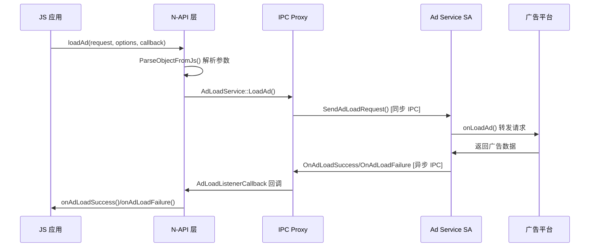
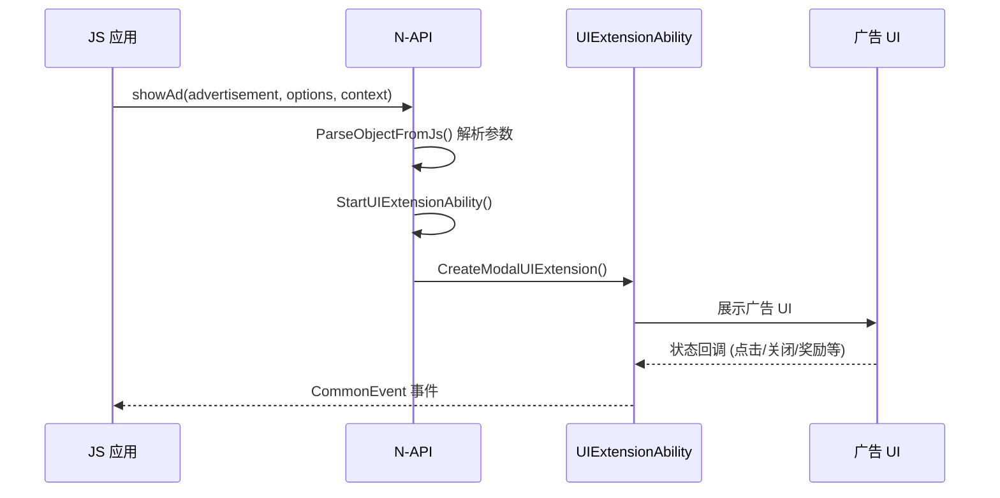

# Advertising 架构说明

## 整体架构

```
┌─────────────────────────────────────────────────────────────────┐
│                      应用层 (Application)                       │
│  ┌───────────────────────────────────────────────────────────┐  │
│  │  AdLoader (JS)    advertising.showAd()  AdComponent     │  │
│  └───────────────────────────────────────────────────────────┘  │
└────────────────────────────┬──────────────────────────────────┘
                             │ N-API
┌────────────────────────────▼──────────────────────────────────┐
│                   frameworks/js/napi/ads                        │
│  ┌─────────────────────────────────────────────────────────┐  │
│  │  advertising.cpp         ad_load_service.cpp          │  │
│  │  - ShowAd()               - LoadAd()                   │  │
│  │  - LoadAd()               - RequestAdBody()            │  │
│  │  - GetAdRequestBody()     - ConnectAdKit()             │  │
│  └─────────────────────────────────────────────────────────┘  │
└────────────────────────────┬──────────────────────────────────┘
                             │ IPC (Binder)
┌────────────────────────────▼──────────────────────────────────┐
│              common/ipc (Proxy-Stub 模式)                       │
│  ┌─────────────────────┐    ┌─────────────────────────────┐  │
│  │  AdLoadSendRequestProxy │  │  AdLoadSendRequestStub     │  │
│  │  AdRequestBodySendProxy │  │  AdRequestBodySendStub     │  │
│  └─────────────────────┘    └─────────────────────────────┘  │
└────────────────────────────┬──────────────────────────────────┘
                             │ AbilityManagerClient
┌────────────────────────────▼──────────────────────────────────┐
│              广告平台 (Ad Platform SA)                          │
│  ┌─────────────────────────────────────────────────────────┐  │
│  │  AdsServiceExtensionAbility (JS 实现)                   │  │
│  │  - onConnect()        → 返回 RPC 对象                   │  │
│  │  - onLoadAd()         → 处理广告请求                    │  │
│  │  - onRemoteMessageRequest() → RPC 消息处理             │  │
│  └─────────────────────────────────────────────────────────┘  │
│                           │ ↑
└───────────────────────────┼─┘
                            ↓
                  ┌─────────────────────┐
                  │   广告平台服务器     │
                  │  (第三方实现)        │
                  └─────────────────────┘
```

## 数据流

### 广告请求流程



### 广告展示流程



## 线程模型

| 层级 | 线程模型 |
|-----|----------|
| JS 层 | 主线程 (Ark 引擎) |
| N-API 层 | libuv 线程池 + 主线程回调 |
| IPC 通信 | 同步调用阻塞发起线程 |
| 广告展示 | UI 主线程 (ModalUIExtension) |

### 关键线程切换

```
JS 主线程 → napi_create_async_work → libuv 线程池执行
                                      ↓
                                 同步 IPC 调用
                                      ↓
                                 回调完成
                                      ↓
                            napi_queue_async_work_with_qos
                                      ↓
                            JS 主线程回调执行
```

## 模块依赖关系

```
advertising (N-API)
    │
    ├── advertising_common (静态库)
    │   ├── ad_load_proxy.cpp ───────┐
    │   ├── ad_request_body_stub.cpp │
    │   ├── ad_load_callback_stub.cpp│
    │   └── utils/                   │
    │                                │
    ├── ability_runtime              │
    ├── ace_engine                   │
    ├── bundle_framework             │
    ├── ipc                          │
    ├── napi                         │
    ├── safwk (SA 框架)              │
    └── samgr (服务管理)             │
                                        ↓
                    ┌─────────────────────────────────┐
                    │  系统层 (OpenHarmony Framework)  │
                    └─────────────────────────────────┘
```

## 生命周期

### AdLoadService 单例生命周期

```
GetInstance() → 双检查锁创建 → LoadAd/RequestAdBody → 析构
```

### SA 生命周期

```
onCreate() → onRequest() → onConnect() → onDisconnect() → onDestroy()
```

## 相关文档

- [N-API 参考](NAPI_Reference.md) - 详细 API 说明
- [构建配置](Build_Configuration.md) - 编译产物说明
- [安全评审](Security_Review.md) - 安全考量
