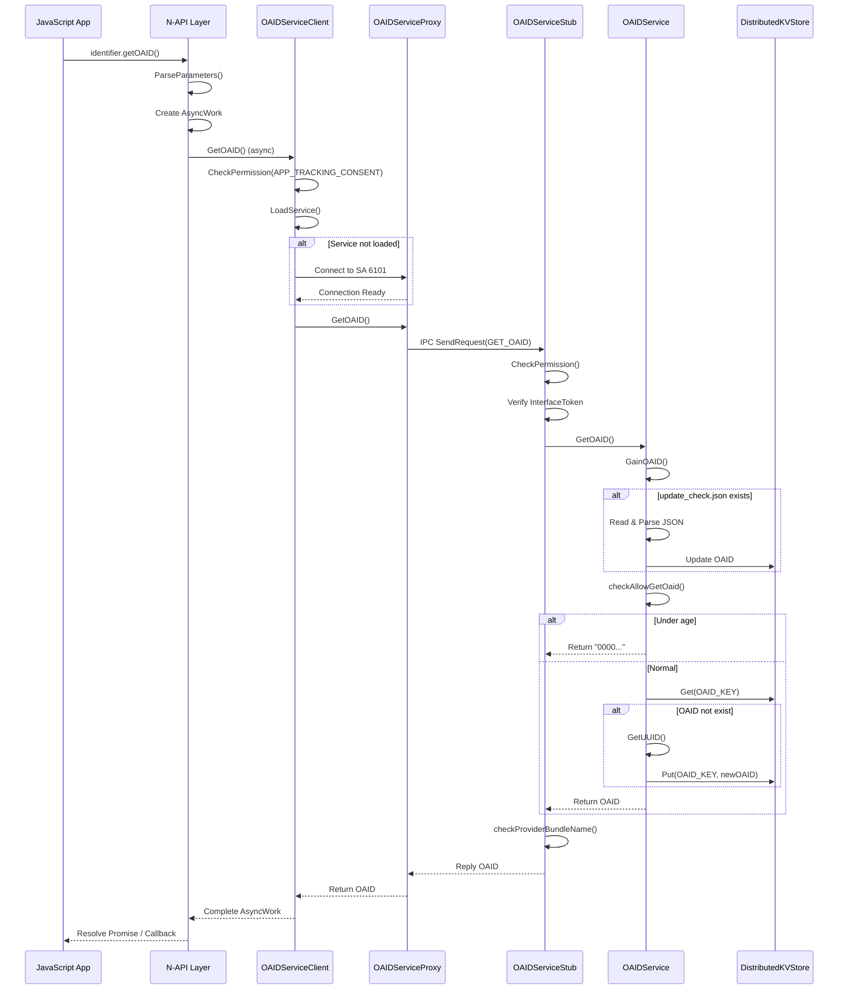
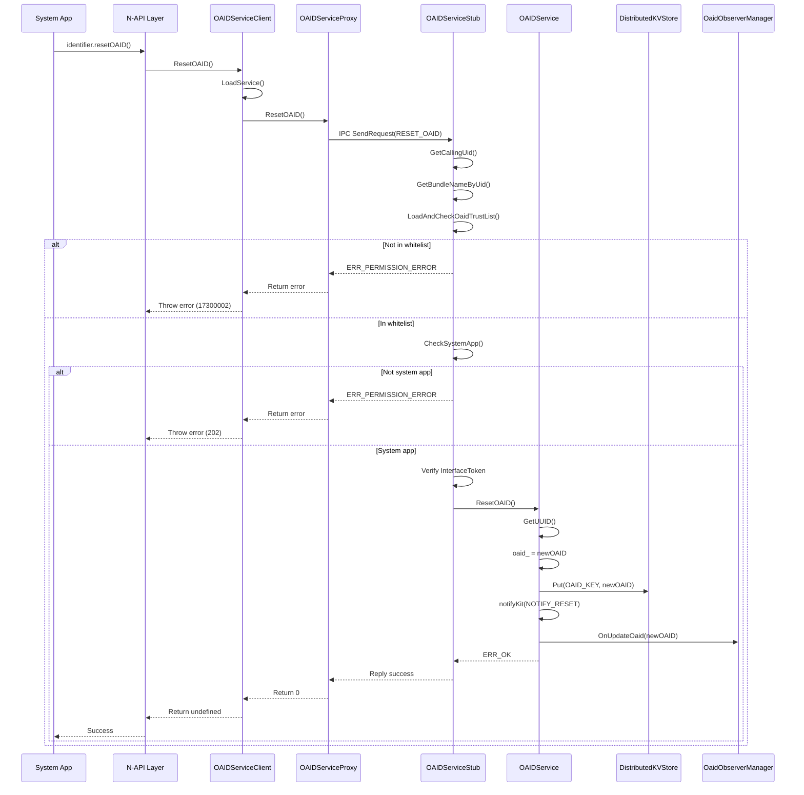

# OAID 架构与数据流

## 组件架构图

```
┌─────────────────────────────────────────────────────────────────────────────┐
│                               应用层 (Application)                           │
│  ┌─────────────────────────────────────────────────────────────────────┐   │
│  │                     JavaScript 应用代码                              │   │
│  │  import identifier from '@ohos.identifier.oaid'                     │   │
│  │  identifier.getOAID()                                               │   │
│  └─────────────────────────────────────────────────────────────────────┘   │
└─────────────────────────────────────────────────────────────────────────────┘
                                       │
                                       ▼
┌─────────────────────────────────────────────────────────────────────────────┐
│                          N-API 接口层 (NAPI Bridge)                          │
│  ┌─────────────────────────────────────────────────────────────────────┐   │
│  │  interfaces/kits/js/napi/oaid/src/oaid.cpp                          │   │
│  │  ├── GetOAID()     [行192-220]                                      │   │
│  │  ├── ResetOAID()   [行222-247]                                      │   │
│  │  └── OAIDInit()    [行249-258]                                      │   │
│  │                                                                     │   │
│  │  功能：JS 与 C++ 互操作，创建异步任务，参数解析                        │   │
│  └─────────────────────────────────────────────────────────────────────┘   │
└─────────────────────────────────────────────────────────────────────────────┘
                                       │
                                       ▼
┌─────────────────────────────────────────────────────────────────────────────┐
│                         客户端 SDK 层 (Client SDK)                           │
│  ┌─────────────────────────────────────────────────────────────────────┐   │
│  │  interfaces/innerkits/src/oaid_service_client.cpp                   │   │
│  │  ├── OAIDServiceClient (单例)                                       │   │
│  │  ├── GetOAID()       [行140-165]                                    │   │
│  │  ├── ResetOAID()     [行167-183]                                    │   │
│  │  └── CheckPermission() [行185-203]                                  │   │
│  │                                                                     │   │
│  │  interfaces/innerkits/src/oaid_service_proxy.cpp                    │   │
│  │  └── OAIDServiceProxy → SendRequest()                               │   │
│  │                                                                     │   │
│  │  功能：权限检查、服务加载、死亡监听、IPC 代理调用                      │   │
│  └─────────────────────────────────────────────────────────────────────┘   │
└─────────────────────────────────────────────────────────────────────────────┘
                                       │
                                       ▼ IPC 通信
┌─────────────────────────────────────────────────────────────────────────────┐
│                          系统服务层 (System Service)                         │
│  ┌─────────────────────────────────────────────────────────────────────┐   │
│  │  services/oaid_manager/src/oaid_service_stub.cpp                    │   │
│  │  ├── OnRemoteRequest()  [行162-193] - IPC 请求入口                   │   │
│  │  ├── CheckPermission()  [行45-80]   - 权限校验                       │   │
│  │  ├── CheckSystemApp()   [行82-91]   - 系统应用检查                   │   │
│  │  ├── OnGetOAID()        [行218-232] - 获取 OAID 处理                 │   │
│  │  └── OnResetOAID()      [行275-283] - 重置 OAID 处理                 │   │
│  └─────────────────────────────────────────────────────────────────────┘   │
                                       │
                                       ▼
┌─────────────────────────────────────────────────────────────────────────────┐
│                         核心业务层 (Core Business)                           │
│  ┌─────────────────────────────────────────────────────────────────────┐   │
│  │  services/oaid_manager/src/oaid_service.cpp                         │   │
│  │  ├── OAIDService (继承 SystemAbility)                               │   │
│  │  ├── GainOAID()        [行238-285] - 获取/生成 OAID                  │   │
│  │  ├── GetUUID()         [行50-93]   - UUID v4 生成                   │   │
│  │  ├── ResetOAID()       [行295-312] - 重置 OAID                      │   │
│  │  ├── InitKvStore()     [行327-375] - 初始化数据库                   │   │
│  │  └── ReadValueFromKvStore() / WriteValueToKvStore()                 │   │
│  └─────────────────────────────────────────────────────────────────────┘   │
                                       │
                                       ▼
┌─────────────────────────────────────────────────────────────────────────────┐
│                          扩展服务层 (Extension Service)                       │
│  ┌─────────────────────────────────────────────────────────────────────┐   │
│  │  services/oaid_manager/src/connect_ads_stub.cpp                     │   │
│  │  ├── ConnectAdsManager (单例)                                       │   │
│  │  ├── checkAllowGetOaid() [行268-311] - 未成年人检查                  │   │
│  │  ├── notifyKit()         [行339-372] - 通知 Ads Service              │   │
│  │  └── getWantInfo()       [行216-266] - 读取配置连接 Ads              │   │
│  └─────────────────────────────────────────────────────────────────────┘   │
└─────────────────────────────────────────────────────────────────────────────┘
                                       │
                                       ▼
┌─────────────────────────────────────────────────────────────────────────────┐
│                           数据存储层 (Data Storage)                          │
│  ┌─────────────────────┐  ┌─────────────────────┐  ┌─────────────────────┐  │
│  │  DistributedKVStore │  │   文件系统           │  │   Ads Service       │  │
│  │  (加密存储)          │  │   (配置文件)         │  │   (ExtensionAbility)│  │
│  │                     │  │                     │  │                     │  │
│  │  • oaidservice      │  │  • oaid_service_    │  │  • 未成年人检测      │  │
│  │  • underAgeInfo     │  │    config.json      │  │  • 更新允许状态      │  │
│  └─────────────────────┘  └─────────────────────┘  └─────────────────────┘  │
└─────────────────────────────────────────────────────────────────────────────┘
```

---

## 模块职责划分

| 模块 | 职责 | 关键类/文件 |
|------|------|------------|
| **N-API 层** | JS/C++ 互操作，参数解析，异步任务管理 | `oaid.cpp`, `oaid_init.cpp` |
| **Client SDK** | 权限检查，服务发现，连接管理，死亡监听 | `OAIDServiceClient`, `OAIDServiceProxy` |
| **Service Stub** | IPC 请求分发，权限校验，接口路由 | `OAIDServiceStub` |
| **Core Service** | OAID 生成/管理，KVStore 操作 | `OAIDService` |
| **Connect Ads** | 外部服务连接，消息队列，配置管理 | `ConnectAdsManager`, `ConnectAdsStub` |
| **Utils** | 文件操作，日志封装 | `OAIDFileOperator` |

---

## 数据流图

### GetOAID 数据流



### ResetOAID 数据流



---

## 线程模型

### 线程结构

```
┌─────────────────────────────────────────────────────────────┐
│                    OAID 服务线程模型                         │
├─────────────────────────────────────────────────────────────┤
│                                                             │
│  ┌──────────────┐                                          │
│  │ 主线程 (Main) │  SystemAbility 主线程                     │
│  │              │  • OnStart() / OnStop()                   │
│  │              │  • OnRemoteRequest() - IPC 请求处理       │
│  │              │  • 服务生命周期管理                        │
│  └──────────────┘                                          │
│                                                             │
│  ┌──────────────┐                                          │
│  │ 工作线程池    │  LibUV 线程池 (NAPI 异步任务)              │
│  │              │  • GetOAIDExecuteCallBack()               │
│  │              │  • GetOAIDCompleteCallBack()              │
│  └──────────────┘                                          │
│                                                             │
│  ┌──────────────┐                                          │
│  │ EventRunner  │  延迟卸载任务线程                          │
│  │ ("unlock")   │  • PostDelayUnloadTask()                  │
│  │              │  • UnloadSystemAbility() 延迟执行          │
│  └──────────────┘                                          │
│                                                             │
│  ┌──────────────┐                                          │
│  │ IPC 线程      │  IPC 通信线程 (框架管理)                   │
│  │              │  • 发送/接收 IPC 消息                      │
│  │              │  • 死亡监听回调                            │
│  └──────────────┘                                          │
│                                                             │
└─────────────────────────────────────────────────────────────┘
```

### 线程安全机制

| 组件 | 互斥机制 | 说明 |
|------|---------|------|
| `OAIDService` | `mutex_` | 实例创建互斥 |
| `OAIDService::GainOAID` | `updateMutex_` | 更新操作互斥 |
| `OAIDService::Read/WriteValueFromKvStore` | `mutex_` | KVStore 操作互斥 |
| `OAIDServiceClient` | `instanceLock_` | 单例创建互斥 |
| `OAIDServiceClient` | `getOaidProxyMutex_` | 代理访问互斥 |
| `OAIDServiceClient` | `loadServiceLock_` | 服务加载互斥 |
| `ConnectAdsStub` | `queueMutex_` | 消息队列互斥 |
| `ConnectAdsStub` | `proxyMutex_` | 代理访问互斥 |
| `ConnectAdsStub` | `stateMutex_` | 状态访问互斥 |

---

## 关键时序

### 服务启动时序

```
时间 ──────────────────────────────────────────────────────────▶

[系统启动]
    │
    ▼
[SA Framework]
    │
    ├──► REGISTER_SYSTEM_ABILITY_BY_ID(OAIDService, 6101)
    │
    ▼
[SystemAbilityManager]
    │
    ├──► 发现 SA 6101
    │
    ▼
[按需加载或系统启动时加载]
    │
    ▼
[OAIDService::OnStart()]
    │
    ├──► Init()
    │      ├──► Publish(this) - 发布服务
    │      └──► state_ = STATE_RUNNING
    │
    ├──► AddSystemAbilityListener(OAID_SYSTME_ID)
    │
    ▼
[OnAddSystemAbility(OAID_SYSTME_ID)]
    │
    ├──► InitKvStore(OAID_DATA_BASE_STORE_ID)
    │      ├──► GetSingleKvStore() - 连接/创建数据库
    │      └──► 重试机制 (最多5次，间隔3s)
    │
    └──► InitKvStore(OAID_UNDER_AGE_STORE_ID)
           └──► 初始化未成年信息存储

[服务就绪]
```

### 服务卸载时序

```
[空闲检测]
    │
    ├──► PostDelayUnloadTask()
    │      ├──► 创建 EventHandler ("unlock")
    │      └──► PostTask(unloadTask, DELAY_TIME=290s)
    │
    ▼
[290秒后]
    │
    ├──► UnloadSystemAbility(OAID_SYSTME_ID)
    │
    ▼
[OAIDService::OnStop()]
    │
    └──► state_ = STATE_NOT_START

[服务卸载]
```

---

## 信任边界

```
┌─────────────────────────────────────────────────────────────────────┐
│                        信任边界分析                                  │
├─────────────────────────────────────────────────────────────────────┤
│                                                                     │
│  ┌─────────────────┐     非信任域      ┌─────────────────┐         │
│  │   第三方应用     │ ◄────────────────► │    N-API 层     │         │
│  │  (应用沙盒)      │    用户授权       │  (参数验证)      │         │
│  └─────────────────┘                   └────────┬────────┘         │
│                                                 │                   │
│                                                 ▼                   │
│  ┌─────────────────────────────────────────────────────────────┐   │
│  │                      半信任域                               │   │
│  │   Client SDK (权限检查) ────────► IPC 通信                 │   │
│  │                                                              │   │
│  │   安全检查点：                                               │   │
│  │   • CheckPermission() - APP_TRACKING_CONSENT               │   │
│  │   • CheckSystemApp() - 系统应用验证                         │   │
│  │   • TrustList 验证 - BundleName 白名单                      │   │
│  └──────────────────────────┬──────────────────────────────────┘   │
│                             │                                       │
│                             ▼                                       │
│  ┌─────────────────────────────────────────────────────────────┐   │
│  │                      信任域                                 │   │
│  │                    OAIDService                             │   │
│  │                                                              │   │
│  │   • 核心业务逻辑                                             │   │
│  │   • 加密数据存储 (KVStore)                                  │   │
│  │   • UUID 生成 (OpenSSL)                                     │   │
│  └─────────────────────────────────────────────────────────────┘   │
│                                                                     │
└─────────────────────────────────────────────────────────────────────┘
```

### 安全边界跨越点

| 边界 | 位置 | 验证机制 |
|------|------|---------|
| 应用 → N-API | `oaid.cpp:117-130` | 参数类型/数量检查 |
| N-API → Client | `oaid.cpp:151` | 调用 Client 方法 |
| Client → Service | `oaid_service_client.cpp:142` | `CheckPermission()` |
| IPC → Stub | `oaid_service_stub.cpp:172` | `CheckPermission()` 二次验证 |
| Stub → Core | `oaid_service_stub.cpp:197-214` | 白名单 + 系统应用验证 |

---

## 关键证据

### 架构相关代码

**服务注册**:
```cpp
// services/oaid_manager/src/oaid_service.cpp:96
REGISTER_SYSTEM_ABILITY_BY_ID(OAIDService, OAID_SYSTME_ID, true);
```

**N-API 注册**:
```cpp
// interfaces/kits/js/napi/oaid/src/oaid.cpp:249-258
napi_value OAIDInit(napi_env env, napi_value exports)
{
    napi_property_descriptor desc[] = {
        DECLARE_NAPI_FUNCTION("getOAID", GetOAID),
        DECLARE_NAPI_FUNCTION("resetOAID", ResetOAID),
    };
    NAPI_CALL(env, napi_define_properties(env, exports, sizeof(desc) / sizeof(desc[0]), desc));
    return exports;
}
```

**IPC 接口定义**:
```cpp
// interfaces/innerkits/include/oaid_service_interface.h:26-46
class IOAIDService : public IRemoteBroker {
public:
    virtual std::string GetOAID() = 0;
    virtual int32_t ResetOAID() = 0;
    virtual int32_t RegisterObserver(const sptr<IRemoteConfigObserver>& observer) = 0;
    DECLARE_INTERFACE_DESCRIPTOR(u"ohos.cloud.oaid.IOAIDService");
};
```

---

## 相关文档

- [项目概览](01_Overview.md)
- [代码地图](03_CodeMap.md)
- [接口文档](04_Interface.md)
- [攻击面分析](05_AttackSurface.md)
