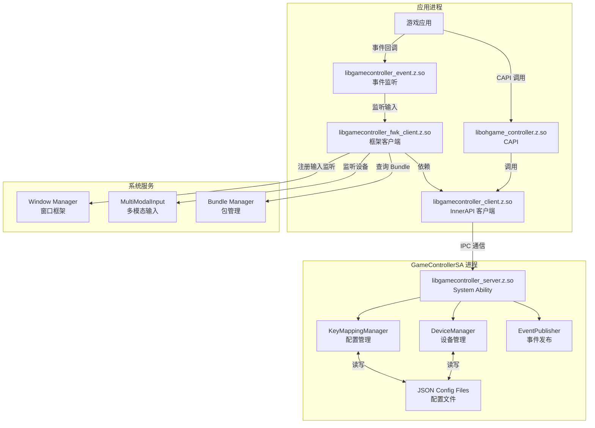
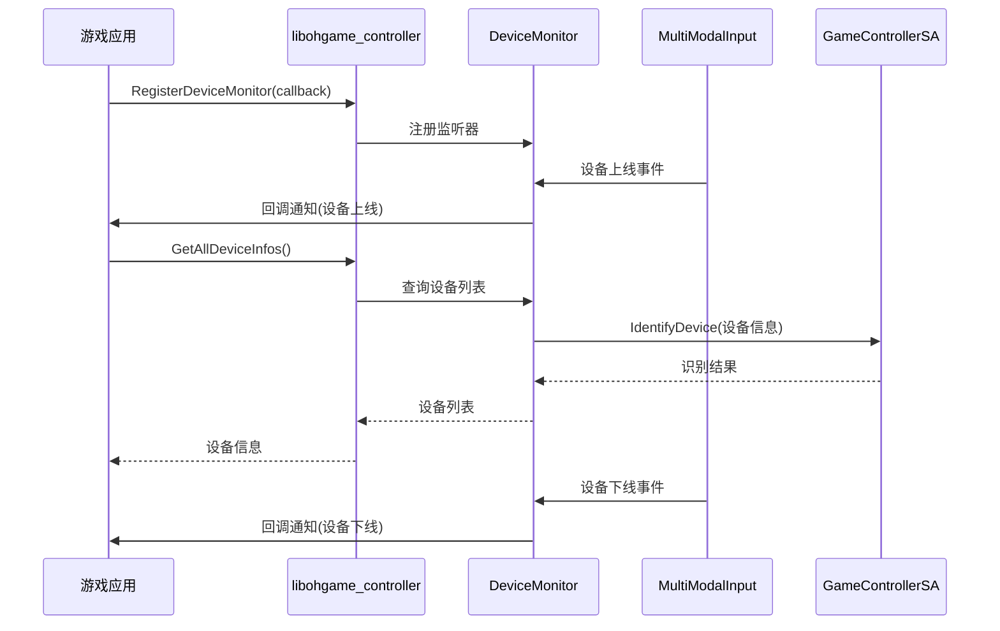
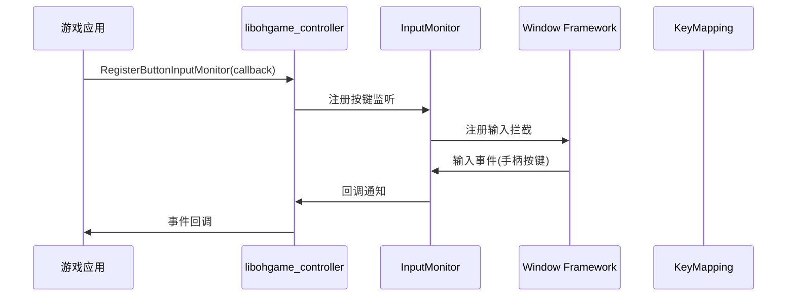
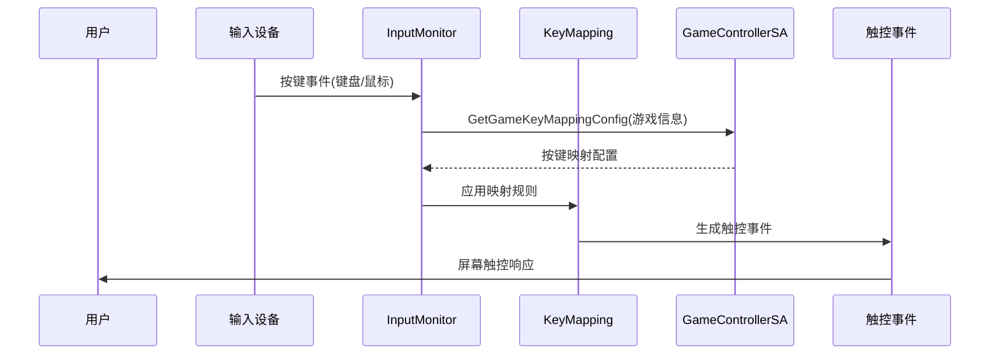
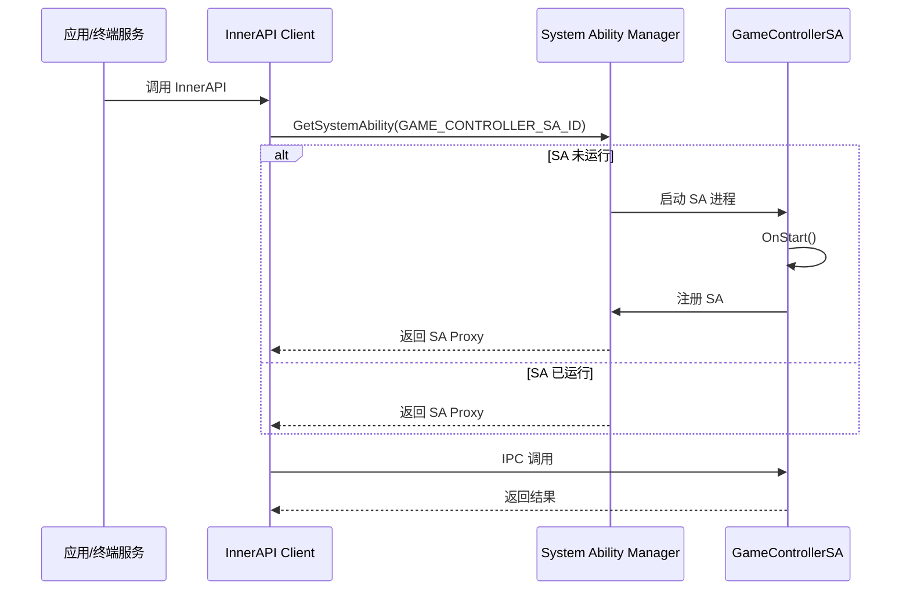
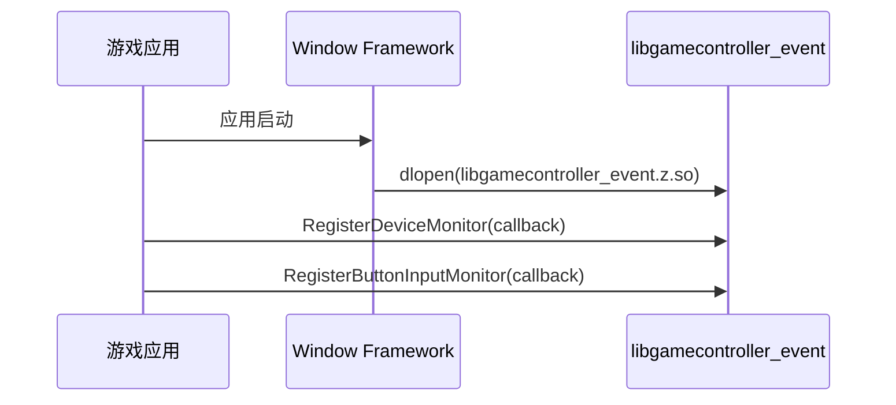
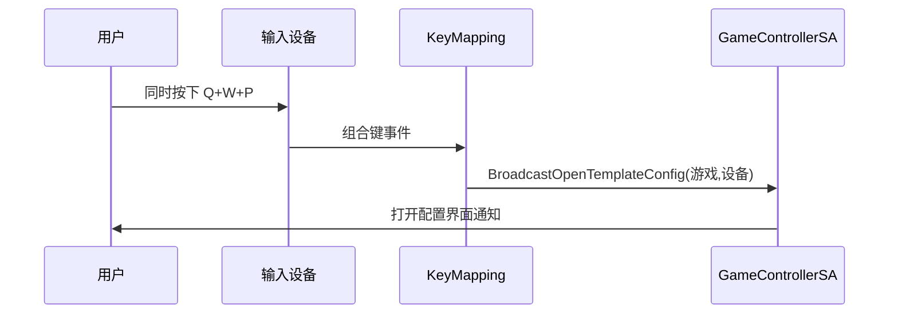
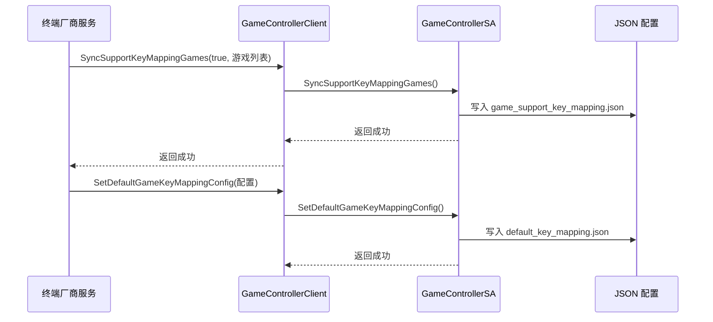

# 03_Architecture - 系统架构

## 目的

本文档详细说明 GameController Framework 的系统架构，包括组件图、数据流、线程模型和关键时序。

## 适用范围

- 架构师、高级开发者
- 需要深入理解系统设计的技术人员

## 整体架构图



## 组件详解

### 应用进程组件

#### 1. libohgame_controller.z.so (CAPI)

**职责**: 暴露 C Native API 给游戏应用

**证据**:
- `interfaces/kits/c/game_device.h`: 设备 API 定义
- `interfaces/kits/c/game_pad.h`: 手柄 API 定义
- `interfaces/kits/c/BUILD.gn:27-68`: 编译配置

**API 类型**:
- GameDevice: 设备管理（查询、监听）
- GamePad: 手柄输入（按键、轴监听）

#### 2. libgamecontroller_event.z.so (事件监听)

**职责**: 监听输入事件和设备事件

**证据**:
- `frameworks/native/event/src/entryModule.cpp`: 事件模块入口
- `frameworks/native/BUILD.gn:196-235`: 编译配置

**子模块**:
- InputMonitor: 对接 Window Framework，拦截输入事件
- DeviceMonitor: 对接 MultiModalInput，监听设备事件

#### 3. libgamecontroller_fwk_client.z.so (框架客户端)

**职责**: 实现核心业务逻辑

**证据**:
- `frameworks/native/BUILD.gn:114-90`: 编译配置

**子模块**:
- KeyMapping: 输入转触控处理
- MultiModalInput 模块: 设备监听和识别
- Window 模块: 输入事件拦截
- Plugin: 插件管理
- BundleInfo: Bundle 信息查询

#### 4. libgamecontroller_client.z.so (InnerAPI 客户端)

**职责**: 提供 InnerAPI，与 SA 通信

**证据**:
- `frameworks/native/sa_client/include/gamecontroller_server_client.h:25`: DelayedSingleton
- `frameworks/native/BUILD.gn:67-112`: 编译配置

**关键接口**:
- IdentifyDevice: 设备识别
- SyncIdentifiedDeviceInfos: 同步设备信息
- SyncSupportKeyMappingGames: 同步游戏列表
- GetGameKeyMappingConfig: 获取映射配置
- SetCustomGameKeyMappingConfig: 设置自定义配置
- SetDefaultGameKeyMappingConfig: 设置默认配置
- BroadcastDeviceInfo: 广播设备信息
- BroadcastOpenTemplateConfig: 广播打开配置
- EnableGameKeyMapping: 启用映射

### System Ability 组件

#### GameControllerServerAbility

**职责**: System Ability 实现，处理 IPC 调用

**证据**:
- `service/ipc/include/gamecontroller_server_ability.h:26`: 继承 SystemAbility
- `sa_profile/8450.json:5`: SA ID = 8450

**生命周期**:
- OnStart: SA 启动事件
- OnStop: SA 停止事件
- OnIdle: SA 空闲事件
- OnActive: SA 激活事件

#### DeviceManager

**职责**: 设备类别识别和管理

**证据**:
- `README_zh.md:63-65`: 进行设备类别识别
- `service/device_manager/include/device_manager.h`: 定义

#### KeyMappingManager

**职责**: 管理按键映射配置

**证据**:
- `README_zh.md:13-17`: 保存配置到 JSON 文件
- `service/key_mapping_manager/include/key_mapping_config_manager.h`: 定义

#### EventPublisher

**职责**: 发布事件到系统

**证据**:
- `service/event/include/event_publisher.h`: 定义

## 数据流

### 1. 设备连接/断开流程



### 2. 输入事件流程（应用监听）



### 3. 输入转触控流程



### 4. SA 启动流程



## 线程模型

### 应用进程线程

| 线程类型 | 职责 | 证据 |
|----------|------|------|
| **主线程** | API 调用、事件回调 | CAPI 接口在主线程调用 |
| **MMI 回调线程** | MultiModalInput 事件回调 | `frameworks/native/multi_modal_input/include/device_event_callback.h` |
| **Window 输入线程** | 输入事件拦截 | `frameworks/native/window/include/input_event_callback.h` |
| **事件处理线程** | EventHandler 处理 | 依赖 eventhandler 组件 |

### SA 进程线程

| 线程类型 | 职责 | 证据 |
|----------|------|------|
| **主线程** | IPC 调用处理 | `service/ipc/include/gamecontroller_server_ability.h:107-125` |
| **事件处理线程** | EventHandler 处理 | 依赖 eventhandler 组件 |
| **文件 I/O 线程** | JSON 配置文件读写 | `service/common/include/json_utils.h` |

### IPC 线程

- **Binder 线程池**: 处理跨进程调用
- **同步/异步**: InnerAPI 调用为同步 IPC

**证据**:
- `frameworks/native/sa_client/include/gamecontroller_server_client_proxy.h`: IPC Proxy 实现
- `service/ipc/include/gamecontroller_server_ability.h`: SA 实现

## 关键时序

### 时序 1: 应用启动与设备监听注册



**证据**:
- `README_zh.md:81-84`: 窗口 Framework 通过 dlopen 加载 libgamecontroller_event.z.so

### 时序 2: 输入转触控配置流程



**证据**:
- `README_zh.md:54`: 当在键盘同时按下 Q、W、P 时，表示需要打开键盘的输入转触控的配置界面

### 时序 3: 终端厂商配置同步流程



**证据**:
- `frameworks/native/sa_client/include/gamecontroller_server_client.h:51`: SyncSupportKeyMappingGames 接口
- `frameworks/native/sa_client/include/gamecontroller_server_client.h:74`: SetDefaultGameKeyMappingConfig 接口

## 错误传播机制

### CAPI 层错误处理

**错误码定义**: `interfaces/kits/c/game_controller_type.h:GameController_ErrorCode`

| 错误码 | 说明 | 证据 |
|---------|------|------|
| GAME_CONTROLLER_SUCCESS | 成功 | 类型定义 |
| GAME_CONTROLLER_PARAM_ERROR | 参数错误 | `interfaces/kits/c/game_device.h:65` |
| GAME_CONTROLLER_MULTIMODAL_INPUT_ERROR | 多模态输入错误 | `interfaces/kits/c/game_device.h:55` |

### InnerAPI 层错误处理

**返回值**: `int32_t`（0 表示成功）

**证据**:
- `frameworks/native/sa_client/include/gamecontroller_server_client.h:34`: 返回 int32_t

### SA 层错误处理

**IPC 错误**: 通过 Binder 返回

**权限检查**: `service/common/include/permission_utils.h`

**证据**:
- `service/ipc/include/gamecontroller_server_ability.h:137-150`: 权限验证方法

## 资源生命周期

### 设备信息生命周期

```
设备连接 → 设备识别 → 存储到 device_config.json
                    ↓
              查询配置 → 应用按键映射规则
                    ↓
              设备断开 → 清理内存
```

### 事件监听器生命周期

```
注册监听器 → 存储回调 → 接收事件 → 调用回调
                    ↓
              注销监听器 → 清理回调
```

### SA 生命周期

```
按需启动 → OnStart() → 处理请求
            ↓
          空闲超时 → OnIdle() → OnStop()
```

**证据**:
- `sa_profile/8450.json:10`: `"recycle-strategy": "low-memory"`
- `service/ipc/include/gamecontroller_server_ability.h:112`: OnIdle 定义

## 关键结论

1. **两层架构**: 应用进程 + SA 进程，通过 IPC 通信
2. **按需启动**: SA 非常驻，按需拉起
3. **事件驱动**: 基于输入事件和设备事件的回调机制
4. **配置驱动**: JSON 文件存储配置，支持动态更新
5. **权限隔离**: InnerAPI 部分接口仅系统服务可调用

## 相关文档

- [00_Overview.md](./00_Overview.md) - 快速概览
- [02_Directory_Structure.md](./02_Directory_Structure.md) - 目录结构
- [05_Inner_API.md](./05_Inner_API.md) - 内部 API 详解

---

**版本**: 1.0 | **更新时间**: 2026-02-06
