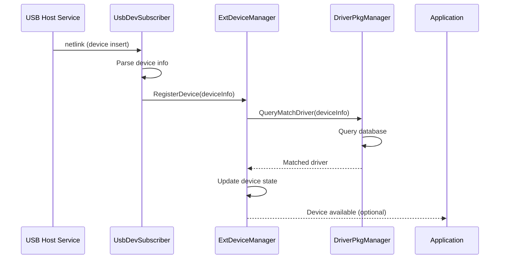
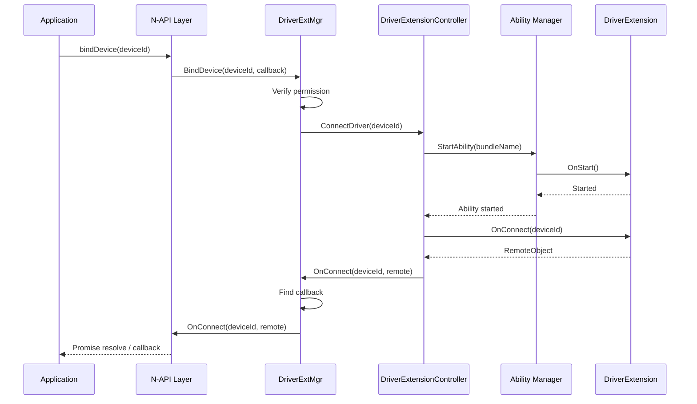
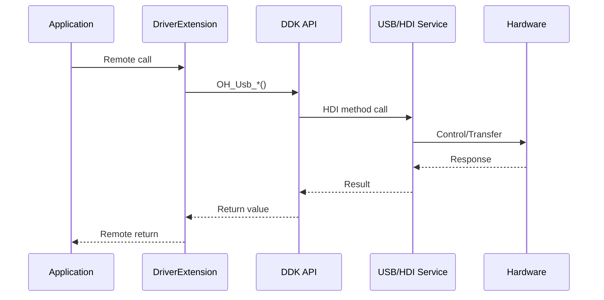

# 架构设计与组件关系

本文档描述扩展外部设备管理模块的整体架构设计，包括组件图、数据流、线程模型以及关键时序流程。这些内容对于理解模块的运行机制和问题定位具有重要意义。

## 整体架构图

```
┌─────────────────────────────────────────────────────────────────────────────────────────────┐
│                                    应用层 (Application Layer)                                │
├─────────────────────────────────────────────────────────────────────────────────────────────┤
│                                                                                             │
│  ┌──────────────────────────────┐    ┌──────────────────────────────┐                      │
│  │    三方应用 (HAP)             │    │   驱动扩展 Ability (HAP)    │                      │
│  │                              │    │                              │                      │
│  │  • 查询外部设备               │    │  • 实现设备操作逻辑          │                      │
│  │  • 绑定/解绑设备              │    │  • 处理设备连接回调          │                      │
│  │  • 与驱动交互                │    │  • 访问硬件 (DDK)           │                      │
│  └──────────────┬───────────────┘    └──────────────┬───────────────┘                      │
│                 │ N-API                              │                                      │
│                 ▼                                    ▼                                      │
│  ┌──────────────────────────────────────────────────────────────────────────┐              │
│  │                    driver.deviceManager (N-API 模块)                       │              │
│  │                                                                          │              │
│  │  • 异步回调封装                                                           │              │
│  │  • Promise 支持                                                           │              │
│  │  • 错误码转换                                                             │              │
│  └──────────────────────────────────────────────────────────────────────────┘              │
│                                        │ IPC (Binder)                                       │
│                                        ▼                                                   │
│  ┌──────────────────────────────────────────────────────────────────────────┐              │
│  │                  hdf_ext_devmgr 进程 (DriverExtensionManager)              │              │
│  │                                                                          │              │
│  │  ┌─────────────────────────────────────────────────────────────────────┐  │              │
│  │  │                     DriverExtMgr (SA ID: 5110)                       │  │              │
│  │  │                                                                     │  │              │
│  │  │  ┌─────────────────┐  ┌─────────────────┐  ┌─────────────────────┐ │  │              │
│  │  │  │   Device        │  │  Driver Package │  │   Bus Extension     │ │  │              │
│  │  │  │   Manager       │  │  Manager        │  │   Core             │ │  │              │
│  │  │  │                 │  │                 │  │                     │ │  │              │
│  │  │  │ • 设备注册      │  │ • 包状态监听    │  │ • IBusExtension    │ │  │              │
│  │  │  │ • 驱动匹配      │  │ • 元数据解析    │  │ • USB Bus Extension│ │  │              │
│  │  │  │ • 连接管理      │  │ • 数据库操作    │  │ • 热插拔事件       │ │  │              │
│  │  │  └────────┬────────┘  └────────┬────────┘  └──────────┬──────────┘ │  │              │
│  │  │           │                    │                      │            │  │              │
│  │  │           └────────────────────┼──────────────────────┘            │  │              │
│  │  │                                ▼                                   │  │              │
│  │  │              ┌─────────────────────────────────┐                  │  │              │
│  │  │              │     ExtDeviceManager           │                  │  │              │
│  │  │              │   (设备与驱动匹配中心)          │                  │  │              │
│  │  │              └─────────────────────────────────┘                  │  │              │
│  │  └─────────────────────────────────────────────────────────────────────┘  │              │
│  │                                                                              │
│  │  ┌─────────────────────────────────────────────────────────────────────┐  │              │
│  │  │                    DriverExtensionAbility                           │  │              │
│  │  │                                                                     │  │              │
│  │  │  • 独立的 Ability 进程                                                │  │              │
│  │  │  • AMS 管理生命周期                                                  │  │              │
│  │  │  • 与 Manager 通过 IPC 通信                                          │  │              │
│  │  └─────────────────────────────────────────────────────────────────────┘  │              │
│  │                                                                              │
│  └──────────────────────────────────────────────────────────────────────────────┘              │
│                                        │ IPC / HDI                                             │
│                                        ▼                                                      │
│  ┌──────────────────────────────────────────────────────────────────────────────┐              │
│  │                         系统底层服务                                           │              │
│  │                                                                              │              │
│  │  ┌───────────────┐  ┌───────────────┐  ┌───────────────┐  ┌───────────────┐ │              │
│  │  │  USB Host     │  │   BMS        │  │    AMS        │  │   SAMGR       │ │              │
│  │  │  Service      │  │   (Bundle)   │  │   (Ability)  │  │   (SA)        │ │              │
│  │  └───────────────┘  └───────────────┘  └───────────────┘  └───────────────┘ │              │
│  │                                                                              │
│  └──────────────────────────────────────────────────────────────────────────────┘              │
│                                                                                             │
└─────────────────────────────────────────────────────────────────────────────────────────────┘
```

架构图展示了扩展外部设备管理模块的分层结构。最上层是应用层，包括使用设备的三方应用和提供设备功能的驱动扩展 Ability。中间是 N-API 层，将 C++ 服务封装为 JavaScript 接口供应用调用。核心是运行在 `hdf_ext_devmgr` 进程中的 DriverExtensionManager 服务，包含设备管理、驱动包管理、总线扩展等核心逻辑。最底层是 OpenHarmony 系统服务，包括 USB 主机服务、包管理服务、能力管理服务和系统能力管理器。

## 组件职责详解

### 设备管理器组件（Device Manager）

设备管理器是模块的核心调度组件，主要职责包括设备注册与注销、驱动匹配、设备连接管理和设备列表维护。它由 `ExtDeviceManager` 单例类实现，内部维护两个核心映射表：`deviceMap_`（按总线类型和设备 ID 索引设备）和 `bundleMatchMap_`（记录驱动与设备的匹配关系）。

当新设备接入时，总线扩展模块调用 `RegisterDevice()` 方法注册设备。设备管理器根据设备的总线类型和属性信息查询 `DriverPkgManager`，获取匹配的驱动信息。如果找到匹配驱动，则更新设备的 `matchedDriver` 属性，并向应用发送设备匹配通知。设备连接时，管理器调用 `DriverExtensionController` 启动目标驱动扩展 Ability，建立从应用到驱动的 IPC 通道。

### 驱动包管理器组件（Driver Package Manager）

驱动包管理器负责驱动扩展 Ability 的生命周期感知和数据持久化。它由 `DriverPkgManager` 单例类实现，通过 `DrvBundleStateCallback` 监听包管理服务的安装、更新、卸载广播。

管理器的核心数据结构是 SQLite 数据库（`PkgDatabase`），存储已安装驱动的元数据信息，包括 bundle name、驱动名称、驱动 UID、支持的总线类型、匹配的 VID/PID 列表等。`PkgDbHelper` 提供数据库操作的封装方法。当收到包状态变化通知时，管理器更新数据库并通知设备管理器刷新匹配关系。

### 总线扩展组件（Bus Extension）

总线扩展提供总线类型的抽象和扩展机制，允许模块支持不同类型的外部设备总线。目前主要实现是 USB 总线扩展（`UsbBusExtension`），通过 `IBusExtension` 接口进行抽象。

USB 总线扩展的核心功能包括设备枚举（`EnumerateDevices()`）、驱动元数据解析（`ParseDriverInfo()`）、设备匹配（`MatchDriver()`）和热插拔监听（`UsbDevSubscriber`）。当 USB 设备插入时，`UsbDevSubscriber` 收到内核 netlink 通知，解析设备信息后调用设备管理器注册设备。匹配算法基于驱动声明的 VID/PID 列表与实际设备属性进行比对。

### 设备通知组件（Device Notification）

设备通知组件负责向用户展示设备状态变更信息。当设备连接成功、断开或发生故障时，组件通过分布式通知服务（ANS）发布通知。通知内容经过本地化处理，支持简体中文、繁体中文、藏文、维吾尔文等多种语言。

### 权限管理组件（Permission Manager）

权限管理组件（`ExtPermissionManager`）是模块的安全门禁，负责验证每个 API 调用的权限。它提供以下验证方法：`VerifyPermission()` 验证调用者是否拥有指定权限；`IsSystemApp()` 验证调用者是否为系统应用；`IsSa()` 验证调用者是否为原生 System Ability；`GetCallingTokenID()` 获取调用者的令牌 ID。

### 系统事件组件（HiSysEvent）

系统事件组件（`ExtDevReportSysEvent`）负责收集和上报模块的运行事件，用于系统监控和故障诊断。配置在 `hisysevent.yaml` 文件中，定义了以下事件类型：`DRIVER_PACKAGE_CYCLE_MANAGER`（驱动包生命周期事件）、`EXT_DEVICE_EVENT`（外部设备事件）、`EXTERNAL_DEVICE_SA_EVENT`（SA 事件）、`EXTERNAL_DEVICE_DDK_EVENT`（DDK 事件）。

## 数据流分析

### 设备插入流程

```
┌──────────┐     ┌──────────┐     ┌──────────┐     ┌──────────┐     ┌──────────┐
│ USB Host │────▶│ UsbDev   │────▶│ UsbBus   │────▶│ ExtDevice│────▶│ DriverPkg│
│ Service  │     │Subscrber │     │Extension │     │ Manager  │     │ Manager  │
└──────────┘     └──────────┘     └──────────┘     └──────────┘     └──────────┘
      │                                                   │               │
      │                                                   │ QueryMatch    │
      │                                                   │ Driver        │
      │                                                   ▼               │
      │                                           ┌──────────────┐          │
      │                                           │ 匹配驱动信息  │◀─────────┘
      │                                           └──────────────┘
      │                                                   │ DriverMatched
      │                                                   ▼
      │                                           ┌──────────────┐
      │                                           │  更新设备状态  │
      │                                           └──────────────┘
      │                                                   │
      ▼                                                   ▼
┌──────────────────────────────────────────────────────────────────────┐
│                         应用层通知                                      │
└──────────────────────────────────────────────────────────────────────┘
```

设备插入的数据流首先由 USB Host Service 检测到设备插入，通过 netlink 机制通知 `UsbDevSubscriber`。订阅者解析设备信息（VID、PID、接口描述符等），创建 `UsbDeviceInfo` 对象。然后调用 `ExtDeviceManager::RegisterDevice()` 注册设备。设备管理器查询 `DriverPkgManager` 获取匹配驱动，更新设备状态。如果驱动已就绪，则触发绑定流程。

### 设备绑定流程

```
┌──────────┐     ┌──────────┐     ┌──────────┐     ┌──────────┐     ┌──────────┐
│  应用    │────▶│ N-API    │────▶│ Manager  │────▶│ DriverExt│────▶│   AMS    │
│          │     │  Layer   │     │   SA     │     │Controller│     │          │
└──────────┘     └──────────┘     └──────────┘     └──────────┘     └──────────┘
      │              │                  │                │               │
      │ BindDevice() │                  │                │               │
      │─────────────▶│                  │                │               │
      │              │ InvokeSA()       │                │               │
      │              │─────────────────▶│                │               │
      │              │                  │ StartDriver()  │               │
      │              │                  │───────────────▶│               │
      │              │                  │                │──────────────▶│
      │              │                  │                │   OnStart()   │
      │              │                  │                │◀──────────────│
      │              │                  │                │ OnConnect()   │
      │              │                  │                │◀──────────────│
      │              │                  │    callback     │               │
      │              │                  │◀───────────────│               │
      │              │                  │ OnConnect()     │               │
      │              │◀─────────────────│────────────────│               │
      │◀─────────────│                  │                │               │
   callback          │                  │                │               │
    or Promise       │                  │                │               │
```

设备绑定的数据流始于应用调用 N-API 的 `bindDevice()` 方法。N-API 层将调用转发给 Manager SA 的 `BindDevice()` 方法。SA 首先通过权限检查验证应用是否有权限绑定设备，然后调用 `DriverExtensionController` 启动目标驱动扩展 Ability。控制器通过 AMS 启动 Ability 的 `OnStart()` 回调。Ability 启动成功后调用 `OnConnect()` 回调，返回驱动扩展的远程对象。控制器将远程对象和设备 ID 封装为回调参数，通过 IPC 返回给 Manager SA。Manager SA 调用 `IDriverExtMgrCallback::OnConnect()` 通知应用。N-API 层将远程对象转换为 JS RemoteObject，通过 Promise 或回调返回给应用。

### 驱动调用流程

```
┌──────────┐     ┌──────────┐     ┌──────────┐     ┌──────────┐     ┌──────────┐
│  应用    │────▶│  Remote  │────▶│  Driver  │────▶│  Driver  │────▶│  硬件    │
│          │     │  Object  │     │Extension │     │  Logic   │     │  Device  │
└──────────┘     └──────────┘     └──────────┘     └──────────┘     └──────────┘
      │              │                  │                │               │
      │ callRemote()  │                  │                │               │
      │─────────────▶│                  │                │               │
      │              │ IPC Call         │                │               │
      │              │─────────────────▶│                │               │
      │              │                  │  处理请求        │               │
      │              │                  │────────────────▶│               │
      │              │                  │                │ DDK API       │
      │              │                  │                │──────────────▶│
      │              │                  │                │               │  操作硬件
      │              │                  │                │               │◀──────────────
      │              │                  │                │ 返回结果       │
      │              │                  │◀────────────────│               │
      │              │                  │ IPC Return      │               │
      │              │◀─────────────────│─────────────────│               │
      │◀─────────────│                  │                │               │
```

驱动调用是反向的数据流。应用通过 JS RemoteObject 调用驱动扩展 Ability 的远程方法。调用通过 IPC 路由到驱动扩展进程。驱动扩展的框架代码接收请求，调用开发者实现的业务逻辑。业务逻辑通过 DDK API 访问硬件设备。硬件操作完成后，结果逐层返回。

## 线程模型

扩展外部设备管理模块采用多线程模型，不同组件运行在不同线程上，通过消息传递和 IPC 进行协作。

### 主线程（UI 线程）

N-API 回调和 Promise 解析运行在主线程。应用调用 N-API 时，如果操作需要异步执行（如设备绑定），N-API 会创建 Promise 并立即返回。当操作完成时，回调通过 `napi_send_event()` 投递到主线程执行。这种设计确保 JS 回调的执行顺序与调用顺序一致，符合 JavaScript 的事件循环模型。

### 服务主线程

DriverExtensionManager SA 运行在主线程，负责处理 IPC 请求和协调各组件。所有 IPC 调用（如 `QueryDevice()`、`BindDevice()`）在主线程执行，确保状态的线程安全性。组件间的协作（如设备注册、驱动匹配）也在主线程进行。

### 异步工作线程

耗时的操作（如数据库查询、设备枚举）运行在异步工作线程，避免阻塞服务主线程。N-API 层使用 `napi_send_event()` 投递异步任务，任务在独立的线程池中执行。

### USB 事件线程

USB 热插拔事件由独立的线程处理。`UsbDevSubscriber` 在单独的线程中监听 netlink 消息，避免事件处理阻塞系统响应。事件处理完成后，通过回调通知主线程更新设备状态。

### 驱动扩展线程

驱动扩展 Ability 运行在独立的进程中，每个 Ability 有自己的线程模型。驱动开发者可以在工作线程中执行耗时操作，通过 IPC 返回结果。

## 关键时序图

### 设备枚举时序



### 设备绑定时序



### DDK 调用时序



## 相关文档

| 文档 | 描述 |
|------|------|
| [00_Overview.md](./00_Overview.md) | 项目概览与核心能力 |
| [01_Directory_Structure.md](./01_Directory_Structure.md) | 目录结构与模块职责 |
| [03_NAPI_Reference.md](./03_NAPI_Reference.md) | JS API 接口参考 |
| [04_DDK_Reference.md](./04_DDK_Reference.md) | DDK C API 接口参考 |
| [05_Inner_API.md](./05_Inner_API.md) | 内部模块接口参考 |
